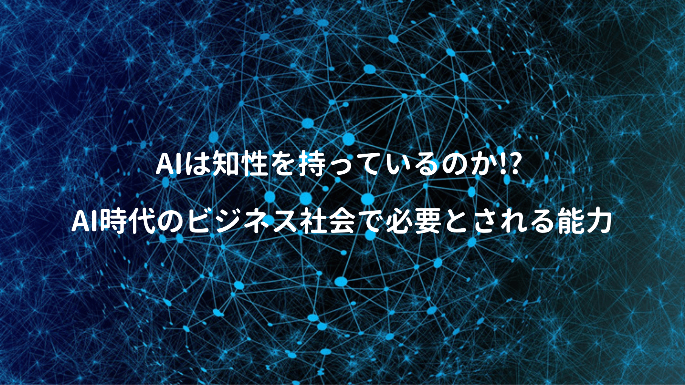

IT業界に身を置く者として、AI・ディープラーニング系の話はよく耳にはするけど、深くコミットもしていないし、積極的に何かやってる訳でもない。ただ直接AI系の開発に携わらずとも、最低限は知っておいた方が良いと思い、こちらを読んでみた。

本書は **2019年2月** に出版されているが、AI技術自体の研究も盛んなので、時が経つにつれ情報鮮度が落ちる。また日本のAI技術はアメリカ・中国に比べて周回遅れ（2〜3周）してるらしいので、現時点でどこまで参考にしてよいか分からないが、自分のようなAI素人には読みやすい一冊だった。

<a href="https://hb.afl.rakuten.co.jp/hgc/146fe51c.1fd043a3.146fe51d.605dc196/yomereba_main_201910242315409737?pc=http%3A%2F%2Fbooks.rakuten.co.jp%2Frb%2F15772758%2F%3Fscid%3Daf_ich_link_urltxt%26m%3Dhttp%3A%2F%2Fm.rakuten.co.jp%2Fev%2Fbook%2F" target="_blank" rel="noopener noreferrer">AIにできること、できないこと</a>
posted with <a href="https://yomereba.com" rel="nofollow noopener noreferrer" target="_blank">ヨメレバ</a>

藤本浩司/柴原一友 日本評論社 2019年02月19日    

<a href="https://hb.afl.rakuten.co.jp/hgc/146fe51c.1fd043a3.146fe51d.605dc196/yomereba_main_201910242315409737?pc=http%3A%2F%2Fbooks.rakuten.co.jp%2Frb%2F15772758%2F%3Fscid%3Daf_ich_link_urltxt%26m%3Dhttp%3A%2F%2Fm.rakuten.co.jp%2Fev%2Fbook%2F" target="_blank" rel="noopener noreferrer">楽天ブックス</a>

<a href="https://www.amazon.co.jp/exec/obidos/asin/4535788774/kanon123-22/" target="_blank" rel="noopener noreferrer">Amazon</a>

<a href="https://www.amazon.co.jp/gp/search?keywords=AI%E3%81%AB%E3%81%A7%E3%81%8D%E3%82%8B%E3%81%93%E3%81%A8%E3%80%81%E3%81%A7%E3%81%8D%E3%81%AA%E3%81%84%E3%81%93%E3%81%A8&__mk_ja_JP=%83J%83%5E%83J%83i&url=node%3D2275256051&tag=kanon123-22" target="_blank" rel="noopener noreferrer">Kindle</a>
                              	  	  	  	  	

## 本書のあらすじ

本書では **3つ** の要点に絞って解説。

まずAIの意味も時代によって変わるので、冒頭部でAIの歴史に触れながらAIとは何か、そして人間が持つ知性と比べて何が足りていないのか **AIに出来ること＋AIに出来ないこと** を説明。

次にAIの本質を踏まえつつ、今後AIが生活やビジネス面でどう関わってくるのか、活用事例をもとに、**AIをビジネスに活かす上で必要なこと** に言及。

最後にこれから訪れるAI時代において **AIに仕事を奪われないために人が身につけるべきこと**、自分がこれからどう進んでいけば良いのか、子供に何を学ばせるのが良いかの方向性を提示。

## AIの実態とは!?

まずAIの研究は今に始まった事ではなく、過去に二度のブーム（第1次は1965年の記号論理的アプローチ、第2次は1985年のエキスパートシステム）があり、昨今はハードウェア技術向上のおかげで、現在は第3次ブームの真っ只中、ディープラーニングを活用したアプローチがメインとなっている。

**さて本当にAIが人間を超えることが出来るのか？**

**人間を超える** の定義も曖昧だが、本書では人間を超えるためには **知性** が必要不可欠で、現在のAIに知性（自分で考えて環境に対応し、より良い成果を達成する能力）が備わっているか考察。

結論として **現時点では人間の脳・知性の仕組みが解明されていないので、AIが人間と同様に初歩的な知識を獲得し、それを基礎に高度な課題を解決できる力は無い** とされている（脳の仕組みが解明されていないので、どうアプローチすれば良いのか試行錯誤しながら研究中）

現在主流のAI(予測系/言語系/画像系/ゲーム系)は「知的な作業に等しい結果を得られる仕組みを知的ではない方法を使って作る」というアプローチなので知性は無く、人間が知的な作業の方針を設計し、ようやく限られた範囲の問題解決が出来るのが現実だと（最先端を走るアメリカや中国は分からないが）

ではそのAIはどのように作られているのか、AIの作り方で基本なる **3つの考え方（教師あり学習/強化学習/教師なし学習）** にも言及されているが、トレンド的には教師あり学習と強化学習が主。

いずれの学習にせよ、大量に試行錯誤出来る環境が必要だが、実世界で行う（車の衝突実験とか）のは無理があるので、メインは仮想空間!! 更に鍵はCG技術。しかしCG技術でもセーターのようなふわふわした質感は表現出来ないなど、実世界を完全に再現するのは困難らしい（いずれ解決されそうだけど）

まだ人間と同じように物事を理解できていない。

## 知性とは何か!?

さてAIに足りないとされる知性、これを持つために必要な要素とは何かを本書では以下4つを列挙。

① 動機：解決すべき課題を定める力

② 目標設計：何が正解かを定める力

③ 思考集中：考えるべきことを捉える力

④ 発見：正解へ繋がる要素を見つける力

 

では今のAIには何が足りて、何が足りないのか!?

端的に言えば4つ目の **発見** 以外は殆ど出来ておらず、残り3項目はAI設計者があらかじめ決めてあげる必要があり、つくづく人間の脳って凄いなぁと感心すると同時に、人間自体にその能力はあっても、上記を実行出来ていない人（AI以下?）も結構多いのでは!? と思ったり、思わなかったり。

知性を持ったAI（強いAI）に近くための研究（他者理解/論理的推論/連想）は日々行われているが、人間って不合理な判断もよくやるので、研究を続けて仮にAIが知性を獲得しても、人間ではない別の生命体になりそうな気もする。

## AIに仕事を奪われないために

現時点では知性を獲得していないAIだが、何かしらの技術革新（脳科学や量子コンピュータ）があれば強いAIが実現するかもしれない、ただ本書では 近い将来では難しい？ と言われているので、現行のAI環境に仕事を奪われないためのポイントを幾つか列挙されていた。

一番重要なポイントはコレに尽きるかなと思う↓

POINT**人間はAIが苦手とする部分（課題・目標設計・思考集中）を担い、AIと共同作業すること!!**

本書を読んでいる限り、現行のAIであれば、様々な要因（内的・外的）を加味しつつ、目標とゴール設定をし、それに向かって突き進める、または周りを巻き込む力、経営者やコンサルなど抽象度の高い業務が出来る人には仕事が殺到し、代替可能な人はAIに仕事を奪われて益々二極化するのかな。

<a href="https://hb.afl.rakuten.co.jp/hgc/g0000015.o51y41f2.g0000015.o51y5a32/kaereba_main_202002061112327463?pc=https%3A%2F%2Fproduct.rakuten.co.jp%2Fproduct%2F-%2Fa4c2e40d8509b94d23a64fa69a33d9b8%2F&m=http%3A%2F%2Fm.product.rakuten.co.jp%2Fproduct%2Fa4c2e40d8509b94d23a64fa69a33d9b8%2F" target="_blank" rel="noopener noreferrer">２１Ｌｅｓｓｏｎｓ ２１世紀の人類のための２１の思考  /河出書房新社/ユヴァル・ノア・ハラリ</a>
posted with <a href="https://kaereba.com" rel="nofollow noopener noreferrer" target="_blank">カエレバ</a>

<a href="https://hb.afl.rakuten.co.jp/hgc/146fe51c.1fd043a3.146fe51d.605dc196/kaereba_main_202002061112327463?pc=https%3A%2F%2Fsearch.rakuten.co.jp%2Fsearch%2Fmall%2FLesson21%2F-%2Ff.1-p.1-s.1-sf.0-st.A-v.2%3Fx%3D0%26scid%3Daf_ich_link_urltxt%26m%3Dhttp%3A%2F%2Fm.rakuten.co.jp%2F" target="_blank" rel="noopener noreferrer">楽天市場</a>

<a href="https://www.amazon.co.jp/gp/search?keywords=Lesson21&__mk_ja_JP=%E3%82%AB%E3%82%BF%E3%82%AB%E3%83%8A&tag=kanon123-22" target="_blank" rel="noopener noreferrer">Amazon</a>

 

ユヴァルの本でも同内容が考察されているが、産業革命時では仕事(物作り)が無くなっても、あまり訓練を求められないサービス業(スーパー等)に従事出来た。しかしAIとの協業では、より高度なスキルが求められるので、これが出来る人はかなり限られる気もする。