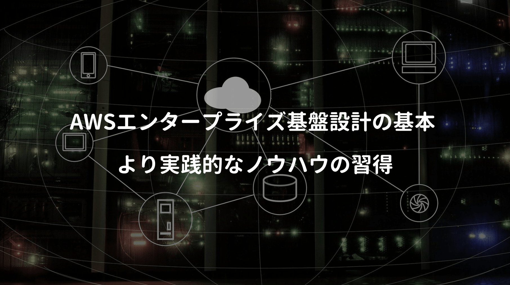

最近はクラウドでの開発が当たり前になってきた。

エンジニアにはクラウド理解が求められ、必須スキルの一つに挙げられる気もする。

**クラウドベンダーが用意するサービスを活用し、いかにクライアントに利益をもたらすか？** 

これを考えるため **AWS認定資格のアーキテクト ー アソシエイト** を取得するも、実践経験に乏しく、彼らが提唱する **Well-Architected** や **ベストプラクティス** を完全には理解できなかった。

今回はそれを克服すべく、AWSの実践的な知識が網羅された次の本を一読してみた。

<a href="https://hb.afl.rakuten.co.jp/hgc/146fe51c.1fd043a3.146fe51d.605dc196/yomereba_main_202001281649171838?pc=http%3A%2F%2Fbooks.rakuten.co.jp%2Frb%2F15610238%2F%3Fscid%3Daf_ich_link_urltxt%26m%3Dhttp%3A%2F%2Fm.rakuten.co.jp%2Fev%2Fbook%2F" target="_blank" rel="noopener noreferrer">Amazon Web Services エンタープライズ基盤設計の基本</a>
posted with <a href="https://yomereba.com" rel="nofollow noopener noreferrer" target="_blank">ヨメレバ</a>

堀内 康弘/三浦 美緒 日経BP 2018年10月05日    

<a href="https://hb.afl.rakuten.co.jp/hgc/146fe51c.1fd043a3.146fe51d.605dc196/yomereba_main_202001281649171838?pc=http%3A%2F%2Fbooks.rakuten.co.jp%2Frb%2F15610238%2F%3Fscid%3Daf_ich_link_urltxt%26m%3Dhttp%3A%2F%2Fm.rakuten.co.jp%2Fev%2Fbook%2F" target="_blank" rel="noopener noreferrer">楽天ブックス</a>

<a href="https://www.amazon.co.jp/exec/obidos/asin/4822292673/kanon123-22/" target="_blank" rel="noopener noreferrer">Amazon</a>

<a href="https://www.amazon.co.jp/gp/search?keywords=Amazon%20Web%20Services%20%E3%82%A8%E3%83%B3%E3%82%BF%E3%83%BC%E3%83%97%E3%83%A9%E3%82%A4%E3%82%BA%E5%9F%BA%E7%9B%A4%E8%A8%AD%E8%A8%88%E3%81%AE%E5%9F%BA%E6%9C%AC&__mk_ja_JP=%83J%83%5E%83J%83i&url=node%3D2275256051&tag=kanon123-22" target="_blank" rel="noopener noreferrer">Kindle</a>
                              	  	  	  	  	

 

本書は単なる解説書ではなく、コーポレートサイト構築を題材に、主要なサービスを使った **アーキテクチャ設計** と **基盤構築の実践的なノウハウ** が解説されている。

■ 序章 AWSの利点とデータセンターの構成 ★ 

■ 第1章 リージョン選びとネットワークの設計

■ 第2章 仮想マシンとオブジェクトストレージ ★ 

■ 第3章 負荷分散とスケーリング ★ 

■ 第4章 疎結合 ★ 

■ 第5章 CDNとDNS

■ 第6章 セキュリティ

■ 第7章 基盤構築の自動化

 

今回は序章 〜 第4章まで（★）を重点的に確認。

## AWSの利点とデータセンターの構成

**序章** では **リージョン** と **アベライビリティゾーン（AZ）**の解説されている。

**リージョン** はデータセンターが置かれている物理的な場所のことをさす。

各リージョンには、2つ以上のAZが配置され、東京では4つのAZが運用されている。

POINT**AZは独立した冗長性のある電源やネットワークを備え、同一リージョンに属するAZは、高速なプライベートリンクで接続されているため、AZ間の遅延は 2ミリ秒以下 で設計されている。**

この仕組みを利用することで、**RDSのマスタ/スレーブ構成** が構築可能となっている。

マスタ / スレーブ構成は、アクティブ/スタンバイ構成を同一リージョンの異なるAZに配置し、リアルタイムにデータ連携させ、障害発生時にスタンバイのインスタンスに切り替える仕組みのこと。

## 仮想マシンとオブジェクトストレージ

**第2章** では、EC2インスタンスと各種ストレージサービスの解説されている。

EC2インスタンスは、ソフトウェア構成を記録したテンプレートAMIから起動されるため、一度AMIを作成しておけば、故障しても代わりのインスタンスを起動できる。

またストレージサービスには、インスタンスストアとEBSの2つがある。

**インスタンスストア** は物理的にアタッチされ、データは非永続化される。逆に **EBS** は、インスタンスから独立しているため、永続性の性質があり、AZ内でのデータ冗長化による高耐久性を実現している。

次に2種類あるストレージ（ブロックとオブジェクト）の特徴と主な用途がこちら↓

**ブロックストレージ** は、データ更新時に1ブロックを変更するため、**更新頻度が高く、低遅延が求められる用途** に適しているが、事前に容量を決める必要があるため、後から拡張しにくい性質がある。

**オブジェクトストレージ（S3等）** は、テキストファイルの1文字を変更するだけでも、ファイル全体の更新が必要になる。主なユースケースには画像、動画のファイルやアプリケーションのログファイルなど、更新頻度が低く、かつ運用で増え続けるファイルの保存が挙げられる。

## 負荷分散とスケーリング

**第3章** の負荷分散とスケーリングは、マネージドサービスの代表例であるRDSの概要、ELBの使い方、オートスケーリングと色々あり、一番気になったのは **データストアのスケーリング** の話だった。

POINT**RDSのスケーリングで最初に検討すべきは、書き込み用と読み込み用で分割する事！**

多くのアプリケーションでは、書き込みよりも読み込みの方が圧倒的に多い。

そのためリードレプリカを増やし、システム全体の性能向上を検討するが、世の中的にCQRSが実用的なのか、一般的な開発者にとって、敷居が高くないかは何ともいえない。

POINT**読み込み速度を更に向上させる方法に、インメモリーキャッシュの併用がある！**

マネージドサービスなので、運用担当者の負担も少ないのは嬉しい話だ。

## 疎結合① – SQSとSNS

**第4章** からはマイクロサービスでも活用される疎結合の話が紹介されている。

可用性 + 拡張性 を実現させるサービスの代表例が **SQS** と **SNS**。

**SQS** は2つのコンポーネント間で通信する際、送信側はキューにメッセージを送信するだけ。受信側では、キューに問い合わせることでリクエストを受けとれ、可用性と拡張性が期待できる。

POINT**SQSは、複数のデータセンターに冗長化して保存しているため、メッセージが消失することはほぼ無く、処理性能も自動的にスケールアウトし、高いスループットを維持できる。**

ただ注意点として **重複処理の可能性** が挙げられる。

クライアントは稀に、同一メッセージを重複して受け取る可能性があり、冪等性を考慮した作りが求められるらしい。またショートポーリングはメッセージを受け取れない可能性もある。

**SNS** はエンドポイントやクライアントにメッセージをプッシュする配信サービス。送信側をパブリッシャー、受信側をサブスクライバーと呼び、トピックを介して通信する仕組みとなっている。

SQSとSNSを組み合わせると、一部のクライアントには即時配信させ、別のクライアントには、SQSでポーリングして受け取るアーキテクチャも構築が可能になる。

## 疎結合② – Lambda

第4章 の後半で紹介されている **Lambda** も今後求められるであろう技術の一つ。

コードをイベントや時間間隔で実行できるサービスで、サーバー管理不要 + 自動スケーリングされるため、コーディングに集中できるのは大変ありがたい。

ただ仕様上で気になったのがENIの話だ。

VPC内のリソースにアクセスする場合、EC2で提供されている仮想NIC（Elastic Network Interface）を利用しており、ENIの作成/削除はLambdaによってコントロールされているようだった。

POINT**最初のリクエストでは、ENI作成処理を含むため、レイテンシーが大きい。**

こちらは時と共に改善されると思うけど、LambdaはAWS固有のサービスなので、何かのタイミングで別サービスに移管させる場合には、それ相応のリプレイスコストがかかるのは懸念点の一つかなと。