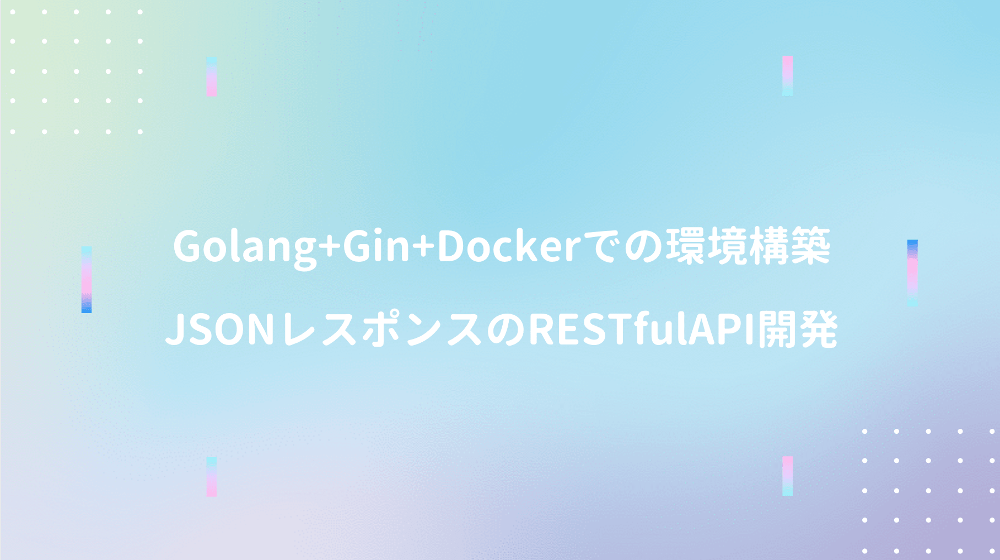

Golangが利用される用途で最も多いAPI開発（あくまで噂）

フレームワークも多数あり、2020年時点では **PHPにおけるLaravel的なもの** が無いようなので、まずは **学習コスト低め + 情報量の多いgo-gin** に触れてみた（フレームワーク使わない勢も結構いる模様）

公式ドキュメントのみで **環境構築 〜 単体試験** のサンプル実装まではサクサク進んだ!!

## Docker環境構築

docker-composeで **go-gin** の動作環境を構築。

```yml
# ディレクトリ構造
.
├──  docker-compose.yml
└──  main.go
```
<br/>

docker-compose.ymlを定義。

```yaml
version: '3'
services:
  app:
    image: golang:latest         # ベースイメージ
    container_name: go_container # プロジェクト名
    tty: true                    # プロセスの常時起動
    ports:                       # ポートフォワーディング（ホスト/コンテナ）
      - "8080:8080"
    volumes:
      - .:/go
```
<br/>

docker-composeを起動後にgo-ginインストール。

```shell
$ docker-compose up -d
$ docker-compose exec app bash
$ go get github.com/gin-gonic/gin
```

## go-ginでのHello World


main.go内に以下のプログラムを追記。

```go
package main

import (
	"net/http"
	"github.com/gin-gonic/gin"
)

func main() {
	router := gin.Default()
	router.GET("/hello", func(c *gin.Context) {
		c.String(http.StatusOK, "Hello World")
	})
	router.Run(":8080")
}
```
<br/>

goプログラムを実行。

```shell
$ go run main.go
```

## JSONレスポンス

main.go内に以下のプログラムを追記。

```go
router.GET("/json", func(c *gin.Context) {
  var msg struct {
    Name string
    Message string
    Number int
  }
  
  msg.Name = "Lena"
  msg.Message = "hey"
  msg.Number = 123
  c.JSON(http.StatusOK, msg)
})
```
<br/>

goプログラムを実行して、以下URLでアクセス。

```shell
[実行結果] {"Name":"Lena","Message":"hey","Number":123}
http://localhost:8080/json
```

## testifyでの単体試験

testifyのインストール。

```shell
$ go get github.com/stretchr/testify
```
<br/>

main.go内に以下のプログラムを追記。

```go
package main

import (
	"net/http"
	"github.com/gin-gonic/gin"
)

func setupRouter() *gin.Engine {
	r := gin.Default()
	r.GET("/hello", func(c *gin.Context) {
		c.String(http.StatusOK, "Hello World")
	})
	return r
}

func main() {
	r := setupRouter()
	r.Run(":8080")
}
```
<br/>

新規にmain_test.go作成。

```go
package main

import (
	"net/http"
	"net/http/httptest"
	"testing"
	"github.com/stretchr/testify/assert"
)

func TestPingRoute(t *testing.T) {
	router := setupRouter()
	w := httptest.NewRecorder()
	req, _ := http.NewRequest("GET", "/hello", nil)
	router.ServeHTTP(w, req)

	assert.Equal(t, 200, w.Code)
	assert.Equal(t, "Hello World!!", w.Body.String())
}
```
<br/>

ステータスコードとレスポンス値を確認。

```shell
go test
```

## 参考文献
■ Golang  
① [Golang フレームワーク比較](https://qiita.com/yumin/items/5de33b068ead564ebcbf)  
② [Go言語の初心者が見ると幸せになれる場所](https://qiita.com/tenntenn/items/0e33a4959250d1a55045)  

■ go-gin  
① [gin-gonic@github](https://github.com/gin-gonic/gin)  
② [Gin Web Framework](https://gin-gonic.com/)  
③ [XML / JSON / YAML / ProtoBuf rendering](https://gin-gonic.com/docs/examples/rendering/)  
④ [Go言語でテスト作成　testifyの基本的な使い方](https://re-engines.com/2018/10/16/go-testify%E3%82%92%E4%BD%BF%E3%81%A3%E3%81%A6%E3%83%86%E3%82%B9%E3%83%88%E4%BD%9C%E6%88%90/)  

■ API開発ハンズオン  
① [[Golang + Docker]GinをDocker上で試してみる](https://www.aizulab.com/blog/gin-docker/)  
② [Go / Gin で超簡単なWebアプリを作る](https://qiita.com/hyo_07/items/59c093dda143325b1859)  
③ [go-ginでサクッとRESTAPIを構築する](https://qiita.com/shiei_kawa/items/eddf48287455380f618f)  