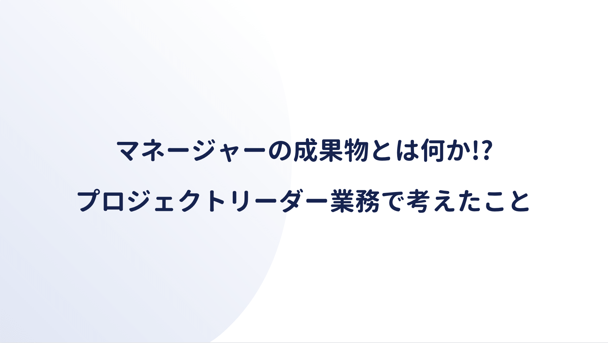

（記述予定）

<a href="https://hb.afl.rakuten.co.jp/hgc/146fe51c.1fd043a3.146fe51d.605dc196/yomereba_main_202011251139192148?pc=http%3A%2F%2Fbooks.rakuten.co.jp%2Frb%2F6868931%2F%3Fscid%3Daf_ich_link_urltxt%26m%3Dhttp%3A%2F%2Fm.rakuten.co.jp%2Fev%2Fbook%2F" target="_blank" >イシューからはじめよ</a>
posted with <a href="https://yomereba.com" rel="nofollow" target="_blank">ヨメレバ</a>

安宅和人 英治出版 2010年12月    

<a href="https://hb.afl.rakuten.co.jp/hgc/146fe51c.1fd043a3.146fe51d.605dc196/yomereba_main_202011251139192148?pc=http%3A%2F%2Fbooks.rakuten.co.jp%2Frb%2F6868931%2F%3Fscid%3Daf_ich_link_urltxt%26m%3Dhttp%3A%2F%2Fm.rakuten.co.jp%2Fev%2Fbook%2F" target="_blank" >楽天ブックス</a>

<a href="https://www.amazon.co.jp/exec/obidos/asin/4862760856/kanon123-22/" target="_blank" >Amazon</a>

<a href="https://www.amazon.co.jp/gp/search?keywords=%E3%82%A4%E3%82%B7%E3%83%A5%E3%83%BC%E3%81%8B%E3%82%89%E3%81%AF%E3%81%98%E3%82%81%E3%82%88&__mk_ja_JP=%83J%83%5E%83J%83i&url=node%3D2275256051&tag=kanon123-22" target="_blank" >Kindle</a>
                              	  	  	  	  	

 

<a href="https://hb.afl.rakuten.co.jp/hgc/146fe51c.1fd043a3.146fe51d.605dc196/yomereba_main_20201125114038694?pc=http%3A%2F%2Fbooks.rakuten.co.jp%2Frb%2F15549602%2F%3Fscid%3Daf_ich_link_urltxt%26m%3Dhttp%3A%2F%2Fm.rakuten.co.jp%2Fev%2Fbook%2F" target="_blank" >コンサルを超える問題解決と価値創造の全技法</a>
posted with <a href="https://yomereba.com" rel="nofollow" target="_blank">ヨメレバ</a>

名和　高司 ディスカヴァー・トゥエンティワン 2018年07月    

<a href="https://hb.afl.rakuten.co.jp/hgc/146fe51c.1fd043a3.146fe51d.605dc196/yomereba_main_20201125114038694?pc=http%3A%2F%2Fbooks.rakuten.co.jp%2Frb%2F15549602%2F%3Fscid%3Daf_ich_link_urltxt%26m%3Dhttp%3A%2F%2Fm.rakuten.co.jp%2Fev%2Fbook%2F" target="_blank" >楽天ブックス</a>

<a href="https://www.amazon.co.jp/exec/obidos/asin/4799323148/kanon123-22/" target="_blank" >Amazon</a>

<a href="https://www.amazon.co.jp/gp/search?keywords=%E3%82%B3%E3%83%B3%E3%82%B5%E3%83%AB%E3%82%92%E8%B6%85%E3%81%88%E3%82%8B%E5%95%8F%E9%A1%8C%E8%A7%A3%E6%B1%BA%E3%81%A8%E4%BE%A1%E5%80%A4%E5%89%B5%E9%80%A0%E3%81%AE%E5%85%A8%E6%8A%80%E6%B3%95&__mk_ja_JP=%83J%83%5E%83J%83i&url=node%3D2275256051&tag=kanon123-22" target="_blank" >Kindle</a>
                              	  	  	  	  	

 

（記述予定）

## 見出し1

## 見出し2

## 見出し3

## 見出し4

## 見出し5

