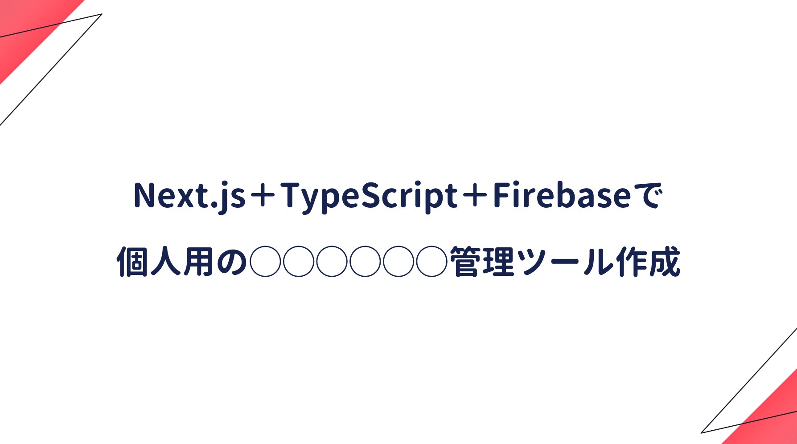

## プロジェクト初期化

```bash
# nodeを設定
nodebrew list
nodebrew install stable
nodebrew use <version>

# プロジェクト初期化
yarn create <project-name>
yarn dev
```

## 見出し1

## 見出し2

## 見出し3

## 参考記事
■ [NEXT.js チュートリアル@公式ドキュメント](https://nextjs.org/docs/getting-started)  

■ [Macでnodeのバージョン切り替え nodebrewの使い方](https://qiita.com/chihiro/items/13652c461519f8922f56)  