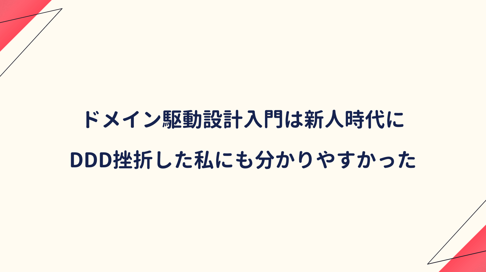
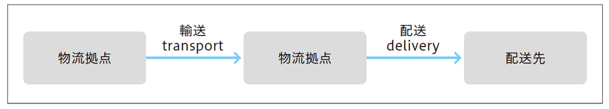

先輩エンジニアからエリック・エヴァンスのDDD本を薦められた新人時代。

当時は今より技術力が未熟だった上、本の内容も難解なので、数ページ見開いただけで挫折してしまい、それから長い期間でDDDに触れる機会もなく現在に至っている。

あれから数年コードを書き続けたが、自身の指針となるコードの書き方は定まらず、現場毎の異なる開発ルールに翻弄されている気がしたので、DDDへ再度入門することを決めた。

しかし数年コードを書き続けても、エリック・エヴァンス本は相変わらず敷居が高い。なので初心者向けに解説された本を読み、特に概念を実装に落とし込むパターンを確認した。

## DDDを考える上での参考文献

DDDを知る上で参考になる本はないか調べると、第一にエリック・エヴァンスが挙げられる。

<div class="cstmreba"><div class="booklink-box"><div class="booklink-image"><a href="https://hb.afl.rakuten.co.jp/hgc/146fe51c.1fd043a3.146fe51d.605dc196/yomereba_main_202004121959571623?pc=http%3A%2F%2Fbooks.rakuten.co.jp%2Frb%2F11146351%2F%3Fscid%3Daf_ich_link_urltxt%26m%3Dhttp%3A%2F%2Fm.rakuten.co.jp%2Fev%2Fbook%2F" target="_blank" ></a></div><div class="booklink-info"><div class="booklink-name"><a href="https://hb.afl.rakuten.co.jp/hgc/146fe51c.1fd043a3.146fe51d.605dc196/yomereba_main_202004121959571623?pc=http%3A%2F%2Fbooks.rakuten.co.jp%2Frb%2F11146351%2F%3Fscid%3Daf_ich_link_urltxt%26m%3Dhttp%3A%2F%2Fm.rakuten.co.jp%2Fev%2Fbook%2F" target="_blank" >エリック・エヴァンスのドメイン駆動設計</a><div class="booklink-powered-date">posted with <a href="https://yomereba.com" rel="nofollow" target="_blank">ヨメレバ</a></div></div><div class="booklink-detail">エリック・エヴァンス/今関剛 翔泳社 2011年04月    </div><div class="booklink-link2"><div class="shoplinkrakuten"><a href="https://hb.afl.rakuten.co.jp/hgc/146fe51c.1fd043a3.146fe51d.605dc196/yomereba_main_202004121959571623?pc=http%3A%2F%2Fbooks.rakuten.co.jp%2Frb%2F11146351%2F%3Fscid%3Daf_ich_link_urltxt%26m%3Dhttp%3A%2F%2Fm.rakuten.co.jp%2Fev%2Fbook%2F" target="_blank" >楽天ブックス</a></div><div class="shoplinkamazon"><a href="https://www.amazon.co.jp/exec/obidos/asin/4798121967/kanon123-22/" target="_blank" >Amazon</a></div><div class="shoplinkkindle"><a href="https://www.amazon.co.jp/gp/search?keywords=%E3%82%A8%E3%83%AA%E3%83%83%E3%82%AF%E3%83%BB%E3%82%A8%E3%83%B4%E3%82%A1%E3%83%B3%E3%82%B9%E3%81%AE%E3%83%89%E3%83%A1%E3%82%A4%E3%83%B3%E9%A7%86%E5%8B%95%E8%A8%AD%E8%A8%88&__mk_ja_JP=%83J%83%5E%83J%83i&url=node%3D2275256051&tag=kanon123-22" target="_blank" >Kindle</a></div>                              	  	  	  	  	</div></div><div class="booklink-footer"></div></div></div>
<br/>

<div class="cstmreba"><div class="booklink-box"><div class="booklink-image"><a href="https://hb.afl.rakuten.co.jp/hgc/146fe51c.1fd043a3.146fe51d.605dc196/yomereba_main_202004111104577927?pc=http%3A%2F%2Fbooks.rakuten.co.jp%2Frb%2F16167672%2F%3Fscid%3Daf_ich_link_urltxt%26m%3Dhttp%3A%2F%2Fm.rakuten.co.jp%2Fev%2Fbook%2F" target="_blank" ></a></div><div class="booklink-info"><div class="booklink-name"><a href="https://hb.afl.rakuten.co.jp/hgc/146fe51c.1fd043a3.146fe51d.605dc196/yomereba_main_202004111104577927?pc=http%3A%2F%2Fbooks.rakuten.co.jp%2Frb%2F16167672%2F%3Fscid%3Daf_ich_link_urltxt%26m%3Dhttp%3A%2F%2Fm.rakuten.co.jp%2Fev%2Fbook%2F" target="_blank" >ドメイン駆動設計入門 ボトムアップでわかる！ドメイン駆動設計の基本</a><div class="booklink-powered-date">posted with <a href="https://yomereba.com" rel="nofollow" target="_blank">ヨメレバ</a></div></div><div class="booklink-detail">成瀬 允宣 翔泳社 2020年02月13日    </div><div class="booklink-link2"><div class="shoplinkrakuten"><a href="https://hb.afl.rakuten.co.jp/hgc/146fe51c.1fd043a3.146fe51d.605dc196/yomereba_main_202004111104577927?pc=http%3A%2F%2Fbooks.rakuten.co.jp%2Frb%2F16167672%2F%3Fscid%3Daf_ich_link_urltxt%26m%3Dhttp%3A%2F%2Fm.rakuten.co.jp%2Fev%2Fbook%2F" target="_blank" >楽天ブックス</a></div><div class="shoplinkamazon"><a href="https://www.amazon.co.jp/exec/obidos/asin/479815072X/kanon123-22/" target="_blank" >Amazon</a></div><div class="shoplinkkindle"><a href="https://www.amazon.co.jp/gp/search?keywords=%E3%83%89%E3%83%A1%E3%82%A4%E3%83%B3%E9%A7%86%E5%8B%95%E8%A8%AD%E8%A8%88%E5%85%A5%E9%96%80%20%E3%83%9C%E3%83%88%E3%83%A0%E3%82%A2%E3%83%83%E3%83%97%E3%81%A7%E3%82%8F%E3%81%8B%E3%82%8B%EF%BC%81%E3%83%89%E3%83%A1%E3%82%A4%E3%83%B3%E9%A7%86%E5%8B%95%E8%A8%AD%E8%A8%88%E3%81%AE%E5%9F%BA%E6%9C%AC&__mk_ja_JP=%83J%83%5E%83J%83i&url=node%3D2275256051&tag=kanon123-22" target="_blank" >Kindle</a></div>                              	  	  	  	  	</div></div><div class="booklink-footer"></div></div></div>
<br/>

ドメイン駆動設計の基本は、概念を実装に落とし込むパターンを中心に解説している。

## ドメイン駆動設計入門のあらすじ

エリック・エヴァンス本では、ユビキタス言語の解説に始まり、ドメインエキスパートや境界付けられたコンテキスト、エンティティ、値オブジェクトなど、専門用語が多くて初心者にはツラい。

本書ではそんな挫折をさせないよう、ドメイン駆動設計で重要な <span style="color: #ff8c00; font-weight: bold;">概念を抽出するモデリング</span> には触れず <span style="color: #ff8c00; font-weight: bold;">概念を実装に落とし込むパターン</span> が中心に解説されている。

<div class="blackboard-box">
<p>■ 知識を表現</p>
<p>・値オブジェクト <span style="color: #ff1493;">★</span></p>
<p>・エンティティ <span style="color: #ff1493;">★</span></p>
<p>・ドメインサービス <span style="color: #ff1493;">★</span></p>
<br/>
<p>■ アプリケーションを表現</p>
<p>・リポジトリ <span style="color: #ff1493;">★</span></p>
<p>・アプリケーションサービス <span style="color: #ff1493;">★</span></p>
<p>・ファクトリ <span style="color: #ff1493;">★</span></p>
<br/>
<p>■ 知識を表現（発展形）</p>
<p>・集約</p>
<p>・仕様</p>
<div class="chalk1"></div>
<div class="chalk2"></div>
</div>
<br/>

ドメイン駆動設計のパターンだけを取り入れる手法は **軽量DDD** と呼ばれるが、<span style="color: #ff8c00; font-weight: bold;">重要なことはドメインの本質と向き合うことで、パターンはあくまでサポート役</span> だと念押しされている。

## ドメイン駆動設計のコンセプト

ドメイン駆動設計のコンセプトとは何か!?

ドメイン駆動設計入門では、次のように言われている。

**<span style="color: #ff8c00;">ビジネスの問題を解決するため、ビジネスの理解を進め、ビジネスを表現し、ビジネスとコードを結び付け、継続的かつ反復的な改良を施せるように枠組みを作ることで、ソフトウェアをより役立つものにしようとするもの</span>**（ソフトウェアにおいて、至極当たり前の話なんだけど・・・）

またソフトウェア開発のドメインとは、<span style="color: #ff8c00; font-weight: bold;">プログラムを適用する対象となる領域</span> で、ドメインに含まれるものを考えることが大切（会計システムなら金銭や帳票、物流システムなら貨物や倉庫、輸送手段）

## 知識を表現 1 ー 値オブジェクト

ドメイン知識をコードへ落とし込む基本パターンに <span style="color: #ff8c00; font-weight: bold;">値オブジェクト</span> がある。

これははドメインオブジェクトの一つで、システム固有の値を定義する役割を担う（次のサンプルプログラムでは、FirstNameとLastNameが該当する）

```Csharp
class FullName : IEquatable<FullName>
{
  private readonly FirstName firstName;
  private readonly LastName lastName;
  public FullName(FirstName firstName, LastName lastName)
  {
    this.firstName = firstName;
    this.lastName = lastName;
  }
  # 省略
}

# 名を表す値オブジェクト
class FirstName
{
  private readonly string value;
  public FirstName(string value)
  {
    if (string.IsNullOrEmpty(value)) throw new ArgumentException("1文字以上である必要があります。", nameof(value));
    this.value = value; 
  }
}

# 姓を表す値オブジェクト
class LastName
{
  # 省略
}
```
<br/>

値オブジェクトをわざわざ定義せずに、プリミティブ型でも実装できるが、それでは汎用的で表現力に乏しいプログラムになりがちだ。値オブジェクトを使えば、クラスにルールが付与され、ドキュメントとして機能させることも可能になる（何をやっているか理解しやすい）

また値オブジェクトは <span style="color: #ff8c00; font-weight: bold;">ただのデータ構造体ではなく、ふるまいも定義可能で、自身のルールを語るドメインオブジェクト</span> になるので、ロジックの散在が改善されて可読性の向上が見込める。

また本書では、値オブジェクトを定義するかの判断基準に、<span style="color: #ff8c00; font-weight: bold;">そこにルールが存在しているか</span> と <span style="color: #ff8c00; font-weight: bold;">それ単体で取り扱いたいか</span> を挙げられていた（やはり判断は難しい）

## 知識を表現 2 ー エンティティ

もう一つのドメインオブジェクトに <span style="color: #ff8c00; font-weight: bold;">エンティティ</span> がある。

同一性で識別されるか否か、またはライフサイクルが存在するかが判断基準と紹介されており、値オブジェクトとの違いが分かりにくいが、次のブログには具体例が説明されている。

■ **[DDD基礎解説：Entity、ValueObjectってなんなんだ](https://little-hands.hatenablog.com/entry/2018/12/09/entity-value-object)**  

|    |  エンティティ  |  値オブジェクト  |
| ---- | ---- | ---- |
|  同一性判定  |  識別子が同一であれば同一  |  保持する属性が全て同一であれば同一  |
|  可変性  |  可変（ライフサイクルを持つ）  |  不変（生成されたら破棄されるだけ）  |

サンプル（社員と10円玉）で考えてみる↓

```bash
例） エンティティを社員で考えてみる

# 山田さんという社員は、ある会社において社員番号という識別子（123）で同一判定される
# 部署や所持金や体重が変わろうと、別人にはならない。
# 部署や所持金などの属性は変わるので、本質的には ”可変” である。

例）値オブジェクトを10円玉で考えてみる

# 造幣局でもない限り、2つの10円玉が並んでいて、区別することない（同じ機能を持つ硬貨）
# 2つの10円玉を区別する必要がない（=不変）場合、10円玉は値オブジェクトとして定義
```
<br/>

基本的にはエンティティが自身の属性として、値オブジェクトを保持する関係となる。

## 知識を表現 3 ー ドメインサービス

値オブジェクトやエンティティの記述では不自然に見えるので、これらのふるまいを定義する <span style="color: #ff8c00; font-weight: bold;">ドメインサービス</span> がある。具体的に **不自然なふるまい** とは次のようなサンプルになる。

```Csharp
# エンティティ
class User
{
  # UserId と UserName は 値オブジェクト
  public User(UserId id, UserName name)
  {
    # 省略
  }
  # 不自然なふるまい
  public bool Exists(User user)
  {
    # 重複を確認するコード
  }
}

var userId = new UserId("id");
var userName = new UserName("nrs");
var user = new User(userId, userName);
var duplicateCheckResult = user.Exists(user);
```
<br/>

重複有無を自身に問い合わせており、多くの開発者を混乱させる不自然な記述に見える。

不自然なふるまいの解決には、ドメインサービスの利用を推奨している。

```Csharp
# ドメインサービス
class UserService
{
  public bool Exists(User user)
  {
    # 重複を確認する処理
  }
}
```
<br/>

ドメインサービスでは、自身のふるまいを変更するようなインスタンス特有の状態は持たせない。

役割は理解しやすいが濫用は危険で、まずエンティティや値オブジェクトで定義できないか検討する。

ドメインサービスの実装例を、物流システムを例に考えてみる。



サンプルでは「物流拠点」をエンティティとして定義している。

```Csharp
class PhysicalDistributionBase 
{
  # （...略...）

  public Baggage Ship(Baggage baggage)
  {
    # （...略...）
  }

  public void Receive(Baggage baggage)
  {
    # （...略...）
  }
}
```
<br/>

物流拠点の出庫と入庫はセットで実施されるので、輸送をサービスに定義している。

```Csharp
class TransportService
{
  public void Transport(PhysicalDistributionBase from, PhysicalDistributionBase to, Baggage baggage)
  {
    var shippedBaggage = from.Ship(baggage);
    to.Receive(shippedBaggage);

    # 配送の記録処理など
  }
}
```

## アプリケーションを実現 1 ー リポジトリ

アプリケーションを表現するパターンの一つが <span style="color: #ff8c00; font-weight: bold;">リポジトリ</span> になる。

データを永続化し、再構築する処理を抽象的に扱うオブジェクトになる。

```Csharp
# リポジトリを利用したユーザ作成処理
class Program
{
  private IUserRepository userRepository;

  public Program(IUserRepository userRepository)
  {
    this.userRepository = userRepository;
  }

  public void CreateUser(string userName)
  {
    var user = new User(new UserName(userName));
    var userService = new UserService(userRepository);
    if (userService.Exists(user)) {
      throw new Exception("既に存在します");
    }
    userRepository.Save(user);
  }
}
```
<br/>

リポジトリの役割はオブジェクトの永続化なので、<span style="color: #ff8c00; font-weight: bold;">ユーザ重複確認のようなドメインルールに近い内容の実装は好ましくなく、そういった処理はドメインサービスが主体で実装するのを推奨。</span>

```Csharp
public interface IUserRepository
{
  User Find(UserId id);

  # ドメインサービスに定義すべき内容
  bool Exists(User user);

  # 特定項目のCRUDはNG（多くのCRUD定義が乱立する結果となる）
  void updateName(UserId id, UserName name);
  # オブジェクトが保持する項目の変更はオブジェクト自身に依頼
  void Save(User user);
}
```
<br/>

本書でもUserの識別子であるUserIdでの検索メソッドは、リポジトリでの定義が望ましいとしており、リポジトリでの定義は、単純なCRUD操作に限られる印象を受けた。

## アプリケーションを実現 2 ー アプリケーションサービス

不自然さを解決するサービスに <span style="color: #ff8c00; font-weight: bold;">アプリケーションサービス</span> があり、ドメインオブジェクトのふるまいを呼び出す役目を担っている。

ドメインオブジェクトの公開には、大きな危険性が潜んでいるため、本書では公開しないことを推奨している（代用としてDTOの活用だったり、コマンドオブジェクトがある）

```Csharp
public class UserApplicationService
{
  private readonly IUserRepository userRepository;
  private readonly UserService userService;

  public UserApplicationService(IUserRepository userRepository, UserService userService)
  {
    this.userRepository = userRepository;
    this.userService = userService;
  }

  public void Register(string name)
  {
    var user = new User(new UserName(name));

    # NGパターン
    var duplicatedUser = userRepository.Find(mailAddress);
    if (duplicatedUser != null) {
      throw new Exception(mailAddress);
    }
    # OKパターン（ドメインサービスを利用してユーザの重複チェックを実施）
    if (userService.Exists(user)) {
      throw new Exception("既に存在しています");
    }
    userRepository.Save(user)
  }
}
```
<br/>

アプリケーションサービスは、<span style="color: #ff8c00; font-weight: bold;">あくまでもドメインオブジェクトのタスク調整に徹し、ドメインルールを記述させないことが重要である</span>（ルールはドメイン側に寄せることが大切）

値オブジェクトやエンティティは、自身のふるまいを持っているが、サービスは自身のためのふるまいを持たず、活動や行動を表すことが多い。

またドメインにおける活動をドメインサービスとし、アプリケーションとして成立させるためのサービスが、アプリケーションサービスとなる。

## アプリケーションを実現 3 ー ファクトリ

アプリケーションを実現させる最後のパターンに、複雑なオブジェクトの生成処理をオブジェクトとして定義する <span style="color: #ff8c00; font-weight: bold;">ファクトリ</span> があり、これは生成のみを責務とするオブジェクトになる。

```Csharp
public class UserFactory : IUserFactory
{
  public User Create(UserName name)
  {
    # データベースのコネクション処理
    # 省略

    # インスタンスの返却
    return new User(id, name);
  }
}
```
<br/>

ファクトリ利用の目安について、生成処理が複雑でない場合は素直にコンストラクタでの呼び出しが望ましく、データベース接続など複雑な処理はファクトリ実装でカプセル化して柔軟性を確保。

Chapter11では解説された全知識を活用して、SNSを実装するサンプルが説明されていた。

## 参考文献

■ [正誤表@ドメイン駆動設計入門 ボトムアップでわかる！ドメイン駆動設計の基本](https://www.shoeisha.co.jp/book/detail/9784798150727)  
■ [ドメイン駆動設計のメリットと始め方@CodeZine](https://codezine.jp/article/detail/9546#cxrecs_s)  
■ [little hands' lab - ドメイン駆動設計を布教したい](https://little-hands.hatenablog.com/)  
■ [[DDD]ドメイン駆動設計で実装を始めるのに一番とっつきやすいアーキテクチャは何か](https://qiita.com/little_hand_s/items/ebb4284afeea0e8cc752)  
■ [今すぐ「レイヤードアーキテクチャ+DDD」を理解しよう（golang）](https://qiita.com/tono-maron/items/345c433b86f74d314c8d)  
■ [Goのpackage構成と開発のベタープラクティス](https://engineer.recruit-lifestyle.co.jp/techblog/2018-03-16-go-ddd/)  
■ [ドメイン駆動設計の比類なきパワーでRailsレガシーコードなど大爆殺したるわあああ](https://qiita.com/MinoDriven/items/3c7db287e2c66f36589a)  
■ [RailsでDDD](https://qiita.com/haazime/items/5776e4e25b6527b682e7)  