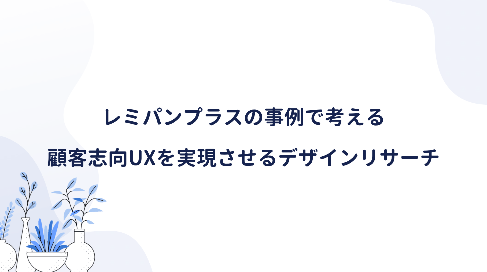

最近仕事でよく耳にする **UX（ユーザーエクスペリエンス）** というバズワード。

UXを直訳すると「ユーザーの体験」になるが、いまいちよく分かっていなかった。

こちらの本を読んでみると、商品やサービスを通じて、今までとは違った体験ができたり、問題を解決して好ましい感情をもたらすなど **利用者や社会をポジティブにする体験** といった感じだろうか。

<a href="https://hb.afl.rakuten.co.jp/hgc/146fe51c.1fd043a3.146fe51d.605dc196/yomereba_main_202007092105376388?pc=http%3A%2F%2Fbooks.rakuten.co.jp%2Frb%2F14584960%2F%3Fscid%3Daf_ich_link_urltxt%26m%3Dhttp%3A%2F%2Fm.rakuten.co.jp%2Fev%2Fbook%2F" target="_blank" >UX×Biz　Book</a>
posted with <a href="https://yomereba.com" rel="nofollow" target="_blank">ヨメレバ</a>

明海司/井登友一 マイナビ出版 2016年12月    

<a href="https://hb.afl.rakuten.co.jp/hgc/146fe51c.1fd043a3.146fe51d.605dc196/yomereba_main_202007092105376388?pc=http%3A%2F%2Fbooks.rakuten.co.jp%2Frb%2F14584960%2F%3Fscid%3Daf_ich_link_urltxt%26m%3Dhttp%3A%2F%2Fm.rakuten.co.jp%2Fev%2Fbook%2F" target="_blank" >楽天ブックス</a>

<a href="https://www.amazon.co.jp/exec/obidos/asin/4839959064/kanon123-22/" target="_blank" >Amazon</a>

<a href="https://www.amazon.co.jp/gp/search?keywords=UX%C3%97Biz%E3%80%80Book&__mk_ja_JP=%83J%83%5E%83J%83i&url=node%3D2275256051&tag=kanon123-22" target="_blank" >Kindle</a>
                              	  	  	  	  	

 

上に紹介した本では、色んな専門家が様々な視点でUXを語っているが、私が一番理解しやすかったのは、デザインリサーチ を活用した平野レミ考案のレミパンプラスの話だった。

デザインリサーチにも色々な手法があるらしく、どの手法にも共通することは、人の行動だけを観察するのではなく、むしろ人を取り巻く環境の文脈的状況と、相互関係を分析すること だとされている。

たとえば平日夜の就寝時間は、完全な自由意思ではない。

朝から重要な客先MTGがあれば、遅刻して迷惑をかけないよう夜更かしは避けるし、夏の電車移動では、厳しい日差しと熱風にさらされるJRの地上駅を避け、移動時間が少し多くなっでも、冷房が効いている地下鉄の利用も選択肢としては十分にあり得る。

人間の行動と心理の多くは、コンテクストにかなり依存しているため、不合理な行動を無意識にやってしまうことは多く、本人が言語化できないことは意外と多いらしい。

話はかわるが、もしフライパンを新規に開発する場合、どんな商品なら売れると考えるだろうか!?

小型で軽量で、収納場所をとらないとか？

もちろん機能性も重要だが、人間は慣れの動物なので、少し使いづらくても慣れてしまう。

まずレミパンプラスの開発チームは、調理現場で一般人とプロの調理人の行動を観察調査した。

そこで分かったことは、一般人もプロの調理人も、複数の作業を同時並行（多分みんな毎日忙しいからだと思う）で進めており、菜箸やトング、計量スプーンの置き場に困る人が多かったそうだ。

火で熱した鍋に一時置きしてしまうと、取手のプラ部分が焼け焦げるし、シンクに置くのは衛生的に気になる。そのため都度洗って拭き取る人が多く、無意識のうちに無駄な行動が多いことが分かった。

フライパンに焦点を当てず、一連の調理行動におけるフライパンの使われ方を俯瞰した視点 として、お玉、ヘラ、菜箸などのキッチンツールと、フライパンをどうデザインすれば課題を解決できるか？

この課題を真剣に考えた結果、フライパンの取手部分のマグネットを入れ、トングやお玉を置けるようにしていた。いずれ競合他社に真似はされるが、この事例でUXの本質を垣間見た気がした。

またユーザーは ニーズを語るプロ ではなく、自身のニーズを明確に表現できる割合は5%程度に過ぎない話は印象深かった。デザインリサーチでわかる無意識の行為にこそ、語られることのない95%の潜在的なニーズがあり、顧客の期待価値が隠れている。