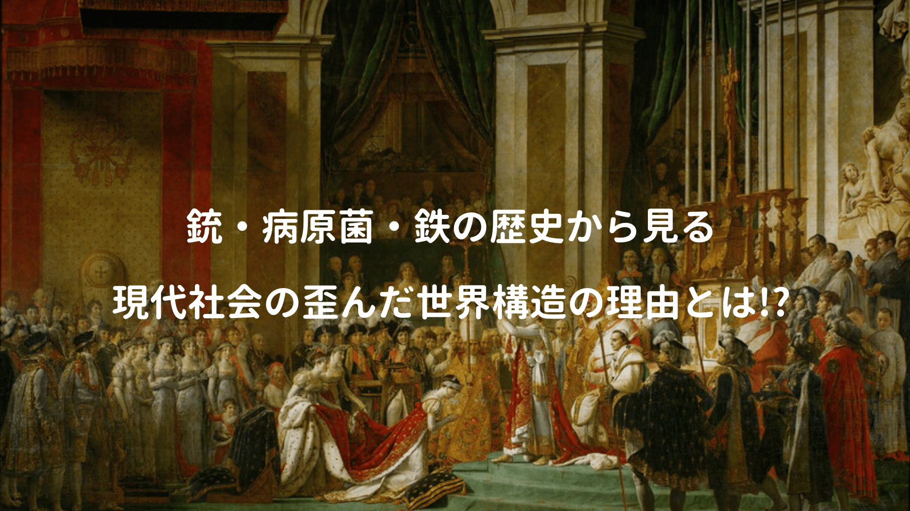

13000年に渡る人類史の謎に迫る **著者ジャレド・ダイアモンド** の「銃・病原菌・鉄」

著者のフィールドワークによる考察が上下二巻にまとめられていた。

膨大な歴史を2冊に収めるのは到底不可能だと、著者自身も言われていたが、その難題にあえて向き合った本書を要約すれば、著者の次の発言に集約されるんじゃないだろうか。

> 歴史は異なる人々によって異なる経路を辿ったが、それは人々の置かれた環境の差異によるものであって、人々の生物的な差異によるものではない.

西洋の認知心理学者達は、アフリカ系アメリカ人がヨーロッパ系白人より、先天的に知能が低い事を示そうと奮闘するも、現代では人種による生まれつきの知能の差異は認められていない。

<a href="https://hb.afl.rakuten.co.jp/hgc/146fe51c.1fd043a3.146fe51d.605dc196/yomereba_main_201902202212061983?pc=http%3A%2F%2Fbooks.rakuten.co.jp%2Frb%2F11538935%2F%3Fscid%3Daf_ich_link_urltxt%26m%3Dhttp%3A%2F%2Fm.rakuten.co.jp%2Fev%2Fbook%2F" target="_blank"  rel="noopener noreferrer">文庫 銃・病原菌・鉄　上</a>
posted with <a href="https://yomereba.com" rel="nofollow noopener noreferrer" target="_blank">ヨメレバ</a>

ジャレド・ダイアモンド/倉骨　彰 草思社 2012年02月    

<a href="https://hb.afl.rakuten.co.jp/hgc/146fe51c.1fd043a3.146fe51d.605dc196/yomereba_main_201902202212061983?pc=http%3A%2F%2Fbooks.rakuten.co.jp%2Frb%2F11538935%2F%3Fscid%3Daf_ich_link_urltxt%26m%3Dhttp%3A%2F%2Fm.rakuten.co.jp%2Fev%2Fbook%2F" target="_blank"  rel="noopener noreferrer">楽天ブックス</a>

<a href="https://www.amazon.co.jp/exec/obidos/asin/4794218788/kanon123-22/" target="_blank"  rel="noopener noreferrer">Amazon</a>

<a href="https://www.amazon.co.jp/gp/search?keywords=%95%B6%8C%C9%20%8Fe%81E%95a%8C%B4%8B%DB%81E%93S%81%40%8F%E3&__mk_ja_JP=%83J%83%5E%83J%83i&url=node%3D2275256051&tag=kanon123-22" target="_blank"  rel="noopener noreferrer">Kindle</a>
                              	  	  	  	  	

 

一般常識として知るべきことばかりなので、今一度振り返ってみる。

## 大型動物絶滅による影響

約4万年前、人類がオーストラリアに渡り、その土地に住む大型動物は絶滅している。

理由について、大規模旱魃など気候変動説も考えられるが、オーストラリアの大型動物は人間を恐る学習ができておらず、高度な狩猟技術を持つ人類に滅ぼされた説が有力らしい。

ちなみにアフリカ・ユーラシア大陸の大型動物は現代でも生き延びているが、これは彼らが何百万年もの進化の過程を初期人類と共有したことにある。その間に人類は狩猟技術を磨き、また大型動物達も人類を恐るという学習ができたので、現代社会でもお互いに生き残っている（互いに切磋琢磨してきた）

ちなみに人類が南北アメリカ大陸に進出したのは約35000〜14000年前で、元々いた大型動物（ゾウ、馬、ライオン、チータ）も、同様の理由で絶滅したと考えられる。

では大型動物の絶滅が、現代の世界構造にどんな影響を及ぼしたのか!?

話は変わるが、天然痘・麻疹・インフルエンザ等の伝染病は、元々動物に感染し変異したものだ。

家畜を持つことができた人々は、新しく生まれた病原菌の最初の犠牲者となるも、時間の経過と共に病原菌に対する抵抗力を身につけることができた。

しかし家畜を持てなかった人は、病原菌の抗体を持たないまま、ヨーロッパ人と出会ってしまった。

なぜスペインの征服者ピサロはインカ帝国を征服出来たのか？

その理由は本書のタイトルが答えで、天然痘、インフルエンザ、チフス、ペストなど疾病に免疫のある人達が、免疫の無い人達に病気をうつし、その後の歴史の流れを大きく変えたことにある。

## 恵まれたユーラシア大陸

本書で肥沃三日月地帯、ニューギニア、合衆国東部の各地域が考察されていた。

特に肥沃三日月地帯は他に比べ、早期から科学技術が発展し、社会構造も複雑化している。

そして伝染病に対する免疫力を発展させているが、なぜこんな差異が生まれたのか?

POINT**入手可能であった野生動植物の差が原因で、人間の特性の違いが原因ではない！**

どうもユーラシア大陸は色々恵まれていたようで、ユーラシア大陸には家畜化可能な動物が多かったり、また他大陸に比べ、横長の地形なので、作物の伝搬速度が早かった。

他に色んな理由が考えられるが、同緯度帯の土地は、日照時間や季節変化のタイミング、分布植物の種類や生態系が似ている。気候が違えば、植物の発芽や成長、病気に対する抵抗力も変化する。

このような事実から、初期のユーラシア大陸民が、他大陸の住民より創意工夫に優れていた訳ではなく、たまたま環境に恵まれていた（＝横長の陸地）と言える。

## 農耕文化に伴うヨーロッパからの贈り物

農耕文化は人類の発展に大きく寄与しただけでなく、病原菌にも同様のことが言える。

狩猟民族は一ヶ所に定住せず、定期的に移住するが、農耕民は病原菌や寄生虫の幼虫を含む自らの排泄物が近くの環境に定住し、自らの排泄物を農地に再利用する者もいた。

つまり狩猟民族に比べ、農耕民は様々な病原菌と隣り合わせの環境にいたと言える。

POINT**人類の間で農業文化が広がり、病原菌はとてつもない繁殖環境を獲得した！**

またユーラシア大陸では、歴史上様々な都市国家が生まれ、交易も盛んに行われていたので、皮肉にも、人や物資だけでなく、病原菌にとっての交易路にもなってしまった。

新大陸の住民に比べ、優れた銃や鉄の剣を持っていた事は確かだが、それによりもユーラシア大陸から運ばれてきた病原菌の犠牲になった人の方が遥かに多かったらしい。

西洋人の論理的思考や科学への追求は素晴らしいが、生まれ持った才能より、生まれついた環境が、人類の命運を大きく左右している考察には大変感銘を受けた。

– 銃・病原菌・鉄・上巻より。

<a href="https://hb.afl.rakuten.co.jp/hgc/146fe51c.1fd043a3.146fe51d.605dc196/yomereba_main_201902231122257906?pc=http%3A%2F%2Fbooks.rakuten.co.jp%2Frb%2F11538936%2F%3Fscid%3Daf_ich_link_urltxt%26m%3Dhttp%3A%2F%2Fm.rakuten.co.jp%2Fev%2Fbook%2F" target="_blank"  rel="noopener noreferrer">文庫 銃・病原菌・鉄　下</a>
posted with <a href="https://yomereba.com" rel="nofollow noopener noreferrer" target="_blank">ヨメレバ</a>

ジャレド・ダイアモンド/倉骨　彰 草思社 2012年02月10日    

<a href="https://hb.afl.rakuten.co.jp/hgc/146fe51c.1fd043a3.146fe51d.605dc196/yomereba_main_201902231122257906?pc=http%3A%2F%2Fbooks.rakuten.co.jp%2Frb%2F11538936%2F%3Fscid%3Daf_ich_link_urltxt%26m%3Dhttp%3A%2F%2Fm.rakuten.co.jp%2Fev%2Fbook%2F" target="_blank"  rel="noopener noreferrer">楽天ブックス</a>

<a href="https://www.amazon.co.jp/exec/obidos/asin/4794218796/kanon123-22/" target="_blank"  rel="noopener noreferrer">Amazon</a>

<a href="https://www.amazon.co.jp/gp/search?keywords=%95%B6%8C%C9%20%8Fe%81E%95a%8C%B4%8B%DB%81E%93S%81%40%89%BA&__mk_ja_JP=%83J%83%5E%83J%83i&url=node%3D2275256051&tag=kanon123-22" target="_blank"  rel="noopener noreferrer">Kindle</a>
                              	  	  	  	  	

 

今回は上巻だけ読んだが、下巻は内容が重複しているので、読まなくてもいいかな。