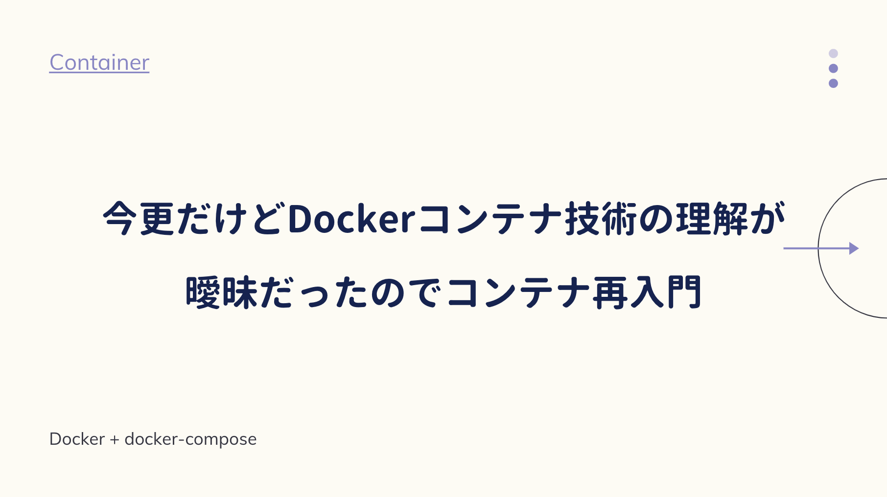

昨今のシステム開発では、コンテナの技術が欠かせない。

しかし今まで他人のDockerfileを拝借していたので、私の理解は曖昧だった。

既存ファイルを流用することも大切だが、Dockerのバージョンアップで急に動かなくなったり、設定の誤りでエラーが出たりと、基礎を知らない人は環境構築で挫折することが多い。

最低限の基礎を理解するため、こちらの本を読んでみた。


<div class="cstmreba"><div class="booklink-box"><div class="booklink-image"><a href="https://hb.afl.rakuten.co.jp/hgc/146fe51c.1fd043a3.146fe51d.605dc196/yomereba_main_20200425225631776?pc=http%3A%2F%2Fbooks.rakuten.co.jp%2Frb%2F15570632%2F%3Fscid%3Daf_ich_link_urltxt%26m%3Dhttp%3A%2F%2Fm.rakuten.co.jp%2Fev%2Fbook%2F" target="_blank" ></a></div><div class="booklink-info"><div class="booklink-name"><a href="https://hb.afl.rakuten.co.jp/hgc/146fe51c.1fd043a3.146fe51d.605dc196/yomereba_main_20200425225631776?pc=http%3A%2F%2Fbooks.rakuten.co.jp%2Frb%2F15570632%2F%3Fscid%3Daf_ich_link_urltxt%26m%3Dhttp%3A%2F%2Fm.rakuten.co.jp%2Fev%2Fbook%2F" target="_blank" >Docker／Kubernetes実践コンテナ開発入門</a><div class="booklink-powered-date">posted with <a href="https://yomereba.com" rel="nofollow" target="_blank">ヨメレバ</a></div></div><div class="booklink-detail">山田明憲 技術評論社 2018年09月    </div><div class="booklink-link2"><div class="shoplinkrakuten"><a href="https://hb.afl.rakuten.co.jp/hgc/146fe51c.1fd043a3.146fe51d.605dc196/yomereba_main_20200425225631776?pc=http%3A%2F%2Fbooks.rakuten.co.jp%2Frb%2F15570632%2F%3Fscid%3Daf_ich_link_urltxt%26m%3Dhttp%3A%2F%2Fm.rakuten.co.jp%2Fev%2Fbook%2F" target="_blank" >楽天ブックス</a></div><div class="shoplinkamazon"><a href="https://www.amazon.co.jp/exec/obidos/asin/4297100339/kanon123-22/" target="_blank" >Amazon</a></div><div class="shoplinkkindle"><a href="https://www.amazon.co.jp/gp/search?keywords=Docker%EF%BC%8FKubernetes%E5%AE%9F%E8%B7%B5%E3%82%B3%E3%83%B3%E3%83%86%E3%83%8A%E9%96%8B%E7%99%BA%E5%85%A5%E9%96%80&__mk_ja_JP=%83J%83%5E%83J%83i&url=node%3D2275256051&tag=kanon123-22" target="_blank" >Kindle</a></div>                              	  	  	  	  	</div></div><div class="booklink-footer"></div></div></div>
<br/>

Dockerの基本、docker-composeによるRails環境を構築するハンズオンを試してみた。

## Dockerfileの書き方

まず **<span style="color: #ff8c00;">Dockerイメージをビルドする</span>** とは、コンテナの元になるイメージを作ることをさす。

```bash
# Dockerfile
FROM golang:1.9

RUN mkdir /echo
COPY main.go /echo

CMD ["go", "run", "/echo/main.go"]
```
<br/>

**<span style="color: #ff8c00;">FROM</span>** では、Dockerイメージのベースとなるイメージを指定し、ビルド時に指定されたイメージがダウンロードされる（取得イメージはデフォルトでDocker Hubレジストリを参照）

**<span style="color: #ff8c00;">RUN</span>** では、コンテナで実行するコマンドを定義でき、引数はコマンドをそのまま指定できる。

**<span style="color: #ff8c00;">COPY</span>** では、ホストマシンにあるファイル等をコンテナにコピーする操作となる。

**<span style="color: #ff8c00;">CMD</span>** では、コンテナで実行するプロセスを指定できる（RUNではアプリケーションの更新や配置、CMDでアプリケーションそのものを動作させる）

## コンテナの操作

サンプル作成したコンテナ環境で、main.goの動作確認を行う。

```go
package main

import (
	"fmt"
	"log"
	"net/http"
)

func main() {
	http.HandleFunc("/", func(w http.ResponseWriter, r *http.Request) {
		log.Println("received request")
		fmt.Fprintf(w, "Hello Docker!!")
	})

	log.Println("start server")
	server := &http.Server{Addr: ":8080"}
	if err := server.ListenAndServe(); err != nil {
		log.Println(err)
	}
}
```
<br/>

まずイメージを作成し、コンテナを実行する（-dでバックグラウンド、-pでポートフォワーディング）

```bash
docker image build -t example/echo:latest .
docker image ls

docker container run -d -p 9000:8080 example/echo:latest
docker container ps
```
<br/>

localhost:9000で「Hello Docker!!」が表示されたら、不要なコンテナとイメージを削除する。

```bash
docker container stop コンテナID
docker container rm コンテナID

docker image ls
docker rmi イメージID
```

## イメージの操作

**<span style="color: #ff8c00;">Dockerイメージ</span>** は、Dockerコンテナを作成するためのテンプレートで、OSとして構成されたファイルシステム、コンテナ上で実行するためのアプリケーション、設定情報などが含まれている。

**<span style="color: #ff8c00;">イメージの操作</span>** に関連するコマンドは次のとおり↓

```bash
# イメージのビルド

## -t オプションで[イメージ名]と[タグ名]を指定.
docker image build -t イメージ名:タグ名 Dockerfile配置ディレクトリのパス
## -f オプションは、指定ファイル(Dockerfileでない名称)を指定してイメージをビルド.
docker image build -f Dockerfile-test -t example/echo:latest
## --pull オプションは、ベースイメージを強制的に再取得してイメージのビルド.
docker image build --pull=true -t example/echo:latest

# イメージの取得

## DockerレジストリからDockerイメージをダウンロード.
docker image pull [options] リポジトリ名:タグ名
## 例) jenkinsのイメージ取得コマンド.
docker image pull jenkins:latest

# イメージの削除

## 削除
docker rmi イメージID
## 強制的に削除.
docker rmi -f イメージID

# イメージの一覧

## Dockerホストに保持されているイメージの一覧表示.
docker image ls [options] [リポジトリ:タグ]

# イメージのタグ付け

## Dockerイメージのタグはある特定のイメージIDを持つDockerイメージを識別しやすくするために利用.
docker image tag 元イメージ:タグ 新イメージ:タグ
```

## コンテナの操作

**<span style="color: #ff8c00;">Dockerコンテナ</span>** は **<span style="color: #ff8c00;">実行中・停止・破棄</span>** の3つのいずれかに分類される。

**<span style="color: #ff8c00;">コンテナの操作</span>** に関連するコマンドは次のとおり↓

```bash
# コンテナの作成と実行

## Dockerイメージからコンテナを作成、実行するコマンド.
docker container run [options] イメージ名:タグ コマンド コマンド引数
docker container run [options] イメージID コマンド コマンド引数
## -p ポートフォワーディング(ホスト側の9000ポートからコンテナ側の8080ポートへアクセス)
## -d バックグラウンド
docker container run -d -p 9000:8080 example/echo:latest
## 名前付きコンテナ
docker container run --name コンテナ名 イメージ名:タグ
docker container run -t -d --name gihyo-echo example/echo:latest

# コンテナの一覧確認

## 実行中のコンテナ及び終了したコンテナの一覧表示.
docker container ls [options]
## 例) コンテナIDのみ抽出.
docker container ls -q
## 例) 特定のコンテナ名のみ抽出.
docker container ls --filter "name=echo1"
## 例) 特定のイメージで抽出.
docker container ls --filter "ancestor=example/echo"
## 例) 終了したコンテナも抽出.
docker container ls -a

# コンテナの停止

## 実行中のコンテナの停止.
docker container stop コンテナID または コンテナ名

# コンテナの再起動

## 一度停止したコンテナの再実行.
docker container restart コンテナID または コンテナ名

# コンテナの破棄

## 停止したコンテナの完全廃棄.
docker container rm コンテナID または コンテナ名
## 実行中のコンテナを強制的に破棄.
docker container rm -f コンテナID または コンテナ名

# 実行中のコンテナ操作

## 実行中コンテナの中で任意のコマンドを実行.
docker container exec [options] コンテナID または コンテナ名 コマンド
docker container exec -it cronjob tail -f /var/log/cron.log
```

## 運用向けの操作

**<span style="color: #ff8c00;">コンテナの一括削除</span>** に関連するコマンドは次のとおり↓

```bash
# 実行していないコンテナの一括削除.
docker container prune [options]

# 不要なイメージファイルの一括削除.
docker image prune [options]

# コンテナ、イメージ、ボリューム、ネットワークなどDockerリソースを一括削除.
docker system prune
```

## Docker-Composeの基本

システム開発ではアプリケーションの連携が必要になり、docker-composeが一般的になる。

**<span style="color: #ff8c00;">docker-compose</span>** は、yaml形式で定義された設定ファイルで複数のコンテナ実行を一括管理する。

```bash
version: "3"
services: 
  echo:                        # コンテナ名
    image: example/echo:latest # Dockerイメージ
    ports:                     # ポートフォワーディング（ホスト/コンテナ）
      - 9000:8080
```
<br/>

docker-composeの基本コマンドは次のとおり↓

```bash 
# イメージのビルド
docker-compose build

# コンテナ群の起動（--buildは必ずビルド実施）
docker-compose up -d
docker-compose up -d --build

# コンテナ群の停止（--rmiはイメージも併せて削除）
docker-compose down
docker-compose down --rmi all

# プロセスの確認
docker-compose ps
```

## 永続化データの取扱い

コンテナ実行中に書き込まれたファイルは、ホストにマウントしない限り、コンテナ破棄のタイミングで消去されるため、ステートフルな運用を実現するために **<span style="color: #ff8c00;">Data Volume</span>** を利用する。

```bash
# docker container run [options] -v ホスト側のpath:コンテナ側のpath リポジトリ名:タグ名 コマンド 引数
docker container run -v ${PWD}:/workspace ghyodocker/imagemagick:latest convert -size 100*100 xc:#000000 /workspace/gihyo.jpg
```

## チュートリアル（Rails）

最後にdocker-compose上でRails開発環境を構築していく。

まずカレントディレクトリ配下のrorディレクトリにDockerfileを作成する。

```bash
FROM ruby:2.4.0
RUN apt-get update -qq && apt-get install -y build-essential libpq-dev nodejs
RUN mkdir /myapp
WORKDIR /myapp
COPY Gemfile /myapp/Gemfile
COPY Gemfile.lock /myapp/Gemfile.lock
RUN bundle install
COPY . /myapp
```
<br/>

Gemfileを作成（併せて空ファイルのGemfile.lockも作成）

```bash
source 'https://rubygems.org'
gem 'rails', '5.0.0.1'
```
<br/>

docker-compose.ymlを次のように定義する。

```bash
# 参考文献(https://discuss.circleci.com/t/postgres-just-stopped-working/34511/4)
version: '3'
services:
  db:
    image: postgres
    environment:
      POSTGRES_PASSWORD: password
  web:
    build: .
    command: bundle exec rails s -p 3000 -b '0.0.0.0'
    volumes:
      - .:/myapp
    ports:
      - "3000:3000"
    depends_on:
      - db
```
<br/>

事前にFile Sharingでカレントディレクトリを追加する。

```bash
docker-compose run web rails new . --force --database=postgresql
```
<br/>

Gemfileを一部修正。

```bash
# 修正前)
gem 'pg', '~> 0.18'
# 修正後)
gem 'pg', '~> 0.20.0'
```
<br/>

修正分を含めるために再度ビルドを実行。

```bash
docker-compose build
```
<br/>

データベース設定(config/database.yml)の追加。

```bash
# 修正前)
default: &default
  adapter: postgresql
  encoding: unicode
  # For details on connection pooling, see rails configuration guide
  # http://guides.rubyonrails.org/configuring.html#database-pooling
  pool: <%= ENV.fetch("RAILS_MAX_THREADS") { 5 } %>

# 修正後)
default: &default
  adapter: postgresql
  encoding: unicode
  host: db
  username: postgres
  password: password
  # For details on connection pooling, see rails configuration guide
  # http://guides.rubyonrails.org/configuring.html#database-pooling
  pool: <%= ENV.fetch("RAILS_MAX_THREADS") { 5 } %>
```
<br/>

動作検証のコマンドは次のとおり↓

```bash
# 起動
docker-compose up -d

# データベース作成.
docker-compose run web rake db:create

# アクセス.
http://localhost:3000/

# コンテナ群の停止.
docker-compose down
```
<br/>