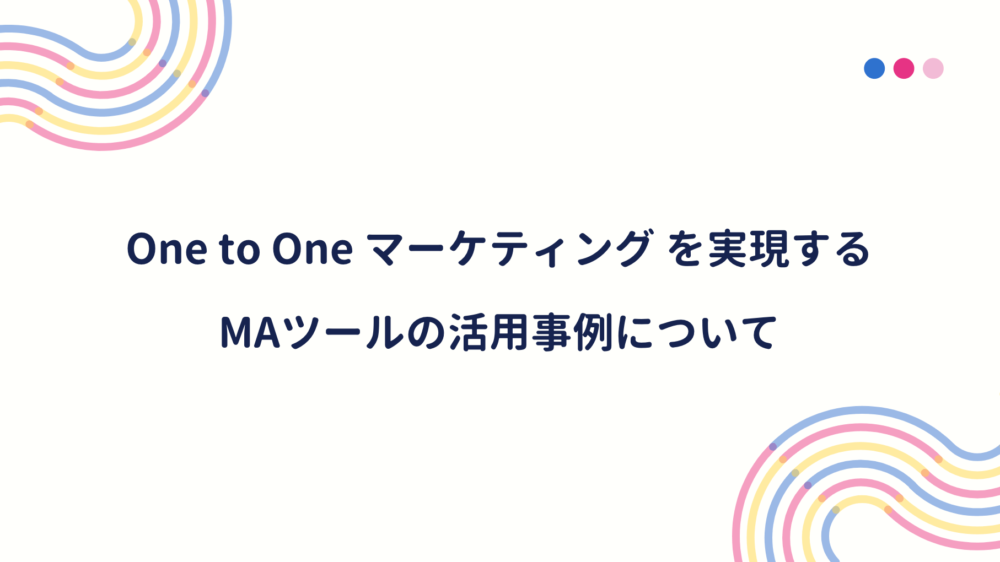
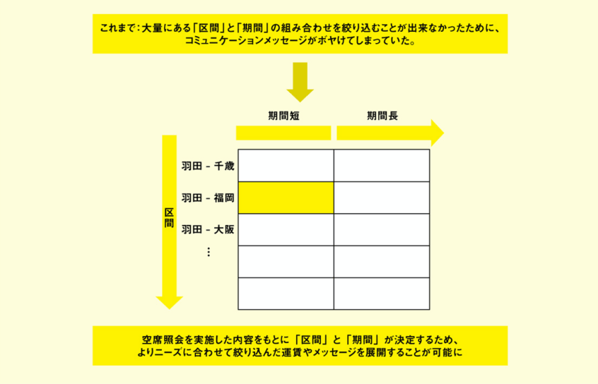

2010年以降、多くのIT企業がMAベンダーを買収し、国内のMA市場規模は拡大トレンドらしい。

しかし私が業界著名人の本を読んだり、また（MAツール開発会社の）現場担当者に話を聞くかぎりでは、せっかく導入しても、上手く活用している企業は少数に限られていると感じた。

この点について、次の本でも紹介されているように、MAツールはPDCAの「D」部分を自動化するもので、その他の工程はマーケターがシナリオを設計しなければならない。

<a href="https://hb.afl.rakuten.co.jp/hgc/146fe51c.1fd043a3.146fe51d.605dc196/yomereba_main_202006292241495264?pc=http%3A%2F%2Fbooks.rakuten.co.jp%2Frb%2F14941316%2F%3Fscid%3Daf_ich_link_urltxt%26m%3Dhttp%3A%2F%2Fm.rakuten.co.jp%2Fev%2Fbook%2F" target="_blank" >マーケティングオートメーション導入の教科書</a>
posted with <a href="https://yomereba.com" rel="nofollow" target="_blank">ヨメレバ</a>

長谷川健人/住岡洋光 エムディエヌコーポレーション 2017年06月    

<a href="https://hb.afl.rakuten.co.jp/hgc/146fe51c.1fd043a3.146fe51d.605dc196/yomereba_main_202006292241495264?pc=http%3A%2F%2Fbooks.rakuten.co.jp%2Frb%2F14941316%2F%3Fscid%3Daf_ich_link_urltxt%26m%3Dhttp%3A%2F%2Fm.rakuten.co.jp%2Fev%2Fbook%2F" target="_blank" >楽天ブックス</a>

<a href="https://www.amazon.co.jp/exec/obidos/asin/4844366726/kanon123-22/" target="_blank" >Amazon</a>

<a href="https://www.amazon.co.jp/gp/search?keywords=%E3%83%9E%E3%83%BC%E3%82%B1%E3%83%86%E3%82%A3%E3%83%B3%E3%82%B0%E3%82%AA%E3%83%BC%E3%83%88%E3%83%A1%E3%83%BC%E3%82%B7%E3%83%A7%E3%83%B3%E5%B0%8E%E5%85%A5%E3%81%AE%E6%95%99%E7%A7%91%E6%9B%B8&__mk_ja_JP=%83J%83%5E%83J%83i&url=node%3D2275256051&tag=kanon123-22" target="_blank" >Kindle</a>
                              	  	  	  	  	

 

また本書の後半でも、MA導入事例（主に大企業）が幾つか紹介されていた。

特にSanSanの事例紹介で **MAツールは魔法の杖ではなく、マーケティングをデジタル化する手段の1つで、マーケターがターゲットやシナリオを考える必要があり、マーケターが具体的に考えられないことをMAツールは実現出来ない** と言われており、実運用には多くの壁があるとわかる。

さらに次の本では、AIDMAモデルが丁寧に説明されており、MAツールは、AIDMA（認知 / 興味 / 欲求 / 記憶 / 行動）のIDM部分を自動化できるツールとしている。

<a href="https://hb.afl.rakuten.co.jp/hgc/146fe51c.1fd043a3.146fe51d.605dc196/yomereba_main_202008011752128282?pc=http%3A%2F%2Fbooks.rakuten.co.jp%2Frb%2F14665971%2F%3Fscid%3Daf_ich_link_urltxt%26m%3Dhttp%3A%2F%2Fm.rakuten.co.jp%2Fev%2Fbook%2F" target="_blank" >実践マーケティングオートメーション</a>
posted with <a href="https://yomereba.com" rel="nofollow" target="_blank">ヨメレバ</a>

永井俊輔/できるシリーズ編集部 インプレス 2017年02月    

<a href="https://hb.afl.rakuten.co.jp/hgc/146fe51c.1fd043a3.146fe51d.605dc196/yomereba_main_202008011752128282?pc=http%3A%2F%2Fbooks.rakuten.co.jp%2Frb%2F14665971%2F%3Fscid%3Daf_ich_link_urltxt%26m%3Dhttp%3A%2F%2Fm.rakuten.co.jp%2Fev%2Fbook%2F" target="_blank" >楽天ブックス</a>

<a href="https://www.amazon.co.jp/exec/obidos/asin/4295000507/kanon123-22/" target="_blank" >Amazon</a>

<a href="https://www.amazon.co.jp/gp/search?keywords=%E5%AE%9F%E8%B7%B5%E3%83%9E%E3%83%BC%E3%82%B1%E3%83%86%E3%82%A3%E3%83%B3%E3%82%B0%E3%82%AA%E3%83%BC%E3%83%88%E3%83%A1%E3%83%BC%E3%82%B7%E3%83%A7%E3%83%B3&__mk_ja_JP=%83J%83%5E%83J%83i&url=node%3D2275256051&tag=kanon123-22" target="_blank" >Kindle</a>
                              	  	  	  	  	

 

しかし **One to One マーケティング** を実現できるMAツールの活用事例を聞くと**「なるほど！」**と思わされる点も多くあるので、これからの時代には必須かなと思えた。

まず活用事例で最初に感心したのが、Adobe製のMAを導入したANAの話だった。

情報過多の時代、顧客体験を向上させるため、なにをすれば良いのか。

まず情報の絞り込みの観点から、情報を正確にフィルタリングし、様々な施策が取られていた。

MA活用の一例として、何かしらのアクション（ページ閲覧やフォームCV）をトリガーに、メール送信する手法があり、ANAでも空席照会をトリガーに照会された結果からメールを配信していた。

しかしメールの文面は「区間と期間」の組み合わせで運賃が決まる「最大公約数的なもの」に過ぎなかったらしい（**旅割運賃なら◯◯◯円〜、特割運賃なら◯◯◯円〜といった案内の文面**）

ANAでは空席照会時の「区間と期間」も考慮に入れ、メールの文面を見込み客に応じて柔軟に制御し、空席照会のCVが 300%UP した事例が紹介されていた（**「今なら羽田 - 福岡は、旅割運賃を使って◯◯◯円」と、不要な他の区間情報は非表示にすることが可能**）

区間が決定しているので、よりマッチしたページへの誘導も可能になり、これは利用者に寄り添った良い施策だと思った（字にすると簡単そうに感じてしまうけど）

また操作の簡略化の観点でも、プラン選択時に参照していたコンテンツ情報から、利用するであろう条件（出発地など）をデフォルト設定し、プルダウンから探さず済むようにしている。

見込み客のデータをどう活用すれば、顧客体験が向上するのか、One To One マーケティングを実現出来るかを、現場のドメイン理解者が、日々試行錯誤して実現させた成功事例かと思います。

ただANAような大企業には専門チームがあり、様々なスペシャリスト（キャンペーン担当 / サイト担当 / 広報担当 / メール担当）が、一貫したデジタルコミュニケーションをとっていると思う。

そのため普通の中小企業には、まだまだ敷居は高い気もする。