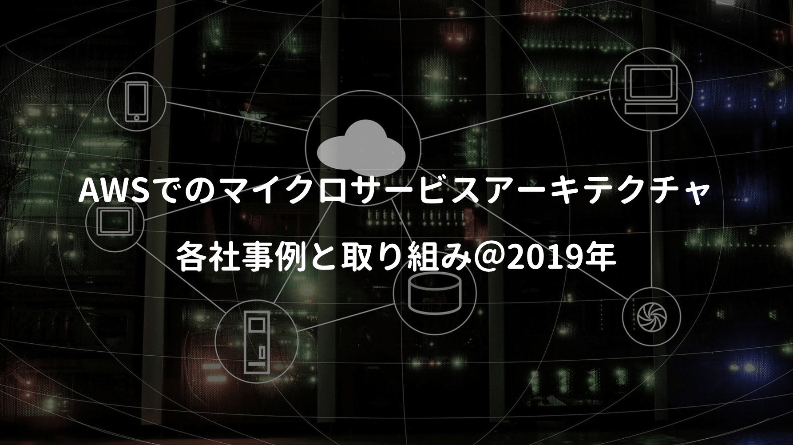
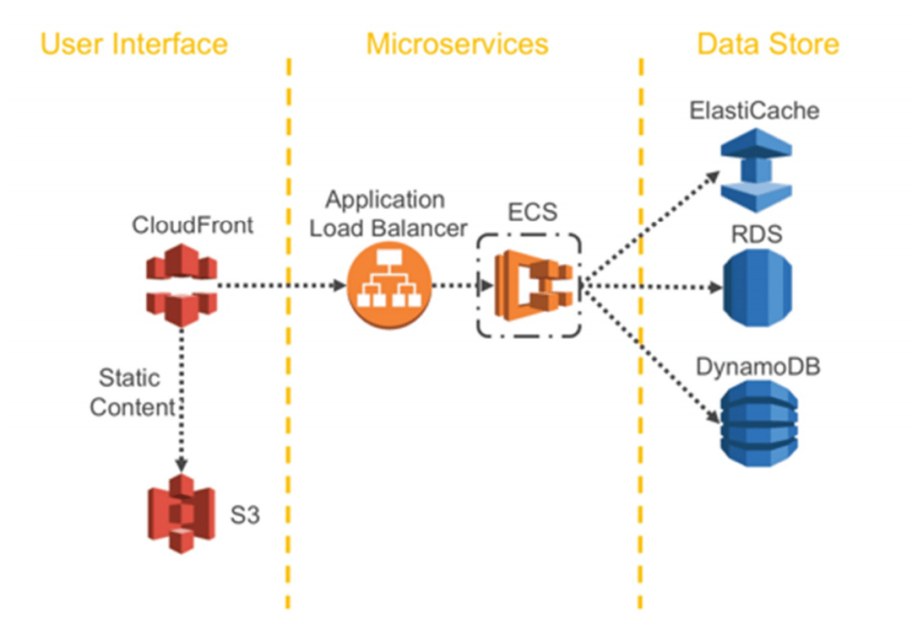

テクノロジーの力で新しい価値を創造するため、DXの推進が重要だと言われる昨今。

IT業界ではその取り組みの一つに **マイクロサービスアーキテクチャ** が挙げられる。

ネット上には色んな事例が溢れているが、個人的な結論としては **多くの組織にとって、マイクロサービスはオーバーエンジニアリング** であり、軽いノリでやり始めても成功の確率は低いと思われる。

しかしマイクロサービスで語られる話は、アーキテクトを考える上で役立つ内容が多いため、今回はマイクロサービスに取り組んでいる他社の事例を調べ、私なりに実現方法を考えてみた。

ちなみに世界的なテクノロジー企業や大手メガベンチャーで、本格的なマイクロサービス開発に携わった経験は無いので、あくまで机上の空論になっております（あしからず）

## マイクロサービスを考える上での参考文献

**マイクロサービスとは何か!? どのような技術スタックが必要になるのか!?**

次に紹介する2つの本には、マイクロサービスに関する話が網羅的に紹介されている。

<a href="https://hb.afl.rakuten.co.jp/hgc/146fe51c.1fd043a3.146fe51d.605dc196/yomereba_main_202009031127327274?pc=http%3A%2F%2Fbooks.rakuten.co.jp%2Frb%2F13770161%2F%3Fscid%3Daf_ich_link_urltxt%26m%3Dhttp%3A%2F%2Fm.rakuten.co.jp%2Fev%2Fbook%2F" target="_blank" >マイクロサービスアーキテクチャ</a>
posted with <a href="https://yomereba.com" rel="nofollow" target="_blank">ヨメレバ</a>

SamNewman/佐藤直生 オライリー・ジャパン 2016年02月26日頃    

<a href="https://hb.afl.rakuten.co.jp/hgc/146fe51c.1fd043a3.146fe51d.605dc196/yomereba_main_202009031127327274?pc=http%3A%2F%2Fbooks.rakuten.co.jp%2Frb%2F13770161%2F%3Fscid%3Daf_ich_link_urltxt%26m%3Dhttp%3A%2F%2Fm.rakuten.co.jp%2Fev%2Fbook%2F" target="_blank" >楽天ブックス</a>

<a href="https://www.amazon.co.jp/exec/obidos/asin/4873117607/kanon123-22/" target="_blank" >Amazon</a>

<a href="https://www.amazon.co.jp/gp/search?keywords=%E3%83%9E%E3%82%A4%E3%82%AF%E3%83%AD%E3%82%B5%E3%83%BC%E3%83%93%E3%82%B9%E3%82%A2%E3%83%BC%E3%82%AD%E3%83%86%E3%82%AF%E3%83%81%E3%83%A3&__mk_ja_JP=%83J%83%5E%83J%83i&url=node%3D2275256051&tag=kanon123-22" target="_blank" >Kindle</a>
                              	  	  	  	  	

 

<a href="https://hb.afl.rakuten.co.jp/hgc/146fe51c.1fd043a3.146fe51d.605dc196/yomereba_main_202009031129415642?pc=http%3A%2F%2Fbooks.rakuten.co.jp%2Frb%2F16239274%2F%3Fscid%3Daf_ich_link_urltxt%26m%3Dhttp%3A%2F%2Fm.rakuten.co.jp%2Fev%2Fbook%2F" target="_blank" >マイクロサービスパターン</a>
posted with <a href="https://yomereba.com" rel="nofollow" target="_blank">ヨメレバ</a>

クリス・リチャードソン/長尾高弘 インプレス 2020年03月    

<a href="https://hb.afl.rakuten.co.jp/hgc/146fe51c.1fd043a3.146fe51d.605dc196/yomereba_main_202009031129415642?pc=http%3A%2F%2Fbooks.rakuten.co.jp%2Frb%2F16239274%2F%3Fscid%3Daf_ich_link_urltxt%26m%3Dhttp%3A%2F%2Fm.rakuten.co.jp%2Fev%2Fbook%2F" target="_blank" >楽天ブックス</a>

<a href="https://www.amazon.co.jp/exec/obidos/asin/4295008583/kanon123-22/" target="_blank" >Amazon</a>

<a href="https://www.amazon.co.jp/gp/search?keywords=%E3%83%9E%E3%82%A4%E3%82%AF%E3%83%AD%E3%82%B5%E3%83%BC%E3%83%93%E3%82%B9%E3%83%91%E3%82%BF%E3%83%BC%E3%83%B3&__mk_ja_JP=%83J%83%5E%83J%83i&url=node%3D2275256051&tag=kanon123-22" target="_blank" >Kindle</a>
                              	  	  	  	  	

 

これからマイクロサービスに取り組もうとお考えの方は、どちらも目を通すのが望ましい。

ホントは推薦図書がもう一冊あるが、英語版のみなので割愛する。

## マイクロサービスとは何か!?

まずオライリー本では、マイクロサービスの定義を次のように説明されている。

> マイクロサービスは協調して動作する小規模で自律的なサービスであり、各サービス間の通信はネットワーク経由となる。そのためサービスを適切にモデル化(ドメイン領域の分割)、API定義を行い、デプロイの対処(クラウドやコンテナ技術)、テスト、監視などの知見も必要となる。

この文章を読んだくらいで理解できる方はそう多くないと思うけど...

AWSで紹介されているアーキテクチャ構成を見ればイメージが湧くだろうか。

細かい話は次の文献に詳しく説明されている。

■ **[AWSにおけるマイクロサービス](https://d1.awsstatic.com/International/ja_JP/Whitepapers/MicroservicesOnAWS-V2_NT0829_SMO_MJ_EditSM_ProofSM_ProofNT.pdf)**  
**■ [コレ１枚でわかるマイクロサービス･アーキテクチャ](https://blogs.itmedia.co.jp/itsolutionjuku/2019/08/post_728.html)**  

モノリスな開発に慣れている方は困惑するかもしれないが、なぜマイクロサービスなのか!?

理由は色々あるが、モノリスな環境で開発を続けてるとコードが複雑になり、メンテコストが膨らむ傾向にある。またインフラ面でも柔軟なスケーリングが難しいと言われている。

またオライリー本では、マイクロサービスのメリットを次のように言っている。

1. 技術特異性 (サービス毎に適した技術が利用可能)

2. 回復性 (障害部分のみ切り離し可能)

3. スケーリング (高負荷部分のみサーバー増強可能)

4. デプロイの容易性 (デプロイ時間短縮)

5. 組織面の一致 (小規模チームによる生産性向上)

6. 合成可能性 (機能の再利用)

7. 交換可能にする最適化 (小規模なので必要に応じて書き換え可能)

 

機能単位に独立したチームで運用するため、生産性向上が見込め、ビジネスチャンスが広がる（と世の中的に言われております、そんなに上手くいくかは会社によると思うけど...）

## どんな知識・スキルが求められるのか!?

ではマイクロサービスの実現には、どんなスキルや知識が求められるだろうか?

まずマイクロサービスに限った話ではないが、当然ながらシステムに対するドメイン知識が必須。

また既存ドメインの適切な分割が求められ、その上で役立つのが **DDDの考え方** だと言われる。

エリック・エヴァンスのDDD本を読んだことがあるが、私の理解力が乏しく、一度読んだくらいでは理解出来なかった。他の方に聞いても、いまいち分からん ... 一部のシリコンバレーエンジニアの間では「DDDなんて知らん♪」と言う人までおり、この点は探り探りやるしかないらしい。

技術的な領域も幅広く、クラウド技術に精通したDevOps/SRE的なポジション、フロントエンドではReactやVueでのSPA開発経験、癖があると言われるサーバレス技術など色々。

開発者視点では上のいずれかに精通し、その他の技術は多少知ってるレベルで良いかなと思う。

## サービス分割の方法

モノリスサービスをどの粒度で分割していくのか!?

具体的な分割について、マイクロサービスパターン本では2つが紹介されていた。

一つ目が **Decompose by buisiness capability** の業務に対応させてサービスを定義する方法。

二つ目が **Decompose by sub-domain** のドメイン駆動設計に基づく分割方法。

正直この本を読んだくらいでは、理解力の乏しい私は理解ができなかったけど...

## マイクロサービスの欠点

システム開発に銀の弾丸は存在しないと言われるが、マイクロサービスにも当然欠点がある。

1. サービスの適切な分割方法を見つけるのが難しい.

2. 分散システムは複雑であり、開発 / テスト / デプロイが難しくなる.

3. 複数のサービスにまたがって使われる機能のデプロイには綿密な調整が必要.

4. いつマイクロサービスアーキテクチャを採用すべきかの判断が難しい.

 

また **分散システムの落とし穴にも気を配る必要** があり、次の記事が参考になった。

■ **[マイクロサービスを蝕む負の力学](https://ota42y.com/blog/2019/06/25/microservices_vector/)**

サービス間の依存関係が複雑になり、通信コストやレイテンシー問題、機能単位にDBを保持するとデータの整合性問題も考えられ、十分な開発リソースや知見を持つエンジニアがいないと手が出せない。

## 何から手を出せば良いのか!?

やらない理由ばかり並べても仕方ないため、最後に仮にやる場合はどうすれば良いか考えた。

最初の取っ掛かりとしては、次の事例が参考になるかと思う。

■ **[ドメイン駆動設計パターンを使用してモノリスからマイクロサービスへ@Microsoft](https://docs.microsoft.com/ja-jp/azure/architecture/microservices/migrate-monolith)**  
■ **[マイクロサービス化デザインパターン@Graat](https://www.slideshare.net/yusuke/awsdevday-tokyo-2018)**  
■ **[実ビジネスのためのアプリケーションモダナイゼーション＠Graat](https://www.slideshare.net/yusuke/ss-171091581)**  

主に次の流れに沿って、段階的にマイクロサービス化していく。

1. モノリスへの機能の追加を停止.

2. フロントエンドからバックエンドを分割.

3. モノリスを分解し、一連のマイクロサービスを分離.

 

これは **ストラングラーパターン** と呼ばれる手法で、切り出せる部分をAPIとして分割し、第二段階でフロントエントとバックエンドを分割していくと説明されている。

AWSホワイトペーパーが足りない情報を補記してくれる役割を担っている。

■ **[AWSにおけるクラウドネイティブ モダンアプリケーション開発と設計パターン](https://d1.awsstatic.com/whitepapers/ja_JP/modern-application-development-on-aws.pdf)** 

第三段階をどこまでやるかは、現場毎に悩むしかないといったところか。

## その他の事例について

**[ Microsoft ]**  
■ [破損対策レイヤーパターン](https://docs.microsoft.com/ja-jp/azure/architecture/patterns/anti-corruption-layer)  
■ [マイクロサービスでの API ゲートウェイの使用](https://docs.microsoft.com/ja-jp/azure/architecture/microservices/design/gateway)  
■ [ストラングラーパターン](https://docs.microsoft.com/ja-jp/azure/architecture/patterns/strangler)  

**[ Line ]**  
■ [実践マイクロサービス ─ コンポーネント分割やトラブル回避の考え方をLINEの導入事例に学ぶ](https://employment.en-japan.com/engineerhub/entry/2018/10/09/110000)

**[ NGINX ]**  
■ [マイクロサービスの紹介](https://www.nginx.com/blog/introduction-to-microservices/#version_b)  

**[ Cookpad ]**  
■ [クックパッドとマイクロサービス](https://techlife.cookpad.com/entry/2014/09/08/093000)  
■ [クックパッドにおける最近のMicroservices事例](https://techlife.cookpad.com/entry/2016/03/16/100043)  
■ [Service Mesh and Cookpad](https://techlife.cookpad.com/entry/2018/05/08/080000)  
■ [大きなRailsアプリケーションをなんとかしよう。まずは計測と可視化からはじめよう](https://techlife.cookpad.com/entry/2018/06/08/080000)  
■ [クックパッド基幹システムのmicroservices化戦略 〜お台場プロジェクト1年半の軌跡〜](https://techlife.cookpad.com/entry/2018-odaiba-strategy)  
■ [100万行オーバーのモノリシックRailsアプリをマイクロサービス化したクックパッドの手順](https://employment.en-japan.com/engineerhub/entry/2019/09/17/103000)  
■ [AWS 導入事例](https://aws.amazon.com/jp/solutions/case-studies/cookpad/)  
■ [How Microservices are linked at Cookpad](https://speakerdeck.com/adorechic/how-microservices-are-linked-at-cookpad)  

**[ freee ]**  
■ [freeeのマイクロサービス基盤とWire導入](https://developers.freee.co.jp/entry/service-infra-and-wire)  
■ [AWS導入事例](https://aws.amazon.com/jp/solutions/case-studies/freee/)  
■ [OSSを活用した、マイクロサービスアーキテクチャの課題を解決する取り組みとは](https://codezine.jp/article/detail/10817)  
■ [Kubernetes×AWSで複雑化したマイクロサービス基盤を改善](https://codezine.jp/article/detail/11863)  
■ [Kubernetes on AWS/EKSベストプラクティス](https://speakerdeck.com/mumoshu/eksbesutopurakuteisu2019-dot-2-number-jawsdays)  
■ [gRPCでインターフェースを再整理してからサービスを分割─freeeの段階的なマイクロサービス戦略](https://employment.en-japan.com/engineerhub/entry/2020/03/30/103000)  

**[ ドリーム・アーツ ]**  
■ [マイクロサービス・コンテナに全面移行するにはどうすればいいか?](https://codezine.jp/article/detail/11415)  

**[ zozotown ]**  
■ [ZOZOTOWNマイクロサービス化 - API Gatewayを自社開発したノウハウ大公開！](https://techblog.zozo.com/entry/zozotown-api-gateway-intro)  

**[ RAKUS ]**  
■ [マイクロサービスアーキテクチャをあきらめないための、モノリスで始めるアーキテクチャテスト](https://tech-blog.rakus.co.jp/entry/20201225/jjug)  

## 参考記事 
■ [REST APIの設計で消耗している感じたときのgRPC入門](https://qiita.com/disc99/items/cfca50a32240284578bb)  
■ [マイクロサービスバックエンドAPIのためのRESTとgRPC](https://www.slideshare.net/disc99_/apirestgrpc)  
■ [マイクロサービスにおけるWeb APIスキーマの管理 ─ GraphQL、gRPC、OpenAPIの特徴](https://employment.en-japan.com/engineerhub/entry/2019/08/22/103000#gRPC--%E5%AF%BE%E5%BF%9C%E3%81%97%E3%81%A6%E3%81%84%E3%82%8B%E8%A8%80%E8%AA%9E%E3%81%AA%E3%82%89%E9%96%8B%E7%99%BA%E3%82%84%E9%80%9A%E4%BF%A1%E5%8A%B9%E7%8E%87%E3%81%8C%E8%89%AF%E3%81%84)  
■ [マイクロサービス移行を阻むレガシーとの戦い方](https://www.atmarkit.co.jp/ait/articles/2003/03/news003.html)  
■ [おっさんがACIDとかBASEとかまとめておく](https://qiita.com/suziq99999/items/2e7037042b31a77b19c8)  
■ [「メタデータ」「NoSQL」「CAP定理」を理解する](https://www.atmarkit.co.jp/ait/articles/1703/01/news204_2.html)  
■ [「マイクロサービスに出遅れた」ところは、先人から何を学べるか](https://www.atmarkit.co.jp/ait/articles/1909/13/news012.html)  
■ [マイクロサービスが注目される理由　導入検討に向けて気を付けるべきポイント](https://www.atmarkit.co.jp/ait/articles/1910/18/news005.html)  
■ [創業時はJava 1.3、JDBC、JSPで構築――ECサイト「Oisix」がマイクロサービス化を進めたワケ](https://www.atmarkit.co.jp/ait/articles/1911/25/news009.html)  
■ [マイクロサービスアーキテクチャにおける「サービス配置」の考え方](https://www.atmarkit.co.jp/ait/articles/1912/17/news007.html)  
■ [新規構築や移行時のリスクを軽減、「ストラングラーパターン」とは？](https://www.atmarkit.co.jp/ait/articles/2001/23/news003.html)  
■ [マイクロサービス移行を阻むレガシーとの戦い方](https://www.atmarkit.co.jp/ait/articles/2003/03/news003.html)  
■ [マイクロサービス移行後のテスト、CI/CD、運用監視で現場が疲弊しないためのポイント](https://www.atmarkit.co.jp/ait/articles/2003/17/news004.html)  
■ [Kubernetes architecture](https://github.com/kubernetes/kubernetes/blob/release-1.3/docs/design/architecture.md)  
■ [数時間で完全理解！わりとゴツいKubernetesハンズオン！！](https://qiita.com/Kta-M/items/ce475c0063d3d3f36d5d)  
■ [KubernetesとNode.jsでマイクロサービスを作成する](https://qiita.com/reireias/items/6a78d6b8df781a76f94f)  
■ [Kubernetesの自前運用は難しい？はてなの撤退事例](https://www.atmarkit.co.jp/ait/articles/1911/08/news009.html)  
■ [AWS コンテナサービス「Fargate」「ECS」「EKS」の違いを解説](https://xn--o9j8h1c9hb5756dt0ua226amc1a.com/?p=2025)  
■ [DockerでEC2、ECS、EKSの運用想定まとめ](https://qiita.com/dich1/items/fca1a46f9a71721359e4)  
■ [AWSはなぜ、ECSがあるのにKubernetesのサービスを始めたのか、コックロフト氏に聞いた](https://www.atmarkit.co.jp/ait/articles/1806/11/news029.html)  
■ [コンテナーとは?Kubernetesとは?導入や運用、ユースケースを解説](https://codezine.jp/article/detail/11336)  
■ [今さら人に聞けないKubernetesとは?](https://qiita.com/MahoTakara/items/85096f8b2632c802ab22)  
■ [Microservices Patterns を読んで(1)](https://kencharos.hatenablog.com/entry/2019/02/24/233148)  
■ [マイクロサービス、ミニサービス、モジュラーモノリス、モノリシックアーキテクチャを比較](https://tech-blog.rakus.co.jp/entry/20201218/architecture)  
■ [Microservices における認証と認可の設計パターン](https://please-sleep.cou929.nu/microservices-auth-design.html)  