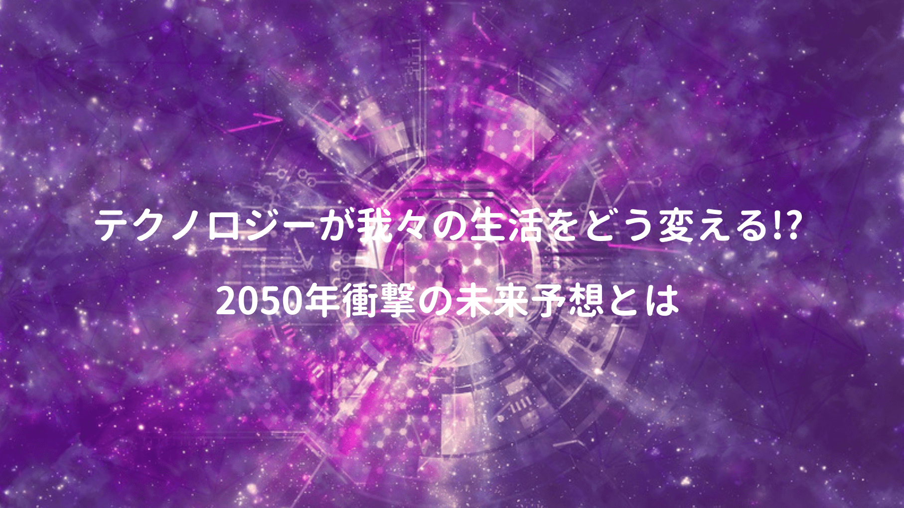

IT業界は技術の流行り廃れが激しく、やれAIだ、機械学習が云々と、全てを追いかけるのは到底無理だが、何となく将来に不安を感じ、無闇やたら新技術にご執心な方も多いのではないか（主に俺）

いつの世もテクノロジーの発展が私たちの生活を大きく変えてきたけど、これから先の未来がどうなるのか、未来予想を述べられている書籍はいくつもあり、その中で特に面白かったのがコチラ↓

<a href="https://hb.afl.rakuten.co.jp/hgc/146fe51c.1fd043a3.146fe51d.605dc196/yomereba_main_201902282241087071?pc=http%3A%2F%2Fbooks.rakuten.co.jp%2Frb%2F14705853%2F%3Fscid%3Daf_ich_link_urltxt%26m%3Dhttp%3A%2F%2Fm.rakuten.co.jp%2Fev%2Fbook%2F" target="_blank"  rel="noopener noreferrer">2050年衝撃の未来予想</a>
posted with <a href="https://yomereba.com" rel="nofollow noopener noreferrer" target="_blank">ヨメレバ</a>

苫米地英人 TAC 2017年02月17日    

<a href="https://hb.afl.rakuten.co.jp/hgc/146fe51c.1fd043a3.146fe51d.605dc196/yomereba_main_201902282241087071?pc=http%3A%2F%2Fbooks.rakuten.co.jp%2Frb%2F14705853%2F%3Fscid%3Daf_ich_link_urltxt%26m%3Dhttp%3A%2F%2Fm.rakuten.co.jp%2Fev%2Fbook%2F" target="_blank"  rel="noopener noreferrer">楽天ブックス</a>

<a href="https://www.amazon.co.jp/exec/obidos/asin/4813271111/kanon123-22/" target="_blank"  rel="noopener noreferrer">Amazon</a>

<a href="https://www.amazon.co.jp/gp/search?keywords=2050%94N%8F%D5%8C%82%82%CC%96%A2%97%88%97%5C%91z&__mk_ja_JP=%83J%83%5E%83J%83i&url=node%3D2275256051&tag=kanon123-22" target="_blank"  rel="noopener noreferrer">Kindle</a>
                              	  	  	  	  	

これを読めば、無造作に技術を追求せず、今自分が何をすべきなのか、おぼろげに見えてくるかも。

## 企業の仮想通貨と国家消滅

ビットコインやNEMなど話題の仮想通貨。

2050年ではGoogleやApple、MUFJのような巨大資本が、巨大資本に裏付けされた信用力のある仮想通貨を発行、遂には「国家」という概念は無くなっているとの予想。

> 2050年、仮想通貨がメインになっている社会は「超格差社会」であることは間違いありません。

理由について、ジェレミー・リフキンの**「限界費用ゼロ社会」**を引き合いに説明されており、物理空間における生産では、必ず限界費用の制約があるが、IT・人工知能を活用したサイバー空間で利益を生み出す企業は、限りなく限界費用を抑えられるという事実。

> 力ある一企業が独自通貨を発行し、企業が超えると、限界費用に縛られた労働者は、貧困層に陥る可能性が高く、富の共有どころか、偏在性を高めていく可能性が非常に高い（事実上の国家消滅）

POINT**社会の中心がサイバーへ移行し、バーチャル国家誕生!!**

地方自治体のような存在は、独自の医療制度や教育制度など様々なサービスを提供、利用者も色んな場所でサービスを享受出来ると（資産を持っていない人は、カスタマイズの幅も狭まるだろうけど）

## 戦争は5次元のサイバー戦へ

21世紀の戦争は、勝敗が事実上サイバー空間で決するサイバー戦争へ変化。

> かつて陸戦・海戦が主だった時代の戦争は2次元でした。そこに第二次世界大戦以降、空戦・ミサイル戦が加わり3次元化。
>
> 更にコンマ数秒の誤差が命取りとなる電磁兵器や超音速ミサイル開発で時間軸が加わり4次元。
>
> そして現在、水面下で勃発している第三次世界大戦においては、情報空間が加わり、戦争のレベルは5次元へと突入しているのです。

つまりサイバー空間で力を持つ者(企業)がその気になれば、電力供給などのインフラを破壊したり、ミサイル発射装置に誤作動を仕掛けたりと、生殺与奪権を奪われてしまうので、当然日本も他人事では済まされず、最終的にはサイバー空間を超え、マインドハッキングが日常茶飯事になると。

正直一般の市民にはどーにも出来ないレベルの話だけど。

## 2050年以降の時代

2050年をどう生きるか、いくつかヒントや戦略が書かれていた。

① 自分がやりたいことをやる

② 金融資本家の奴隷にならない

③ 生産性を劇的に向上

3点目は具体的に「人間にしか出来ない新しい物の創造と表現」と言われており、これ系の話を聞くと、どーしても現状の延長線上での話(スキルアップとか)を考えがちだが、そうではないと。

さて、本書に書かれていた事、重要だと感じた事を個人的にまとめ考えてみると...

POINT**自我の領域を鍛え、コンピュータサイエンスを学びなおす**

POINT**人間が長い歴史で培ったリベラルアーツを学び、深い人間性を身につける!!**

どんなにビジネススキルを磨いても、誰かの代わりに過ぎない仕事を続ければ、金融資本家の奴隷で、やりたいことをやり、自我の領域を鍛え、社会のニーズに適った機能を提供できる人間になることが大切（でないと人工知能と同等の扱いを受けても文句は言えないと）