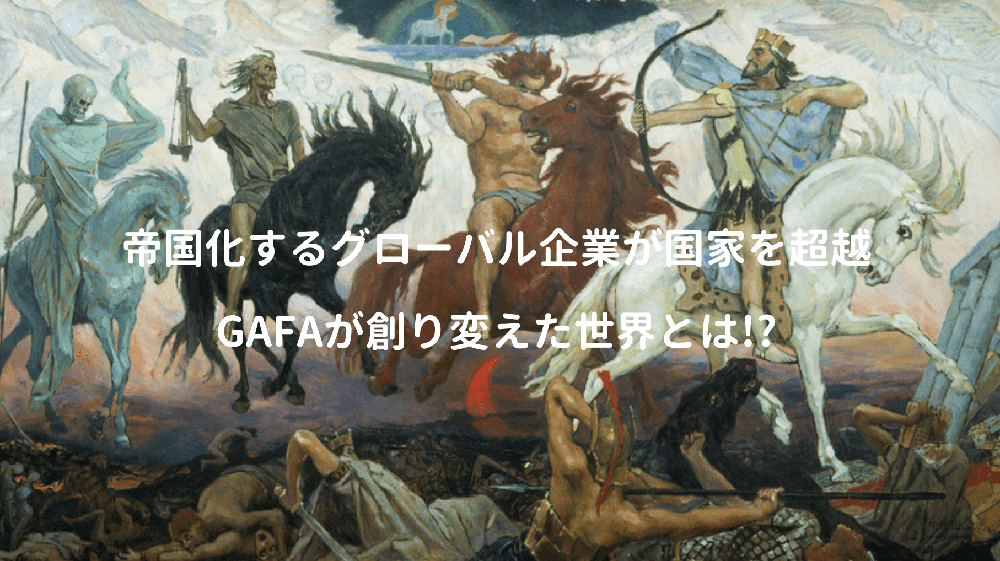

国境を超えて活動する巨大グローバル企業は世界に多々あるが、テクノロジー業界で四強といわれる四騎士・GAFAの生み出した富は2兆3000億ドルとも言われ、多くの喜びや人間同士の繋がり、更には経済的な繁栄や発明をもたらし、世界をより豊かな場所に変えてくれた。

ただ一方でグローバル企業のイギリス・ケイマン諸島やアメリカ・デラウェア州への租税回避で本来納税される税金の減少、不透明なお金がテロリストに流れている疑惑もある。また商品製造に関わるコスト抑制により、発展途上国における労働問題の深刻化を声高に叫ぶ人もいる。

歴史的に資本主義の変遷を辿ってみると、極度なグローバル化で国家の徴税機能が弱体化した時には、自己防衛本能から国家機能が強まり、国家は新たな税制・制裁金を課したり、法律の策定を画策される。一方のGAFAも売上税の拒否、国内テロリズムに関する情報提供の捜査拒否、訴訟とロビー活動に励んで独占禁止法の適用を逃れるなど対抗。

果たして世界を創り変えたGAFAは、これからも人類を幸せに導く聖なる四騎士なのか!?

<a href="https://hb.afl.rakuten.co.jp/hgc/146fe51c.1fd043a3.146fe51d.605dc196/yomereba_main_201904210031179431?pc=http%3A%2F%2Fbooks.rakuten.co.jp%2Frb%2F15533826%2F%3Fscid%3Daf_ich_link_urltxt%26m%3Dhttp%3A%2F%2Fm.rakuten.co.jp%2Fev%2Fbook%2F" target="_blank" rel="noopener noreferrer">the　four　GAFA　四騎士が創り変えた世界</a>

posted with <a href="https://yomereba.com" target="_blank" rel="nofollow noopener noreferrer">ヨメレバ</a>

スコット・ギャロウェイ/渡会 圭子 東洋経済新報社 2018年07月27日

<a href="https://hb.afl.rakuten.co.jp/hgc/146fe51c.1fd043a3.146fe51d.605dc196/yomereba_main_201904210031179431?pc=http%3A%2F%2Fbooks.rakuten.co.jp%2Frb%2F15533826%2F%3Fscid%3Daf_ich_link_urltxt%26m%3Dhttp%3A%2F%2Fm.rakuten.co.jp%2Fev%2Fbook%2F" target="_blank" rel="noopener noreferrer">楽天ブックス</a>

<a href="https://www.amazon.co.jp/exec/obidos/asin/4492503021/kanon123-22/" target="_blank" rel="noopener noreferrer">Amazon</a>

<a href="https://www.amazon.co.jp/gp/search?keywords=the%E3%80%80four%E3%80%80GAFA%E3%80%80%E5%9B%9B%E9%A8%8E%E5%A3%AB%E3%81%8C%E5%89%B5%E3%82%8A%E5%A4%89%E3%81%88%E3%81%9F%E4%B8%96%E7%95%8C&amp;__mk_ja_JP=%83J%83%5E%83J%83i&amp;url=node%3D2275256051&amp;tag=kanon123-22" target="_blank" rel="noopener noreferrer">Kindle</a>

こちらの本はそんな四騎士との向き合い方を書いた一冊。

## 本書の内容

GAFA以後の世界において、もはや四騎士の事業（検索、ソーシャル・ネットワーク、ブランド、小売）の理解は必須科目なので、冒頭では各事業の中身と強みについて説明。

GAFAによって同一分野の企業はほぼ全てが負け組へ、また元々アップルはマシン、アマゾンはストア、グーグルは検索エンジン、フェイスブックはソーシャル・ネットワークと互いに競合するとは思えなかったけれど、今では四騎士が互いの領域へ踏み込み、互いの市場で競合。

本書中盤では過去に圧倒的な地位を得ていたIBMやヒューレット・パッカード、更にはマイクロソフトを例に、絶対的な力を持つGAFAには一定の優位性はありながらも、今後何十年も今の地位にとどまる可能性は低く、ライバルになり得る企業をいくつか抜粋。

最後に個人が考えるべき生存戦略などを少々。

## 四騎士の標的

進化心理学の観点で成功するビジネスとは、**脳・心・性器のいずれかの部位**に訴えかけるものらしく、四騎士それぞれがどの部位に訴えかけるのか、それを知ることが四騎士の理解に繋がると。

**グーグル** は総当たり式の超高速処理能力、高速ブロードバンド・ネットワーキングを背景に、ペタバイト規模で世界中の情報アクセスを可能とし、人類の脳に話しかけ、長期記憶をほぼ無限レベルまで増幅、現代において脳はグーグルを愛さずにはいられない。

**アマゾン** はグーグル同様に脳と、ものを掴む指と、より多くのものを手に入れたいと思う狩猟・採取者の欲望を繋ぐ企業であり、**フェイスブック** は自身のアイデンティティを確率させるもう一つの場所と存在感を高めるツールを提供、他者との繋がりを作り上げ、心に訴えかける企業。

**アップル** は最初は頭に訴えかけ、次第に性的な魅力で訴えかける企業に変貌。

終盤では第五の騎士となりえる企業の課題を説明されていますが、コレは一個人には及ばない話だし、重要なことはGAFA以後の世界で個人が生きるためにどうすべきか。

## GAFA以後の世界

さて新世界で成功するにはどんなキャリア戦略が必要なのか…成功の定義も曖昧ですが結論として、現在は超優秀な人間にとっては最高の時代であり、私含め平凡な人間にとっては最悪らしい。

生まれながらに優秀でなくても、行動によってどう改善できるのか…それは心理的成熟や好奇心、当事者意識や大学に行って勉強、資格・証明や友人の有無など、まあ自己啓発系の書籍に書かれるであろう内容が書かれていますが、その中で特に気になったのはコレ↓

POINT**富・情報・権力・チャンスが集中している都市に出ることの重要性!!**

世界のGDPの80%が都市で生まれ、大都市の72%は成長率でその国全体を上回っているという事実があり、テクノロジーの進化でITは地方在住でも仕事が出来るが、富・情報・権力・チャンスは都市に集中しているとの指摘通り、やはり魅力的な仕事は大都市圏の人に集中している印象。

## 芸術性とアート

今後も巨大グローバル企業は国境を超えて活動し、より一層AIインターネット時代が加速化、AIを道具として活用し、AIと共に提案していくコミュニケーションの仕事が誕生する世界においては、何より**創造性とアート**が大切だとも言われている。

そう言われると超優秀ではない平凡な自分には、尚更勝ち目が無いように思えるが、AIによる代替によって可処分時間が増えるので、人はもっとアート・スポート・エンタメなど、より人間らしいこと、または自分が好きなことに時間を費やし、生きがいを見つけることが大切との結論に至る。

<a href="https://hb.afl.rakuten.co.jp/hgc/146fe51c.1fd043a3.146fe51d.605dc196/yomereba_main_201904221833283552?pc=http%3A%2F%2Fbooks.rakuten.co.jp%2Frb%2F15363879%2F%3Fscid%3Daf_ich_link_urltxt%26m%3Dhttp%3A%2F%2Fm.rakuten.co.jp%2Fev%2Fbook%2F" target="_blank" rel="noopener noreferrer">10年後の仕事図鑑</a>

posted with <a href="https://yomereba.com" target="_blank" rel="nofollow noopener noreferrer">ヨメレバ</a>

堀江 貴文/落合 陽一 SBクリエイティブ 2018年04月06日

<a href="https://hb.afl.rakuten.co.jp/hgc/146fe51c.1fd043a3.146fe51d.605dc196/yomereba_main_201904221833283552?pc=http%3A%2F%2Fbooks.rakuten.co.jp%2Frb%2F15363879%2F%3Fscid%3Daf_ich_link_urltxt%26m%3Dhttp%3A%2F%2Fm.rakuten.co.jp%2Fev%2Fbook%2F" target="_blank" rel="noopener noreferrer">楽天ブックス</a>

<a href="https://www.amazon.co.jp/exec/obidos/asin/4797394579/kanon123-22/" target="_blank" rel="noopener noreferrer">Amazon</a>

<a href="https://www.amazon.co.jp/gp/search?keywords=10%E5%B9%B4%E5%BE%8C%E3%81%AE%E4%BB%95%E4%BA%8B%E5%9B%B3%E9%91%91&amp;__mk_ja_JP=%83J%83%5E%83J%83i&amp;url=node%3D2275256051&amp;tag=kanon123-22" target="_blank" rel="noopener noreferrer">Kindle</a>

とは言いつつ、インターネットの発達である程度の情報は簡単に手に入るし、グーグルのSEOで算出される検索結果、アマゾンのレコメンド機能で奨められる商品など、そんな世界で過ごしていると同じような人間が量産される気もして、他者と違った価値観を提供出来るんだろうか…

## 検索キーワードを探す旅

GAFA以後の世界でどう自分と向き合えば良いのか!?

黎明期に比べ最適化が進み、ノイズの減ったネット社会、東浩紀氏の著書ではアウシュヴィッツやチェルノブイリを観光する中で感じたリアルな世界のノイズを例に、旅に出る事を推奨されている。

<a href="https://hb.afl.rakuten.co.jp/hgc/146fe51c.1fd043a3.146fe51d.605dc196/yomereba_main_20190209123044838?pc=http%3A%2F%2Fbooks.rakuten.co.jp%2Frb%2F14337320%2F%3Fscid%3Daf_ich_link_urltxt%26m%3Dhttp%3A%2F%2Fm.rakuten.co.jp%2Fev%2Fbook%2F" target="_blank" rel="noopener noreferrer">弱いつながり</a>

posted with <a href="https://yomereba.com" target="_blank" rel="nofollow noopener noreferrer">ヨメレバ</a>

東浩紀 幻冬舎 2016年08月05日

<a href="https://hb.afl.rakuten.co.jp/hgc/146fe51c.1fd043a3.146fe51d.605dc196/yomereba_main_20190209123044838?pc=http%3A%2F%2Fbooks.rakuten.co.jp%2Frb%2F14337320%2F%3Fscid%3Daf_ich_link_urltxt%26m%3Dhttp%3A%2F%2Fm.rakuten.co.jp%2Fev%2Fbook%2F" target="_blank" rel="noopener noreferrer">楽天ブックス</a>

<a href="https://www.amazon.co.jp/exec/obidos/asin/4344425014/kanon123-22/" target="_blank" rel="noopener noreferrer">Amazon</a>

<a href="https://www.amazon.co.jp/gp/search?keywords=%8E%E3%82%A2%82%C2%82%C8%82%AA%82%E8&amp;__mk_ja_JP=%83J%83%5E%83J%83i&amp;url=node%3D2275256051&amp;tag=kanon123-22" target="_blank" rel="noopener noreferrer">Kindle</a>

何か知りたいとグーグルで一語入力すれば、検索候補がサジェストされ、自由に検索したつもりでも、グーグルSEOが決めた検索結果が表示、結局はグーグルが取捨選択した枠組みの中の話。

またアマゾンや楽天など、ネットで買い物をする時も、気になる商品を見ていると「この商品を買った人はこれも買ってます」的なレコメンド機能が発達しており、ネットに触れている限り、他者の規定した世界でしかものを考えられなくなりがち。

POINT**自分を変えるには環境を変えるしかなく、環境を変える=移動(旅)するしかない!!**

ネットには書き手の書きたい情報しか存在しないし、受け手は自身が見たい情報しか見ない。それでは世界は広がらないので、不確実性に満ちた現実世界で普段全く関わらないノイズに触れること。

著者は海外旅行の事例を挙げながら、現実世界のノイズ(弱いリアル)の重要性と、それによって初めてネットの強さを活かせることを言及されている。