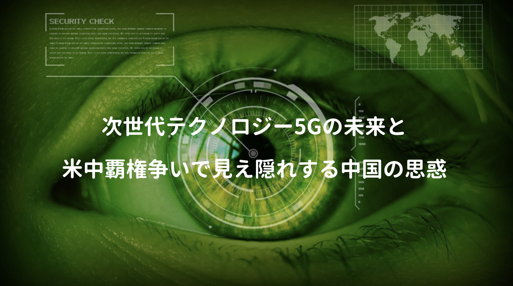

AI・IoT・ブロックチェーン・仮想現実など、様々な次世代テクノロジーがあるが、中でも2018年ファーウェイ事件をキッカケによく耳にする 5G って、そんなに凄いテクノロジーなの!?

何となく疑問に思っていた時、YouTubeでイチゼロシステムさんの動画を発見!!

https://www.youtube.com/watch?v=oYAnilTcfXo&t=128s

上の動画では、初心者にも分かるように、5Gの概要と一般消費者の生活にどんな影響があるのか、そして低遅延技術に着目した未来のテクノロジーなど面白く紹介されていた。

本当に実現するのか不確実な点も多いが、5Gに関する書籍や動画を漁ってみたので一部抜粋。

## 5Gで何が変わるのか!?

5Gは **5th Generation** の略称で、世代名が規格名として用いられた。

高速・大容量・多接続が可能となる5Gで、一般消費者の生活にどんな影響があるか？

よく挙げられるのは自動運転であったり、医療業界では遠隔地での手術、危険地帯でのロボット遠隔操作など、こちらの本にも紹介されており、どちらかと言えば公共インフラ的な話が多い。

<a href="https://hb.afl.rakuten.co.jp/hgc/146fe51c.1fd043a3.146fe51d.605dc196/yomereba_main_201909210005440766?pc=http%3A%2F%2Fbooks.rakuten.co.jp%2Frb%2F15928325%2F%3Fscid%3Daf_ich_link_urltxt%26m%3Dhttp%3A%2F%2Fm.rakuten.co.jp%2Fev%2Fbook%2F" target="_blank" rel="noopener noreferrer">5Gビジネス</a>
posted with <a href="https://yomereba.com" rel="nofollow noopener noreferrer" target="_blank">ヨメレバ</a>

亀井卓也 日本経済新聞出版社 2019年06月16日    

<a href="https://hb.afl.rakuten.co.jp/hgc/146fe51c.1fd043a3.146fe51d.605dc196/yomereba_main_201909210005440766?pc=http%3A%2F%2Fbooks.rakuten.co.jp%2Frb%2F15928325%2F%3Fscid%3Daf_ich_link_urltxt%26m%3Dhttp%3A%2F%2Fm.rakuten.co.jp%2Fev%2Fbook%2F" target="_blank" rel="noopener noreferrer">楽天ブックス</a>

<a href="https://www.amazon.co.jp/exec/obidos/asin/4532114071/kanon123-22/" target="_blank" rel="noopener noreferrer">Amazon</a>

<a href="https://www.amazon.co.jp/gp/search?keywords=5G%E3%83%93%E3%82%B8%E3%83%8D%E3%82%B9&__mk_ja_JP=%83J%83%5E%83J%83i&url=node%3D2275256051&tag=kanon123-22" target="_blank" rel="noopener noreferrer">Kindle</a>
                              	  	  	  	  	

ただテクノロジーは保険業界にも大きな影響があり、現在でも走行距離に応じて保険料が変わるが、5G導入後はエンジンのオンオフやブレーキの使い方、車内での会話、搭載されたドライブレコーダー映像など、多岐に渡るデータからスキル・集中度から保険額が算出されると説明されている。

勝手に色んなデータが収集されたり、車内の会話まで盗聴されるのは微妙。ただ危険地帯での遠隔操作が可能になれば、人命のリスクが大幅に抑えられ、懸命にロビイング活動に励む保険会社も多いとか。

医療現場では今でも遠隔地で、患者の問診や電子カルテやレントゲン写真を電子化して共有し、自宅で診断が受けられるが、よりミッションクリティカルな業務を遠隔で可能となる。介護分野でもロボティクスには、5G技術が大きな役割を果たすことが期待されている（夢が膨らむ）

## オンラインゲーム市場

折角5G技術が確立されても、消費者が既存サービスを利用する際の通信需要という観点では、4Gで困ることはほぼ無く、どちらかと言えば5Gは公共サービスなどを提供する産業業界向けの技術。

ただイチゼロシステムの動画でも紹介されている中で、遅延に厳しいコンテンツであるオンラインゲーム市場には大きな恩恵があり、ゲームプレイヤーの出来るだけ近くで通信処理を行うエッジコンピューティングを活用すれば遅延無しが実現可能になるとか（真偽は不明）

低遅延技術（デバイス間の距離が0）が確立されれば、一時的にデータセンターにある超高性能のグラフィックボードにアクセスし、ゲームをする時にだけ遠隔地の機器接続も可能になると、もしかしたら手元のPCにはCPUすら不要になり、人間とのインタフェースさえあれば良い世界になるかも。

仮にそんな世界が実現すればデバイスも随分様変わりしそうだが、落合陽一氏の **日本再興戦略** でも遠隔地で重い処理を捌き、スマホもただの受信機になる!?的な内容もあったりと、ハードウェアは勿論、ソフトウェア業界で働く技術者にも結構な影響がありそう。

## 低遅延技術は実現するのか!?

夢を語るのは良いが、現実では課題も多く、また5G議論にはウソとホントが錯綜しており、その点に関して深田萌絵氏の **5G革命の真実** が技術的な点も含めて分かりやすく言及されていた。

<a href="https://hb.afl.rakuten.co.jp/hgc/146fe51c.1fd043a3.146fe51d.605dc196/yomereba_main_201909192316001286?pc=http%3A%2F%2Fbooks.rakuten.co.jp%2Frb%2F15966878%2F%3Fscid%3Daf_ich_link_urltxt%26m%3Dhttp%3A%2F%2Fm.rakuten.co.jp%2Fev%2Fbook%2F" target="_blank" rel="noopener noreferrer">「5G革命」の真実　5G通信と米中デジタル冷戦のすべて</a>
posted with <a href="https://yomereba.com" rel="nofollow noopener noreferrer" target="_blank">ヨメレバ</a>

深田萌絵 ワック 2019年07月25日    

<a href="https://hb.afl.rakuten.co.jp/hgc/146fe51c.1fd043a3.146fe51d.605dc196/yomereba_main_201909192316001286?pc=http%3A%2F%2Fbooks.rakuten.co.jp%2Frb%2F15966878%2F%3Fscid%3Daf_ich_link_urltxt%26m%3Dhttp%3A%2F%2Fm.rakuten.co.jp%2Fev%2Fbook%2F" target="_blank" rel="noopener noreferrer">楽天ブックス</a>

<a href="https://www.amazon.co.jp/exec/obidos/asin/4898318045/kanon123-22/" target="_blank" rel="noopener noreferrer">Amazon</a>

<a href="https://www.amazon.co.jp/gp/search?keywords=%E3%80%8C5G%E9%9D%A9%E5%91%BD%E3%80%8D%E3%81%AE%E7%9C%9F%E5%AE%9F%E3%80%805G%E9%80%9A%E4%BF%A1%E3%81%A8%E7%B1%B3%E4%B8%AD%E3%83%87%E3%82%B8%E3%82%BF%E3%83%AB%E5%86%B7%E6%88%A6%E3%81%AE%E3%81%99%E3%81%B9%E3%81%A6&__mk_ja_JP=%83J%83%5E%83J%83i&url=node%3D2275256051&tag=kanon123-22" target="_blank" rel="noopener noreferrer">Kindle</a>
                              	  	  	  	  	

ちなみに5Gでは遅延を1ミリ秒(0.001秒)と規定しているが、2019年時点では実現出来てないし、ここでの **遅延** とは、エンド・ツー・エンド（端末間）ではなく、基地局から端末までの無線区間に限定された狭い範囲の話（それでも大変凄い取り組みだけど）

また通信遅延と一口に言っても、アナログ→デジタル変換時の遅延、伝送時のケーブルでの遅延、ネットワークエンジンでの処理遅延、ソフトウェアを走らせるチップでの遅延、チップとメモリ間をやり取りするパスの転送遅延、各インタフェースでの遅延など原因も様々で、解決すべき問題は多岐に渡る。

超低遅延技術は人類の未来にとっても大きなテーマですが、仮に5Gにおける基地局と端末との遅延が解消しても、それだけで自動運転や医療現場での遠隔操作が上手くいく訳では無いそう(;^_^

## 最強の諜報インフラを巡る争い

ちなみに同書では、米中5G覇権争が単なる **通信技術** が生み出す経済的利益の奪い合いではなく、諜報インフラである通信技術を獲得するため、グローバルな政治実質支配の覇権争いであると解説。

中国共産党の検閲が厳しい事は有名だが、監視国家である中国が国内の監視に留まらず、世界監視システムの完成に必要な技術が5Gであり、これをGAFAなど結託して推進、トランプ陣営（民主主義）vs中国・GAFA（社会主義）の争いに発展しているとスケールの大きな話に及んでいる。

ちなみに5G技術の特出すべき点にアップロードの高速化があるが、従来よりも高速に大量の個人情報を同時（多数同時接続）に抜き取られる話には、かなり恐怖を感じる。

どこまで本当かは謎だが、著者自身も過去に相当圧力を受けた経験があるらしく、えげつない世界が広がってるんだろうなぁ…ご本人の経歴も去ることながら、大変興味深い話が動画にも挙げられているので、興味のある方は是非視聴頂けれとば。

`youtube:https://www.youtube.com/embed/K8GntPG3FTI`

著者はジョージ・ソロスの本を読み、国際政治を学ばなければ、本当の経済は理解出来ないと実感。

一介の技術者に国際政治の知識・理解が必須かどうかは意見が別れるが、グローバルでITビジネスに関わる方には、国際政治に対する基本的な理解が無いと大損する可能性は大きい。