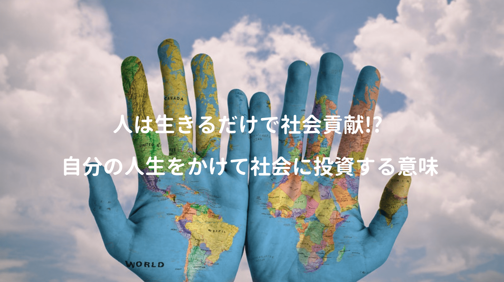

社会貢献と聞かされると、重く受け止める人は多いかもしれない。

世の中へ奉仕するため、人に罵倒されながらも頭を下げてお金を集め、NPO活動をされている方もいらっしゃるが、自分も微力ながら世の中に貢献出来ないかを考える事がある。

社会貢献でまず思い浮かぶのは、ボランティアや被災地・恵まれない発展途上国への寄付・支援、青年海外協力隊、マザーテレサなど。プログラマーで言えば、OSSコミッターとして活動したり、自身の知見を世に広めるために登壇など色々ある。

社会貢献を考えると身構えてしまうけど、自分の凝り固まった視点を広げてくれる本に出会った。

<a href="http://www.amazon.co.jp/exec/obidos/asin/4061385208/kanon123-22/" target="_blank"  rel="noopener noreferrer">投資家が「お金」よりも大切にしていること (星海社新書)</a>
posted with <a href="https://yomereba.com" rel="nofollow noopener noreferrer" target="_blank">ヨメレバ</a>

藤野 英人 講談社 2013-02-26    

<a href="http://www.amazon.co.jp/exec/obidos/asin/4061385208/kanon123-22/" target="_blank"  rel="noopener noreferrer">Amazon</a>

<a href="http://www.amazon.co.jp/gp/search?keywords=%93%8A%8E%91%89%C6%82%AA%81u%82%A8%8B%E0%81v%82%E6%82%E8%82%E0%91%E5%90%D8%82%C9%82%B5%82%C4%82%A2%82%E9%82%B1%82%C6%20%28%90%AF%8AC%8E%D0%90V%8F%91%29&__mk_ja_JP=%83J%83%5E%83J%83i&url=node%3D2275256051&tag=kanon123-22" target="_blank"  rel="noopener noreferrer">Kindle</a>

<a href="https://hb.afl.rakuten.co.jp/hgc/146fe51c.1fd043a3.146fe51d.605dc196/yomereba_201806221808047147?pc=http%3A%2F%2Fbooks.rakuten.co.jp%2Frb%2F11905536%2F%3Fscid%3Daf_ich_link_urltxt%26m%3Dhttp%3A%2F%2Fm.rakuten.co.jp%2Fev%2Fbook%2F" target="_blank"  rel="noopener noreferrer">楽天ブックス</a>
                        	  	  	  	  	

レオス・キャピタルという投資信託会社の代表が書かれた一冊。

## 互恵関係という考え

お金は経済を形成するメインプレイヤー(政府・家系・企業)の間でグルグル回っており、生産者が働くことで物・サービスが生まれ、更に消費する人がいることで初めて価値が生まれる。

1円も稼げない赤ちゃんのおかげで、成り立つ事業(オムツや離乳食)や会社があることを一例に挙げられており、改めてなるほど〜と思わされる考え方。

POINT**人は生きているだけで価値がある！**

随分青臭い言葉に聞こえるが、消費活動があって、生産活動に繋がるのは重要な事実。

> まわりとの関係で私たちは生かし生かされているのだと認識することが、経済を理解するうえでもっとも重要なことです。

どうも著者の藤野氏も大乗仏教の考え方に則り、座右の銘を「自他不二」とされているとか。

POINT**「経済」とはお金を通してみんなの幸せを考えること!!**

最初から寄付・ボランティアを考えずとも、自分が欲しい・やりたいと思うステキな物・サービスに積極的にお金を使うことが、既に社会へ貢献している訳なので、随分気も楽になる。

## 投資 = エネルギーのやり取り

投資はお金を出してお金を得るイメージが強いけど、それは投資の一面に過ぎず、著者は投資を今この瞬間のエネルギーを投入し、未来からの恩返しを頂くことだと表現されている。

お金以外のエネルギーでは、例えば時間があり、本を読むなど自己投資をすれば、時間というエネルギーを投資し、代わりに知識を得たり、視野が広がったりと、恩返し=お金とは限らない。

ちなみに著者はエネルギーの要素に以下の8つを挙げられていた。

POINT**エネルギー=情熱 x 行動 x 時間 x 回数 x 知恵 x 体力 x お金 x 運**

投資の目的は明るい未来を作るの一点に集約され、そのエネルギーをどのように世の中に流して、どう明るい未来を創るか、社会を形成する末端の人間として消費と生産と投資していきたいと思わされた。