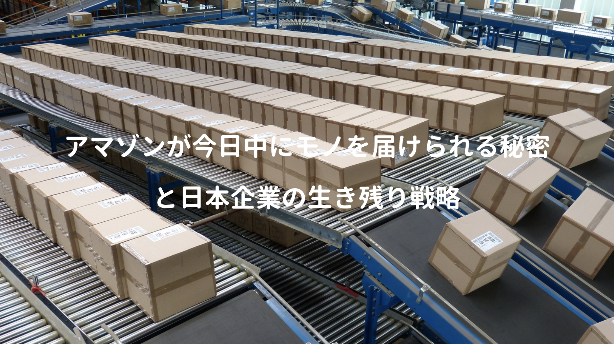

アマゾンジャパンでSCM部門(サプライチェーン・マネジメント)のマネージャーとして、物流や倉庫オペレーションの管理、さらには多くの採用面接に携わった著者が語るアマゾンの真の強さの秘密。

POINTそれは彼らが掲げる企業理念(**①.地球上で最も豊富な品揃え / ②.地球上で最もお客様を大切にできる企業であること**) を実現するため、顧客に提供すべき価値を徹底的に考え、出した答えである**「豊富な種類の商品を出来るだけ早く、安く、消費者に届けること」**をひたすら追求する姿勢。

その実現するために、従来はコストセンターとして捉えられていた物流に、優秀な人材と膨大な投資を行い、徹底的に倉庫管理を効率化して得られた利益を **安さ** と **利便性** で消費者に還元！

日本企業にありがちな義理人情が、全く通用しないグローバル企業の話を交え、アマゾンの高い理念を遂行するため、常に顧客至上主義を貫く彼らの姿には色々考えさせられた。

<a href="https://hb.afl.rakuten.co.jp/hgc/146fe51c.1fd043a3.146fe51d.605dc196/yomereba_main_201912242142347735?pc=http%3A%2F%2Fbooks.rakuten.co.jp%2Frb%2F15239065%2F%3Fscid%3Daf_ich_link_urltxt%26m%3Dhttp%3A%2F%2Fm.rakuten.co.jp%2Fev%2Fbook%2F" target="_blank" rel="noopener noreferrer">なぜアマゾンは「今日中」にモノが届くのか</a>
posted with <a href="https://yomereba.com" rel="nofollow noopener noreferrer" target="_blank">ヨメレバ</a>

林部健二 プチ・レトル 2017年12月25日    

<a href="https://hb.afl.rakuten.co.jp/hgc/146fe51c.1fd043a3.146fe51d.605dc196/yomereba_main_201912242142347735?pc=http%3A%2F%2Fbooks.rakuten.co.jp%2Frb%2F15239065%2F%3Fscid%3Daf_ich_link_urltxt%26m%3Dhttp%3A%2F%2Fm.rakuten.co.jp%2Fev%2Fbook%2F" target="_blank" rel="noopener noreferrer">楽天ブックス</a>

<a href="https://www.amazon.co.jp/exec/obidos/asin/4907278667/kanon123-22/" target="_blank" rel="noopener noreferrer">Amazon</a>

<a href="https://www.amazon.co.jp/gp/search?keywords=%E3%81%AA%E3%81%9C%E3%82%A2%E3%83%9E%E3%82%BE%E3%83%B3%E3%81%AF%E3%80%8C%E4%BB%8A%E6%97%A5%E4%B8%AD%E3%80%8D%E3%81%AB%E3%83%A2%E3%83%8E%E3%81%8C%E5%B1%8A%E3%81%8F%E3%81%AE%E3%81%8B&__mk_ja_JP=%83J%83%5E%83J%83i&url=node%3D2275256051&tag=kanon123-22" target="_blank" rel="noopener noreferrer">Kindle</a>
                              	  	  	  	  	

## 本書のあらすじ

**冒頭** ではインターネットにより激変した通販業界の歴史、そしてアマゾンが日本の物流業界(ヤマト・佐川・日本郵便)に与えた影響と、今後アマゾンと日本の物流業界との関わりに言及。

**第2章** ではアマゾンの物流戦略としての購買管理、注文管理、在庫管理、倉庫運営のそれぞれの強みと、とにかく品質にこだわる経営姿勢、アマゾンの物流の歴史。

**第3章** ではアマゾンの強大な物流システムを支えるロジカル経営として、プラットフォーム戦略やロジカル経営の3つの柱(KPI/オペレーション/システム)と優秀な人材の獲得戦術。

**最終章** ではこれからの日本企業が、アマゾンとどう向き合うべきか解説。

## 日本の個人向け物流業界の話

圧倒的なサービス力で国内トップを走っていたヤマトが、アマゾンの競争原理に振り回され離脱、更に価格競争に晒された佐川も体勢が弱体化、力を伸ばし始めた日本郵便など、宅配便を代表する大手3社(ヤマト/佐川/日本郵便)の歴史を振り返る話。

ちなみに豆知識として、ヤマトの圧倒的なサービス力の強さには **時間指定配達** や **クール便** が挙げられ、ドライバーも下請けに頼まず、自社の社員で調達するなど、その高いサービス力の証が生みの親である小倉昌男氏の**「運転手はドライバーではなく、セールスマンである」**という言葉。

佐川はドライバーを下請けに頼み、気合と根性で**「ヤマトより安い」**を強みに、日本郵便は資金はありながらも、荷受人からの受取日時変更が出来ないなど、個人向けサービスでは難あり…アマゾンのせいで物流量が多くなって悲鳴を上げていたが、ヤマトの凄さが伝わってくる。

ここら辺の話が気になる方は、本書の出典でも紹介されている**「仁義なき宅配：ヤマトvs佐川vs日本郵便vsアマゾン 著者:横田増生」**を読めば、更に理解が深まると思う。

## アマゾンが変えた日本の物流業界

さてアマゾンが企業理念を実現するためには、物流分野への優秀な人材と膨大な資金を投入だけでなく、理念実現に欠かせない配送業界(ヤマト・佐川・日本郵便など)へ競争原理を持ち込み、自社の利益を最大化出来るようにすることだった。

その一例がカスケードの仕組みやリベート、日販バックオーダー発注の廃止で、非常に機械的・合理的に利益を最大化する仕組みを構築、本書を読んでいると、随分ドライな印象を抱くが、義理人情感の強い日本企業がグローバル企業に勝てるのか懐疑的にならざるを得ない。

競争原理により、ヤマトの営業所も採算が取れず、利益率の低下と人手不足の状況から、配送料の値上げと総量規制でヤマトショックが起き、アマゾンがこれからどんな戦略を取るのか？

POINT**元々アマゾンは、倉庫管理に非常に強みがあるので、その強みを活かしつつ、配送は既に高い品質とサービス力のある配送業社に任せるのが基本戦略となる！**

宅配業会には気概のある方が多いらしく、各地方毎に小規模な宅配業者が乱立しているので、そういった企業と連携していくことが考えられると、著者は語られていた。

## アマゾンの物流戦略

前述の配送業コントロールに加え、自社の優れた購買、注文、在庫、倉庫の管理に言及。

リアル店舗に匹敵するサービス提供の答えが**「顧客の手元へ商品を届けるタイミングのサービスレベルの最大化」**であり、とにかく配送スピード(予想より早く届く)と品質(注文内容に誤りがなく、傷がないこと)の追求した結果、以下の施策を実現。

■ 販売と物流が一体化(タイムラグが無い)

■ S&OPの調整プロセス(販売とオペレーションの相互監視)

■ 物流部門に多額の投資(原価の次に高い売上高の約13%/約2兆円)

■ サプライチェーンが製造業並み

■ 優秀なエンジニアによる内製化

■ 徹底的な納期遵守意識

■ 何があろうとサービスレベルを落とさない気概

それにより生まれたのが **購買、注文、在庫、倉庫の管理の強み。**

## それぞれの強み

**■ 購買管理** ー 独自の需要予測システムを構築し、どのような商品がどの地域でどのくらい注文されそうかをシステムで予測(膨大な商品数を扱うアマゾンには必須)。

**■ 注文管理** ー 商品納入に考えられる全ての納品経路(仕入先→倉庫→顧客)を算出し、お届け日とコストを考慮して最適な納品経路を決定可能なフルフィルメントの最適化システムを構築。

ちなみに一般的な流通企業では、人間の経験に頼り、手作業レベルで需要予測を行うケースが多いが、アマゾンでは各倉庫の営業時間や処理能力、コストといった固有情報(仕入れ先のリードタイム、商品コストや作業コスト、配送コスト)を保持することで詳細な納期割り出しが可能。

**■ 在庫管理** ー 独自のEDIシステムで適切な在庫数を割り出し、不足分はサプライヤーに発注(誰に発注して、どの倉庫に在庫として持つかを最適化)出来るよう仕組み化(主要カテゴリはバイヤーがいるらしいが、徐々にAIに置き換えられているらしい）

**■ 倉庫運営** ー いち早くWMS(倉庫管理システム)を導入、人材不足を補うために機械を導入し、効率化するだけでなく、短期間での倉庫構築が可能なように、倉庫の設計段階から最大限に効率化を目指し、徹底した企業理念を実現するためにアンドンを採用したり。

## さて日本企業はどうすれば!?

第3章では、データに基づいたロジカルな判断で遂行される経営手法の話で、シングル・ディティル・ページ(UIUXを考える人にはタメになる)の話や、FBA仕組み(プラットフォーマーの話)、優秀な人材獲得の話をされていた(アマゾン程の企業なら、黙っていても優秀な人ばかり来る気も…)

**さてアマゾンと日本企業では大学生と小学生ほどの差がある現在、一体どう戦えば良いのか？**

POINT**真正面から戦えば負けるので、真似すべき点を取り入れ、自社独自の強みを出すしか無い**

本書ではアマゾンからは**「顧客視点」** と **「長期視点」**の2つを学び、長期視点では人材教育、オペレーション改善、システム投資の3つに取り組むべきだと。

IT業界にいる身としては、GAFAが作るプラットフォーム上での開発が当たり前となり、GAFAが衰退する兆候も見られないし、今後も技術のコモディティ化はどんどん強くなるので、個人的にはGAFAの優秀な技術と共存し、コンサル方面に進んだ方が良いと痛感する一冊だった。