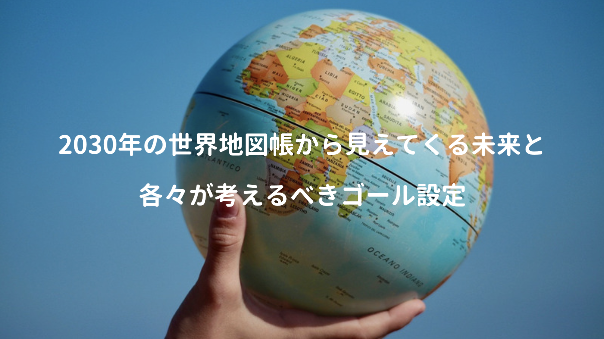

世の中の流れが早いので、10年先を予知することも難しいけど、今後確実に来るであろう破壊的テクノロジーやSDGsの取り組みを知ることで、停滞や試行錯誤を突破し、**個人がこの先、何を目的に生きれば良いのか？** それを考えるためキッカケにはなるかもしれない。

今回はその一助になりそうな本書を読んでみたが、タイトル通りに世界地図帳だけあって、未来の世界情勢が分かるグラフや指標が載せられ、また未来のテクノロジーだけでなく、歴史的な背景の紹介など面白かった(個人的には金額以上の価値ありだと思う)

<a href="https://hb.afl.rakuten.co.jp/hgc/146fe51c.1fd043a3.146fe51d.605dc196/yomereba_main_202001032122468538?pc=http%3A%2F%2Fbooks.rakuten.co.jp%2Frb%2F16014986%2F%3Fscid%3Daf_ich_link_urltxt%26m%3Dhttp%3A%2F%2Fm.rakuten.co.jp%2Fev%2Fbook%2F" target="_blank" rel="noopener noreferrer">2030年の世界地図帳</a>
posted with <a href="https://yomereba.com" rel="nofollow noopener noreferrer" target="_blank">ヨメレバ</a>

落合 陽一 SBクリエイティブ 2019年11月15日    

<a href="https://hb.afl.rakuten.co.jp/hgc/146fe51c.1fd043a3.146fe51d.605dc196/yomereba_main_202001032122468538?pc=http%3A%2F%2Fbooks.rakuten.co.jp%2Frb%2F16014986%2F%3Fscid%3Daf_ich_link_urltxt%26m%3Dhttp%3A%2F%2Fm.rakuten.co.jp%2Fev%2Fbook%2F" target="_blank" rel="noopener noreferrer">楽天ブックス</a>

<a href="https://www.amazon.co.jp/exec/obidos/asin/4797399953/kanon123-22/" target="_blank" rel="noopener noreferrer">Amazon</a>

<a href="https://www.amazon.co.jp/gp/search?keywords=2030%E5%B9%B4%E3%81%AE%E4%B8%96%E7%95%8C%E5%9C%B0%E5%9B%B3%E5%B8%B3&__mk_ja_JP=%83J%83%5E%83J%83i&url=node%3D2275256051&tag=kanon123-22" target="_blank" rel="noopener noreferrer">Kindle</a>
                              	  	  	  	  	

## 本書のあらすじ

**今の時代は何を課題とし、どの方向に向けて進むべきか？** 個人レベルでもそれが見えづらいが、そんな時代に重要な鍵になりそうなのが[SDGs(エスディージーズ)](https://www.mofa.go.jp/mofaj/gaiko/oda/sdgs/about/index.html)の国際的な取り組み。

そのSDGs(飢餓根絶や教育の平等など)の実現に不可欠な要素の一つがテクノロジーなので、冒頭は **テクノロジー** と **人口** に焦点を絞り、2030年の世界がどうなっているかを考察。

**第2章** でSDGsの掲げる16のゴール中でも最重要視されている貧困根絶について、そもそもの貧困の定義とアフリカ貧困の歴史や背景に触れつつ、先進国内部で広がる格差や相対的貧困(シングルマザー/高齢者/子供)、現代に見られるギグ・エコノミーに言及。

**第3章** はアメリカと中国の環境問題を考え、最終章ではヨーロッパで提唱されたSDGsを違う視点から俯瞰し、これからの日本がどこに活路を見出すべきかの可能性に言及。

## 先進国内での格差問題

5つの**破壊的テクノロジー(AI/5G/自律走行/量子コンピューティング/ブロックチェーン)**が変える未来(食糧/健康/資源/都市/労働)、2020年代を牽引するデジタルイデオロギーの話も面白いけど、未来を考える上で大切な現状を、落合氏と安田洋祐氏(大阪大学教授)が対談されていた。

未だサハラ以南のアフリカ地域は最貧困層だが、モバイル決済のMペサなど、今後リープフロッグ現象が次々に起こると予測されるので未来は明るく、それよりも**先進国内での貧困問題(中間層の所得伸び悩み)はサスティナビリティを阻害する深刻な要因**だと。

POINT産業革命以降、アジアとヨーロッパでは巨大な格差(大分岐)が生まれるも、**90年代のインターネット登場でアイディアやノウハウの移動コストが劇的に下がり、**先進国は途上国で現地生産の工場を作ったり、現地企業を買収して技術提供することで**企業の多国籍化 + オフショア化**が促進。

現代は**「高度な技術 + 高価な労働力」** から **「高度な技術 + 安価な労働力」**に切り替わり、高価な労働力を担っていた中間層の賃金は伸び悩み、自動化やハードウェア開発、プラットフォームサービス技術の開発が出来る人材など、**高付加価値を生み出せなければ高賃金を得られない**厳しい世界、この事実はどんな立場の方であろうと、早い段階で認識すべき話だと思う。

## アフリカ貧困の歴史と背景

サハラ以南のアフリカ地域(サブサハラ)は最貧困層について、なぜ絶対的貧困の中で暮らす人々がアフリカには多いのか…本書ではアフリカ開発の難しさや歴史的な背景にも言及。

POINTまず第一に16世紀の奴隷貿易や19世紀の西欧列強に搾取された時代、そして米ソ冷戦など**「西欧諸国に振り回された歴史」**があり、第二に天然資源が豊富なので、国内インフラの開発努力や教育拡充をせずとも潤沢な富を得られてしまう**「資源の呪い」**、第三に近代化を経験していないので**「近代的な制度が定着しにくい」**など様々な要因が重なり、アフリカでは長く貧困が続いている。

外国に資源採取の強化を与えれば富を獲得、税収に頼らずとも政権維持でき、国民の同意が必要無いので、独裁化(国と国民の間で社会契約が結ばれていない)しやすく、歴史的に国境をヨーロッパ列強に恣意的に定められ、国と民族が一致せず、国家への帰属意識も低く、民族紛争が絶えない。

幸せになるには恵まれた環境だけでなく、本人達の努力が必要不可欠だが、その点は池上彰さんとの対談にて、日本のODAの話(情けは人の為ならず)で触れられていた。

またアフリカは社会の未熟さが、逆に画期的なアイディアを実現しやすく、決済手段であるMペサを筆頭に、今後も独創的なイノベーションが起こり得るので未来は明るいとの話は正直羨ましい限り。

## アメリカが牽引する限界費用ゼロ化

昨今パリ協定を離脱したアメリカだが、環境問題への取り組み自体を拒否している訳ではなく、化石燃料の中で最も二酸化炭素排出量の少ないシェールガス利用(シェールガスの高度な採掘技術はアメリカが独占)で、途上国の生活水準向上に貢献する姿勢をとっている話。

テクノロジーや資本主義を**「法律や条約によって規制することで自然環境保護」**を目指すヨーロッパと、テクノロジーや資本主義を**「加速させることで自然環境を保護するイノベーションを生み出す」**アメリカとの対比構造、ちなみに中国は国家手動で太陽光による経済圏の構築を目指す姿勢。

POINTジェレミー・リフキン(メルケル首相のブレーン)が提唱する**「限界費用ゼロ社会」**における所有の超克が、アメリカ自由主義が牽引するテクノロジーによって実現される点にも言及。

またアメリカ西海岸やGAFAMはなぜ環境問題に熱心なのかや、ヨーロッパから独立した人口国家のアメリカが生んだ超越主義にはじまり、ディープ・エコロジーや生命地域主義にガイア理論、第3章では少しスピリチュアルな話題など多岐に渡っていた。

## ヨーロピアン・デジタルの資本主義

SDGs自体には、大変素晴らしいゴール設定が掲げられているが、ヨーロッパ的な価値観で成立されているので、今後はヨーロッパ諸国に有利なシナリオの元に規制されるのではないかと、そーゆー文脈では、ヨーロッパの歴史や背景を知っておくことは非常に大切かなと。

ヨーロピアン・デジタルでは伝統(ギリシャ哲学とローマ法典など)で築かれた文明が、国家や市場の権力を抽象的な理念で掌握した歴史があり、資源の層をアフリカ・中東、工業の層を中国、情報の層をアメリカ、それらをヨーロッパが**法と倫理で調停する構図**は本書の考察は理解しやすい。

POINT**プラットフォーム戦略や安価な労働力による市場の囲い込みではなく、法や倫理で市場をコントロールし、そこから新しい価値を引き出す方法論は日本も見習うべき点!!**

日本で制定されている個人情報保護法よりも厳格なルールが定められているGDPR、ヨーロッパが個人情報に拘る理由として、歴史的な背景(ナチスドイツの迫害)、高付加価値を生み出すスイスの取り組みに触れ、最後には日本が米・中・欧の中間地点に活路を見出す話を展開。

本書では今後の明確な指針が提示されている訳ではないけど、これからの時代に個人がどの方向に進めば良いのか、そのインスピレーションを感じる知識が散りばめられている印象だった。