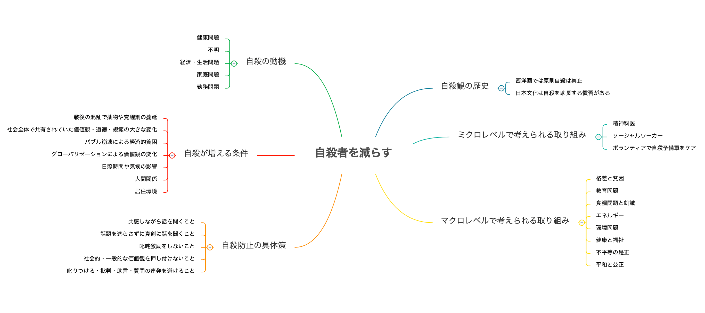

自殺はある日、突然起こり、何かしらの猛烈な感情体験を残すが、平均寿命が大幅に伸びた現代では、誰しも自殺に遭遇する可能性がある(戦争が減り、それだけ平和である証拠でもあるけど)

こうした社会的な問題を考える上で参考になる情報を探してみると**「自殺予防の基礎知識 – 多角的な視点から自殺を理解する(著書:末木新)」**が目に入ったので、こちらを一読してみた。

本書のあらすじとして、自殺予防の基礎知識として、冒頭では自殺に対する現状理解と自殺をする人の心理状況、そして今自殺を考えている人に対し、個人レベルで出来る対処方法を解説。

中盤では過去に遡り、西洋・東洋での自殺観の違い、自殺と自傷の関係性とメディア(インターネット含む)が与える自殺への影響度を考え、最終章では自殺対策の歴史と自殺対策の有効性に言及。

多岐に渡る自殺予防の基礎知識が網羅されている一冊。

## 全体像

## 自殺の現状と様々な傾向

日本では戦後、3度の自殺数の増加傾向が見られ、その要因の一つには社会的な変化 **(戦後の混乱で覚醒剤や薬物が蔓延 / 社会全体で共有されていた価値観・道徳・規範などが大きく変化 / バブル崩壊による経済的貧困 / グローバリゼーションによる価値観の変化)** がある。

デュルケームはこのような理由で自殺する人を**「アノミー的自殺」**と命名。

自殺の動機は **(健康問題 > 不詳 > 経済・生活問題 > 家庭問題 > 勤務問題)** の順番で多く、自殺者には「孤独」と「相反する二つの心」の共通心理があるので、経済的な貧困である無職や、孤独になりやすい未婚者が、自殺に繋がりやすいのは、何となく理解しやすい。

ただ意外に **日照時間**と**気温**も自殺に関係し、ロシアは先進国内でも自殺率が高く、日本でも北の方が自殺率が高い事実もあり、事故物件で有名な大島てるの管理人も、物件の間取り(天井の低さや柱の位置)で自殺確率が上がる話をされていたので、人間関係 + 居住地も含めて考える必要があるのかも。

## 自殺の危機が迫っている人の対処方法

**第3章** で言及されている対処方法だが、非常に興味深い内容であると同時に、自殺を考えている人と向き合うこと自体、膨大なエネルギーを必要とするアクションであり、何かの手違いで誤った対応をした結果、自殺の助長に繋がる懸念など、大変にデリケートな話題。

色んな施策があるけれど、時代や西洋・東洋問わずに多くの研究者が推奨しているのは**「共感すること」**で、また逆にやってはいけないことに **話題を逸らす、激励する、社会的・一般的な価値観を押し付ける、叱りつける、批判・助言、質問の連発** を挙げられていた。

## 自殺観の歴史

**第4章** では西欧と東洋(主に日本)の自殺観の違いを、歴史を振り返りながら説明。

西欧では古代ギリシャまで遡り、プラトン(人間は神の所有物なので自殺は神の意思に逆らう行為なので禁止)とアリストテレス(自殺は国家や共同体を棄損する行為なので禁止)の考え方の違い、アウグスティヌスやトマス・アクティナスの自殺観、いつの時代も前提として自殺が原則禁止されるも、時代の変遷に伴って考え方も少しずつ変化することに言及。

また日本は先進諸国の中でも自殺が多い国だと言われ、その理由として考えられる**3つの要因 (①.スチュワート・ピッケンが提唱した日本語がヨーロッパ諸言語に比べ、自殺に関する語彙が豊富なので自殺と日本文化との親和性がある点 / ②.儒教の影響(自殺に関してダブルスタンダードな考え方) / ③.仏教の影響(輪廻転生))** に言及。

## 自殺問題の難しさ

**自殺は何か単一の問題で生じる訳ではなく、様々な社会的問題や個人的な悩みが絡み合い、稀に起きる大変深刻な社会問題** だが、自殺の動機も人それぞれで **「なぜこの人は自殺をしたのか？」** と事後的に動機を推定するケースが多く、動機の2位は「理由不詳」となっている(1位は健康問題)

**人はなぜ自殺をするのか？**の動機特定の困難さも去ることながら、**自殺予防対策の有効性を明らかにする事は更に困難**で、そもそも因果関係を実証するための実証実験が難しい。

POINT**自殺という現象が1年間追跡して10万人に20人くらいの割合で、明確な自殺予防対策(強いて挙げれば、かかりつけ医などのコミュニティーサポートや自殺方法の制限)が分かっていない。**

そんな現状で個人レベルで何が出来るか？ どう考えるべきか？ どう行動すれば良いのか？

POINT本書終盤ではそのヒント **(自殺対策に関するマクロとミクロの考え方)** が紹介されており、マクロ視点の自殺に影響を及ぼす社会的な問題の解決を主張と、ミクロ視点では今目の前に「死にたい」と言ってる人に薬や心理療法を施し、身近で困っている人を助けるという主張がある。

双方の主張はどちらも大切なので、各自がどちらを重視するか考え、具体的な行動に移せれば良い訳だが、ミクロ視点だと、自身が精神科医やソーシャルワーカーになり、ボランティアで自殺予備軍のケア・フォロー、マクロだと仕事などを通して社会問題の解決に携わること。

自分はマクロな視点を重視しつつ、SDGsなどの施策に会社での仕事を通してだったり、個人レベルで何が出来るか(出来ればテクノロジーの活用)を考え、個人レベルでやれる事が少なければ、会社を通しての活動、何かしらの団体に入ってみるなどがあるかな。

## 参考文献

■ [自殺を予防する - 世界の優先課題](https://apps.who.int/iris/bitstream/handle/10665/131056/9789241564779_jpn.pdf?sequence=5&isAllowed=y)  
■ [自殺対策を推進するためにメディア関係者に知ってもらいたい基礎知識](https://www.mhlw.go.jp/stf/seisakunitsuite/bunya/hukushi_kaigo/seikatsuhogo/jisatsu/who_tebiki.html)  
■ [警視庁 - 自殺者数](https://www.npa.go.jp/publications/statistics/safetylife/jisatsu.html)  
■ [外務省 - SDGsの取組み](https://www.mofa.go.jp/mofaj/gaiko/oda/sdgs/about/index.html)  
■ [著者の紹介ページ](https://researchmap.jp/read0146450/)  