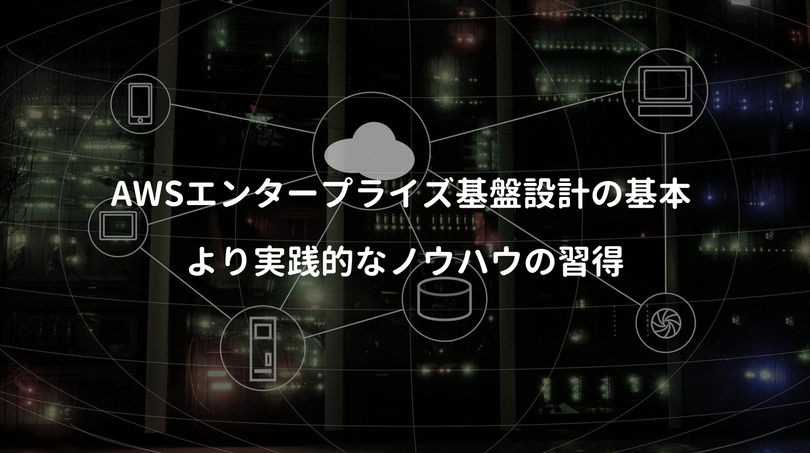

日本で普通に生活していれば、GAFAMのサービスに全く触れない日はないが、昨今のシステム開発では、何かしらのクラウド環境(AWS / GCP / Azure)で開発するのが当たり前となっている。特にエンジニアはクラウド知識の習熟から逃れられず、普段から使い慣れていないとマズい。

**クラウドベンダーが用意するサービスを活用し、クライアントにいかに利益をもたらすか？** を考えるために **AWS認定資格のアーキテクト-アソシエイト** を取得してみた。ただ実践経験が乏しいため、彼らが提唱するWell-Architectedやベストプラクティスを完全には理解出来ず (サービス多過ぎ問題)

今回はそれを克服すべく、AWSの実践的な知識が網羅されたこちらを一読してみた。

<a href="https://hb.afl.rakuten.co.jp/hgc/146fe51c.1fd043a3.146fe51d.605dc196/yomereba_main_202001281649171838?pc=http%3A%2F%2Fbooks.rakuten.co.jp%2Frb%2F15610238%2F%3Fscid%3Daf_ich_link_urltxt%26m%3Dhttp%3A%2F%2Fm.rakuten.co.jp%2Fev%2Fbook%2F" target="_blank" rel="noopener noreferrer">Amazon Web Services エンタープライズ基盤設計の基本</a>
posted with <a href="https://yomereba.com" rel="nofollow noopener noreferrer" target="_blank">ヨメレバ</a>

堀内 康弘/三浦 美緒 日経BP 2018年10月05日    

<a href="https://hb.afl.rakuten.co.jp/hgc/146fe51c.1fd043a3.146fe51d.605dc196/yomereba_main_202001281649171838?pc=http%3A%2F%2Fbooks.rakuten.co.jp%2Frb%2F15610238%2F%3Fscid%3Daf_ich_link_urltxt%26m%3Dhttp%3A%2F%2Fm.rakuten.co.jp%2Fev%2Fbook%2F" target="_blank" rel="noopener noreferrer">楽天ブックス</a>

<a href="https://www.amazon.co.jp/exec/obidos/asin/4822292673/kanon123-22/" target="_blank" rel="noopener noreferrer">Amazon</a>

<a href="https://www.amazon.co.jp/gp/search?keywords=Amazon%20Web%20Services%20%E3%82%A8%E3%83%B3%E3%82%BF%E3%83%BC%E3%83%97%E3%83%A9%E3%82%A4%E3%82%BA%E5%9F%BA%E7%9B%A4%E8%A8%AD%E8%A8%88%E3%81%AE%E5%9F%BA%E6%9C%AC&__mk_ja_JP=%83J%83%5E%83J%83i&url=node%3D2275256051&tag=kanon123-22" target="_blank" rel="noopener noreferrer">Kindle</a>
                              	  	  	  	  	

メジャーなサービス(EC2 / RDS / S3)でのサービス構築から、疎結合化で使われるSQSやSNS、サーバレス技術のLambdaなどが解説されており、実務レベルでも通用する内容が網羅されている。

## 本書のあらすじ

本書は単なる解説書ではなく、実務でAWSを使いこなせるよう、コーポレートサイトのシステムを題材にし、主要なサービスを使った **アーキテクチャ設計** と **基盤構築の実践的なノウハウ** を解説。

■ 序章 AWSの利点とデータセンターの構成 ★

■ 第1章 リージョン選びとネットワークの設計 ★

■ 第2章 仮想マシンとオブジェクトストレージ ★

■ 第3章 負荷分散とスケーリング ★

■ 第4章 疎結合 ★

■ 第5章 CDNとDNS

■ 第6章 セキュリティ

■ 第7章 基盤構築の自動化

今回は序章 〜 第4章まで(★)を重点的に確認。

## AWSの利点とデータセンターの構成

**序章** では **リージョン** と **アベライビリティゾーン(AZ)** の解説。

**リージョン** はデータセンターが置かれている物理的な場所を表し、各リージョンでは **2つ以上** のAZを配置、また東京では **4つ** のAZを運用 **(ただし新規アカウントではこのうちの1つは利用不可)**

POINTAZは独立した冗長性のある電源やネットワークを備え、障害が発生しても他のAZに影響を与えないよう考慮されており、また同一リージョンに属するAZは、高速なプライベートリンクで互いに接続されているので、AZ間の遅延が 2ミリ秒以下 となるよう設計。

この仕組みを利用することで、RDSの **マスタ / スレーブ構成** が構築可能！

POINT**マスタ / スレーブ構成** は、RDSのアクティブ/スタンバイ構成を同一リージョンの異なるAZに配置し、マスターとスタンバイの間でリアルタイムにデータを同期、マスターを配置したAZで障害が発生した場合でも、すぐスタンバイのインスタンスに切り替えサービス継続をする。

## リージョン選びとネットワークの設計

**第1章** では、1台の仮想マシンでコーポレーションサイトを稼働させる手順の紹介。

■ リージョンの選択：法規や社内規定 / ユーザーの近さ / 必要なサービス / コスト効果

■ VPCとサブネットの作成：1つのリージョンに紐付き、複数リージョンは横断不可

■ Internet Gatewayの設置：インターネットへのルーティングとネットワークアドレス変換

■ ルートテーブルの設定：カスタムルートテーブルを作成、サブネットの関連付け

■ パブリックIP / ElasticIPの割当：インターネットで通用するパブリックIPアドレスの割当

■ セキュリティグループ（サービス単位） / ネットワークACL（ネットワーク単位）

## 仮想マシンとオブジェクトストレージ

**第2章** では、EC2インスタンスと各種ストレージサービスの解説。

**EC2インスタンス** はソフトウェア構成を記録した **テンプレートAMI** から起動され、AMIを作成することで故障発生時には、そのAMIを使用し、代わりのEC2インスタンスで起動可能。

POINTインスタンスのストレージサービスには、インスタンスストアとEBSの2種類があり、**インスタンスストア** は物理的にアタッチ + データの非永続化、**EBS** はインスタンスから独立した永続性 + AZ内でデータ冗長化による高耐久性を実現。

2種類あるストレージ(ブロックとオブジェクト)の特徴と主な用途。

POINT**ブロックストレージ** は、データ更新時に1ブロックを変更するので **更新頻度が高く、低遅延が求められる用途** に適しているが、事前に容量を決める必要があるので、後から拡張しにくい。

POINT**オブジェクトストレージ(S3等)** は、テキストファイルの1文字を変更するだけでも、ファイル全体の更新が必要。なのでユースケースとしては画像、動画のファイルやアプリケーションのログファイル等、更新頻度が低く、かつ運用で増え続けるファイルの保存が挙げられる。

## 負荷分散とスケーリング

**第3章** の負荷分散とスケーリングでは、マネージドサービスの代表例であるRDSの概要、ELBの使い方、オートスケーリングと色々あり、一番気になったのは **データストアのスケーリング** の話。

POINT**RDSのスケーリングで最初に検討すべきは、書き込み用と読み込み用で分割する事！**

多くのアプリケーションでは、書き込みよりも読み込みの方が圧倒的に多く、リードレプリカを増やす事でシステム全体の性能を向上させることが可能。

POINT**読み込み速度を更に向上させる方法に、インメモリーキャッシュの併用がある！**

マネージドサービスなので、運用担当者の負担も少ない。

## 疎結合① – SQSとSNS

**第4章** からはマイクロサービスでも活用される疎結合の話。

可用性 + 拡張性を実現させるサービスの代表例が **SQS** と **SNS** の2つ。

POINT**SQS** は二つのコンポーネントがやりとりする際、送信側はキューにメッセージを送信、受信側はキューに問い合わせて受け取る仕組みで、システム全体の可用性と拡張性を向上。マネージドサービスであるSQSは、複数のデータセンターに冗長化して保存しているので、メッセージが消失することがほぼ無く、処理性能も自動的にスケールアウトし、高いスループットを維持。

SQSの注意点に **重複処理の可能性がある**(稀に同一メッセージを重複してクライアントが受け取る可能性があるので、冪等性を考慮した作りが必要) / **順序が守られない**(2020年時点では東京でもFIFOが利用可能) / **ショートポーリングはメッセージを受け取れない可能性** がある。

POINT**SNS** は登録しているエンドポイントやクライアントにメッセージをプッシュする配信サービスで、送信側を**パブリッシャー**、受信側を**サブスクライバー**と呼び、トピックと呼ばれる箱を介して通信 **(トピックにサブスクライバーを紐付け、パブリッシャーがトピックにメッセージを発行すると、紐づけられているサブスクライバーに送信される)**

SNSはメッセージの即時配信が可能だが、サブスクライバーが常時メッセージを受け取れるようにする必要があり、SQSは受信クライアントが自身の都合に合わせて、ポーリングによってメッセージを受け取ることが可能 **(SQSとSNSを組み合わせると、一部のクライアントには即時配信、別のクライアントにはSQSにポーリングして受け取るアーキテクチャも構築可能)**

## 疎結合② – Lambda

第4章 の後半で紹介されている **Lambda** の話。

これはコードをイベントや時間間隔で指定し、実行できるサービスで、サーバー管理が不要、自動スケーリング、インフラ管理が軽減され、コーディングに集中できるマネージドサービスの一種。

LambdaがVPC内のリソースにアクセスする場合、EC2で提供されている仮想NIC **(Elastic Network Interface(ENI))** を利用し実現され、ENIの作成/削除はLambdaによってコントロールされる**(最初のリクエストで作成され、リクエストがしばらくないと自動的に削除)**

POINT最初のリクエストではENI作成処理を含むので、レイテンシーが大きく**(通常は数秒〜数十秒、最大60秒)**、レスポンスが数秒掛かるとユーザビリティー問題があるし、API Gatewayだとタイムアウトも考えられるため、ENIが自動的に削除されないよう、定期的なポーリング対策が大切！

クラメソのブログ等を見てる感じ、Lambdaなどのサーバレスアーキテクチャは癖があり、試行錯誤が必要らしいので、こちらは別途専門書に触れながら、ノウハウの習熟が必要そう。