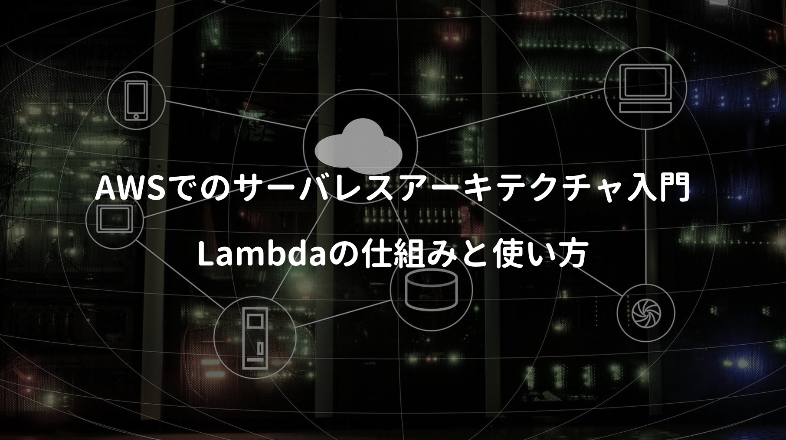
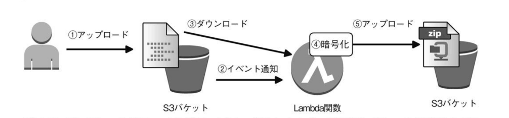
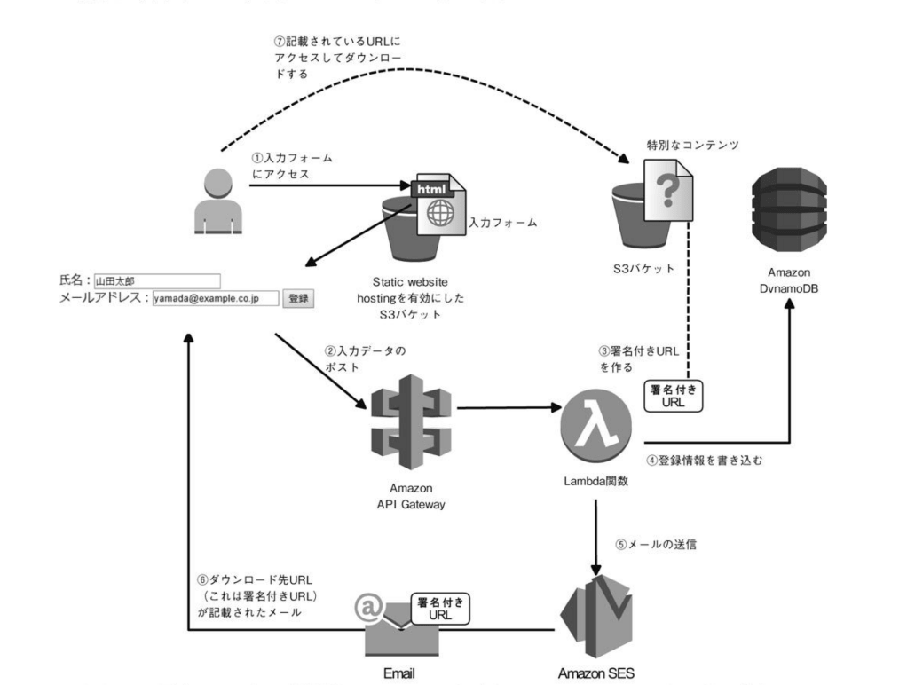
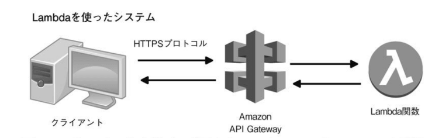

**サーバレスアーキテクチャ** を使いこなすには、試行錯誤が必要である話をよく聞くが、彼らが提唱している **ベストプラクティス (サーバではなくサービス)** や、日々追加されるサーバレスアーキテクチャの新機能を見れば、AWSがサーバレスアーキテクチャに力を入れているのが伝わってくる(多分)

実際AWSで働かれている方のTwitter投稿を見る限り、今まで抱えていたLambdaの問題点も随分と解消されはじめ、2020年以降は本格的にサーバレスアーキテクチャの需要が増えそう。

ちなみに最近の新規開発案件では、Lambdaを取り入れるケースが増えているらしく、ただ魅力があったとしても、すぐ移行出来る簡単な技術ではない(従来とプログラミング方法や設計思想も随分違うため)ので、自分に使えそうかを理解するためにコチラを読んでみた。

<div class="cstmreba"><div class="booklink-box"><div class="booklink-image"><a href="https://hb.afl.rakuten.co.jp/hgc/146fe51c.1fd043a3.146fe51d.605dc196/yomereba_main_202002061507500683?pc=http%3A%2F%2Fbooks.rakuten.co.jp%2Frb%2F15179436%2F%3Fscid%3Daf_ich_link_urltxt%26m%3Dhttp%3A%2F%2Fm.rakuten.co.jp%2Fev%2Fbook%2F" target="_blank" rel="noopener noreferrer"></a></div><div class="booklink-info"><div class="booklink-name"><a href="https://hb.afl.rakuten.co.jp/hgc/146fe51c.1fd043a3.146fe51d.605dc196/yomereba_main_202002061507500683?pc=http%3A%2F%2Fbooks.rakuten.co.jp%2Frb%2F15179436%2F%3Fscid%3Daf_ich_link_urltxt%26m%3Dhttp%3A%2F%2Fm.rakuten.co.jp%2Fev%2Fbook%2F" target="_blank" rel="noopener noreferrer">AWS　Lambda実践ガイド</a><div class="booklink-powered-date">posted with <a href="https://yomereba.com" rel="nofollow noopener noreferrer" target="_blank">ヨメレバ</a></div></div><div class="booklink-detail">大澤文孝 インプレス 2017年10月    </div><div class="booklink-link2"><div class="shoplinkrakuten"><a href="https://hb.afl.rakuten.co.jp/hgc/146fe51c.1fd043a3.146fe51d.605dc196/yomereba_main_202002061507500683?pc=http%3A%2F%2Fbooks.rakuten.co.jp%2Frb%2F15179436%2F%3Fscid%3Daf_ich_link_urltxt%26m%3Dhttp%3A%2F%2Fm.rakuten.co.jp%2Fev%2Fbook%2F" target="_blank" rel="noopener noreferrer">楽天ブックス</a></div><div class="shoplinkamazon"><a href="https://www.amazon.co.jp/exec/obidos/asin/4295002526/kanon123-22/" target="_blank" rel="noopener noreferrer">Amazon</a></div><div class="shoplinkkindle"><a href="https://www.amazon.co.jp/gp/search?keywords=AWS%E3%80%80Lambda%E5%AE%9F%E8%B7%B5%E3%82%AC%E3%82%A4%E3%83%89&__mk_ja_JP=%83J%83%5E%83J%83i&url=node%3D2275256051&tag=kanon123-22" target="_blank" rel="noopener noreferrer">Kindle</a></div>                              	  	  	  	  	</div></div><div class="booklink-footer"></div></div></div>

2020年時点では内容も古くなっているので、一部AWS公式HPが発表している内容を付記。

## 本書のあらすじ

**第1章** では、従来のシステム開発(EC2)との違いとLambda利用のメリット。

**第2章** では、Lambda関数をどのような書式で作成し、登録するかをハンズオン形式で解説。

**第3章** では、Lambdaの内部的な仕組みと、開発に欠かせない基礎知識。

**第4章 〜 第6章** では、Lambda開発のユースケース(S3 / API Gatewat / DynamoDB / SES / SQS / SNSとの組み合わせ)が幾つか紹介(今回はほぼ割愛)

## Lambdaで実現するサーバレスアーキテクチャ

AWSでのアプリケーション構築を行う場合、一般的にはEC2上でプログラムを動かすのが一般的だが、その運用には結構な手間やコストを要し、また性能上の問題 (最初に選択したインスタンスタイプは一時停止しないと変更出来ない)も併せて考慮しなければならないのは面倒。

<span class="mark">POINT</span>そういった手間を軽減する一つの手段が **AWS Lambda** であり、EC2のような仮想サーバーを必要とせず **実行時間に対しての課金なのでコスト削減効果を期待できる / マネージドサービスなので保守・運用が不要 / 高負荷時は自動的にスケーリング** などの特徴がある！

ただ **2つの制限(①.ステートレス / ②.最大稼働時間5分)** があるので、現時点では全てをサーバレスアーキテクチャで賄うのではなく、継続的に稼働する処理ではないもの(必要に応じて少しだけ動く)に限定して利用するのが主な用途 **(2018年に15分に変更されたので複雑な処理も可能になった)**

Webサイトの管理画面機能として、画像アップロード後にサーバー上に画像を格納すると、サムネイル画像を自動生成する機能があるが、Lambdaを使えば、S3アップロード時の自動生成処理を、簡単に作れる(本書の第4章では同内容が紹介されている)



またLambdaの呼び出しには、ファイルがS3に置かれたタイミングや、API Gatewayと組み合わせて、REST形式のWeb API (JavaScriptのAjax通信)で呼び出したり、CloudWatchでスケジューリングなど、Lambda自体が疎結合を実現させ、AWSサービス間の接着剤的な役割を担っている。

## Lambda関数の作り方

**第2章** では、簡単なLambda関数を作って実行するまでのハンズオン。

PythonではLambda関数を以下記述 **(eventにリクエスト、contextに実行環境の情報)**

```python
# def 関数名 (event, context):
#  ・・関数の処理・・
#   return 戻り値
 
def myfunc_handler (event, context):
  return 戻り値
```
<br/>

本書ではPython3系 (Python 3.6)で解説されており、他言語の場合、微妙に書き方が異なるので、それぞれの言語に併せた書式を覚える必要有り。

## Lambdaの仕組み

**第3章** では、EC2と異なる性質を持つLamdbaの仕組みを知ることで、パフォーマンス低下を防いだり、同時実行時に期待した動きにならなかった際の対応方法を理解。

<span class="mark">POINT</span>Lambda関数は **Lambdaコンテナ (Linuxコンテナ環境)** で動作し、実行時にコンテナ生成(EC2より起動時間は短く、必要なCPUリソースも少ない)するので、初回起動時に多少時間がかかり、二回目以降の実行では一度作成したコンテナを再利用し、高速化する仕組みが採用されている。

またLambdaはインターネットと接続可能なパブリック環境にあるので、デフォルトでプライベートなネットワークであるVPCと接続が出来ず、これを実現するためには、Lambda関数のVPCオプションを設定し、VPCの任意のサブネットに配置する構成とする必要有り(主にVPC内のRDSになるかと)

~~<span style="color: gray;">ただVPC接続だと 2つの制限 (①.起動時間がかかる / ②.同時実行性が落ちる) を考慮する必要があり、パフォーマンスに影響を及ぼすので、本書ではRDSよりもDynamoDBの利用を推奨 (理由として、DynamoDBならVPC接続が不要なので、パフォーマンス低下を多少軽減出来る)</span>~~

~~<span style="color: gray;">リアルタイム性の考慮がいらなければ、一旦はLambda関数でDynamoDBにデータを格納し、そこから別のLambda関数でRDSに徐々に転送するよう構成すれば、直接RDSに書き込むよりもパフォーマンスが向上する事例を紹介 (Lambda関数の処理の多くがDynamoDBらしい)</span>~~

<span style="color: crimson; font-weight: bold;">VPCアクセスのレイテンシコストは、2019年9月以降に順次適用予定で、今後悩まされることも無くなり、RDSに対する最大同時接続数の問題も、今後はRDS Proxyで改善してくれると思われる。</span>

■ [[発表] Lambda 関数が VPC 環境で改善されます](https://aws.amazon.com/jp/blogs/news/announcing-improved-vpc-networking-for-aws-lambda-functions/)  
■ [Amazon RDS プロキシのご紹介 (プレビュー)](https://aws.amazon.com/jp/about-aws/whats-new/2019/12/amazon-rds-proxy-available-in-preview/)  

Lambda関数呼び出しには2種類があり、特に利用頻度の高いプッシュモデル(非同期呼び出し)について、キューに溜まっているイベントを複数Lambdaが処理する可能性もあるので、何かしらの理由で実行時エラーが発生した場合、2回の試行(つまり初回を含めれば最大3回の実行可能性)が発生する。

<span class="mark">POINT</span>ここでの **失敗** とは、Lambda関数呼び出し時の失敗だけでなく、**処理中の例外が発生した場合も含み、また正常実行されても複数回実行されるケースも考えられるので、冪等性を考慮した作り** (例えば前回実行したかのフラグを持たせ、フラグ判定を入れるとか)が大切。

## API Gateway + Lambda + DynamoDB + S3

**第5章** では主要なサービスとLambdaを活用した事例を紹介。

S3にホスティングされているWebサイトにて、ユーザーが入力した値をAPI Gatewayで経由させ、Lambda関数でDynamoDBに登録と、著名付きURLの発行 + SESでのメール送信を実現。



**API Gateway** は一種のプロトコル変換器であり、HTTPSプロトコルで送られてきたリクエスト値を受け取り、Lambda関数に渡し、Lambda関数からの戻り値をHTTPSプロトコルに変換して返却。



API Gatewayは重要サービスなので必須知識になっていると思う（もうなってるか？）

以前まではDynamoDBとの連携が必須に思われていたが、様々な問題が解消され始めているので、2020年以降はRDS連携でも十分に使えるかもしれない。
