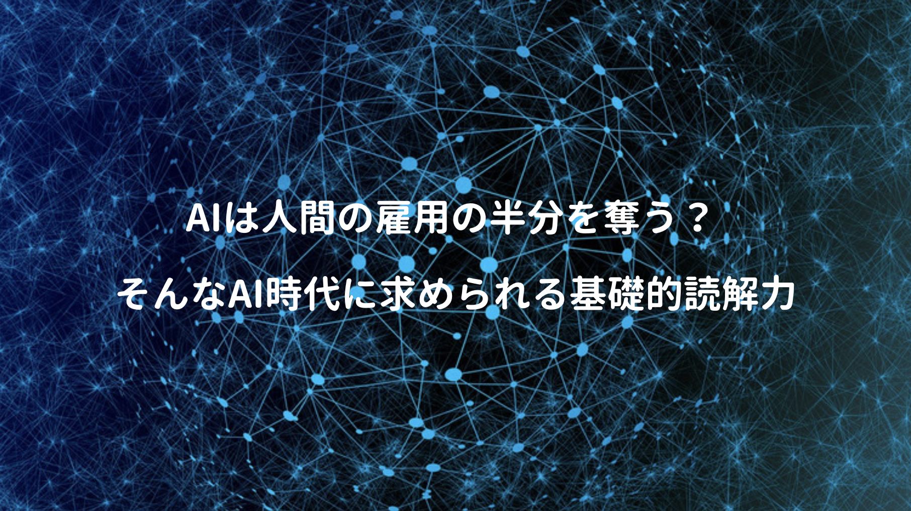

知人に紹介され **ユヴァル・ノア・ハラリ** の **21Lesson** を読んでみた。

以前に読んだ **サピエンス全史** が、大変読み辛かったので **(内容は面白いんだけれど難解で、しかも話が長い)** 今回もそうなのかな？と思いながら読んでみると、随分読みやすく万人受けすると思う。

サピエンス全史では **「過去」** を振り返り、ホモデウスでは **「未来」** を予測、**21Lesson** では長期的な視点を忘れずに **「現代を考える一冊」** ということで、IT x バイオテクノロジーがもたらす変革が及ぼす影響など、今を生きる人に色んな気付きを与えてくれる一冊（正直辛くなるけど）

<a href="https://hb.afl.rakuten.co.jp/hgc/g0000015.o51y41f2.g0000015.o51y5a32/kaereba_main_202002061112327463?pc=https%3A%2F%2Fproduct.rakuten.co.jp%2Fproduct%2F-%2Fa4c2e40d8509b94d23a64fa69a33d9b8%2F&m=http%3A%2F%2Fm.product.rakuten.co.jp%2Fproduct%2Fa4c2e40d8509b94d23a64fa69a33d9b8%2F" target="_blank" rel="noopener noreferrer">２１Ｌｅｓｓｏｎｓ ２１世紀の人類のための２１の思考  /河出書房新社/ユヴァル・ノア・ハラリ</a>
posted with <a href="https://kaereba.com" rel="nofollow noopener noreferrer" target="_blank">カエレバ</a>

<a href="https://hb.afl.rakuten.co.jp/hgc/146fe51c.1fd043a3.146fe51d.605dc196/kaereba_main_202002061112327463?pc=https%3A%2F%2Fsearch.rakuten.co.jp%2Fsearch%2Fmall%2FLesson21%2F-%2Ff.1-p.1-s.1-sf.0-st.A-v.2%3Fx%3D0%26scid%3Daf_ich_link_urltxt%26m%3Dhttp%3A%2F%2Fm.rakuten.co.jp%2F" target="_blank" rel="noopener noreferrer">楽天市場</a>

<a href="https://www.amazon.co.jp/gp/search?keywords=Lesson21&__mk_ja_JP=%E3%82%AB%E3%82%BF%E3%82%AB%E3%83%8A&tag=kanon123-22" target="_blank" rel="noopener noreferrer">Amazon</a>

 

21のテーマ中でも **バイオテクノロジー x IT** は、自身を作り変える力を与える可能性があるので、心の複雑さを理解していない人間は、自身が引き起こす変化で心が崩壊しかねないとの懸念は恐ろしい。

内容は推測の域を出ない部分も多くあり、確定事項では無いので、まず現状のテクノロジー(特にAI)で何が出来るのか、その道の専門家の意見を聞きつつ、各自がしっかりと考えると事が重要だと。

## ロボットは東大に入れるか？

そんなモヤモヤを持っている時、こちらの一冊が目に入ったので読んでみた。

<a href="https://hb.afl.rakuten.co.jp/hgc/146fe51c.1fd043a3.146fe51d.605dc196/yomereba_main_202002152330196352?pc=http%3A%2F%2Fbooks.rakuten.co.jp%2Frb%2F15297786%2F%3Fscid%3Daf_ich_link_urltxt%26m%3Dhttp%3A%2F%2Fm.rakuten.co.jp%2Fev%2Fbook%2F" target="_blank" rel="noopener noreferrer">AI vs．教科書が読めない子どもたち</a>
posted with <a href="https://yomereba.com" rel="nofollow noopener noreferrer" target="_blank">ヨメレバ</a>

新井 紀子 東洋経済新報社 2018年02月02日    

<a href="https://hb.afl.rakuten.co.jp/hgc/146fe51c.1fd043a3.146fe51d.605dc196/yomereba_main_202002152330196352?pc=http%3A%2F%2Fbooks.rakuten.co.jp%2Frb%2F15297786%2F%3Fscid%3Daf_ich_link_urltxt%26m%3Dhttp%3A%2F%2Fm.rakuten.co.jp%2Fev%2Fbook%2F" target="_blank" rel="noopener noreferrer">楽天ブックス</a>

<a href="https://www.amazon.co.jp/exec/obidos/asin/4492762396/kanon123-22/" target="_blank" rel="noopener noreferrer">Amazon</a>

<a href="https://www.amazon.co.jp/gp/search?keywords=AI%20vs%EF%BC%8E%E6%95%99%E7%A7%91%E6%9B%B8%E3%81%8C%E8%AA%AD%E3%82%81%E3%81%AA%E3%81%84%E5%AD%90%E3%81%A9%E3%82%82%E3%81%9F%E3%81%A1&__mk_ja_JP=%83J%83%5E%83J%83i&url=node%3D2275256051&tag=kanon123-22" target="_blank" rel="noopener noreferrer">Kindle</a>
                              	  	  	  	  	

 

**「東ロボくん」** と名付けた人工知能で、東大合格を目指すチャレンジを試してきた **数学者・新井紀子さん** が、現状のAIに出来る事や限界、更にAIの歴史やAI時代にどう生きるべきかを言及。

POINT**AIは神にはならないし、AIが人類を滅ぼすことはないし、シンギュラリティも到来しない！**

読解力低下の問題提起など、具体例を丁寧に説明されているので、こちらを読むだけでも、頭の中のモヤモヤが随分なくなったので内容を一部抜粋。

## 数学は論理・確率・統計で表現すること

第1章 + 第2章ではAIに出来ることや歴史とシンギュラリティの話だが、結論としてコレ↓

POINT**AIは人間の言葉を理解しておらず、計算に応じて答えを出力しているに過ぎない、またコンピューターは計算機なので、計算しか出来ず、AIが人間を超える(知能を得る)ためには、人間の知能の原理を解明し、数理モデルに落とし込む必要がある！**

本書では数学の歴史にも話が及び、4000年の数学の歴史で獲得した表現方法は **論理・確率・統計** の3つだけ、現時点では **意味** を記述出来ない(真・偽の2つしか無い)ので、AIは神にはならないし、人類を滅ぼさないし、シンギュラリティもこないとの結論(少なくとも私達や私達の孫世代までは)

まあだからと言って安心は出来ず、AIが労働者として人間のライバルになる可能性は高いし、また現代人の仕事の半数を奪う時代がそこまで迫っているのは事実。

POINT**AIが苦手な領域に注力するため、何よりも基礎的読解力が重要である！**

## AIが苦手な領域とは？

ではAIに苦手な領域とは何だろうか？

POINT**コミュニケーション能力や理解力、柔軟な判断力が求められる知的労働活動！**

つまり高度な読解力と常識、加えて人間らしい柔軟判断が要求される分野なので希少性が高い人材！

また本書ではAIが得意な領域と不得意な領域が解説されている。

① 係り受け：主語と述語の関係や修飾語と被修飾語の関係の理解する能力

② 照応解決：それ、これといった指示代名詞が何を指すかの理解する能力

③ 同義文判定：2つの似た文章を読み比べて、意味が同じか判定する能力

④ 推論：文の構造を理解した上で、様々な知識を総動員し文の意味を理解する能力

⑤ イメージ同定：文章と図形やグラフを比べ、内容が一致しているか認識する能力

⑥ 具体例同定：定義を読んでそれと合致する具体例を認識する能力

 

①と②はかなりの精度でAIも正解しており、③はちょっと精度が低い、④〜⑥は全く出来ていないので、この能力向上(基礎的読解力)が鍵な訳だが、著者自身も科学的に読解力を向上させる方法は分かっておらず、試行錯誤中とのこと。

読書習慣に相関関係は無いらしいが、多読より精読・深読にヒントがあるかも...

ちなみに本書では、上記素養があるかの例題が掲載されているが、しっかり考えないとミスする問題も多く、中学・高校では結構な人が理解出来ていない調査報告もあるので、学校教育に必要なこと一に読解力、二に読解力、三、四は遊びで、五に算数と締められている。