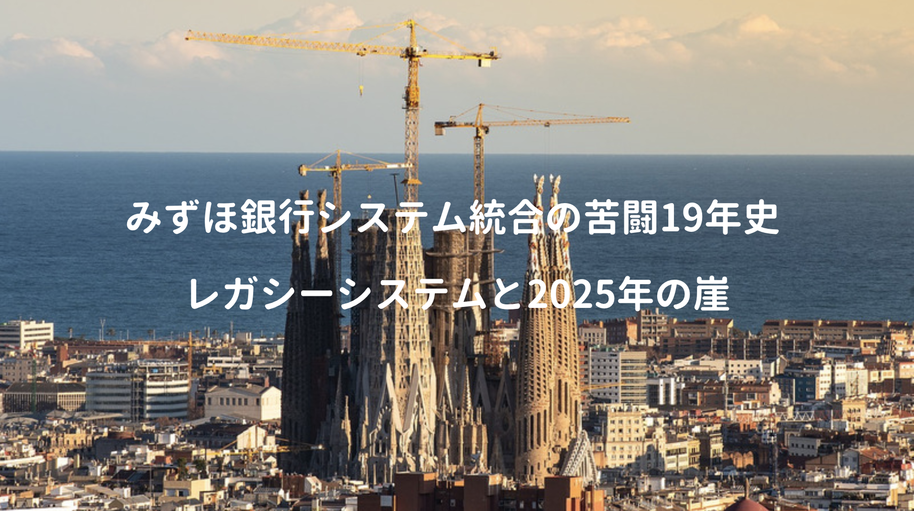
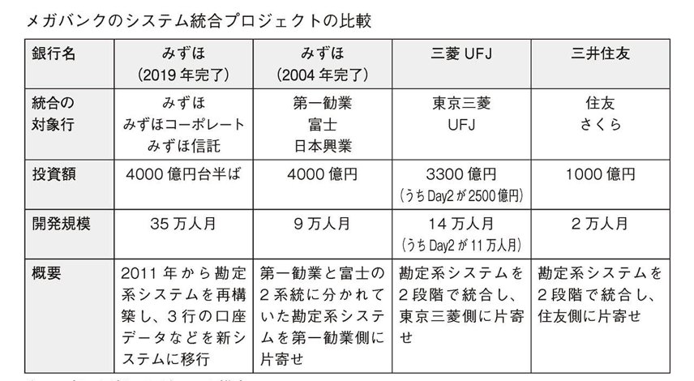
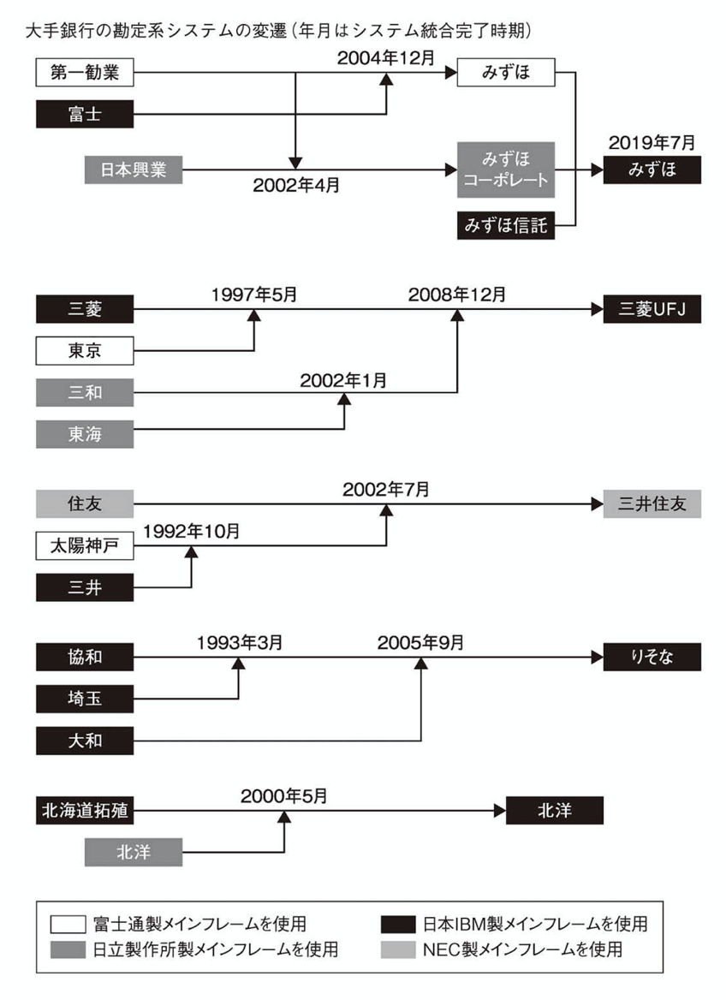

経産省のレポートでまとめられた **2025年の崖** — このまま旧式の基幹業務（レガシーシステム）を使い続ければ、日本経済は年間約12兆円の経済損失を被り続ける可能性があるらしく、国内SIerも **デジタルトランスフォーメーション** の重要性を声高に叫んでいる。

その基幹業務の代表例に、銀行の勘定系システム（預金/融資/振り込み等）があり、IT業界のサクラダファミリアと言われた **みずほ銀行システム統合** は大変有名な話（書籍も何冊か出版されている）

<a href="https://hb.afl.rakuten.co.jp/hgc/146fe51c.1fd043a3.146fe51d.605dc196/yomereba_main_202003081730050352?pc=http%3A%2F%2Fbooks.rakuten.co.jp%2Frb%2F16213851%2F%3Fscid%3Daf_ich_link_urltxt%26m%3Dhttp%3A%2F%2Fm.rakuten.co.jp%2Fev%2Fbook%2F" target="_blank" rel="noopener noreferrer">みずほ銀行システム統合、苦闘の19年史</a>
posted with <a href="https://yomereba.com" rel="nofollow noopener noreferrer" target="_blank">ヨメレバ</a>

日経コンピュータ/山端 宏実 日経BP 2020年02月15日    

<a href="https://hb.afl.rakuten.co.jp/hgc/146fe51c.1fd043a3.146fe51d.605dc196/yomereba_main_202003081730050352?pc=http%3A%2F%2Fbooks.rakuten.co.jp%2Frb%2F16213851%2F%3Fscid%3Daf_ich_link_urltxt%26m%3Dhttp%3A%2F%2Fm.rakuten.co.jp%2Fev%2Fbook%2F" target="_blank" rel="noopener noreferrer">楽天ブックス</a>

<a href="https://www.amazon.co.jp/exec/obidos/asin/4296105353/kanon123-22/" target="_blank" rel="noopener noreferrer">Amazon</a>

<a href="https://www.amazon.co.jp/gp/search?keywords=%E3%81%BF%E3%81%9A%E3%81%BB%E9%8A%80%E8%A1%8C%E3%82%B7%E3%82%B9%E3%83%86%E3%83%A0%E7%B5%B1%E5%90%88%E3%80%81%E8%8B%A6%E9%97%98%E3%81%AE19%E5%B9%B4%E5%8F%B2&__mk_ja_JP=%83J%83%5E%83J%83i&url=node%3D2275256051&tag=kanon123-22" target="_blank" rel="noopener noreferrer">Kindle</a>
                              	  	  	  	  	

みずほ勘定系システムは部分的な改修を繰り返し、内部構造を把握しきれずブラックボックス化。

システム統合が遅れた理由について、勿論システム側の問題もあるだろうけど、資金調達の面でも世の中の流れが間接投資 → 直接投資（株式や債権発行）に変化し、勘定系システムへの大きな投資判断が出来ない背景から、東日本大震災時の義援金振り込みが集中したことでサービス停止の事態を招いた。

本書ではシステム障害をキッカケに始まったシステム統合案件の話を紹介。普段システム開発に馴染みの無い方でも、老朽化した基幹業務を続けることは、大変危険だと思える一冊かなと。

## 人知を超えた案件規模

今回のシステム統合がどれだけ過酷な案件だったか、本書では要した金額と人月工数を紹介。

私は赤い銀行（今後は赤銀と省略）の情報系システム部に3年在籍した経験があるが、その際に勘定系の先輩エンジニアから **11万人月規模であるDay2案件のヤバさ** を度々聞かされていた。

直接Day2案件に関わっていた訳ではないけど、Day2の残案件に携わり、それなりに大変な時期（半年間の終電帰宅）も経験。その過程で精神を病んで休職された方、また亡くなった方も目の当たりにしていたので、金融システム開発の厳しさを多少は理解しているつもり。

本書では何とか頑張ってシステム更改したと書かれているが、Day2の規模すら凌駕するのが、みずほ銀行システム統合案件なので、この一文の裏に、想像を絶する開発現場があったことは想像に難くない。

## 勘定系システムにSOAアーキテクチャ採用

みずほシステム統合では、SOAの採用が目玉トピックとして挙げられていた。

大規模モノリスなシステム開発を長年続けると、軽微な機能追加やリファクタリングでさえ、システム全体に大きな影響を及ぼしかねず、影響範囲の調査や試験コスト（退行試験）は膨らむ傾向にある。そういった事態を防ぐため、みずほ銀行の勘定系でもSOAが導入された模様。

**鍵は疎結合（マイクロサービス）** — ちなみにこの話は基幹業務に限ったことではなく、昨今のシステム開発では、より一層のスピード感が求められているので、モダンな最新技術（クラウド/コンテナ）の活用により、疎結合を実現することが急務だと言われている。

■ [マイクロサービス、SOA、API：味方か敵か](https://www.ibm.com/developerworks/jp/websphere/library/techarticles/soa_microservices_architecture/index.html)  
■ [マイクロサービスのメリットをざっくり言うと「変化に対応しやすい」こと](https://knowledge.sakura.ad.jp/3377/)  

SOAは銀行システムなど大金を使える大規模開発でない限りは採用されないので、実務経験を積む機会も少なく、また情報系と勘定系では作りも全然違うだろうし、勘定系のSOAがどう実現されているのかは未知数（一応本書ではSOA採用で、従来コストの30%を削減出来ると言っている）

## 主要ベンダーIBMと富士通の争い

赤銀の情報系システムについて、少なくとも私が携わっていたシステムはIBM製（WAS/WACs/DB2）で統一され、IBMのコンサルが数人、他にも富士通や日立、NTTなど日本を代表するITベンダーのエンジニアが多く常駐していた（その下で雇われる孫請け、ひ孫請けベンダーは数知れず）

みずほ銀行のシステム部でも、主要な4ベンダーが参画し、各ベンダー（特にIBMと富士通）が自分の食い扶持（メーカーのフラッグシップとして、メガバンクの勘定系を抑えているという事実）を確保すべく、不毛な議論が長く続いたようだが、紆余曲折あってIBMのメインフレーム利用に着地。

勘定系メインフレームはIBM天国なので、かなり儲かっているのでは？と思いつつ、今後は大規模金融開発も減るのでIBMも厳しいのでは？と指摘する人もいる … IBMクラウドも流行らなそうだし、OSSに馴染みのある開発者は今後もIBMと絡むことは無さそうかな。

## 日経コンピュータが検証した三十もの不手際

東日本大震災時のシステム障害について、システム障害特別調査委員会がまとめた報告書を、日経コンピュータが検証したところ、**三十もの不手際** が積もり重なって起きたものとしている。

本書では、その三十の不手際（いずれの問題も経営陣のIT軽視、及びITへの理解不足）を4種類の問題に分類し説明しており、この点は戒めの意味も含め、システム開発に携わる人なら読むと良いかも。

**■ システム仕様や設定の不手際**（部分的な機能改修を続けたせいでシステムがブラックボックス化）  
**■ システム運用の不手際**（運用の自動化が行われておらず操作ミスが多発）  
**■ リスク管理**（システムリスク点検の不備と新サービス導入の差異とリスク評価）  
**■ 緊急態勢**（頭取が報告を受けるまで二十一時間を要している事実から分かる危機対応能力の欠如）

調査報告書では一連の障害を通じて、システム全体を俯瞰でき、かつ、多重障害の陣頭指揮を執り得るマネジメントの人材の不足と指摘している（かなり希少な人材なので、採用も育成も難しい）

## 基幹業務の統合案件

企業の合併で最も大変なのは **情報システムの統合** であり、情報システムは企業の業務と表裏一体なので、業務が一本化しなければシステム統合は不可、また求められるレベルの高さは言わずもがな。

開発者の観点で考えれば、単なる技術理解だけでなく、深い業務知識が求められる故、他の案件に比べると単価は高いけど、激務なケースが多い（鬱になる人も多く、追い詰められ死ぬ人もいる）

規模が大きくなると管理が難しくなり、進捗会議では問題無いと聞かされていても、蓋を開けてみるとプログラムが出来ていなかった（完成度が非常に低いプログラム）みたいな悲しい事も起きたりと、みずほの事例を聞けば、大変な現場であることは間違いない（運用部門は除く）

そーいえば（勘定系の）先輩に、金融開発には独自文化や風土があるので、若い頃からやってないと馴染めずに辞める人が多いと聞いた（その馴染んだ人って、ある意味で洗脳なのでは？）

なんだか結果的に、勘定系のシステム開発をdisってしまったけど、金銭的な面では確かに恵まれた傾向で、一次受けベンダーのコンサルの単価は300万だったり、一部のフリーランスは勘定系システムの開発案件を500万で契約する人までいたりと、にわかに信じがたい相場感だったりらしい(今後は不明)

とにかく本案件に携わられた（強制も含む）方々は本当にお疲れ様でした！