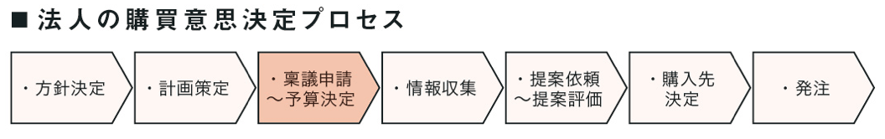

少し前に業務で **BtoBマーケティング** に携わる機会に恵まれた。

**マーケティング** と一括りにしても幅広いが、Wikipediaでは次のように説明している。

> 企業などの組織が行うあらゆる活動のうち「顧客が真に求める商品やサービスを作り、その情報を届け、顧客がその価値を効果的に得られるようにする」ための概念である。また顧客のニーズを解明し、顧客価値を生み出すための経営哲学、戦略、仕組み、プロセスを指す。

クライアントから業界の歴史的背景、日本とアメリカの違い、MAツールの使い方など話を聞く中で、本業界についても **インターネットの登場** が大きく影響していることを感じた。

## BtoBマーケティングの歴史

**インターネットの登場** による **BtoBマーケティングの変遷** は大体こんな感じ↓

**インターネットが存在しない時代** ー 主なマーケティング活動は、人的リソースに依存したプッシュ活動（紹介/飛び込み/テレアポ等）と、4大マズ媒体（テレビ/ラジオ/新聞/雑誌）に広告を載せるしかなく、膨大なリードに対して商談管理しても、ほとんどが検討段階に至らなかった。

**インターネット黎明期** ー 当時はサイト数も少なく、企業はHPを作るだけで、問い合わせが来る時代。しかしHP数の増加により、いかに検索順位で上位に食い込めるか**「SEOが求められる時代」**へと変化していく（＝営業部門による人海戦術でのアプローチが減少）

**SEOの概念** ー 更に選ばれるHPとなるため、コンテンツの拡充（専門性/強み等）と導線（分かりやすく説明）を考える施策によって、幅広い層まで拾えるようになった（＝直接CV獲得が可能）

**潜在層の育成** ー SEOだけでなくリスティング広告も進化。ただし市場ニーズは一定なので、顕在層の奪い合いが激化し、広告単価が高騰してしまった。そのため一段階下の層（準顕在層/潜在層）の獲得が急務となる（ホワイトペーパー戦略による資料ダウンロードなど）

人力に頼っていた運用の一部では、MAツールの導入でシステム化が進み、今までアプローチ出来なかった潜在層を取り込めるようになった（はずだった）

## MAツールの機能

まずMAツールについて、代表的な機能には次の **6つ** が挙げられる。

① リードの管理

② フォームとランディングページの作成

③ Webトラッキング

④ メールの送信と開封確認

⑤ スコアリング

⑥ シナリオの作成

 

これらの機能を利用し、どのリードがメールを開封し、サイトの「どのページ」にアクセスしたか、それらデータを総合的に分析し、適切な対応が自動的に実施される仕組みを作るのがマーケターの仕事。

<a href="https://hb.afl.rakuten.co.jp/hgc/146fe51c.1fd043a3.146fe51d.605dc196/yomereba_main_202008011752128282?pc=http%3A%2F%2Fbooks.rakuten.co.jp%2Frb%2F14665971%2F%3Fscid%3Daf_ich_link_urltxt%26m%3Dhttp%3A%2F%2Fm.rakuten.co.jp%2Fev%2Fbook%2F" target="_blank" >実践マーケティングオートメーション</a>
posted with <a href="https://yomereba.com" rel="nofollow" target="_blank">ヨメレバ</a>

永井俊輔/できるシリーズ編集部 インプレス 2017年02月    

<a href="https://hb.afl.rakuten.co.jp/hgc/146fe51c.1fd043a3.146fe51d.605dc196/yomereba_main_202008011752128282?pc=http%3A%2F%2Fbooks.rakuten.co.jp%2Frb%2F14665971%2F%3Fscid%3Daf_ich_link_urltxt%26m%3Dhttp%3A%2F%2Fm.rakuten.co.jp%2Fev%2Fbook%2F" target="_blank" >楽天ブックス</a>

<a href="https://www.amazon.co.jp/exec/obidos/asin/4295000507/kanon123-22/" target="_blank" >Amazon</a>

<a href="https://www.amazon.co.jp/gp/search?keywords=%E5%AE%9F%E8%B7%B5%E3%83%9E%E3%83%BC%E3%82%B1%E3%83%86%E3%82%A3%E3%83%B3%E3%82%B0%E3%82%AA%E3%83%BC%E3%83%88%E3%83%A1%E3%83%BC%E3%82%B7%E3%83%A7%E3%83%B3&__mk_ja_JP=%83J%83%5E%83J%83i&url=node%3D2275256051&tag=kanon123-22" target="_blank" >Kindle</a>
                              	  	  	  	  	

 

ちなみにベンダー製のMAツールは、年間数百万のコストがかかるため、上の書籍では、無料で使える **Mautic** で運用をはじめ、慣れてきたら **Marketo** の利用を推奨されている。

## MAツールの役割と突然の発芽

次にMAの役割について、BtoBマーケティングではリードを温め、企業の奥深くで発芽するタイミングを見逃さず、チャンスが閉じる前にリーチする仕組みの構築が求められ、これを実現するものである。

また **BtoC** に比べ、購買意思決定プロセスが複雑、かつ稟議を通す必要がある。更に予算決定前後でアプローチも変わり、売り手側でコントロールが難しく、購買意欲が急に高まるタイミングがある（例えば、たまたま参加したパーティーで、人づてにある会社の製品を知り、興味・関心を持ったとか...）

POINT**BtoBマーケティングでは、あるポイントで急激に高まる「突然の発芽」が存在する。**

世の中の一般的なMAツールでは、突然の発芽タイミングを検知するため、スコアリングやシナリオで様々な事前設定が求められる。そのためマーケティングの深い理解が求められ、MAツールを運用出来る人材が少ないため、多くの企業が上手く使いこなせていないのが実態らしい（詳細は後述）

■ [BtoBではカスタマーがあまりジャーニーしてくれない理由と対策](https://marketing-campus.jp/lecture/noyan/105.html)  

## ナーチャリング活動の難しさ

では、なぜMAツールを導入しても、ナーチャリング活動が上手く行われないのか！？

■ MAツールの利用に、大きな学習コストが必要.

■ 企業内に担当出来る人材が少ない（皆無）

■ そもそも自動化したい運用がない（導入以前の問題）

■ MAツール導入が効果を発揮するためには時間がかかり、殆どが途中で辞めてしまう.

 

特に一番目の理由は深刻で、日本は欧米企業と異なり、事業会社に在籍するIT人材が極端に少ない（実態として欧米では7割が事業会社に在籍しているが、日本の場合は3割しか在籍していない）

更にナーチャリング活動を本格的に行う場合、多岐に渡る業務（HP整備 / 展示会実施 / ホワイトペーパー戦略 / メールマーケティング / コンテンツ拡充 / 名刺のデータ化）が求められ、次の役割を担う人が6〜7人が必要になる。これを実現できるのは、限られた大企業のみとなってしまうのが実情。

■ MA運営責任者

■ LP作成・WEB制作

■ メールマーケティング

■ 効果測定

■ マーケティングコミュニケーション

■ CRM・顧客管理

 

説明をしてくれたマーケ専門の会社ですら、それほど多くの人材を抱えていないのに、一般企業に出来るはずもなく。なので導入しても途中で辞めて、結局流行らないのが現状らしい。

クライアントはマーケティング知識の無い方でも、ある程度使いこなせるMAツールを開発・運用し、日本にMAを段階的に根付かせていくと力強く語ってくれた。
