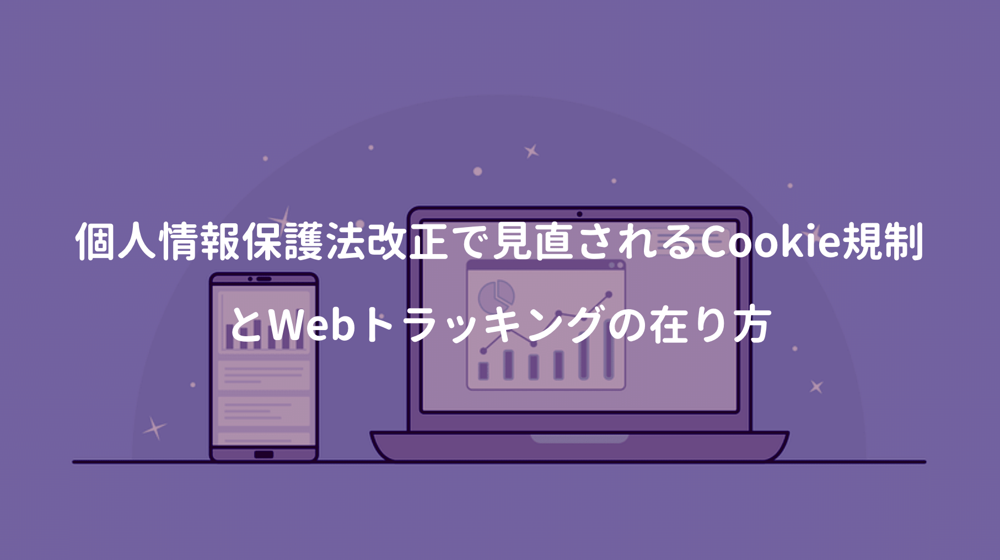

以前にリクルートキャリア提供のサービスで、個人を特定出来る情報を収集していたことが問題となっていた。プライバシーポリシーに不備があり、利用者から同意を得ていないかったのも大きな問題。

Web開発ではCookieによるセッション管理を行うケースが多いが、ChromeでサードパーティCookie廃止が決まり、携わっていたシステムにも影響が出てしまった。

■ **[Google Chromium blog（英語）](https://blog.chromium.org/2020/01/building-more-private-web-path-towards.html)**  

> Privacy Sandboxの取り組みでは、サードパーティCookie抜きで個人情報保護を前提に、広告に支えられた無料のインターネットが維持出来るとし、今後2年をかけてサードパーティCookieのサポート廃止を目指し、また透明性、選択肢、コントロールを実現出来るトラッキング手段を考えるとしている。

日本でも個人情報保護法が制定されているが、GDPRに比較すれば不明確な部分やグレーゾーンも多い。そのため個人情報を扱う企業では、世界標準（GDPR）に合わる動きも見られる。

## 個人情報保護法改正で示されたCookie規制

まず個人情報保護法では **個人データ** を以下のように定義されている。

> 個人情報とは、生存する個人に関する情報であって、氏名や生年月日等により特定の個人を識別することができるものをいいます。
>
> 個人情報には、他の情報と容易に照合することができ、それにより特定の個人を識別することができることとなるものも含みます。
>
> また「生年月日と氏名の組合せ」「顔写真」なども個人情報です。

Cookie自体は個人情報に当たらないが、SNS上にはユーザーアカウントが存在しているため、閲覧履歴が**サードパーティCookie**でSNS経由されると、得られた閲覧情報から個人に紐付け出来ることがある。

**個人情報保護法 いわゆる3年ごとの見直し 制度改正大綱（骨子）** では、今後このような情報の第三者提供を制限することが述べられており、利用者に対して、利用目的を情報提供すること、SNS等への情報提供を拒否する権利の保証、個人情報保護委員会に届け出等が義務付けられる。

■ **[個人情報保護法の改正で示されたCookie規制の方向性とは？ IIJが解説](https://internet.watch.impress.co.jp/docs/news/1225265.html)**

冒頭でも紹介したように、Google ChromeもサードパーティCookieが廃止予定で、サードパーティCookieを活用したシステム（アドテク / トラッキング）は大きな影響を受ける。

## サードパーティCookie廃止の背景

**[こちらの記事](https://blog.jxck.io/entries/2020-02-25/end-of-idyllic-cookie.html)** では、現状におけるCookieのユースケースや、サードパーティCookieが制限される背景、Privacy Sandboxの概念などが説明されていた。

本記事によれば、現状のCookieには様々なユースケース（セッション維持 / Credential / SSO / 広告 / Analytics）があり、問題の本質はCookieの仕様ではなく、ユースケース側であることに言及。

サービス提供側はDNT等を利用し、ユーザーからトラッキング拒否のヘッダを受け取った場合、トラッキングを外せば解決するが、仕様すらほぼ知られておらず、全く遵守もされなければ、普及もしない。これだけ広がったCookieという挙動は維持したいので、ユースケース側の問題を解決する手段として、使い方の如何に限らず、サードパーティCookieの全てをブロックする流れになってしまった。

あらゆるユースケースを担っていたCookieも、今後はファーストパーティCookieの役割に限定される。

第一に考えられるのが、企業がユーザーデータにアクセスする際に、ユーザーの同意を得るための施策が標準化されること、もう一つは **Privacy Sandbox** のアイディアを推奨。

仕様は不明だけど、APIはプライバシーに配慮し、利用者の許諾を取るような権限モデル、利用者がOpt-In/Outを選択出来るなど、事業者も新たなエコシステム構築を迫られるかもしれない。

## Cookie用途別の影響度

また **[こちらの記事](https://www.principle-c.com/column/marketing/google-chrome-third-party-cookie/#__1690877137.1585022027)** ではCookieの用途別に影響度を説明されていた。

トラッキングへの影響は限定的と述べられているが、携わっているシステムでもサードパーティCookieを活用したトラッキング処理が行われており、Chrome80対応でもろに影響を受けてしまった。

内容は発行されたトラッキングコードを複数サイトで管理するケースで、今までは同一ユーザーとしてCookie情報が維持されていたが、Chrome80対応でSameSite=NoneとSecure属性を指定し、Cookieをクロスサイトアクセスの対象であることを明示する必要がある。

■ **[新しいCookie設定 SameSite=None; Secure の準備を始めましょう](https://developers-jp.googleblog.com/2019/11/cookie-samesitenone-secure.html)**  

Chrome80以降では **SameSite=None; Secure** の設定済みのCookieのみ外部アクセスが可能。

## _gac Cookieの仕組み

では今後サードパーティCookieをどう対処すれば良いのか？

SafariへのITP導入など、サードパーティCookieの問題は以前から話題となっているが、一例としてGoogleは独自に_gac Cookieを使うことで一早く対処していたことを知った。

<a href="https://hb.afl.rakuten.co.jp/hgc/146fe51c.1fd043a3.146fe51d.605dc196/yomereba_main_20200410143756454?pc=http%3A%2F%2Fbooks.rakuten.co.jp%2Frb%2F15405689%2F%3Fscid%3Daf_ich_link_urltxt%26m%3Dhttp%3A%2F%2Fm.rakuten.co.jp%2Fev%2Fbook%2F" target="_blank" >ネット広告運用“打ち手”大全</a>
posted with <a href="https://yomereba.com" rel="nofollow" target="_blank">ヨメレバ</a>

寳洋平/辻井良太 インプレス 2018年04月    

<a href="https://hb.afl.rakuten.co.jp/hgc/146fe51c.1fd043a3.146fe51d.605dc196/yomereba_main_20200410143756454?pc=http%3A%2F%2Fbooks.rakuten.co.jp%2Frb%2F15405689%2F%3Fscid%3Daf_ich_link_urltxt%26m%3Dhttp%3A%2F%2Fm.rakuten.co.jp%2Fev%2Fbook%2F" target="_blank" >楽天ブックス</a>

<a href="https://www.amazon.co.jp/exec/obidos/asin/4295003204/kanon123-22/" target="_blank" >Amazon</a>

<a href="https://www.amazon.co.jp/gp/search?keywords=%E3%83%8D%E3%83%83%E3%83%88%E5%BA%83%E5%91%8A%E9%81%8B%E7%94%A8%E2%80%9C%E6%89%93%E3%81%A1%E6%89%8B%E2%80%9D%E5%A4%A7%E5%85%A8&__mk_ja_JP=%83J%83%5E%83J%83i&url=node%3D2275256051&tag=kanon123-22" target="_blank" >Kindle</a>
                              	  	  	  	  	

 

AdWordsとGoogleアナリティクスをリンクさせ、自動タグ設定を有効にしておけば、広告のURLにURLにGLINKが付与される。このGLINKを含む値情報を_gac Cookieに書き込むことで、広告のクリックをファーストパーティCookieとして保存しITPを回避。

将来どうなるか分からないけど、一技術者も個人情報の取扱いには一層注意が求められそうだ。

## 参考文献
■ [個人情報保護委員会](https://www.ppc.go.jp/)  
■ [個人情報保護法ハンドブック](https://www.ppc.go.jp/files/pdf/kojinjouhou_handbook.pdf)  
■ [個人情報保護委、“リクナビの内定辞退率”利用企業に行政指導　トヨタ、京セラなど35社](https://www.itmedia.co.jp/news/articles/1912/04/news155.html)  
■ [サードパーティクッキーって何だっけ？ 今さら聞けないHTTP Cookieのキホン](https://webtan.impress.co.jp/e/2017/10/03/27016)  
■ [Googleの「 プライバシーサンドボックス 」とは？：Cookieの代わりとされる5つのAPI](https://digiday.jp/platforms/wtf-googles-privacy-sandbox/)  
■ [3rd-party cookieのない2年後のアドテックに向けた動きまとめ　各陣営紹介編](https://note.com/martech/n/n0943251e38f4)  
