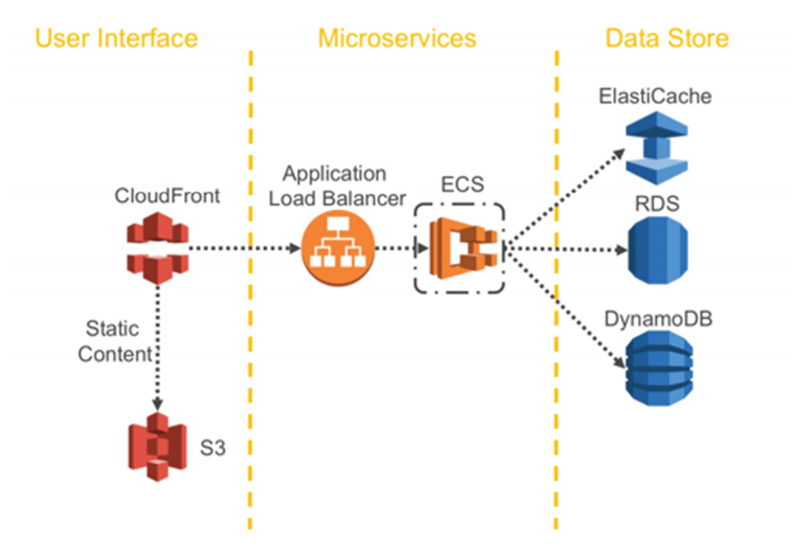

テクノロジーの力で新しい価値創造するため、デジタルトランスフォーメーション(DX)の推進が叫ばれているが、その取り組みの一つに **マイクロサービスアーキテクチャ** が挙げられている。

個人的な結論では、求められる技術領域も広く、多くの組織ではオーバーエンジニアリングであり、何となく流行っているからやってみよう♪的な軽い勢いで手を出すと痛い目にあうと思う。

<a href="https://hb.afl.rakuten.co.jp/hgc/146fe51c.1fd043a3.146fe51d.605dc196/yomereba_main_202003271340390723?pc=http%3A%2F%2Fbooks.rakuten.co.jp%2Frb%2F13770161%2F%3Fscid%3Daf_ich_link_urltxt%26m%3Dhttp%3A%2F%2Fm.rakuten.co.jp%2Fev%2Fbook%2F" target="_blank" rel="noopener noreferrer">マイクロサービスアーキテクチャ</a>
posted with <a href="https://yomereba.com" rel="nofollow noopener noreferrer" target="_blank">ヨメレバ</a>

SamNewman/佐藤直生 オライリー・ジャパン 2016年02月26日    

<a href="https://hb.afl.rakuten.co.jp/hgc/146fe51c.1fd043a3.146fe51d.605dc196/yomereba_main_202003271340390723?pc=http%3A%2F%2Fbooks.rakuten.co.jp%2Frb%2F13770161%2F%3Fscid%3Daf_ich_link_urltxt%26m%3Dhttp%3A%2F%2Fm.rakuten.co.jp%2Fev%2Fbook%2F" target="_blank" rel="noopener noreferrer">楽天ブックス</a>

<a href="https://www.amazon.co.jp/exec/obidos/asin/4873117607/kanon123-22/" target="_blank" rel="noopener noreferrer">Amazon</a>

<a href="https://www.amazon.co.jp/gp/search?keywords=%E3%83%9E%E3%82%A4%E3%82%AF%E3%83%AD%E3%82%B5%E3%83%BC%E3%83%93%E3%82%B9%E3%82%A2%E3%83%BC%E3%82%AD%E3%83%86%E3%82%AF%E3%83%81%E3%83%A3&__mk_ja_JP=%83J%83%5E%83J%83i&url=node%3D2275256051&tag=kanon123-22" target="_blank" rel="noopener noreferrer">Kindle</a>
                              	  	  	  	  	

 

ただマイクロサービスで語られている考え方は、システムアーキテクトやサービスを考える上で有用なので、実際にマイクロサービスに取り組まれている事例含め、自分なりに色々と考えてみた。

## マイクロサービスとは何か!?
オライリーの書籍では以下のような内容で説明されている。

> マイクロサービスは協調して動作する小規模で自律的なサービスであり、各サービス間の通信はネットワーク経由となる。
> 
> そのためサービスを適切にモデル化(ドメイン領域の分割)、API定義を行い、デプロイの対処(クラウドやコンテナ技術)、テスト、監視などの知見も必要となる。

文字だけでは全体像が理解しづらいので、以下記事のアーキテクチャ図を見ると良い。

■ [AWSにおけるマイクロサービス](https://d1.awsstatic.com/International/ja_JP/Whitepapers/MicroservicesOnAWS-V2_NT0829_SMO_MJ_EditSM_ProofSM_ProofNT.pdf)  
■ [コレ１枚でわかるマイクロサービス･アーキテクチャ](https://blogs.itmedia.co.jp/itsolutionjuku/2019/08/post_728.html)  

一般的なWebシステムでは、全ての機能(ユーザーインタフェース / ビジネスロジック等)が一まとまりになったモノリス構成となっている。リリース時は問題ないけど、長い間改修を続けていると、保守管理の工数も膨らみ、インフラの面でもスケーリングが難しかったり。

またビジネス環境が頻繁に変化している現代、従来のやり方では通用しなくなってきた。これらの課題を解決し、ビジネスをスケールさせるため、システム全体を互いに独立した機能部品に分割し、連結させて機能させるアーキテクチャの重要性が言われている。

ちなみにオライリーの書籍では、マイクロサービスのメリットを以下のように言っている。

①. 技術特異性 (サービス毎に適した技術が利用可能)

②. 回復性 (障害部分のみ切り離し可能)

③. スケーリング (高負荷部分のみサーバー増強可能)

④. デプロイの容易性 (デプロイ時間短縮)

⑤. 組織面の一致 (小規模チームによる生産性向上)

⑥. 合成可能性 (機能の再利用)

⑦. 交換可能にする最適化 (小規模なので必要に応じて書き換え可能)

独立した各機能は、APIでの相互通信(REST/gRPC)なので疎結合となり、また機能単位に小規模チームで運用するので生産性向上が見込め、ビジネスチャンスが広がると（分散システムには色んな落とし穴があるので、こんなに上手く行くとは思えないけど）

## どんな知識・スキルが求められるのか!?

マイクロサービスに限った話ではないが、当然ながらシステムに対するドメイン知識が必須。

また既存ドメインの適切な分割が求められ、その上で役立つのが DDDの考え方 であると話す。

ただ自分もエリック・エヴァンスのDDD本に目を通してみたが、自分の理解力も乏しく、一度や二度読んだくらいでは理解出来なかった。他の方に聞いても、いまいち分からんと ... 一部のシリコンバレーエンジニアも「DDDなんて知らん♪」と言う人までおり、この点は探り探りやるしかないらしい。

あとマイクロサービスの話が盛り上がる要因には 昨今のクラウド技術の発展 が大きいかなと思う。

例えば過去は困難だったインフラのスケーリング対応、分割された機能群同士を連携させるSQSやSNS等の登場、コンテナ技術(Docker/ECS/EKS/k8s)の発達、バックエンドとフロントエンドを分割する手法(S3/CloudFront)、各種サーバレス技術(Lambda)などあり、これらに精通することが求められる。

何かしらのクラウド技術(AWS/GCP/Azure)に精通したDevOps/SRE的なポジション、フロントエンドではReactやVueでのSPA開発経験、色々癖があると言われるサーバレス技術を使いこなせる人などは、採用のハードルが高い気がして厳しいのでは!?と個人的に感じる（GAFAや有名テック企業ではやれるんだろうけど、一般的なWeb企業ではちょっと現実的ではない気がする）

## サービス分割の方法

ちなみに書籍(マイクロサービスパターン)では、モノリスなドメインの分割方法を2つ紹介している。

Decompose by buisiness capability では、業務に対応させてサービスを定義する方法。

ただ主要なサービスの一つ一つを他サービスと連携させ過ぎると、プロセス間通信が過度になり、非効率になるケースもあるため、場合によってはサービスを結合する判断も必要。

Decompose by sub-domain では、ドメイン駆動設計に基づく分割方法。

正直この本を読んだくらいでは、理解力の乏しい私には、やっぱ理解が出来なかったけど...

<a href="https://hb.afl.rakuten.co.jp/hgc/146fe51c.1fd043a3.146fe51d.605dc196/yomereba_main_202004051411239735?pc=http%3A%2F%2Fbooks.rakuten.co.jp%2Frb%2F16239274%2F%3Fscid%3Daf_ich_link_urltxt%26m%3Dhttp%3A%2F%2Fm.rakuten.co.jp%2Fev%2Fbook%2F" target="_blank" >マイクロサービスパターン</a>
posted with <a href="https://yomereba.com" rel="nofollow" target="_blank">ヨメレバ</a>

クリス・リチャードソン/長尾高弘 インプレス 2020年03月    

<a href="https://hb.afl.rakuten.co.jp/hgc/146fe51c.1fd043a3.146fe51d.605dc196/yomereba_main_202004051411239735?pc=http%3A%2F%2Fbooks.rakuten.co.jp%2Frb%2F16239274%2F%3Fscid%3Daf_ich_link_urltxt%26m%3Dhttp%3A%2F%2Fm.rakuten.co.jp%2Fev%2Fbook%2F" target="_blank" >楽天ブックス</a>

<a href="https://www.amazon.co.jp/exec/obidos/asin/4295008583/kanon123-22/" target="_blank" >Amazon</a>

<a href="https://www.amazon.co.jp/gp/search?keywords=%E3%83%9E%E3%82%A4%E3%82%AF%E3%83%AD%E3%82%B5%E3%83%BC%E3%83%93%E3%82%B9%E3%83%91%E3%82%BF%E3%83%BC%E3%83%B3&__mk_ja_JP=%83J%83%5E%83J%83i&url=node%3D2275256051&tag=kanon123-22" target="_blank" >Kindle</a>
                              	  	  	  	  	

## マイクロサービスの欠点

マイクロサービスでは主に以下のような欠点が挙げられる。

①. サービスの適切な分割方法を見つけるのが難しい.

②. 分散システムは複雑であり、開発 / テスト / デプロイが難しくなる.

③. 複数のサービスにまたがって使われる機能のデプロイには綿密な調整が必要.

④. いつマイクロサービスアーキテクチャを採用すべきかの判断が難しい.

マイクロサービスでは分散システムの落とし穴にも気を配る必要もあり、こちらの記事が参考になる。

■ [マイクロサービスを蝕む負の力学](https://ota42y.com/blog/2019/06/25/microservices_vector/)

マイクロサービスでは、サービス間の依存関係が複雑になったり、通信コストが増える問題、機能間のレイテンシー問題、あと機能単位にDBを保持するので、データの整合性問題も考えられ、組織として十分な開発リソースや知見を持っているエンジニアが求められる（頭痛すぎる）

## 仮にやる場合はどうすれば!?

やらない理由ばかり並べても仕方ないので、仮にやる場合はどうすれば良いか調べてみた。

色んなテック企業が取り組まれているが、最初の取っ掛かりとして、以下事例が参考になると思う。

■ [ドメイン駆動設計パターンを使用してモノリスからマイクロサービスへ@Microsoft](https://docs.microsoft.com/ja-jp/azure/architecture/microservices/migrate-monolith)  
■ [マイクロサービス化デザインパターン@Graat](https://www.slideshare.net/yusuke/awsdevday-tokyo-2018)  
■ [実ビジネスのためのアプリケーションモダナイゼーション＠Graat](https://www.slideshare.net/yusuke/ss-171091581)  

主に以下の流れで、段階的にマイクロサービス化していく。

1. モノリスへの機能の追加を停止.

2. フロントエンドからバックエンドを分割.

3. モノリスを分解し、一連のマイクロサービスを分離.

**ストラングラーパターン** と呼ばれる手法で、切り出せる部分をAPIとして分割し、第二段階でフロントエントとバックエンドを分割していくやり方で、この点はAWSホワイトペーパーが参考になると思う。

■ [AWSにおけるクラウドネイティブ モダンアプリケーション開発と設計パターン](https://d1.awsstatic.com/whitepapers/ja_JP/modern-application-development-on-aws.pdf) 

第三段階をどこまでやるか(厳密にDB分割までする!?)は、現場毎に悩むしかないといったところか。

## その他の事例について

**■ Microsoft**  
❶ [破損対策レイヤーパターン](https://docs.microsoft.com/ja-jp/azure/architecture/patterns/anti-corruption-layer)  
❷ [マイクロサービスでの API ゲートウェイの使用](https://docs.microsoft.com/ja-jp/azure/architecture/microservices/design/gateway)  
❸ [ストラングラーパターン](https://docs.microsoft.com/ja-jp/azure/architecture/patterns/strangler)  

**■ Line**  
❶ [実践マイクロサービス ─ コンポーネント分割やトラブル回避の考え方をLINEの導入事例に学ぶ](https://employment.en-japan.com/engineerhub/entry/2018/10/09/110000)

**■ NGINX**  
❶ [マイクロサービスの紹介](https://www.nginx.com/blog/introduction-to-microservices/#version_b)  

**■ Cookpad**  
❶ [クックパッドとマイクロサービス](https://techlife.cookpad.com/entry/2014/09/08/093000)  
❷ [クックパッドにおける最近のMicroservices事例](https://techlife.cookpad.com/entry/2016/03/16/100043)  
❸ [Service Mesh and Cookpad](https://techlife.cookpad.com/entry/2018/05/08/080000)  
❹ [大きなRailsアプリケーションをなんとかしよう。まずは計測と可視化からはじめよう](https://techlife.cookpad.com/entry/2018/06/08/080000)  
❺ [クックパッド基幹システムのmicroservices化戦略 〜お台場プロジェクト1年半の軌跡〜](https://techlife.cookpad.com/entry/2018-odaiba-strategy)  
❻ [100万行オーバーのモノリシックRailsアプリをマイクロサービス化したクックパッドの手順](https://employment.en-japan.com/engineerhub/entry/2019/09/17/103000)  
❼ [AWS 導入事例](https://aws.amazon.com/jp/solutions/case-studies/cookpad/)  
❽ [How Microservices are linked at Cookpad](https://speakerdeck.com/adorechic/how-microservices-are-linked-at-cookpad)  

**■ freee**  
❶ [freeeのマイクロサービス基盤とWire導入](https://developers.freee.co.jp/entry/service-infra-and-wire)  
❷ [AWS導入事例](https://aws.amazon.com/jp/solutions/case-studies/freee/)  
❸ [OSSを活用した、マイクロサービスアーキテクチャの課題を解決する取り組みとは](https://codezine.jp/article/detail/10817)  
❹ [Kubernetes×AWSで複雑化したマイクロサービス基盤を改善](https://codezine.jp/article/detail/11863)  
❺ [Kubernetes on AWS/EKSベストプラクティス](https://speakerdeck.com/mumoshu/eksbesutopurakuteisu2019-dot-2-number-jawsdays)  
❻ [gRPCでインターフェースを再整理してからサービスを分割─freeeの段階的なマイクロサービス戦略](https://employment.en-japan.com/engineerhub/entry/2020/03/30/103000)  

**■ ドリーム・アーツ**  
❶ [マイクロサービス・コンテナに全面移行するにはどうすればいいか?](https://codezine.jp/article/detail/11415)  

## 参考記事 
■ [REST APIの設計で消耗している感じたときのgRPC入門](https://qiita.com/disc99/items/cfca50a32240284578bb)  
■ [マイクロサービスバックエンドAPIのためのRESTとgRPC](https://www.slideshare.net/disc99_/apirestgrpc)  
■ [マイクロサービスにおけるWeb APIスキーマの管理 ─ GraphQL、gRPC、OpenAPIの特徴](https://employment.en-japan.com/engineerhub/entry/2019/08/22/103000#gRPC--%E5%AF%BE%E5%BF%9C%E3%81%97%E3%81%A6%E3%81%84%E3%82%8B%E8%A8%80%E8%AA%9E%E3%81%AA%E3%82%89%E9%96%8B%E7%99%BA%E3%82%84%E9%80%9A%E4%BF%A1%E5%8A%B9%E7%8E%87%E3%81%8C%E8%89%AF%E3%81%84)  
■ [マイクロサービス移行を阻むレガシーとの戦い方](https://www.atmarkit.co.jp/ait/articles/2003/03/news003.html)  
■ [おっさんがACIDとかBASEとかまとめておく](https://qiita.com/suziq99999/items/2e7037042b31a77b19c8)  
■ [「メタデータ」「NoSQL」「CAP定理」を理解する](https://www.atmarkit.co.jp/ait/articles/1703/01/news204_2.html)  
■ [「マイクロサービスに出遅れた」ところは、先人から何を学べるか](https://www.atmarkit.co.jp/ait/articles/1909/13/news012.html)  
■ [マイクロサービスが注目される理由　導入検討に向けて気を付けるべきポイント](https://www.atmarkit.co.jp/ait/articles/1910/18/news005.html)  
■ [創業時はJava 1.3、JDBC、JSPで構築――ECサイト「Oisix」がマイクロサービス化を進めたワケ](https://www.atmarkit.co.jp/ait/articles/1911/25/news009.html)  
■ [マイクロサービスアーキテクチャにおける「サービス配置」の考え方](https://www.atmarkit.co.jp/ait/articles/1912/17/news007.html)  
■ [新規構築や移行時のリスクを軽減、「ストラングラーパターン」とは？](https://www.atmarkit.co.jp/ait/articles/2001/23/news003.html)  
■ [マイクロサービス移行を阻むレガシーとの戦い方](https://www.atmarkit.co.jp/ait/articles/2003/03/news003.html)  
■ [マイクロサービス移行後のテスト、CI/CD、運用監視で現場が疲弊しないためのポイント](https://www.atmarkit.co.jp/ait/articles/2003/17/news004.html)  
■ [Kubernetes architecture](https://github.com/kubernetes/kubernetes/blob/release-1.3/docs/design/architecture.md)  
■ [数時間で完全理解！わりとゴツいKubernetesハンズオン！！](https://qiita.com/Kta-M/items/ce475c0063d3d3f36d5d)  
■ [KubernetesとNode.jsでマイクロサービスを作成する](https://qiita.com/reireias/items/6a78d6b8df781a76f94f)  
■ [Kubernetesの自前運用は難しい？はてなの撤退事例](https://www.atmarkit.co.jp/ait/articles/1911/08/news009.html)  
■ [AWS コンテナサービス「Fargate」「ECS」「EKS」の違いを解説](https://xn--o9j8h1c9hb5756dt0ua226amc1a.com/?p=2025)  
■ [DockerでEC2、ECS、EKSの運用想定まとめ](https://qiita.com/dich1/items/fca1a46f9a71721359e4)  
■ [AWSはなぜ、ECSがあるのにKubernetesのサービスを始めたのか、コックロフト氏に聞いた](https://www.atmarkit.co.jp/ait/articles/1806/11/news029.html)  
■ [コンテナーとは?Kubernetesとは?導入や運用、ユースケースを解説](https://codezine.jp/article/detail/11336)  
■ [今さら人に聞けないKubernetesとは?](https://qiita.com/MahoTakara/items/85096f8b2632c802ab22)  
■ [Microservices Patterns を読んで(1)](https://kencharos.hatenablog.com/entry/2019/02/24/233148)  