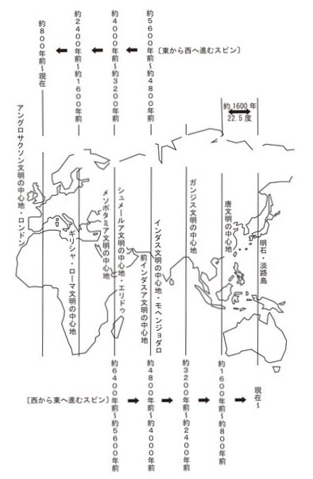
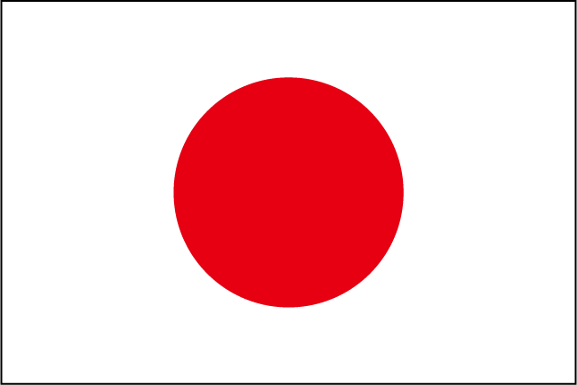

少し前にガイアの法則という随分ブッ飛んだ本に出会った。

著者・千賀一生さんが、古代メソポタミアの都市エリドゥで経験した神秘的な話が綴られており、歴史の時間軸を等分割すると、文明は1600年(それぞれ800年の隆盛と衰退)のサイクルがあり、世界の中心となる最も栄えた文明は東洋と西洋で800年ごとに入れ替わっていると話す（ロマン感半端ない）

非常に内容が濃く、色々興味深い事盛り沢山だが、特に気になったのが円形シンボリズムの話。

西洋文化に浸りきった私には非常に新鮮に感じられた。

<a href="https://www.amazon.co.jp/exec/obidos/asin/490502790X/kanon123-22/" target="_blank"  rel="noopener noreferrer">ガイアの法則[I] 日本中枢[135度文明]への超転換(超☆きらきら)</a>
posted with <a href="https://yomereba.com" rel="nofollow noopener noreferrer" target="_blank">ヨメレバ</a>

千賀 一生 ヒカルランド 2012-02-02    

<a href="https://www.amazon.co.jp/exec/obidos/asin/490502790X/kanon123-22/" target="_blank"  rel="noopener noreferrer">Amazon</a>

<a href="https://www.amazon.co.jp/exec/obidos/ASIN/B01CDXVM9O/kanon123-22/" target="_blank"  rel="noopener noreferrer">Kindle</a>

<a href="https://hb.afl.rakuten.co.jp/hgc/146fe51c.1fd043a3.146fe51d.605dc196/yomereba_main_201811070020316357?pc=http%3A%2F%2Fbooks.rakuten.co.jp%2Frb%2F11534158%2F%3Fscid%3Daf_ich_link_urltxt%26m%3Dhttp%3A%2F%2Fm.rakuten.co.jp%2Fev%2Fbook%2F" target="_blank"  rel="noopener noreferrer">楽天ブックス</a>
                        	  	  	  	  	

<a href="https://www.amazon.co.jp/exec/obidos/asin/4905027918/kanon123-22/" target="_blank"  rel="noopener noreferrer">ガイアの法則[II] 中枢日本人は[アメノウズメ]の体現者となる(超☆きらきら)</a>
posted with <a href="https://yomereba.com" rel="nofollow noopener noreferrer" target="_blank">ヨメレバ</a>

千賀 一生 ヒカルランド 2012-02-02    

<a href="https://www.amazon.co.jp/exec/obidos/asin/4905027918/kanon123-22/" target="_blank"  rel="noopener noreferrer">Amazon</a>

<a href="https://www.amazon.co.jp/exec/obidos/ASIN/B01CDXVMCQ/kanon123-22/" target="_blank"  rel="noopener noreferrer">Kindle</a>

<a href="https://hb.afl.rakuten.co.jp/hgc/146fe51c.1fd043a3.146fe51d.605dc196/yomereba_main_201811070018417341?pc=http%3A%2F%2Fbooks.rakuten.co.jp%2Frb%2F11534159%2F%3Fscid%3Daf_ich_link_urltxt%26m%3Dhttp%3A%2F%2Fm.rakuten.co.jp%2Fev%2Fbook%2F" target="_blank"  rel="noopener noreferrer">楽天ブックス</a>
                        	  	  	  	  	

## 東洋と西洋の違い

円形シンボリズムを知るために、東洋と西洋の違いを知ると尚理解が深まった気がする。

この点は飲茶さんの「史上最強の哲学入門」にて、東西の歴史観の違いが紹介されていた。

POINT**西洋における歴史観は「過去から未来へ」と一直線に進むという考え方。**

POINT**東洋における歴史観は「輪」のように永遠に巡っているという考え方。**

西洋哲学の場合、ソクラテス以来、人類の歴史には目指すべき唯一真理があると考え、常に前者(近代哲学における中世哲学、現代哲学における近代哲学)の批評から生まれているので確かに直線的かも。

東洋哲学では輪のように永遠に巡るので、細かい年表などは残っておらず、細かい内容より象徴的な内容を抽出し、新しい歴史的事件が起こる度に、物語を書き換える…つまり円的な思想。

時間は輪のように永遠に続くと考えれば、膨大な書物(細かい年表など)など誰も読まないだろうし、象徴的な部分さえ書き出せば、より物語は洗練され、人間の本質が色濃く表れるだろうと発想で、東洋哲学では「輪=円」の発想が至る所に残っている。

<a href="https://www.amazon.co.jp/exec/obidos/asin/4309414133/kanon123-22/" target="_blank"  rel="noopener noreferrer">史上最強の哲学入門 (河出文庫)</a>
posted with <a href="https://yomereba.com" rel="nofollow noopener noreferrer" target="_blank">ヨメレバ</a>

飲茶 河出書房新社 2015-11-05    

<a href="https://www.amazon.co.jp/exec/obidos/asin/4309414133/kanon123-22/" target="_blank"  rel="noopener noreferrer">Amazon</a>

<a href="https://www.amazon.co.jp/exec/obidos/ASIN/B01JA1LEZO/kanon123-22/" target="_blank"  rel="noopener noreferrer">Kindle</a>

<a href="https://hb.afl.rakuten.co.jp/hgc/146fe51c.1fd043a3.146fe51d.605dc196/yomereba_main_201811070017477158?pc=http%3A%2F%2Fbooks.rakuten.co.jp%2Frb%2F13441671%2F%3Fscid%3Daf_ich_link_urltxt%26m%3Dhttp%3A%2F%2Fm.rakuten.co.jp%2Fev%2Fbook%2F" target="_blank"  rel="noopener noreferrer">楽天ブックス</a>
                        	  	  	  	  	

## 円的空間がもたらす関係性

円的空間がもたらす力について、意識レベルで解説されており、例えば人と人が向かい合う直線的な関係にある場合、相対観念(私とあなた)が形成されやすく、2つの意識が芽生えやすいと指摘。

■ 権力者にへりくだることで関係を築こうとする意識

■ 疑問が生じた場合、権威者に対抗しようとする意識

ちなみに人の意識には顕在意識と潜在意識があり、顕在意識はたったの3%で殆ど潜在意識なので、意識せずともそのような考えに至る事があるのかもしれない。

それに対して円的空間では、人が向かい合う方向性(角度)が全て異なっており、隣に座る人はみな同一対象へと向かう共感者として意識される（古代の先人達は、その点をよく理解し、住居・生活環境も円的シンボリズムを大切にしていたとか）

POINT**意識的にしろ無意識的にしろ、人間の根本的な意識の優位性は空間で決まる!!**

そういえば先進国首脳会議では各国の代表が円卓で議論されている。

## 羽根つきにみる調和と共動

最近急に強くなって話題に挙がるバドミントン競技。

このスポーツは互いにコートの広さが同一など一定のルールが設けられており、何の違和感も感じませんでしたが、古来の文化である羽根つきでは、広さなど条件が設けられていない。

POINT**両者が向かい合って羽を打ち合うが、前者は競争、後者はいかに二人で長くつけるかの調和。**

羽根つきをやった経験が無いから意識すらしたことなかったけど、競争も大切であるのは前提として、この調和こそ、理想的な宇宙的人間観による世界形成だと紹介されている。

## 国旗に隠された民族性

国旗には国民性や歴史が表れると言われるが、日本の国旗は日の丸で円形。

西洋の影響力が強いイギリスやアメリカは国旗には直線的な感性が表面化。

今改めて各国の国旗を眺めてみると面白いけど、西洋ではキリスト教なので十字をモチーフに、イスラム圏では月のシンボルマークが多かったり、確かに国民性が色濃く現れているように見受けられる。

ちなみに十字のシンボリズムは縦横の線で宇宙の陰陽の働きを表し、白黒を明確にするので、論理的思考や分析力に優れた性質を持っている（西洋科学の歴史を見れば確かに合ってる気がする）

日本は昔倭の国だったし、多民族に比べ、円形シンボリズムが色濃く表れてる？

とにかくガイアの法則は奥が深すぎて、一度や二度読んだだけで全容は理解出来ないが、読み直す度に新しい発見があり、忘れている何かを知れるような本な気がする。