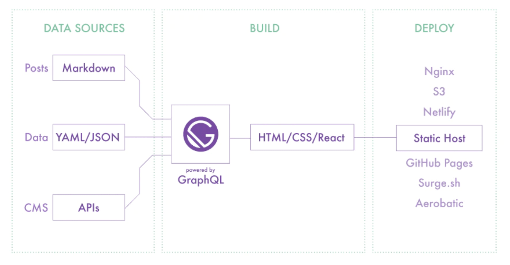

WordPress自体は大変有用なオープンソースだと思うけど、CMSが孕むセキュリティーの問題、コストに難があったり、表示速度の遅さ（インフラ知識があれば、ある程度は改善出来るけど）など、散々無料で使わせてもらっているのに、何かと不満を持っていた。

そんな背景もあって、以前より話題となっていた静的サイトジェネレーターのGatsby.jsを使ってみたが <span style="color: crimson; font-weight: bold;">プラグインも豊富で「簡単・便利・カッコいい」の三拍子が揃っているし、何よりMarkdownでサクサク書けて、CMSより爆速で表示されることを実感できた。</span>



Gatsby.js自体がReactとGraphQLをベースに構築されているので、当然JavaScriptやReactの知識や、yarnでのモジュール管理が求められる。ただプラグインは豊富で、機能拡張は簡単に出来るので、構築する上で役立ったプラグインや参考記事を紹介。

## gatsby-imageでの画像表示

Gatsby.jsの初心者殺しと言われる最初の関門は以下の記事が参考になった。

■ [GatsbyJSのimageを使ってみよう@Crieit](https://crieit.net/posts/GatsbyJS-image)

マークダウン上では楽に画像表示が可能だが、Gatsby.js上ではかなり癖がある模様。

## カテゴリとタグの実装

こちらの記事が参考になった。

■ [GatsbyJSで作っているブログにタグ機能を導入した@キクナントカドットコム](https://kikunantoka.com/2019/12/01--install-tags/)

Markdown記述 → gatsby-node.jsの追記 → templates作成の順に作れば、タグでの検索が可能。

タグ検索さえ実装出来れば、カテゴリ検索もほぼ同様なので、簡単に実装出来ると思われる。


## サイトマップ作成

gatsby-config.jsにsiteUrlを設定することで、最低限のサイトマップが作成される。

```js
siteMetadata: {
  siteUrl: `https://hogehoge.com`,
},
plugins: [`gatsby-plugin-sitemap`]
```

## Youtubeの埋め込み

gatsby-config.jsにgatsby-remark-embed-youtubeを追加。

```js
{
  resolve: `gatsby-transformer-remark`,
    options: {
      plugins: [
        {
          resolve: "gatsby-remark-embed-youtube",
          options: {
            width: 800,
            height: 400
          }
        },
        {
          resolve: `gatsby-remark-responsive-iframe`,
          options: {
            wrapperStyle: `margin-bottom: 1.0725rem`,
          },
        },
      ],
    },
},
```

マークダウンファイルには以下のフォーマットで追記。

```bash
`youtube:https://www.youtube.com/embed/XXXXXXXXX`
```

## ローディングバー

gatsby-config.jsにgatsby-plugin-nprogressを追加。

```js
plugins: [
  {
    resolve: `gatsby-plugin-nprogress`,
    options: {
      color: `#444`,
      showSpinner: false,
    },
  },
]
```

## Firebaseへのデプロイ

ローカル環境からFirebaseへのデプロイ手順。
```shell
yarn global add firebase-tools
firebase login
firebase init
firebase deploy
```

## 参考にさせて頂いたブログ

■ [Gatsby.jsの公式HP](https://www.gatsbyjs.org/)  
■ [Takumon Blog](https://takumon.com/)  
■ [suzukalight.com](https://suzukalight.com/)  
■ [Crieit](https://crieit.net/tags/Gatsby)  
■ [Corylog](https://www.corylog.com/)  
■ [キクナントカドットコム](https://kikunantoka.com/)  
■ [Nakamu Blog](https://blog.nakamu.life/)  
■ [RIGHTCODE](https://rightcode.co.jp/blog)  