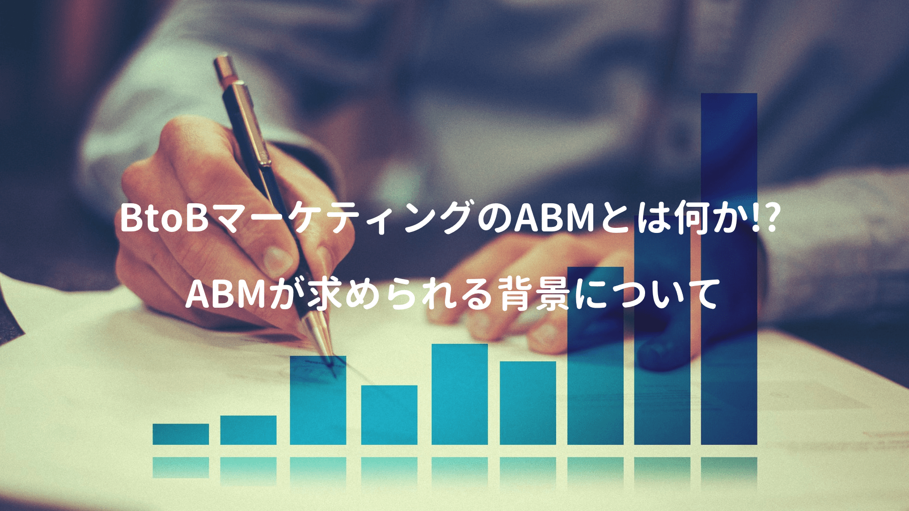

以前私にBtoBマーケティングを教えてくれた方から、シンフォニーマーケティングの **庭山一郎さん** を薦められ、同氏が執筆されたABM（アカウントベースドマーケティング）の書籍を読んでみた。

<a href="https://hb.afl.rakuten.co.jp/hgc/g0000015.o51y41f2.g0000015.o51y5a32/kaereba_main_202003301719104955?pc=https%3A%2F%2Fproduct.rakuten.co.jp%2Fproduct%2F-%2F9b0ab3cf0022fd40891fd61b16cb9a3c%2F&m=http%3A%2F%2Fm.product.rakuten.co.jp%2Fproduct%2F9b0ab3cf0022fd40891fd61b16cb9a3c%2F" target="_blank" rel="noopener noreferrer">究極のＢｔｏＢマ-ケティングＡＢＭ アカウントベ-スドマ-ケティング  /日経ＢＰ/庭山一郎</a>
posted with <a href="https://kaereba.com" rel="nofollow noopener noreferrer" target="_blank">カエレバ</a>

<a href="https://hb.afl.rakuten.co.jp/hgc/146fe51c.1fd043a3.146fe51d.605dc196/kaereba_main_202003301719104955?pc=https%3A%2F%2Fsearch.rakuten.co.jp%2Fsearch%2Fmall%2F%25E7%25A9%25B6%25E6%25A5%25B5%25E3%2581%25AEBtoB%25E3%2583%259E%25E3%2583%25BC%25E3%2582%25B1%25E3%2583%2586%25E3%2582%25A3%25E3%2583%25B3%25E3%2582%25B0%2F-%2Ff.1-p.1-s.1-sf.0-st.A-v.2%3Fx%3D0%26scid%3Daf_ich_link_urltxt%26m%3Dhttp%3A%2F%2Fm.rakuten.co.jp%2F" target="_blank" rel="noopener noreferrer">楽天市場</a>

<a href="https://www.amazon.co.jp/gp/search?keywords=%E7%A9%B6%E6%A5%B5%E3%81%AEBtoB%E3%83%9E%E3%83%BC%E3%82%B1%E3%83%86%E3%82%A3%E3%83%B3%E3%82%B0&__mk_ja_JP=%E3%82%AB%E3%82%BF%E3%82%AB%E3%83%8A&tag=kanon123-22" target="_blank" rel="noopener noreferrer">Amazon</a>

 

日本はマーケティング無しで経済大国に上り詰めたので、米国に比べて15年程度遅れているのが実情。

しかし昨今のグローバル時代では、マーケティング無しに生き残ることが非常に困難であり、そのためBtoBマーケティング業界では今、ABMの活用が求められているそうだ。

日本がマーケティング無しに経済大国に上り詰めた歴史的背景、マーケティングの基礎知識、ABMやMAツール、BtoBマーケティングの包括的な知識が得られる一冊であることは間違いない。

## 日本のマーケティングが遅れている理由

なぜ日本はマーケティング無しに、世界第2位の経済大国に上り詰めることが出来たのか!?

主な要因として 戦後の急成長する内需と、為替の恩恵を受けたことにある が挙げられる。

> 日本は第二次世界大戦での敗戦による復興需要と朝鮮戦争の特需が重なり、一気に上昇気流に乗ることが出来ました。さらに高度経済成長の中で家電をそろえ、3〜4年おきに車を買い替え、子供に高等教育を受けさせるなど、巨大で旺盛な国内内需が企業の成長を支えたのです。マーケティングはそれほど重要ではありません。
>
> 良いものを作れば売れる時代が続いたのです。
> 
> また日本は世界有数の工業国であり、その技術力で世界最高レベルの工業製品を、為替によって非常に安い価格で輸出できたことで、日本製品はマーケティングの助けが無くても飛ぶように売れました。

しかしその時期も、2008年のリーマンショックを期に完全に終了し、今やマーケティング無しでは、成長どころか存続すら危ういと言われている。

## ABMはマーケティングと営業を繋ぐもの

本書ではABMを以下のように定義している。

> 全社の顧客情報を統合し、マーケティングと営業の連携によって、定義されたターゲットアカウントからの売り上げ最大化を目指す戦略的マーケティング。

まずABMの重要性が叫ばれる背景に、マーケティングと営業の間にある深い溝が関係している。

| マーケターが重要視する指標 | 営業が重要視する指標 |
| ---- | ---- |
| リードの行動 | その人の所属している企業 |
| リードの数 | リードの質 |
| Webへのアクセス | 予算を確保しているか |
| 未来への種まき | 今期中に刈り取れるもの |

そのためマーケターがコストを掛けて案件創出しても、営業はフォローしないので不信に感じ、営業側も **「なぜもっと良質な案件を創れないのか?」** とお互いの溝は深まるばかり。

しかしABMでは、営業がフォローしたい企業を最優先でリストアップするため、SALとして受け入れられる率は一気に上がり、両者の関係を密に連携出来ることが期待される。

## デマンドジェネレーションの考え方

またBtoBマーケティングの基礎理論である **Demand Waterfall** が紹介されていた。

①. 見込み客データの収集

②. リードナーチャリング（啓蒙・育成）

③. スコアリング（絞り込み）

 

まずWebやイベント、コールドコールなどで集めた名刺をデジタル化し、名寄せや営業対象外排除などのデータマネージメントを実施。その際に名寄せや営業対象外排除など、データマネージメント実施。

**リードナーチャリング** では、メールマガジンやWeb、動画、オンラインセミナー、ホワイトペーパー、チャット、そしてSNS、電話など多くのチャネルと、ターゲットに最適化されたコンテンツを利用。

最後の **スコアリング** では、ファネルの中にいる全員を、属性情報と行動履歴の2軸でスコアリングし、有望と思われる見込み客リストを抽出し、営業部門へ連携（営業が受け入れるとSALとなる）

これがMAでリードを収集し、温め、営業へ連携する迄の大まかな流れとなる。

## デマンドジェネレーションの進化系がABM

本書ではデマンドジェネレーションの進化系がABMとしている。

> 一つの湾のような巨大な養殖イケスの中に船を入れ、養殖している魚の中から獲りたい魚だけを銛で打つようなもの。こうすれば外洋を走り回るような効率の悪さも無く、必要とする量と質の魚だけを収穫できる（デマンドジェネレーションを定置網、ABMを銛 と喩えることができる）

昔は果てしない大海原でも大物に出会える時代だったが、現代は1週間海の上を走り回っても、魚影すら見かけない時代なので、MAをプラットフォームにしたデマンドセンターを確立させ、ABMの銛でターゲットを獲得することが大切だとしている。

## 8つのデータマネージメントプロセス

実際にMAを活用するためにはどうすれば良いのか!?

まず社内に眠っている名刺を集めれば、簡単にABMが始められる訳ではなく、8つのプロセスを踏む必要があること（日本のデータマネージメントは世界で最も難度が高いらしく、殆どの失敗原因がコレ）

①. ファイルの統合

②. 個人データの名寄せ

③. 企業データの名寄せ

④. 企業と個人の紐付け

⑤. 営業対象外、競合のフラグ処理(論理削除)

⑥. 企業の属性情報付与

⑦. 製品ごとのターゲットアカウントのフラグ

⑧. 法令要件の整備

 

字面にすると何てことない様に見えるけど、特に①〜③はコストがかかり、ファイル形式も多種多様なので、マーケターがリード情報を都度登録するのは大変な手間となる。

またリードや企業の名寄せはある程度システム化も可能だが、精度を保った名寄せは難しく、どうしても手作業が発生してしまう。企業データも自身の会社名を正式名称で登録しない人も多く、表記揺れで名寄せも難しい（かと言って対処しないと精度が下がり、使い物にならない）

## ABMで成果を出せる企業とは!?

ABMは一企業に複数のコンタクトポイントがあり、コンタクト履歴や属性情報を統合的に管理、新規を戦略的に攻略 + 既存を戦略的に守る手法なので、以下のケースには適していないと言われている。

・購買に関わる人が1〜3人の経営幹部で決まる中小・零細企業の市場

・大学の研究室のように、購買プロセスが確立した予算申請がガラス張りとなっている市場

・売っている商材が単品に近く、一つの部門の決まった担当者にしかビジネスチャンスが無い

 

ちなみに本書では、成果が出せる企業として、日本では 中堅以上の規模感で従業員数は数百人以上で売上100億円以上の企業  と紹介されているが、そもそもマーケ人材が乏しいので、ABM以前にMAを使いこなせる企業も少ない気がする。

## 参考文献
■ [今一番使われているMAは1位：Pardot、2位：BowNow、3位：Marketoという結果に](https://mtame.jp/martec/MA_introduction/)  
