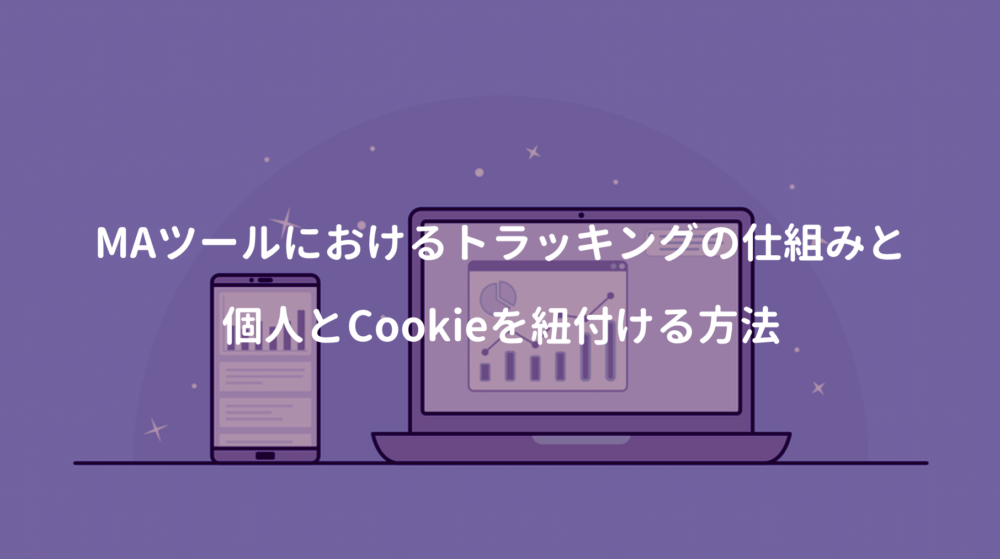

以前取引先のクライアントに、BtoBマーケティングの業務理解を深めるにはどうすれば？と尋ねた際、シンフォニーマーケティングの庭山さんと、Nexalの上島千鶴さんを薦められた。

上島さんはナーチャリングの概念を広めた第一人者と紹介されるが、複数の外資系IT企業に勤めた経歴から、リードビジネスは勿論、MAツールのシステム的な知見もお持ちのお方。

本書ではマーケティングのKPIを中心に解説しているが、今回はMAツールの技術周りを集中的に一読。

<a href="https://hb.afl.rakuten.co.jp/hgc/146fe51c.1fd043a3.146fe51d.605dc196/yomereba_main_202004041645517401?pc=http%3A%2F%2Fbooks.rakuten.co.jp%2Frb%2F14291219%2F%3Fscid%3Daf_ich_link_urltxt%26m%3Dhttp%3A%2F%2Fm.rakuten.co.jp%2Fev%2Fbook%2F" target="_blank" >マーケティングのKPI</a>
posted with <a href="https://yomereba.com" rel="nofollow" target="_blank">ヨメレバ</a>

上島千鶴 日経BP 2016年06月20日    

<a href="https://hb.afl.rakuten.co.jp/hgc/146fe51c.1fd043a3.146fe51d.605dc196/yomereba_main_202004041645517401?pc=http%3A%2F%2Fbooks.rakuten.co.jp%2Frb%2F14291219%2F%3Fscid%3Daf_ich_link_urltxt%26m%3Dhttp%3A%2F%2Fm.rakuten.co.jp%2Fev%2Fbook%2F" target="_blank" >楽天ブックス</a>

<a href="https://www.amazon.co.jp/exec/obidos/asin/4822237613/kanon123-22/" target="_blank" >Amazon</a>

<a href="https://www.amazon.co.jp/gp/search?keywords=%E3%83%9E%E3%83%BC%E3%82%B1%E3%83%86%E3%82%A3%E3%83%B3%E3%82%B0%E3%81%AEKPI&__mk_ja_JP=%83J%83%5E%83J%83i&url=node%3D2275256051&tag=kanon123-22" target="_blank" >Kindle</a>
                              	  	  	  	  	

 

さて、デマンドジェネレーション（マーケターが案件を創出し、営業へ引き渡すまで）を円滑に行うためには、何よりリードの管理が大切になるが、上島さんはリードを次のように定義している。

POINT**成約に繋がる、または取引成立の可能性が少しでも見込める個客(BtoBは組織内個人) ≒ 個客**

BtoBマーケティングの目的である 商談の創出 では、展示会等で集めた名刺情報をMAツールでデジタル化し、お礼メールやフォーム登録によって、個人とCookieを紐づけてトラッキング。

更にナーチャリング活動後に営業へ引き渡し、SFAやCRMで案件管理するのが一般的な流れとなる。

（[実態](/post-31/)としては、マーケターと営業の間には大きな溝が生まれがちで、マーケターがMAツールで案件創出しても営業が追わなかったり、営業がSFAに案件を登録するだけでも、責任者から結果を追求されるので、導入してもSFAが活用されないという話は、結構あるあるらしい）

まず疑問に思ったのは、リード管理する仕組みがどうなっているのか!? だった。

一般的にはWebサイトのヘッダー上に、JavaScriptの解析タグを貼り付けることで、Cookieを活用したトラッキングが行われている（昨今は個人情報の観点から問題視されているけど）

ちなみに解析タグを貼り付けるだけでも、次のような情報が取れる。

①. どの端末でアクセスしたか

②. どの企業から閲覧されているか

③. いつ、どのページを、何秒見たか（閲覧時刻/滞在時間/直帰率）

④. 何人来たか

⑤. どこ経由で自社サイトに来たか.

⑥. 検索エンジンで入力されたキーワード（検索エンジンに未ログインの場合のみ）

⑦. サイト内検索ワード.

 

私が関わっているMAでは、上記以外にもページの読了率やメール開封率も解析されていた。

サイトを訪問するだけではUnknowユーザーだが、個人のメールアドレスで行動履歴を追跡するため、Cookieを紐づける方法には2種類（フォーム経由とメール経由）が考えられる。

一つ目がフォーム経由で、サイトに設置されているホワイトペーパーをダウンロードする際、必要情報（メールアドレス等）を入力すると紐付けが可能となり、他にはサンクスメール等のメール中にあるリンクURLを踏んでもらうことでCookieと紐付けができる。

しかし上島さん自身も、正直合法なやり方なのかは判断出来ず、利用者はこんな使われ方は想定していないので、オプトアウトやCookie削除方法の説明などフォローは最低限必要と言われていた。
