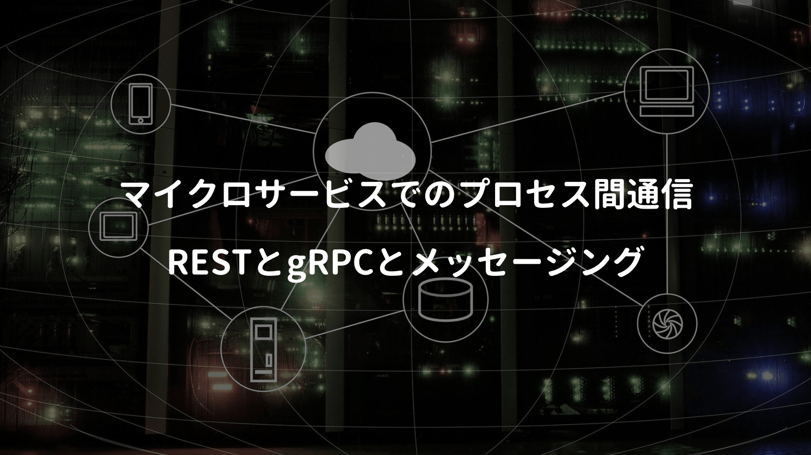
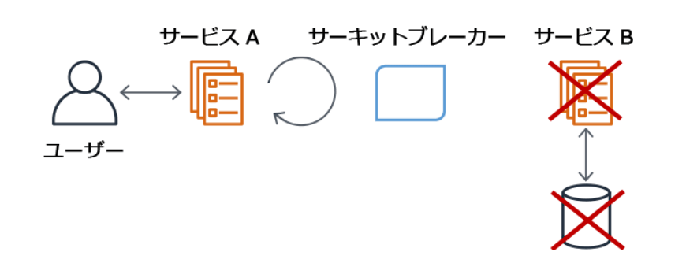
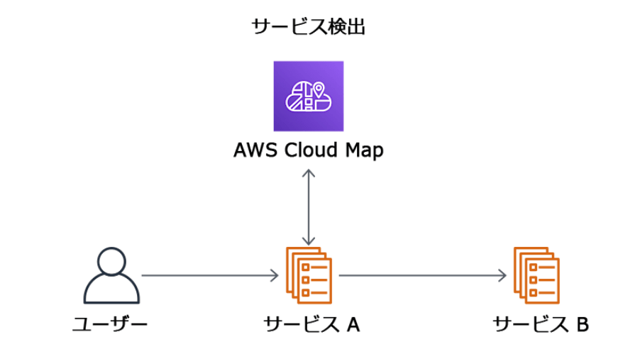

マイクロサービスアーキテクチャは、考慮すべき技術領域がとにかく広い。

その中でも特に難しいのがドメイン分割だと言われる。

モノリスなアプリケーションを複数のドメインに分割したら、APIで相互接続させる必要がある。

モノリスなら関数呼び出しで済むが、分散システムでは依存関係が複雑になりがちだ。

しかし最近はクラウド技術の発展で、これらを解決する豊富なマネージドサービスが生まれている。

<a href="https://hb.afl.rakuten.co.jp/hgc/146fe51c.1fd043a3.146fe51d.605dc196/yomereba_main_202004051411239735?pc=http%3A%2F%2Fbooks.rakuten.co.jp%2Frb%2F16239274%2F%3Fscid%3Daf_ich_link_urltxt%26m%3Dhttp%3A%2F%2Fm.rakuten.co.jp%2Fev%2Fbook%2F" target="_blank" >マイクロサービスパターン</a>
posted with <a href="https://yomereba.com" rel="nofollow" target="_blank">ヨメレバ</a>

クリス・リチャードソン/長尾高弘 インプレス 2020年03月    

<a href="https://hb.afl.rakuten.co.jp/hgc/146fe51c.1fd043a3.146fe51d.605dc196/yomereba_main_202004051411239735?pc=http%3A%2F%2Fbooks.rakuten.co.jp%2Frb%2F16239274%2F%3Fscid%3Daf_ich_link_urltxt%26m%3Dhttp%3A%2F%2Fm.rakuten.co.jp%2Fev%2Fbook%2F" target="_blank" >楽天ブックス</a>

<a href="https://www.amazon.co.jp/exec/obidos/asin/4295008583/kanon123-22/" target="_blank" >Amazon</a>

<a href="https://www.amazon.co.jp/gp/search?keywords=%E3%83%9E%E3%82%A4%E3%82%AF%E3%83%AD%E3%82%B5%E3%83%BC%E3%83%93%E3%82%B9%E3%83%91%E3%82%BF%E3%83%BC%E3%83%B3&__mk_ja_JP=%83J%83%5E%83J%83i&url=node%3D2275256051&tag=kanon123-22" target="_blank" >Kindle</a>
                              	  	  	  	  	

 

今回はマイクロサービスアーキテクチャでの、プロセス間における通信方法を確認してみた。

## 同期的な呼び出し ー REST

まず第一にWEB開発に携わっていれば、嫌でも知ることになるRESTの考え方。

RESTでは **リソース** という概念があり、リソースの操作にHTTPメソッドを利用する。

正直本を読むまでは、自分の作ったAPIが完全なREST-APIだと思い込んでいたが、考案者であるロイ・フィールディングから言わせれば、そうではないようだった。

本書ではREST成熟度モデルを紹介しており、私が作ったAPIは正直レベル2相当（悪い意味ではない）

■ レベル2

アクションを実行するためにHTTP動詞(情報取得ではGET / 作成ではPOST / 更新ではPUT)を使い、アクションパラメータは、リクエストのクエリー文字列とリクエスト本体を指定。

 

■ レベル3

HATEOASの原則に基づいて設計し、GETが返すリソースの表現に、そのリソースに対するアクションのリンクを組み込むことが出来る(クライアントにURLをハードコードしなくても良い)

 

RESTで困りがちな話が2つ紹介していた。

まず第一に **1つのリクエストで複数のリソースをフェッチする時の問題** が考えられる。

例として、注文情報とその注文に紐づく顧客情報を取得したい場合、APIは別々に呼び出しても問題ないが、複雑な仕様ではレイテンシが大きくなる可能性がある。

かと言って一度の呼び出しで済ませるために、取得条件をクエリストリングで制御すると、仕様も複雑化して実装工数にも影響し、メンテコストも大きくなりがちだ。

次に **操作をHTTP動詞に対応付ける問題** が考えられる。

データ更新にはPUTの利用が推奨されるが、**更新にも様々なケース（キャンセル/内容の変更/複数の形）があり、冪等性の考慮も必要** になる。

特定条件に応じてサブリソースの定義もあるが、Restfulの思想とは解離してしまう。

これらの問題を解決するために、GraphQLのような競合サービスが幾つか生まれているが、すぐに取って代わることも無いので、引き続きRESTが重要な技術であることに変わりはないとは思う。

ちなみにHATEOASの原則は、オライリーの書籍でも紹介されており、HATEOASではAPIの返すデータに、次の行動や取得するデータのURIをリンクとして含める設計手法となる。

<a href="https://hb.afl.rakuten.co.jp/hgc/146fe51c.1fd043a3.146fe51d.605dc196/yomereba_main_202004061933241732?pc=http%3A%2F%2Fbooks.rakuten.co.jp%2Frb%2F13028363%2F%3Fscid%3Daf_ich_link_urltxt%26m%3Dhttp%3A%2F%2Fm.rakuten.co.jp%2Fev%2Fbook%2F" target="_blank" >Web　API：The　Good　Parts</a>
posted with <a href="https://yomereba.com" rel="nofollow" target="_blank">ヨメレバ</a>

水野貴明 オライリー・ジャパン 2014年11月    

<a href="https://hb.afl.rakuten.co.jp/hgc/146fe51c.1fd043a3.146fe51d.605dc196/yomereba_main_202004061933241732?pc=http%3A%2F%2Fbooks.rakuten.co.jp%2Frb%2F13028363%2F%3Fscid%3Daf_ich_link_urltxt%26m%3Dhttp%3A%2F%2Fm.rakuten.co.jp%2Fev%2Fbook%2F" target="_blank" >楽天ブックス</a>

<a href="https://www.amazon.co.jp/exec/obidos/asin/4873116864/kanon123-22/" target="_blank" >Amazon</a>

<a href="https://www.amazon.co.jp/gp/search?keywords=Web%E3%80%80API%EF%BC%9AThe%E3%80%80Good%E3%80%80Parts&__mk_ja_JP=%83J%83%5E%83J%83i&url=node%3D2275256051&tag=kanon123-22" target="_blank" >Kindle</a>
                              	  	  	  	  	

 

クライアントは事前にURIを知る必要がなく、ハードコーディング不要なので、URIの変更がしやすい。エンドポイントさえ分かれば、提供されるAPI機能に全てアクセス出来る状況が作り出せる。

ただ何でもHATEOASを適用すれば良い訳ではなく、特定クライアント向けに公開されるAPIには適しても、オープンソースとしての公開は時期尚早であると本書では指摘されている。

## 同期的な呼び出し ー gRPC

RESTではH限られた数の動詞を使い、リソース操作を表現する。

ただし更新のようなREST-APIの設計が必ずしも容易でないケースもあり、このような問題点を解決するための技術として、バイナリーメッセージベースのgRPCが挙げられる。

実際の開発現場で経験したことが無いが、本書では次のように説明している。

■ gRPCの利点

1. 更新操作が豊富でAPI設計がしやすい.

2. 大きなメッセージを交換するときに効率的でコンパクトなIPCメカニズムを持っている.

3. 双方向ストリーミングにより、RPIとメッセージの両方のスタイルの通信が可能.

4. 様々な言語で書かれたクライアントとサービスを相互運用出来る.

 

■ gRPCの欠点

1. JavaScriptクライアントでは、REST/JSONよりgRPCベースの方が消費に手間がかかる.

2. 古いファイアウォールはHTTP/2をサポートしていない場合がある.

 

メガベンチャーではgRPCの採用が目立つが、現状ではREST習熟者が圧倒的に多いので、REST採用を第一かなぁーと個人的に感じる。

## 部分的なエラーへの対応 ー Circuit breaker

部分的なエラーへの対応として、サーキットブレーカーも考えられる。

サーキットブレーカーは、他のサービスの呼び出しは、通常より長い時間がかかったり、エラーが返された場合、インシデント数をカウントしておき、制限値を超えると即エラーを返す仕組みになる。

呼び出し元のクライアントに、レスポンスが返されない問題を回避できる。

つまりUXの向上が期待でき、サーバーの過負荷も抑えられる。

AWS White Paperでは、昨今は **[Envoy Proxy](https://www.envoyproxy.io/)** での実装が一般的だとしている。

## サービスディスカバリとレジストリ

可用性の監視について、サービスディスカバリとレジストリにも言及されていた。

クラウド技術を活用したマイクロサービスアーキテクチャでは、インスタンスやコンテナのIPアドレスが絶えず変更される可能性があり、継続的な可用性の監視が必要になる。

サービスディスカバリパターンでは、検出されるべきサービス情報をレジストリで一元管理する。

AWS White Paperでは、AWS Cloud Map利用を推奨されている。

## 非同期な呼び出し ー メッセージング

最後に非同期な呼び出しとして、メッセージングが挙げられる。

サービス間の仲介役として機能する **メッセージブローカー** を利用すれば、非同期通信が可能になり、クライアントはサーバー側からのリプライを待つために、ブロックする必要がなくなる。

AWSではSQSやSNSが該当する。

> Amazon SQS は、高速で信頼性があり、スケーラブルな完全マネージド型のキューサービスで、クラウドアプリケーションのコンポーネントの
非⼲渉化をシンプル化し、コスト効率を向上させます。
>
> Amazon SNS は完全マネージド型通知サービスで、アプリケーションからメッセージを公開し、それらを受信者やその他アプリケーションに直ちに配信するための⾼スケーラブルで柔軟なコスト効率の⾼い機能を開発者に提供します。

本書では細かい説明が書かれているが、最近のクラウド技術は細かい部分をラップして、マネージドサービスとして提供してくれているので読み飛ばしもアリかも。

## 参考文献

■ [外部からAWSのバックエンドサービス利用を実現する仕組みをグラレコで解説](https://aws.amazon.com/jp/builders-flash/202004/awsgeek-api-gateway/)  
■ [AWSにおけるマイクロサービス](https://d1.awsstatic.com/International/ja_JP/Whitepapers/MicroservicesOnAWS-V2_NT0829_SMO_MJ_EditSM_ProofSM_ProofNT.pdf)  
■ [AWSにおけるクラウドネイティブ モダンアプリケーション開発と設計パターン](https://d1.awsstatic.com/whitepapers/ja_JP/modern-application-development-on-aws.pdf)  