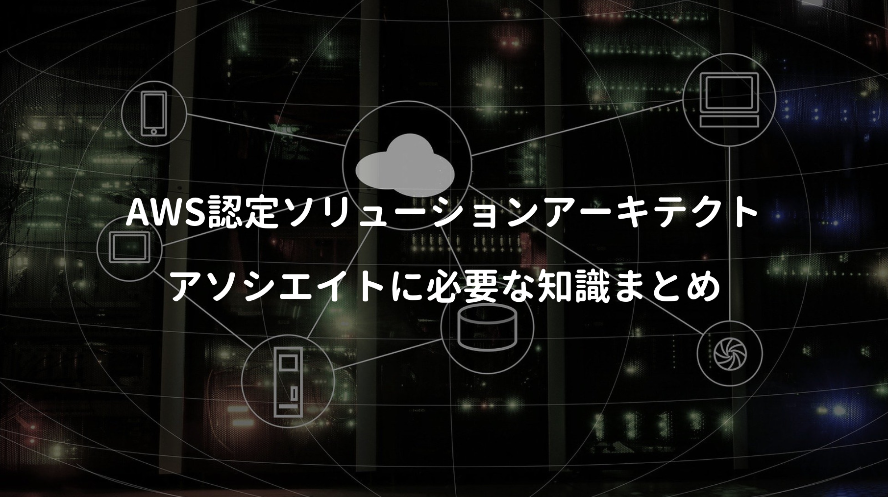
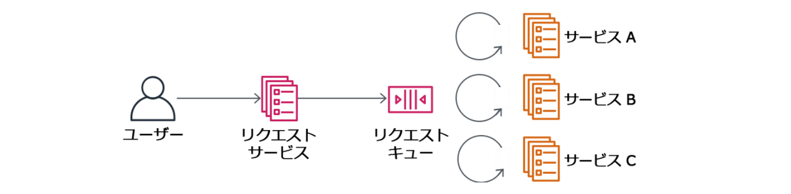
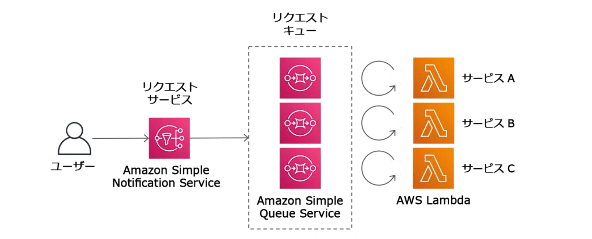

マイクロサービスを実現する上で悩みの種の一つがトランザクション管理。

モノリスでのトランザクション管理なら話は単純だが、マイクロサービスのように複数のデータベースで分割管理する場合、SQSなどメッセージキューを利用した複雑なトランザクション管理を迫られる。

一般的な分散トランザクション管理では、2相コミットが思い浮かぶ。ただしNoSQL系のテクノロジーや、一部のメッセージブローカー(RabbitMQ/Apache Kafka)ではサポートされておらず、スケーラビリティを大きく損なうことから、本書ではSagaパターンが紹介されていた。

<a href="https://hb.afl.rakuten.co.jp/hgc/146fe51c.1fd043a3.146fe51d.605dc196/yomereba_main_202004051411239735?pc=http%3A%2F%2Fbooks.rakuten.co.jp%2Frb%2F16239274%2F%3Fscid%3Daf_ich_link_urltxt%26m%3Dhttp%3A%2F%2Fm.rakuten.co.jp%2Fev%2Fbook%2F" target="_blank" >マイクロサービスパターン</a>
posted with <a href="https://yomereba.com" rel="nofollow" target="_blank">ヨメレバ</a>

クリス・リチャードソン/長尾高弘 インプレス 2020年03月    

<a href="https://hb.afl.rakuten.co.jp/hgc/146fe51c.1fd043a3.146fe51d.605dc196/yomereba_main_202004051411239735?pc=http%3A%2F%2Fbooks.rakuten.co.jp%2Frb%2F16239274%2F%3Fscid%3Daf_ich_link_urltxt%26m%3Dhttp%3A%2F%2Fm.rakuten.co.jp%2Fev%2Fbook%2F" target="_blank" >楽天ブックス</a>

<a href="https://www.amazon.co.jp/exec/obidos/asin/4295008583/kanon123-22/" target="_blank" >Amazon</a>

<a href="https://www.amazon.co.jp/gp/search?keywords=%E3%83%9E%E3%82%A4%E3%82%AF%E3%83%AD%E3%82%B5%E3%83%BC%E3%83%93%E3%82%B9%E3%83%91%E3%82%BF%E3%83%BC%E3%83%B3&__mk_ja_JP=%83J%83%5E%83J%83i&url=node%3D2275256051&tag=kanon123-22" target="_blank" >Kindle</a>
                              	  	  	  	  	

Sagaパターンでは、非同期メッセージングでサービス間を連携させる。そのため 処理途中で失敗した場合には更新処理を取り消す必要があり、補償トランザクションを用意しておかなければならない。

ちなみにSagaパターンでは、ACIDのI(分離性)を犠牲にした結果整合性モデルになる。補償トランザクションでは、打ち消す処理を提供するサービスと、それを呼び出すサービスの双方に負担がかかり、ビジネスロジックの設計が難しくなりがちなので、本当に実践レベルで使えるのかは怪しいけど、マイクロサービスでの分散データベース設計にお悩みの方には参考になるとは思う。

## パターン1 - コレオグラフィ

**コレオグラフィ** はサーガの参加サービスに、次ステップの判断を委ねる判断管理の方法。

必要な情報を全て含んだ最初のイベントを1つのメッセージに保存し、最初のトランザクションは完了。その後は各サービスが非同期的にメッセージを取得し、それぞれのタスクを実行していく。

イベントをPub/Subするだけなので、コレオグラフィの利点には サービス間の疎結合実現 が挙げられる。逆に欠点として、サービス間にサーガが分散されて分かりづらい点が挙げられる。本書では単純なサーガなら上手く機能するけど、複雑なサービスではオーケストレーションを推奨している。

ちなみにAWSでの実現では Kinesis + Lambda or SQS + SNS + Lambdaの組合せが考えられる。

## パターン2 - オーケストレーション

オライリー書籍の方がシンプルに説明されている気がする。

例として顧客サービスというオーケストレーターが、一連のサービス(ロイヤリティポイントサービス/メールサービス/郵送サービス)をリクエスト/レスポンス呼び出しで行っている。

<a href="https://hb.afl.rakuten.co.jp/hgc/146fe51c.1fd043a3.146fe51d.605dc196/yomereba_main_202003271340390723?pc=http%3A%2F%2Fbooks.rakuten.co.jp%2Frb%2F13770161%2F%3Fscid%3Daf_ich_link_urltxt%26m%3Dhttp%3A%2F%2Fm.rakuten.co.jp%2Fev%2Fbook%2F" target="_blank" rel="noopener noreferrer">マイクロサービスアーキテクチャ</a>
posted with <a href="https://yomereba.com" rel="nofollow noopener noreferrer" target="_blank">ヨメレバ</a>

SamNewman/佐藤直生 オライリー・ジャパン 2016年02月26日    

<a href="https://hb.afl.rakuten.co.jp/hgc/146fe51c.1fd043a3.146fe51d.605dc196/yomereba_main_202003271340390723?pc=http%3A%2F%2Fbooks.rakuten.co.jp%2Frb%2F13770161%2F%3Fscid%3Daf_ich_link_urltxt%26m%3Dhttp%3A%2F%2Fm.rakuten.co.jp%2Fev%2Fbook%2F" target="_blank" rel="noopener noreferrer">楽天ブックス</a>

<a href="https://www.amazon.co.jp/exec/obidos/asin/4873117607/kanon123-22/" target="_blank" rel="noopener noreferrer">Amazon</a>

<a href="https://www.amazon.co.jp/gp/search?keywords=%E3%83%9E%E3%82%A4%E3%82%AF%E3%83%AD%E3%82%B5%E3%83%BC%E3%83%93%E3%82%B9%E3%82%A2%E3%83%BC%E3%82%AD%E3%83%86%E3%82%AF%E3%83%81%E3%83%A3&__mk_ja_JP=%83J%83%5E%83J%83i&url=node%3D2275256051&tag=kanon123-22" target="_blank" rel="noopener noreferrer">Kindle</a>
                              	  	  	  	  	

書籍(マイクロサービスパターン)では、複雑なサービスではオーケストレーションの利用が推奨されているけど、オーケストレーターが中央集権化しやすく、少数の賢い神クラスになりがちな欠点が挙げられる。コレオグラフィの方がより疎結合を実現できるし、マイクロサービスっぽいので、オライリー本ではコレオグラフィ推しな印象。

## ACID特性と分散トランザクション

データベースでは、信頼性のあるトランザクションシステムの持つべき性質に ACID特性 がある。

■ 原子性（ Atomicity ）

トランザクションが完全に実行されるか、全く実行されないかの2通りの結果しか持たない.

ex) 引き出し作業と振り込み作業の片方が失敗するともう片方も失敗しなければならない.

 

■ 一貫性（ Consistency ）

アクセスするデータは、ある有効な状態から別の有効な状態に変換されなければならない.

ex) 引き出し作業によって引き出された金額と、振り込み作業によって振り込まれた金額は同じにならなければならない.

 

■ 分離性（ Isolation ）

トランザクション実行中は、それ自身が他から何の影響も受けず隔離されていなければならない.

ex) 引き出し作業と振り込み作業を行っている最中に、別の作業が影響を及ぼしてはいけない.

 

■ 耐久性（ Durability ）

どんな障害が発生してもトランザクション結果は永久に保障されていなければならない.

ex) 引き出し作業と振り込み作業が正常であれ異常であれ完了したら、その結果が障害などによって失われてしまうことがあってはいけない.

分散トランザクションの実現では2相コミットが考えられる。2相コミットでは、第一フェーズで各データベースに対してコミット可能な状態かを確認するprepare指示を行い、第二フェーズでは全データベースにcommit/rollback判定後に処理実施。本書でもXAに準拠したJTAが紹介されている。