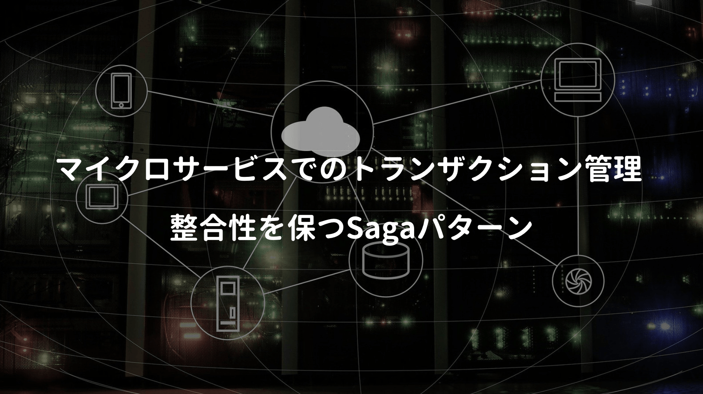

## 

## 

## 

## 

## 

## 

## 参考文献

■ [AWSドキュメント](https://docs.aws.amazon.com/index.html)  
■ [AWSサービス別資料](https://aws.amazon.com/jp/aws-jp-introduction/aws-jp-webinar-service-cut/)  
■ [AWS金額算出](https://calculator.s3.amazonaws.com/index.html)  
■ [builders.flash](https://aws.amazon.com/jp/builders-flash/)  
■ [Developers.IO](https://dev.classmethod.jp/)  
■ [AWS Well-Architected フレームワーク](https://d1.awsstatic.com/International/ja_JP/Whitepapers/AWS_Well-Architected_Framework_2018_JA_final.pdf)  
■ [AWSセキュリティのベストプラクティス](https://d1.awsstatic.com/whitepapers/ja_JP/Security/AWS_Security_Best_Practices.pdf)  
■ [AWSにおける継続的インテグレーションと継続的デリバリーの実践](https://d1.awsstatic.com/International/ja_JP/Whitepapers/practicing-continuous-integration-continuous-delivery-on-AWS_JA_final.pdf)  
■ [AWSにおけるマイクロサービス](https://d1.awsstatic.com/International/ja_JP/Whitepapers/MicroservicesOnAWS-V2_NT0829_SMO_MJ_EditSM_ProofSM_ProofNT.pdf)  
■ [AWSにおけるクラウドネイティブ モダンアプリケーション開発と設計パターン](https://d1.awsstatic.com/whitepapers/ja_JP/modern-application-development-on-aws.pdf)  
