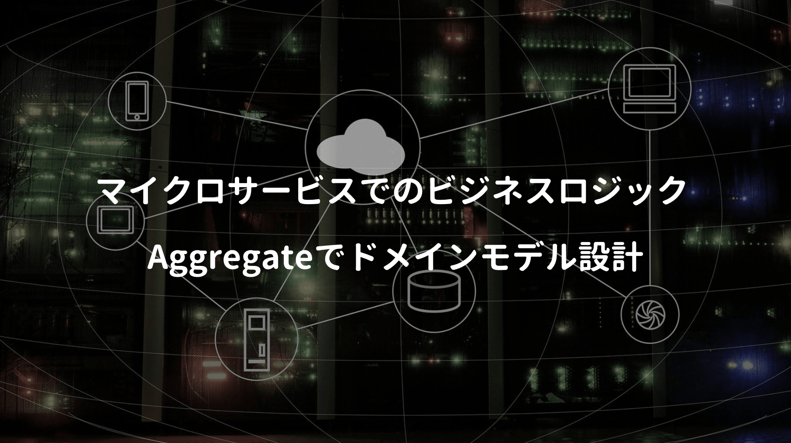

モノリスのサービス分割では、DDDの考え方が役立つと言われている（多分）

そのため以下の書籍でも、DDDのAggregateパターンを利用したドメインモデルの設計が説明されているが、正直なところ説明内容が難しくて（自分には）あまり理解出来ず ... DDDの知見が無い状態で本書を読んでも、結構な数の人が困惑するのでは？と思う（多分自分が理解力不足なだけ）

<div class="cstmreba"><div class="booklink-box"><div class="booklink-image"><a href="https://hb.afl.rakuten.co.jp/hgc/146fe51c.1fd043a3.146fe51d.605dc196/yomereba_main_202004051411239735?pc=http%3A%2F%2Fbooks.rakuten.co.jp%2Frb%2F16239274%2F%3Fscid%3Daf_ich_link_urltxt%26m%3Dhttp%3A%2F%2Fm.rakuten.co.jp%2Fev%2Fbook%2F" target="_blank" ></a></div><div class="booklink-info"><div class="booklink-name"><a href="https://hb.afl.rakuten.co.jp/hgc/146fe51c.1fd043a3.146fe51d.605dc196/yomereba_main_202004051411239735?pc=http%3A%2F%2Fbooks.rakuten.co.jp%2Frb%2F16239274%2F%3Fscid%3Daf_ich_link_urltxt%26m%3Dhttp%3A%2F%2Fm.rakuten.co.jp%2Fev%2Fbook%2F" target="_blank" >マイクロサービスパターン</a><div class="booklink-powered-date">posted with <a href="https://yomereba.com" rel="nofollow" target="_blank">ヨメレバ</a></div></div><div class="booklink-detail">クリス・リチャードソン/長尾高弘 インプレス 2020年03月    </div><div class="booklink-link2"><div class="shoplinkrakuten"><a href="https://hb.afl.rakuten.co.jp/hgc/146fe51c.1fd043a3.146fe51d.605dc196/yomereba_main_202004051411239735?pc=http%3A%2F%2Fbooks.rakuten.co.jp%2Frb%2F16239274%2F%3Fscid%3Daf_ich_link_urltxt%26m%3Dhttp%3A%2F%2Fm.rakuten.co.jp%2Fev%2Fbook%2F" target="_blank" >楽天ブックス</a></div><div class="shoplinkamazon"><a href="https://www.amazon.co.jp/exec/obidos/asin/4295008583/kanon123-22/" target="_blank" >Amazon</a></div><div class="shoplinkkindle"><a href="https://www.amazon.co.jp/gp/search?keywords=%E3%83%9E%E3%82%A4%E3%82%AF%E3%83%AD%E3%82%B5%E3%83%BC%E3%83%93%E3%82%B9%E3%83%91%E3%82%BF%E3%83%BC%E3%83%B3&__mk_ja_JP=%83J%83%5E%83J%83i&url=node%3D2275256051&tag=kanon123-22" target="_blank" >Kindle</a></div>                              	  	  	  	  	</div></div><div class="booklink-footer"></div></div></div>
<br/>

私のようにDDDへの理解が無い方には、以下の書籍を読むことをオススメしたい。DDDにおける「概念を実装に落とし込むパターン」や、集約（Aggregate）に関する内容が説明されているので、一読するとマイクロサービスパターンの内容理解も深まると思われる。

<div class="cstmreba"><div class="booklink-box"><div class="booklink-image"><a href="https://hb.afl.rakuten.co.jp/hgc/146fe51c.1fd043a3.146fe51d.605dc196/yomereba_main_202004111104577927?pc=http%3A%2F%2Fbooks.rakuten.co.jp%2Frb%2F16167672%2F%3Fscid%3Daf_ich_link_urltxt%26m%3Dhttp%3A%2F%2Fm.rakuten.co.jp%2Fev%2Fbook%2F" target="_blank" ></a></div><div class="booklink-info"><div class="booklink-name"><a href="https://hb.afl.rakuten.co.jp/hgc/146fe51c.1fd043a3.146fe51d.605dc196/yomereba_main_202004111104577927?pc=http%3A%2F%2Fbooks.rakuten.co.jp%2Frb%2F16167672%2F%3Fscid%3Daf_ich_link_urltxt%26m%3Dhttp%3A%2F%2Fm.rakuten.co.jp%2Fev%2Fbook%2F" target="_blank" >ドメイン駆動設計入門 ボトムアップでわかる！ドメイン駆動設計の基本</a><div class="booklink-powered-date">posted with <a href="https://yomereba.com" rel="nofollow" target="_blank">ヨメレバ</a></div></div><div class="booklink-detail">成瀬 允宣 翔泳社 2020年02月13日    </div><div class="booklink-link2"><div class="shoplinkrakuten"><a href="https://hb.afl.rakuten.co.jp/hgc/146fe51c.1fd043a3.146fe51d.605dc196/yomereba_main_202004111104577927?pc=http%3A%2F%2Fbooks.rakuten.co.jp%2Frb%2F16167672%2F%3Fscid%3Daf_ich_link_urltxt%26m%3Dhttp%3A%2F%2Fm.rakuten.co.jp%2Fev%2Fbook%2F" target="_blank" >楽天ブックス</a></div><div class="shoplinkamazon"><a href="https://www.amazon.co.jp/exec/obidos/asin/479815072X/kanon123-22/" target="_blank" >Amazon</a></div><div class="shoplinkkindle"><a href="https://www.amazon.co.jp/gp/search?keywords=%E3%83%89%E3%83%A1%E3%82%A4%E3%83%B3%E9%A7%86%E5%8B%95%E8%A8%AD%E8%A8%88%E5%85%A5%E9%96%80%20%E3%83%9C%E3%83%88%E3%83%A0%E3%82%A2%E3%83%83%E3%83%97%E3%81%A7%E3%82%8F%E3%81%8B%E3%82%8B%EF%BC%81%E3%83%89%E3%83%A1%E3%82%A4%E3%83%B3%E9%A7%86%E5%8B%95%E8%A8%AD%E8%A8%88%E3%81%AE%E5%9F%BA%E6%9C%AC&__mk_ja_JP=%83J%83%5E%83J%83i&url=node%3D2275256051&tag=kanon123-22" target="_blank" >Kindle</a></div>                              	  	  	  	  	</div></div><div class="booklink-footer"></div></div></div>
<br/>

また集約を理解しようとすると、DDDの基本である値オブジェクトやエンティティ、ドメインサービスの理解も必須なので、やはり本書の一読を強く推奨したいかも。

## アグリゲートパターン

ドメイン駆動設計入門では、集約をざっくりこんな感じで説明。

**集約は関連するオブジェクト同士を線で囲う境界があり、例として以下のようなクラス定義!!**

集約を操作するための直接のインターフェースとなるオブジェクトは <span style="color: crimson; font-weight: bold;">集約ルート（Aggregate Root）と呼ばれるオブジェクト（User）に限定、集約内部のオブジェクト（UserIdとUserName）に対する変更は、集約ルートが責任をもって行うこと</span> で集約内部の不変条件が保たれる（UserNameを直接操作するのはUserのみとなる ＝ デルメルの法則）

```Csharp
class User
{
  public User(UserId id, UserName name)
  {
      # 処理
  }
}
```
<br/>

デルメルの法則では、メソッドを呼び出せるオブジェクトを4つに限定（オブジェクト自身 / 引数として渡されたオブジェクト / インスタンス変数 / 直接インスタンス化したオブジェクト）しており、この原則を守ることでメンテナンス性の向上とコードの柔軟性を実現。

## アグリゲートのルール

本書ではFTGOアプリケーションというものをサンプルに説明。

アグリゲートで各領域の境界を明確にしていない場合にどんな問題が考えられるか？ **密結合していると、あるビジネスオブジェクトの一部を直接更新することで、ビジネスルールを破る可能性がある。**

まず本書では各領域（Order / Consumer / Restaurant）でアグリゲートルートを明確化させ、更にアグリゲートでは以下の3つのルールが課されると説明されている。

<div class="blackboard-box">
<p>■ アグリゲートルートだけを参照する.</p>
<p>■ アグリゲート間の参照では主キーを使わなければならない.</p>
<p>■ 1つのトランザクションで1つのアグリゲートを作成または更新.</p>
<div class="chalk1"></div>
<div class="chalk2"></div>
</div>

一点目では、値オブジェクトを操作出来るのはアグリゲートルートだけで、必ずルート経由で操作を行うもので、例えばサービスはリポジトリでデータベースからアグリゲートをロードし、アグリゲートルートの参照を獲得する流れとなる。

二点目では、他アグリゲートを利用する際、オブジェクト参照ではなく、アイデンティティ（主キー）利用するもので、最後は文字通り（第4章で解説されているサーガの話）

## アグリゲートの粒度

両書とも基本的には、アグリゲートはなるべく小さく作ることを推奨されており、FTGOの例ではOrderとConsumerを別々に分割していたけど、勿論Consumerに集約する考えも勿論あり得る。

集約すればアトミックに更新できるメリットがある反面、スケーラビリティが下がる欠点（アプリケーションで同時処理出来るリクエスト数が増える等）もあり、これは明確な答えは無さげだ（システム毎にエンジニアが考えるしかない）

ビジネスロジックの基本はアグリゲート中心となり、それ以外のビジネスロジックは、ドメインサービスとサーガに集約（本書の場合では、アグリゲートのOrder、サービスクラスのOrderService、最後にOrderRepositoryと1つ以上のサーガから構成される）