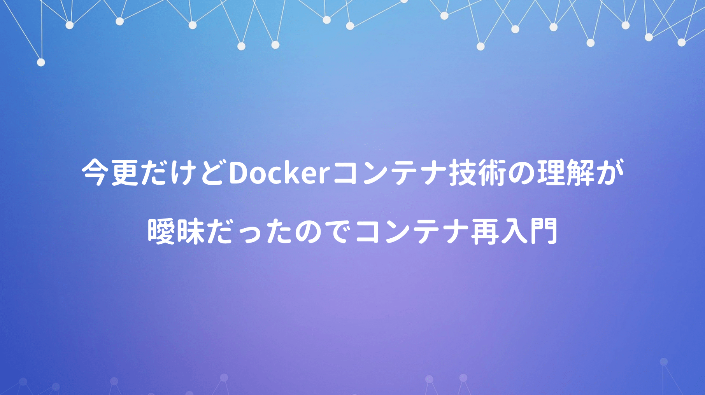

昨今のシステム開発では欠かせないコンテナ技術だが、今まで人が作ったDockerfileを流用したりで、正確に理解出来ていなかった。このままでも良いかなと思っていた矢先、バージョアップで急に動かなくなり、結構ムダな時間を要してしまうこともしばしば。

<div class="cstmreba"><div class="booklink-box"><div class="booklink-image"><a href="https://hb.afl.rakuten.co.jp/hgc/146fe51c.1fd043a3.146fe51d.605dc196/yomereba_main_20200425225631776?pc=http%3A%2F%2Fbooks.rakuten.co.jp%2Frb%2F15570632%2F%3Fscid%3Daf_ich_link_urltxt%26m%3Dhttp%3A%2F%2Fm.rakuten.co.jp%2Fev%2Fbook%2F" target="_blank" ></a></div><div class="booklink-info"><div class="booklink-name"><a href="https://hb.afl.rakuten.co.jp/hgc/146fe51c.1fd043a3.146fe51d.605dc196/yomereba_main_20200425225631776?pc=http%3A%2F%2Fbooks.rakuten.co.jp%2Frb%2F15570632%2F%3Fscid%3Daf_ich_link_urltxt%26m%3Dhttp%3A%2F%2Fm.rakuten.co.jp%2Fev%2Fbook%2F" target="_blank" >Docker／Kubernetes実践コンテナ開発入門</a><div class="booklink-powered-date">posted with <a href="https://yomereba.com" rel="nofollow" target="_blank">ヨメレバ</a></div></div><div class="booklink-detail">山田明憲 技術評論社 2018年09月    </div><div class="booklink-link2"><div class="shoplinkrakuten"><a href="https://hb.afl.rakuten.co.jp/hgc/146fe51c.1fd043a3.146fe51d.605dc196/yomereba_main_20200425225631776?pc=http%3A%2F%2Fbooks.rakuten.co.jp%2Frb%2F15570632%2F%3Fscid%3Daf_ich_link_urltxt%26m%3Dhttp%3A%2F%2Fm.rakuten.co.jp%2Fev%2Fbook%2F" target="_blank" >楽天ブックス</a></div><div class="shoplinkamazon"><a href="https://www.amazon.co.jp/exec/obidos/asin/4297100339/kanon123-22/" target="_blank" >Amazon</a></div><div class="shoplinkkindle"><a href="https://www.amazon.co.jp/gp/search?keywords=Docker%EF%BC%8FKubernetes%E5%AE%9F%E8%B7%B5%E3%82%B3%E3%83%B3%E3%83%86%E3%83%8A%E9%96%8B%E7%99%BA%E5%85%A5%E9%96%80&__mk_ja_JP=%83J%83%5E%83J%83i&url=node%3D2275256051&tag=kanon123-22" target="_blank" >Kindle</a></div>                              	  	  	  	  	</div></div><div class="booklink-footer"></div></div></div>

今まで何かと理由をつけて逃げていたが、エラーに遭遇すると結構困ることが多いので、流石にマズいと思うので上の書籍を再読してみた（Kubernetesは学習コスト大なのでDockerの仕組みだけ）

## Dockerfileの書き方

**Dockerイメージをビルド** とは、Dockerfileやアプリケーションの実行ファイルから、Dockerコンテナの元となるイメージを作ることで、Dockerfileは独自のDLSでイメージ構成を定義。

```bash
# Dockerfile
FROM golang:1.9

RUN mkdir /echo
COPY main.go /echo

CMD ["go", "run", "/echo/main.go"]
```
<br/>

**FROM** は作成するDockerイメージのベースとなるイメージを指定し、ビルド時にはFROMで指定されたイメージをダウンロードして実行（取得イメージはデフォルトでDocker Hubレジストリを参照）

**RUN** はDockerイメージビルド時、Dockerコンテナ内で実行するコマンドを定義し、引数にはDockerコンテナ内で実行するコマンドをそのまま指定出来る。

**COPY** はDockerを動作させるホストマシン上のファイル等をDockerコンテナにコピーする操作。

**CMD** はDockerコンテナとして実行する際、コンテナ内で実行するプロセスを指定（RUNではアプリケーションの更新や配置、CMDでアプリケーションそのものを動作させる）

## コンテナの操作

サンプルで作成したDockerfileで動作させるためのmain.goを新規作成。

```go
package main

import (
	"fmt"
	"log"
	"net/http"
)

func main() {
	http.HandleFunc("/", func(w http.ResponseWriter, r *http.Request) {
		log.Println("received request")
		fmt.Fprintf(w, "Hello Docker!!")
	})

	log.Println("start server")
	server := &http.Server{Addr: ":8080"}
	if err := server.ListenAndServe(); err != nil {
		log.Println(err)
	}
}
```
<br/>

まずDockerイメージを作成して、作成されたイメージを一覧化。

```bash
docker image build -t example/echo:latest .
docker image ls
```
<br/>

作成されたイメージでコンテナ実行（-dでバックグラウンド処理、-pでポートフォワーディング）

```bash
docker container run -d -p 9000:8080 example/echo:latest
docker container ps
```
<br/>

localhost:9000で画面上に「Hello Docker!!」されるのを確認したら不要なコンテナを削除。

```bash
docker container stop コンテナID
docker container rm コンテナID
```
<br/>

コンテナ実行に利用したイメージも併せて削除。

```bash
docker image ls
docker rmi イメージID
```

## Dockerイメージ操作

**Dockerイメージ** は **Dockerコンテナ** を作成するためのテンプレートで、UbuntuなどOSとして構成されたファイルシステム、コンテナ上で実行するためのアプリケーション、依存するライブラリ・ツール、プロセスがコンテナ上で実行されるか等の設定情報まで含んだもの。

イメージ操作に関わる主なコマンドは以下のとおり↓

```bash
docker help
docker image --help
```
<br/>

イメージの **ビルド** で行うコマンド。

```bash
# -t オプションで[イメージ名]と[タグ名]を指定.
docker image build -t イメージ名:タグ名 Dockerfile配置ディレクトリのパス

# -f オプションは、指定ファイル(Dockerfileでない名称)を指定してイメージをビルド.
docker image build -f Dockerfile-test -t example/echo:latest

# --pull オプションは、ベースイメージを強制的に再取得してイメージのビルド.
docker image build --pull=true -t example/echo:latest
```
<br/>

イメージの **取得** を行うコマンド。

```bash
# DockerレジストリからDockerイメージをダウンロード.
docker image pull [options] リポジトリ名:タグ名

# 例) jenkinsのイメージ取得コマンド.
docker image pull jenkins:latest
```
<br/>

イメージの **削除** を行うコマンド。

```bash
docker rmi イメージID

# 強制的に削除.
docker rmi -f イメージID
```
<br/>

イメージの **一覧** を確認するコマンド。

```bash
# Dockerホストに保持されているイメージの一覧表示.
docker image ls [options] [リポジトリ:タグ]
```
<br/>

イメージの **タグ付け** を行うコマンド。

```bash
# Dockerイメージのタグはある特定のイメージIDを持つDockerイメージを識別しやすくするために利用.
docker image tag 元イメージ:タグ 新イメージ:タグ
```

## Dockerコンテナ操作

**Dockerコンテナ** は **実行中・停止・破棄** の3つの状態のいずれかに分類される。

コンテナの **作成と実行** を行うコマンド。

```bash
# Dockerイメージからコンテナを作成、実行するコマンド.
docker container run [options] イメージ名:タグ コマンド コマンド引数
docker container run [options] イメージID コマンド コマンド引数

# -p ポートフォワーディング(ホスト側の9000ポートからコンテナ側の8080ポートへアクセス)
# -d バックグラウンド
docker container run -d -p 9000:8080 example/echo:latest

# 名前付きコンテナ
docker container run --name コンテナ名 イメージ名:タグ

# 例)
docker container run -t -d --name gihyo-echo example/echo:latest
```
<br/>

コンテナの **一覧** を確認するコマンド。

```bash
# 実行中のコンテナ及び終了したコンテナの一覧表示.
docker container ls [options]

# 例) コンテナIDのみ抽出.
docker container ls -q

# 例) 特定のコンテナ名のみ抽出.
docker container ls --filter "name=echo1"

# 例) 特定のイメージで抽出.
docker container ls --filter "ancestor=example/echo"

# 例) 終了したコンテナも抽出.
docker container ls -a
```
<br/>

コンテナの **停止** を行うコマンド。

```bash
# 実行中のコンテナの停止.
docker container stop コンテナID または コンテナ名
```
<br/>

コンテナの **再起動** を行うコマンド。

```bash
# 一度停止したコンテナの再実行.
docker container restart コンテナID または コンテナ名
```
<br/>

コンテナの **破棄** を行うコマンド。

```bash
# 停止したコンテナの完全廃棄.
docker container rm コンテナID または コンテナ名

# 実行中のコンテナを強制的に破棄.
docker container rm -f コンテナID または コンテナ名
```
<br/>

実行中のコンテナで **コマンド** を行う。

```bash
# 実行中コンテナの中で任意のコマンドを実行.
docker container exec [options] コンテナID または コンテナ名 コマンド

# ex)
docker container exec -it cronjob tail -f /var/log/cron.log
```

## Docker運用向け操作

コンテナの **一括削除** を行うコマンド。

```bash
# 実行していないコンテナの一括削除.
docker container prune [options]
```
<br/>

イメージの **一括削除** を行うコマンド。

```bash
# 不要なイメージファイルの一括削除.
docker image prune [options]
```
<br/>

Dockerリソースの **一括削除** を行うコマンド。

```bash
# コンテナ、イメージ、ボリューム、ネットワークなどDockerリソースを一括削除.
docker system prune
```
<br/>