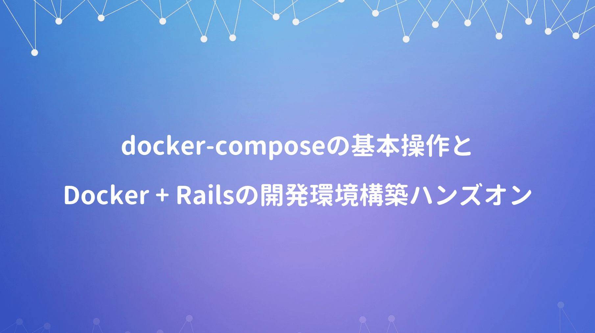

一般的なWebシステムは、単一のアプリケーションやミドルウェアだけで成立することはなく、アプリケーション同士の連携が必要。そのため実際の開発ではdocker-composeの利用が一般的になる。

<div class="cstmreba"><div class="booklink-box"><div class="booklink-image"><a href="https://hb.afl.rakuten.co.jp/hgc/146fe51c.1fd043a3.146fe51d.605dc196/yomereba_main_20200425225631776?pc=http%3A%2F%2Fbooks.rakuten.co.jp%2Frb%2F15570632%2F%3Fscid%3Daf_ich_link_urltxt%26m%3Dhttp%3A%2F%2Fm.rakuten.co.jp%2Fev%2Fbook%2F" target="_blank" ></a></div><div class="booklink-info"><div class="booklink-name"><a href="https://hb.afl.rakuten.co.jp/hgc/146fe51c.1fd043a3.146fe51d.605dc196/yomereba_main_20200425225631776?pc=http%3A%2F%2Fbooks.rakuten.co.jp%2Frb%2F15570632%2F%3Fscid%3Daf_ich_link_urltxt%26m%3Dhttp%3A%2F%2Fm.rakuten.co.jp%2Fev%2Fbook%2F" target="_blank" >Docker／Kubernetes実践コンテナ開発入門</a><div class="booklink-powered-date">posted with <a href="https://yomereba.com" rel="nofollow" target="_blank">ヨメレバ</a></div></div><div class="booklink-detail">山田明憲 技術評論社 2018年09月    </div><div class="booklink-link2"><div class="shoplinkrakuten"><a href="https://hb.afl.rakuten.co.jp/hgc/146fe51c.1fd043a3.146fe51d.605dc196/yomereba_main_20200425225631776?pc=http%3A%2F%2Fbooks.rakuten.co.jp%2Frb%2F15570632%2F%3Fscid%3Daf_ich_link_urltxt%26m%3Dhttp%3A%2F%2Fm.rakuten.co.jp%2Fev%2Fbook%2F" target="_blank" >楽天ブックス</a></div><div class="shoplinkamazon"><a href="https://www.amazon.co.jp/exec/obidos/asin/4297100339/kanon123-22/" target="_blank" >Amazon</a></div><div class="shoplinkkindle"><a href="https://www.amazon.co.jp/gp/search?keywords=Docker%EF%BC%8FKubernetes%E5%AE%9F%E8%B7%B5%E3%82%B3%E3%83%B3%E3%83%86%E3%83%8A%E9%96%8B%E7%99%BA%E5%85%A5%E9%96%80&__mk_ja_JP=%83J%83%5E%83J%83i&url=node%3D2275256051&tag=kanon123-22" target="_blank" >Kindle</a></div>                              	  	  	  	  	</div></div><div class="booklink-footer"></div></div></div>
<br/>

今回はDockerの基礎知識を再復習した上で、docker-composeの基本的な使い方や永続化データの取扱い、更にハンズオンとしてRails環境の構築までを実施。


## Docker-Composeの基本

**Docker-Compose** はyaml形式で定義された設定ファイルから、複数のコンテナ実行を一括管理。

```bash
version: "3"
services: 
  echo:                        # コンテナ名
    image: example/echo:latest # Dockerイメージ
    ports:                     # ポートフォワーディング（ホスト/コンテナ）
      - 9000:8080
```
<br/>

Docker-Composeの基本的なコマンドは以下のとおり。

**■ イメージのビルド**

```bash 
docker-compose build
```
<br/>

**■ コンテナ群の起動（--buildは必ずビルド実施）**

```bash
docker-compose up -d
docker-compose up -d --build
```
<br/>

**■ コンテナ群の停止（--rmiはイメージも併せて削除）**

```bash
docker-compose down
docker-compose down --rmi all
```
<br/>

**■ プロセスの確認**

```bash
docker-compose ps
```

## 永続化データの取扱い

Dockerコンテナ実行中に書き込まれたファイルは、ホスト側にマウントしない限り、コンテナ破棄のタイミングで消去されるため、ステートフルな運用を実現するためにData Volumeを利用。

Dockerコンテナ内のディレクトリをディスクに永続化(ホスト・コンテナ間で共有)するための仕組み。

```bash
# docker container run [options] -v ホスト側のpath:コンテナ側のpath リポジトリ名:タグ名 コマンド 引数
docker container run -v ${PWD}:/workspace ghyodocker/imagemagick:latest convert -size 100*100 xc:#000000 /workspace/gihyo.jpg
```

## チュートリアル(Rails)

カレントディレクトリ配下のrorディレクトリにDockerfile作成。

```bash
FROM ruby:2.4.0
RUN apt-get update -qq && apt-get install -y build-essential libpq-dev nodejs
RUN mkdir /myapp
WORKDIR /myapp
COPY Gemfile /myapp/Gemfile
COPY Gemfile.lock /myapp/Gemfile.lock
RUN bundle install
COPY . /myapp
```
<br/>

Gemfileを作成 (併せて空ファイルのGemfile.lockも作成)

```bash
source 'https://rubygems.org'
gem 'rails', '5.0.0.1'
```
<br/>

docker-compose.ymlを以下のように定義。

```bash
# 参考文献(https://discuss.circleci.com/t/postgres-just-stopped-working/34511/4)
version: '3'
services:
  db:
    image: postgres
    environment:
      POSTGRES_PASSWORD: password
  web:
    build: .
    command: bundle exec rails s -p 3000 -b '0.0.0.0'
    volumes:
      - .:/myapp
    ports:
      - "3000:3000"
    depends_on:
      - db
```
<br/>

事前にFile Sharingでカレントディレクトリを追加する。

```bash
docker-compose run web rails new . --force --database=postgresql
```
<br/>

Gemfileを一部修正。

```bash
# 修正前)
gem 'pg', '~> 0.18'
# 修正後)
gem 'pg', '~> 0.20.0'
```
<br/>

修正分を含めるために再度ビルドを実行。

```bash
docker-compose build
```
<br/>

データベース設定(config/database.yml)の追加。

```bash
# 修正前)
default: &default
  adapter: postgresql
  encoding: unicode
  # For details on connection pooling, see rails configuration guide
  # http://guides.rubyonrails.org/configuring.html#database-pooling
  pool: <%= ENV.fetch("RAILS_MAX_THREADS") { 5 } %>

# 修正後)
default: &default
  adapter: postgresql
  encoding: unicode
  host: db
  username: postgres
  password: password
  # For details on connection pooling, see rails configuration guide
  # http://guides.rubyonrails.org/configuring.html#database-pooling
  pool: <%= ENV.fetch("RAILS_MAX_THREADS") { 5 } %>
```
<br/>

動作検証。

```bash
# 起動
docker-compose up -d

# データベース作成.
docker-compose run web rake db:create

# アクセス.
http://localhost:3000/

# コンテナ群の停止.
docker-compose down
```
<br/>