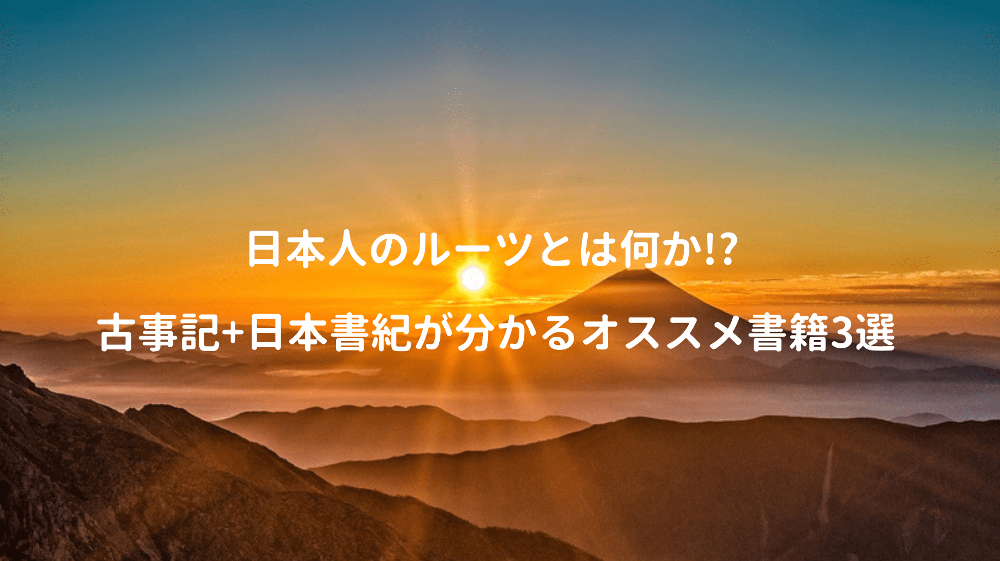

神話には民族のアイデンティティを確認させる力があるが、教育現場で神話に触れる機会はほぼ皆無。

神道が国教化され神話教育が当たり前だった明治時代。

時が経つにつれて植民地主義とも呼応し、日本は過酷な道を辿るが、その際に神話が不自然な民族意識の形成に利用、軍国主義の温床とみなされ、神話はタブー視されてしまった。

ちなみに諸外国では自国の歴史・神話を知ることが当たり前で、それらを知ることで自国に誇りを持っており、自国の歴史・神話を語れない人間は恥知らずのレッテルを貼られるとか。

最近私も何故か自国の歴史・神話に改めて興味を持ったので、幾つか本を読んでみた。

## 小難しいのは無し!! 漫画だから小一時間で読める

神話に出てくる神様の正式名称って、とにかく長くて覚えづらい。

名前が覚えられないから、全体のストーリーも頭に入りづらいイメージたった、こちらは全ページ漫画で紹介されているので、ざっくりの流れを知れるのは良い。

<a href="https://www.amazon.co.jp/exec/obidos/asin/4062194767/kanon123-22/" target="_blank"  rel="noopener noreferrer">愛と涙と勇気の神様ものがたり まんが古事記</a>
posted with <a href="https://yomereba.com" rel="nofollow noopener noreferrer" target="_blank">ヨメレバ</a>

ふわ こういちろう 講談社 2015-06-30    

<a href="https://www.amazon.co.jp/exec/obidos/asin/4062194767/kanon123-22/" target="_blank"  rel="noopener noreferrer">Amazon</a>

<a href="https://www.amazon.co.jp/exec/obidos/ASIN/B011QCXMMI/kanon123-22/" target="_blank"  rel="noopener noreferrer">Kindle</a>

<a href="https://hb.afl.rakuten.co.jp/hgc/146fe51c.1fd043a3.146fe51d.605dc196/yomereba_main_201812192331298979?pc=http%3A%2F%2Fbooks.rakuten.co.jp%2Frb%2F13229339%2F%3Fscid%3Daf_ich_link_urltxt%26m%3Dhttp%3A%2F%2Fm.rakuten.co.jp%2Fev%2Fbook%2F" target="_blank"  rel="noopener noreferrer">楽天ブックス</a>
                        	  	  	  	  	

八百万の神なのでとにかく色んな神様がおり、主要な神々から現人神までの流れはこんなイメージ。

1. 別天津神(独神という特別な5神柱)

■ 特に最初に生まれた3神柱を造化三神と呼ぶ.

■ この時代に天と地が開かれて、新たな神々が誕生.

 

2. 神代7代(7代目にイザナキとイザナミ)

■ イザナキとイザナミは日本の土地を作り(国生み)、色んな神様を生み出す.

■ その中でも特別な神(アマテラス/ツクヨミ/スサノオ)をイザナキが生み出す.

 

3. 日本神話の三貴子

■ アマテラスが高天原、ツクヨミは夜の国、スサノオは海原を治める.

■ スサノオを言いつけを守らず、高天原で暴れまわり、追放される.

■ 地上に降り、出雲国でヤマタノオロチを退治し、天野叢雲を入手.

■ スサノオはクシナダヒメと結婚.

 

4. オオクニヌシの国作り.

■ スサノオから数えて6代目の子孫オオクニヌシの国作り開始.

■ スクナビコナなどと共に農業技術や病気の治し方などを広める.

■ 葦原中国は豊かになり、国作りが完了.

 

5. オオクニヌシの国譲り.

■ アマテラスの遣い(タケミカヅチ)が天孫に国を譲るよう説得.

■ オオクニヌシの子供(コトシロヌシ・タケミナカタ)も国譲りを承諾.

 

6. 天孫降臨

■ アマテラスの孫であるニニギノミコトが複数の神々と共に宮崎の高千穂に降臨.

■ 天孫降臨時、先導役を猿田彦が務める.

■ ニニギノミコトが結婚し、海佐知毘古と山佐知毘古が生まれる.

■ 山佐知毘古に孫が生まれ、その内の一人が後の神武天皇となる.

■ イワレビコ(神武天皇)が更なる繁栄を求め、神武東征を開始.

随分詳細は省いたが、正史における最初の神様〜初代天皇までの流れ（長い）

ちなみに古事記は3巻(上・中・下)の構成となっているが、この漫画では上巻が中心。

ただ上巻(神代記)読むだけで、お参りする神社に祀られている神様が結構気になり始めめる。

## レビュー評価も高く古代天皇から神社について知れる

神代記は勿論、神武東征時代の話や古代天皇、ヤマトタケル物語など。

神社にまつわる神話として、祀られている神様や成り立ちなどの解説が面白い。

<a href="https://www.amazon.co.jp/exec/obidos/asin/4044064067/kanon123-22/" target="_blank"  rel="noopener noreferrer">知っておきたい日本の神話 (角川ソフィア文庫)</a>
posted with <a href="https://yomereba.com" rel="nofollow noopener noreferrer" target="_blank">ヨメレバ</a>

瓜生 中 KADOKAWA 2007-11-21    

<a href="https://www.amazon.co.jp/exec/obidos/asin/4044064067/kanon123-22/" target="_blank"  rel="noopener noreferrer">Amazon</a>

<a href="https://www.amazon.co.jp/exec/obidos/ASIN/B0093SXSYU/kanon123-22/" target="_blank"  rel="noopener noreferrer">Kindle</a>

<a href="https://hb.afl.rakuten.co.jp/hgc/146fe51c.1fd043a3.146fe51d.605dc196/yomereba_main_201812200010262463?pc=http%3A%2F%2Fbooks.rakuten.co.jp%2Frb%2F5138839%2F%3Fscid%3Daf_ich_link_urltxt%26m%3Dhttp%3A%2F%2Fm.rakuten.co.jp%2Fev%2Fbook%2F" target="_blank"  rel="noopener noreferrer">楽天ブックス</a>
                        	  	  	  	  	

本書では古事記の内容が中心で、神武東征では、大和の強敵ナガスネヒコとの戦いが描かれていた。

ちなみにこのナガスネヒコ、昔天孫から降臨したニギハヤヒという神様の系譜を引くと紹介されており、ニギハヤヒも謎多き神様だが、ニニギノミコトの兄!?と唱える方もいらる（一説では千と千尋の神隠しの琥珀(ニギハヤミノミコト)のモデルだと、ハク同様に名前を奪われた神だという都市伝説も）

私も最初にこの本を読んだが、スラスラ頭の中に入ってきたの、こちらもオススメの一冊。

## 古事記と日本書紀の記述の違いを解説してくれる

先に紹介した書籍は古事記の内容が中心だが、こちらは日本書紀との違いまで書かれている。

<a href="https://www.amazon.co.jp/exec/obidos/asin/4569670504/kanon123-22/" target="_blank"  rel="noopener noreferrer">日本の「神話」と「古代史」がよくわかる本 (PHP文庫 に 12-55)</a>
posted with <a href="https://yomereba.com" rel="nofollow noopener noreferrer" target="_blank">ヨメレバ</a>

日本博学倶楽部 PHP研究所 2008-06-02    

<a href="https://www.amazon.co.jp/exec/obidos/asin/4569670504/kanon123-22/" target="_blank"  rel="noopener noreferrer">Amazon</a>

<a href="https://www.amazon.co.jp/exec/obidos/ASIN/B0079A789U/kanon123-22/" target="_blank"  rel="noopener noreferrer">Kindle</a>

<a href="https://hb.afl.rakuten.co.jp/hgc/146fe51c.1fd043a3.146fe51d.605dc196/yomereba_main_201812202356458052?pc=http%3A%2F%2Fbooks.rakuten.co.jp%2Frb%2F5721990%2F%3Fscid%3Daf_ich_link_urltxt%26m%3Dhttp%3A%2F%2Fm.rakuten.co.jp%2Fev%2Fbook%2F" target="_blank"  rel="noopener noreferrer">楽天ブックス</a>
                        	  	  	  	  	

そもそも古事記と日本書紀では、神話の扱いが異なり、そもそも両書作成の目的は、過去に遡って天皇家による日本支配の正当性を明らかにする事。ちなみに二書の性質を以下のように紹介されていた。

■ 古事記の特徴

・天皇家の系譜や伝承を伝えている.

・国土支配の正当性を強調している.

・天照を頂点に、周りの神々は天皇に臣従する存在.

 

■ 日本書紀の特徴

・大和に天皇家が成立する以前の内容が多い.

・物語中に歌謡が多く取り入れられている.

・事実のみが淡々と記されている.

・海外にも通用する正史としての性格を持つ.

それぞれ別の使命を持った書物らしい。

## あくまで一説という前提

歴史は勝者によってつくられるとよく言われる。

特に古事記はその特徴がよく見られ、天から降りてきたのは作り話では!?と思われる。

また神代記が文字通りに神話世界の人物の実在するか定かではない。

ただ話の元になった史実は結構残っているので、決して荒唐無稽な作り話と簡単に決めつけられないとは思うけど、記紀以外でも土着の言い伝えがあり、太古の歴史を口伝で語り継ぐ一族がいて、天照が宇宙人だと言う人までいたり、正直なところ、信じるか信じないかはあなた次第といった感じだ。