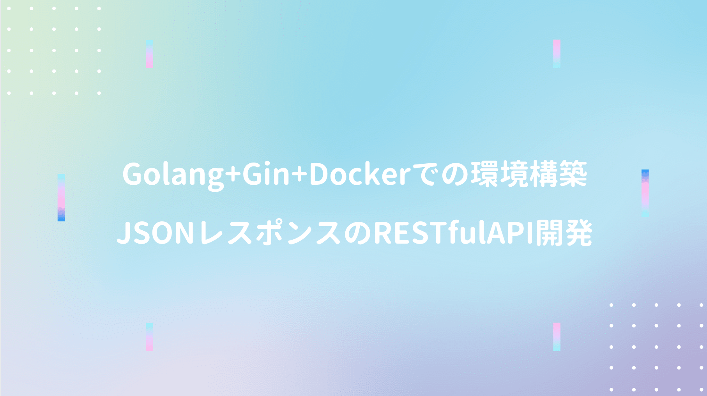

**[前回チュートリアル](/post-40)** の続き。

<div class="cstmreba"><div class="booklink-box"><div class="booklink-image"><a href="https://hb.afl.rakuten.co.jp/hgc/146fe51c.1fd043a3.146fe51d.605dc196/yomereba_main_202005211313266227?pc=http%3A%2F%2Fbooks.rakuten.co.jp%2Frb%2F13310126%2F%3Fscid%3Daf_ich_link_urltxt%26m%3Dhttp%3A%2F%2Fm.rakuten.co.jp%2Fev%2Fbook%2F" target="_blank" ></a></div><div class="booklink-info"><div class="booklink-name"><a href="https://hb.afl.rakuten.co.jp/hgc/146fe51c.1fd043a3.146fe51d.605dc196/yomereba_main_202005211313266227?pc=http%3A%2F%2Fbooks.rakuten.co.jp%2Frb%2F13310126%2F%3Fscid%3Daf_ich_link_urltxt%26m%3Dhttp%3A%2F%2Fm.rakuten.co.jp%2Fev%2Fbook%2F" target="_blank" >基礎からわかるGo言語改訂2版</a><div class="booklink-powered-date">posted with <a href="https://yomereba.com" rel="nofollow" target="_blank">ヨメレバ</a></div></div><div class="booklink-detail">古川昇 シーアンドアール研究所 2015年07月    </div><div class="booklink-link2"><div class="shoplinkrakuten"><a href="https://hb.afl.rakuten.co.jp/hgc/146fe51c.1fd043a3.146fe51d.605dc196/yomereba_main_202005211313266227?pc=http%3A%2F%2Fbooks.rakuten.co.jp%2Frb%2F13310126%2F%3Fscid%3Daf_ich_link_urltxt%26m%3Dhttp%3A%2F%2Fm.rakuten.co.jp%2Fev%2Fbook%2F" target="_blank" >楽天ブックス</a></div><div class="shoplinkamazon"><a href="https://www.amazon.co.jp/exec/obidos/asin/4863541783/kanon123-22/" target="_blank" >Amazon</a></div><div class="shoplinkkindle"><a href="https://www.amazon.co.jp/gp/search?keywords=%E5%9F%BA%E7%A4%8E%E3%81%8B%E3%82%89%E3%82%8F%E3%81%8B%E3%82%8BGo%E8%A8%80%E8%AA%9E%E6%94%B9%E8%A8%822%E7%89%88&__mk_ja_JP=%83J%83%5E%83J%83i&url=node%3D2275256051&tag=kanon123-22" target="_blank" >Kindle</a></div>                              	  	  	  	  	</div></div><div class="booklink-footer"></div></div></div>
<br/>

本書では以下のように一通りの言語仕様が解説されている。

■ Chapter1 - Go言語による開発の概要  
■ Chapter2 - Go言語の基本  
■ Chapter3 - 関数とメソッド  
■ Chapter4 - 構造体  
■ Chapter5 - インタフェース ★  
■ Chapter6 - 配列・スライス・マップ  
■ Chapter7 - エラーハンドリング ★  
■ Chapter8 - 並列処理 ★  
■ Chapter9 - 逆引きリファレンス  

本記事では★印の3分野に絞って確認。

## インタフェース

Goではクラスの概念が存在しないが、インタフェースは用意されている。

Javaのようにimplementsで明示的に宣言する必要もなく、インターフェースに定義されている関数を、メソッドとして定義している型（構造体）は、自動的にインターフェースが実装される。

```go
package main

import "fmt"

type Calculator interface {
	Calculate(a int, b int) int
}

// 構造体（足し算・引き算）
type Add struct {
}
type Sub struct {
}

// Add型にCalculate関数を実装
func (x Add) Calculate(a int, b int) int {
	return a + b
}
// Sub型にCalculate関数を実装
func (x Sub) Calculate(a int, b int) int {
	return b - a
}

func main() {
	var add Add
	var sub Sub
	var cal Calculator
	
	cal = add
	fmt.Println("和：", cal.Calculate(1, 2))
	cal = sub
	fmt.Println("差：", cal.Calculate(1, 2))
}
```
<br/>

以下はサンプルプログラムの実装例。

```go
package main

import (
	"fmt"
)

type Eater interface {
	PutIn()   // 口に入れる
	Chew()    // 噛む
	Swallow() // 飲み込む
}

// 人間の構造体
type Human struct {
	Height int // 身長
}

// カメの構造体
type Turtle struct {
	Kind string // 種類
}

// 人間用のインターフェースの実装
// Golangではレシーバを通して構造体に関数が実装されている
func (h Human) PutIn() {
	fmt.Println("道具を使って丁寧に口に運ぶ")
}
func (h Human) Chew() {
	fmt.Println("歯でしっかり噛む")
}
func (h Human) Swallow() {
	fmt.Println("よく噛んだら飲み込む")
}

// カメ用のインターフェースの実装
func (t Turtle) PutIn() {
	fmt.Println("獲物を見つけたら首をすばやく伸ばして噛む")
}
func (t Turtle) Chew() {
	fmt.Println("クチバシで噛み砕く")
}
func (t Turtle) Swallow() {
	fmt.Println("小さく噛み砕いたら飲み込む")
}

// インターフェースが引数になる食べるメソッド
func EatAll(e Eater) {
	e.PutIn()
	e.Chew()
	e.Swallow()
}

func main() {
	var man Human = Human{Height: 300}
	var cheloniaMydas Turtle = Turtle{Kind: "アオウミガメ"}
	var eat Eater

	// Human型がインターフェースであるEater型に変換される
	fmt.Println("＜人間が食べる＞")
	eat = man
	EatAll(eat)

	// Turtle型がインターフェースであるEater型に変換される
	fmt.Println("＜カメが食べる＞")
	eat = cheloniaMydas
	EatAll(eat)
}
```

## エラーハンドリング

Goでは戻り値に多値を返す仕様を利用し、標準関数の中ではerrorを返すものがある。

```go
package main

import "fmt"
import "os"

func main() {
	file, err := os.Open("test.txt")
	if err != nil {
		// エラーの詳細情報を出力
		// open test.txt: no such file or directory
		fmt.Println(err.Error())
		// 終了
		os.Exit(1)
	}
	
	// ファイルのクローズ
	file.Close()
	fmt.Println("OK")
}
```
<br/>

自作関数のエラー処理も実装可能。

```go
package main

import "fmt"

type MyError struct {
	message string // エラー詳細
}

// Errorメソッドの実装
func (err MyError) Error() string {
	// エラーメッセージを返す
	return err.message
}

func main() {
	val, err := hex2int("1")
	fmt.Println(val, err)
}

func hex2int(hex string) (val int, err error) {
	// エラーの場合
	return 0, MyError{"不正な文字です。:" + string(r)}
	
	// 戻り値errには初期値であるnilが返る
	return
}
```
<br/>

パニックとリカバリの使い方は別途学習が必要。

## ゴルーチンとは!?

Goでは並列処理に **ゴルーチン** という仕組みが用意されており、goキーワードで関数を呼び出す。

Go言語では <span style="color: crimson; font-weight: bold;">ランタイムが暗黙的にゴルーチンを1つ作成し、ゴルーチン上でmain関数を実行</span>、mainのゴルーチンが終了すると、他のゴルーチンが動作中であってもプログラムは終了。

```go
package main

import "fmt"
import "time"

/**
 * main:開始
 * testを通常の関数として起動
 * 01234testをゴルーチンとして起動
 * 0123main:終了
 */
func main() {
	fmt.Println("main:開始")
	fmt.Println("testを通常の関数として起動")
	test()
	
	fmt.Println("testをゴルーチンとして起動")
	go test()
	
	// 3秒待つ
	time.Sleep(3 * time.Second)
	fmt.Println("main:終了")
}

// ゴルーチンとして起動する関数
func test() {
	for i := 0; i < 5; i++ {
		// 連番出力
		fmt.Print(i)
		// 1秒待つ
		time.Sleep(1 * time.Second)
	}
}
```
<br/>

チャネルやselect文は並列処理を書く状況になり次第、別途学習が必要。
