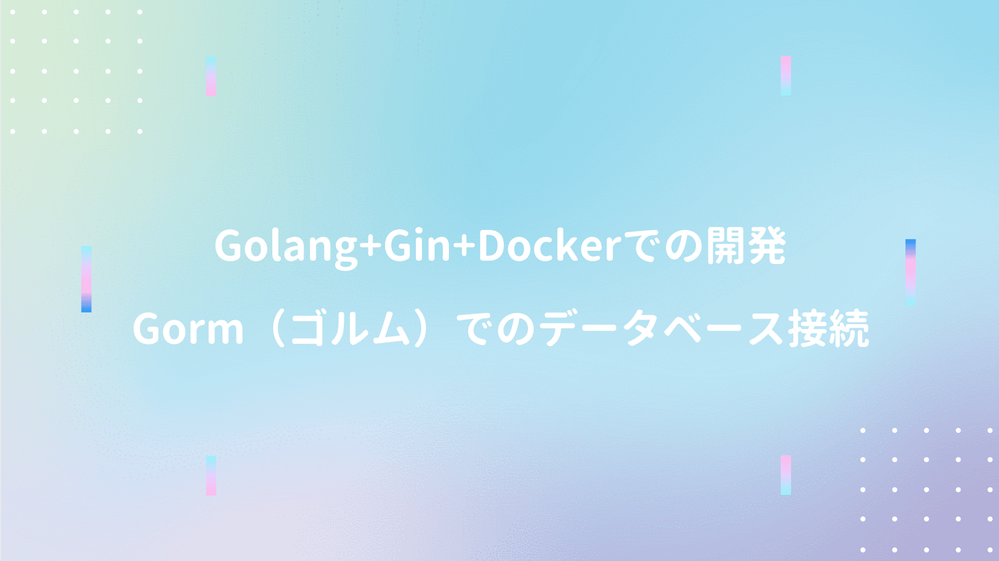

GolangでのDB接続では、GORM利用が多いらしい？ので簡易CRUDを試してみた。

## Docker環境の構築

→ [Golang+Gin+Dockerでの環境構築とJSONレスポンスのRESTfulAPI開発](/post-42/)

## Hello World

プロジェクト配下にmain.goを作成。

```go
package main

import (
	"net/http"
	"github.com/gin-gonic/gin"
)

func setupRouter() *gin.Engine {
	r := gin.Default()
	r.LoadHTMLGlob("templates/*.html")

	data := "Hello Go/Gin!!"
	r.GET("/", func(c *gin.Context) {
		c.HTML(http.StatusOK, "index.html", gin.H{"data": data})
	})
	return r
}

func main() {
	r := setupRouter()
	r.Run(":8080")
}
```
<br/>

templatesフォルダを作成後、index.htmlを作成。

```html
<!DOCTYPE html>
<html lang="ja">
<head>
    <meta charset="UTF-8">
    <title>Sample App</title>
</head>
<body>
    <h1>{{.data}}</h1>
</body>
</html>
```
<br/>

r.LoadHTMLGlobでHTMLを読み込むディレクトリを指定し、GETメソッドでレンダリング。

## 管理CRUDアプリの構築

データベースは sqlite3 を利用。

```shell
go get github.com/jinzhu/gorm
go get github.com/mattn/go-sqlite3
```
<br/>

main.goにgorm.Modelの標準モデルを定義。

```go
type Todo struct {
	gorm.Model
	// id
	// created_at
	// updated_at
	// deleted_at
	Text   string
	Status string
}
```
<br/>

マイグレーション処理（第一引数：使用するDB　第二引数：ファイル名）

```go 
func dbInit() {
	db, err := gorm.Open("sqlite3", "test.sqlite3")
	if err != nil {
		panic("データベース接続不可(dbInit)")
	}

	// ファイルが無ければ生成、存在すれば処理スキップ
	db.AutoMigrate(&Todo{})
	defer db.Close()
}
```
<br/>

データベースへのINSERT処理を実装。

```go
func dbInsert(text string, status string) {
	db, err := gorm.Open("sqlite3", "test.sqlite3")
	if err != nil {
		panic("データベース接続不可(dbInsert)")
	}
	db.Create(&Todo{Text: text, Status: status})
	defer db.Close()
}
```
<br/>

データベースの全件取得処理を実装（created_atの昇順ソート）

```go
func dbGetAll() []Todo {
	db, err := gorm.Open("sqlite3", "test.sqlite3")
	if err != nil {
		panic("データベース接続不可(dbGetAll)")
	}
	var todos []Todo
	db.Order("created_at desc").Find(&todos)
	db.Close()
	return todos
}
```
<br/>

データベースから指定レコード取得を実装。

```go
func dbGetOne(id int) Todo {
	db, err := gorm.Open("sqlite3", "test.sqlite3")
	if err != nil {
		panic("データベース接続不可(dbGetOne)")
	}
	var todo Todo
	db.First(&todo, id)
	db.Close()
	return todo
}
```
<br/>

データベースへの更新処理を実装。

```go
func dbUpdate(id int, text string, status string) {
	db, err := gorm.Open("sqlite3", "test.sqlite3")
	if err != nil {
		panic("データベース接続不可(dbUpdate")
	}
	var todo Todo
	db.First(&todo, id)
	todo.Text = text
	todo.Status = status
	db.Save(&todo)
	db.Close()
}
```
<br/>

データベースへの削除処理を実装。

```go
func dbDelete(id int) {
	db, err := gorm.Open("sqlite3", "test.sqlite3")
	if err != nil {
		panic("データベース接続不可(dbDelete)")
	}
	var todo Todo
	db.First(&todo, id)
	db.Delete(&todo)
	db.Close()
}
```

## メソッド呼び出し

文字列のデータ変換に必要な [strconv](https://golang.org/pkg/strconv/) をインポート。

```go
import (
	"strconv"
	"net/http"
	"github.com/gin-gonic/gin"
	"github.com/jinzhu/gorm"
	_ "github.com/mattn/go-sqlite3"
)
```
<br/>

main.goに各URL毎のデータベース接続処理を実装。

```go
func setupRouter() *gin.Engine {

	r := gin.Default()
	r.LoadHTMLGlob("templates/*.html")

	// マイグレーション
	dbInit()

	// Index
	r.GET("/", func(c *gin.Context) {
		todos := dbGetAll()
		c.HTML(http.StatusOK, "index.html", gin.H{"todos": todos})
	})

	// Create
	r.POST("/new", func(c *gin.Context) {
		text   := c.PostForm("text")
		status := c.PostForm("status")
		dbInsert(text, status)
		c.Redirect(http.StatusFound, "/")
	})

	// Detail
	r.GET("/detail/:id", func(c *gin.Context) {
		n := c.Param("id")

		// string型 → int型に型変換
		id, err := strconv.Atoi(n)
		if err != nil {
			panic(err)
		}
		todo := dbGetOne(id)
		c.HTML(http.StatusOK, "detail.html", gin.H{"todo": todo})
	})

	// Update
	r.POST("/update/:id", func(c *gin.Context) {
		n := c.Param("id")
		id, err := strconv.Atoi(n)
		if err != nil {
			panic("ERROR")
		}
		text   := c.PostForm("text")
		status := c.PostForm("status")
		dbUpdate(id, text, status)
		c.Redirect(http.StatusFound, "/")
	})

	// 削除確認
	r.GET("/delete_check/:id", func(c *gin.Context) {
		n := c.Param("id")
		id, err := strconv.Atoi(n)
		if err != nil {
			panic("ERROR")
		}
		todo := dbGetOne(id)
		c.HTML(http.StatusOK, "delete.html", gin.H{"todo": todo})
	})

	// Delete
	r.POST("/delete/:id", func(c *gin.Context) {
		n := c.Param("id")
		id, err := strconv.Atoi(n)
		if err != nil {
			panic("ERROR")
		}
		dbDelete(id)
		c.Redirect(http.StatusFound, "/")
	})

	return r
}

func main() {
	r := setupRouter()
	r.Run(":8080")
}
```

## テンプレート

**templates/index.html** を以下のよう定義。

```html
<body>
    <h2>追加</h2>
    <form method="post" action="/new">
        <p>内容<input type="text" name="text" size="30" placeholder="入力してください" ></p>
        <p>状態
            <select name="status">
                <option value="未実行">未実行</option>
                <option value="実行中">実行中</option>
                <option value="終了">終了</option>
            </select>
        </p>
        <p><input type="submit" value="Send"></p>
    </form>
    
    <ul>
        {{ range .todos }}
            <li>内容：{{ .Text }}、状態：{{ .Status }}
                <label><a href="/detail/{{.ID}}">編集</a></label>
                <label><a href="/delete_check/{{.ID}}">削除</a></label>
            </li>
        {{end}}
    </ul>
    </body>
```
<br/>

**templates/detail.html** を以下のように定義。

```html
<body>
    <h2>aaa</h2>
    
    <p>{{.user.ID}}</p>
    <p>{{.user.Name}}</p>
    <p>{{.user.Age}}</p>
    
    <form method="post" action="/update/{{.todo.ID}}">
        <p>内容<input type="text" name="text" size="30" value="{{.todo.Text}}" ></p>
        <p>状態
            <select name="status">
                {{if eq .todo.Status "未実行"}}
                    <option value="未実行" selected>未実行</option>
                    <option value="実行中">実行中</option>
                    <option value="終了">終了</option>
                {{else if eq .todo.Status "実行中"}}
                    <option value="未実行">未実行</option>
                    <option value="実行中" selected>実行中</option>
                    <option value="終了">終了</option>
                {{else}}
                    <option value="未実行">未実行</option>
                    <option value="実行中">実行中</option>
                    <option value="終了" selected>終了</option>
                {{end}}
            </select>
        </p>
        <p><input type="submit" value="Send"></p>
    </form>
    </body>
```
<br/>

**templates/delete.html** を以下のように定義。

```html
<body>
    <h1>削除確認</h1>
    <p>本当に削除しますか？</p>
    <ul>
        <li>内容： {{.todo.Text}}</li>
        <li>状態： {{.todo.Status}}</li>
        <li>作成時間： {{.todo.CreatedAt}}</li>
    </ul>
    
    <form method="post" action="/delete/{{.todo.ID}}">
        <p><input type="submit" value="削除"></p>
        <p><a href="/">戻る</a></p>
    </form>
</body>
```
<br/>

ここまで書けたら実行。

```shell
go run main.go
```

## 参考文献
■ [GoDoc](https://godoc.org/github.com/gin-gonic/gin)  
■ [GORM@公式HP](https://jinzhu.me/gorm/)  
■ [Go言語でORM触ってみた](https://qiita.com/chan-p/items/cf3e007b82cc7fce2d81)  
■ [Go / Gin で超簡単なWebアプリを作る](https://qiita.com/hyo_07/items/59c093dda143325b1859)  
