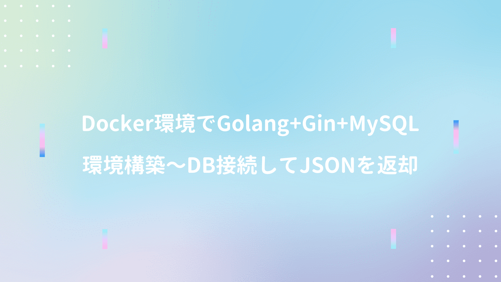

ドメイン駆動設計入門にて **[概念を実装に落とし込むパターン](/post-35/)** を確認し、Goのアーキテクチャ構成を調査すると <span style="color: crimson; font-weight: bold;">レイヤードアーキテクチャ + DDD</span> を解説される方が多かったので、簡単にまとめてみた。

まず **「Go DDD」** で検索すると、検索一覧のトップに **[コチラの記事](https://qiita.com/tono-maron/items/345c433b86f74d314c8d)** が表示される。図解で丁寧に説明され **[githubにサンプルコード](https://github.com/jojoarianto/go-ddd-api)** も用意されているので、最初に読む記事としては良いかもしれない。


```yml
.
├── cmd
│   └── api
│       └── main.go
├── domain                      # エンティティや値オブジェクトなど（構造体定義）
│   └── repository              # インターフェースのみ（実装はinfrastructure層）
|   |   └── user_repository.go
|   └── user.go
├── config
│   └── database.go
├── interfaces                  # FWのコントローラクラス（リクエスト/レスポンス処理）
│   └── handler
│   |   └── user.go
|   └── response
│       └── response.go
├── infrastructure              # DBアクセスなど技術的関心 / DIP（-> domain層）
│   └── persistence
│       └── user.go
└── usecase                     # interface層から銃砲を受け、domain層の関数利用
    └── user.go                 # DDDでのアプリケーションサービス
```
<br/>

Web上では色んな方が解説されているが、レイヤードアーキテクチャなので **インターフェース / ドメイン / インフラストラクチャ / アプリケーション（ユースケース）** の4つの階層（ディレクトリ）は必ず用意し、その他フォルダはお好みで自作しているイメージだろうか。

しかし何となくレイヤードアーキテクチャのディレクトリを用意し、レイヤを切り分ければ良いのではなく **[DIP（依存関係逆転の原則）](https://medium.com/eureka-engineering/go-dependency-inversion-principle-8ffaf7854a55)** 適用するために、interfaceで抽象の公開に注力することが大切だと <span style="color: crimson; font-weight: bold;">リクルートライフスタイル</span> さんの記事でも紹介されている。
 
■ [Goのpackage構成と開発のベタープラクティス](https://engineer.recruit-lifestyle.co.jp/techblog/2018-03-16-go-ddd/)  

上記リンク先の記事では、フレームワーク等を利用しない単純な構成で、package構成の意図やインターフェースの実装例が紹介されている（個人的にはこの構成が一番良い気がする）

ちなみにリクルート記事内でGunosyのパッケージ構成も紹介されている（変遷が面白い）

■ [Goのパッケージ構成の失敗遍歴と現状確認](https://medium.com/@timakin/go%E3%81%AE%E3%83%91%E3%83%83%E3%82%B1%E3%83%BC%E3%82%B8%E6%A7%8B%E6%88%90%E3%81%AE%E5%A4%B1%E6%95%97%E9%81%8D%E6%AD%B4%E3%81%A8%E7%8F%BE%E7%8A%B6%E7%A2%BA%E8%AA%8D-fc6a4369337)

```yml
.
├── application                    # レイヤードアーキテクチャでのapplication層
│   └── usecase                    # DDDでのアプリケーションサービスを配置
│       ├── xxx_usecase.go
│       └── yyy_usecase.go
├── domain                         # レイヤードアーキテクチャでのdomain層
│   ├── model                      # DDDでのエンティティ／値オブジェクト
│   ├── repository                 # DDDでのリポジトリ
│   │   └── xxx_repository.go      # interfaceのみ定義（実装はinfrastructure層）
│   └── service                    # DDDでのドメインサービス
├── infrastructure                 # レイヤードアーキテクチャでのinfrastructure層
│   └── persistence                # 永続化の実装方式に応じてサブパッケージを切る
│       └── datastore              # データベース接続を想定
│           └── xxx_repository.go
├── interfaces                     # レイヤードアーキテクチャでのUI層
│   └── api                        # httpを想定(標準出力等は別パッケージを切る)
│       └── server
│           ├── auth
│           ├── handler
│           │   ├── app_handler.go
│           │   ├── xxx_handler.go
│           │   └── yyy_handler.go
│           ├── httputils
│           ├── middleware
│           └── router
└── registry                       # DI解決のためのオブジェクト生成ルール
    └── registry.go
```
<br/>

またIIJさんの記事では **DDD + クリーンアーキテクチャ** のアーキテクチャを紹介されているが、構成がほぼほぼ同じなので、多くの有識者の方に支持されるアーキテクチャかもしれない（業務でここまで綺麗な構成のシステムに出会った事がないので、使用感は何とも言えないけど・・・）

■ [go言語でクリーンアーキテクチャっぽいもの](https://eng-blog.iij.ad.jp/archives/2442)

リクルートさんの記事以上に、図解で丁寧に説明されており、各レイヤ間の依存関係や役割が可視化されて理解しやすい。昨今クラウド環境が発達で、選択肢も増えているので、handler（httpsとpubsub等）やpersistence（RDBSとNoSQL等）のサブディレクトリを切るのが良さげです。


## その他参考記事
■ [Golang + レイヤードアーキテクチャ - DDDを意識してWebAPIを実装してみる](https://yyh-gl.github.io/tech-blog/blog/go_web_api/)  