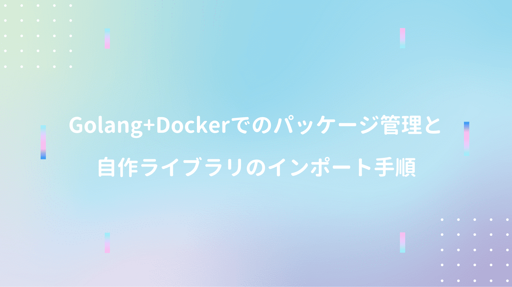

Golang + Docker環境下で、自作ライブラリを呼び出す手順の備忘録。

## Docker環境構築

環境構築のベースは **[こちらの記事](/post-44/)** を参考に実施。

加えて **Dockerfile** を以下のとおりに修正する。

```yml
FROM golang:latest

WORKDIR /go/src/app

ENV GO111MODULE=on

# ここから下は好みで（Ginを使わない場合は不要）
RUN go get github.com/gin-gonic/gin
RUN go get github.com/jinzhu/gorm
RUN go get github.com/go-sql-driver/mysql
```
<br/>

Dockerの起動を確認して、コンテナへの接続を実施。

```yml
docker-compose up -d
docker-compose exec app bash
```

## go.mod作成

プロジェクト直下で以下のコマンドを実行。

```yml
go mod init project_name

# 実行結果
# go: creating new go.mod: module project_name
```
<br/>

プロジェクト直下に **go.mod** が作成される。

```yml
module app

go 1.14
```

## 自作ライブラリのインポート

**/project/lib/lib.go** を作成。

```go
package lib

func Convert(str string) string {
	return "test" + str
}
```
<br/>

**/project/main.go** を以下のように作成。

```go
package main

import (
	"fmt"
	"app/lib"
)

func main() {
	fmt.Println("Hello World")
	fmt.Println(lib.Convert("hello"))
}
```
<br/>

main.goを実行すると、自作ライブラリの呼び出しを確認できる。

## その他参考記事
■ [Go言語(1.13)で自作ライブラリをimportする](https://qiita.com/taku-yamamoto22/items/4d6f9ff8451a0b86997b)  
■ [Go 1.12 の開発環境と本番環境の Dockerfile を考える](https://qiita.com/takasp/items/c6288d4836e79801bb19)  
■ [GOPATH モードからモジュール対応モードへ移行せよ](https://qiita.com/spiegel-im-spiegel/items/5cb1587cb55d6f6a34d7)  
■ [Docker for MacでGoの実行環境を作る](https://qiita.com/masakurapa/items/fa867451053e41b69126)  
■ [Go Modules](https://qiita.com/propella/items/e49bccc88f3cc2407745)  