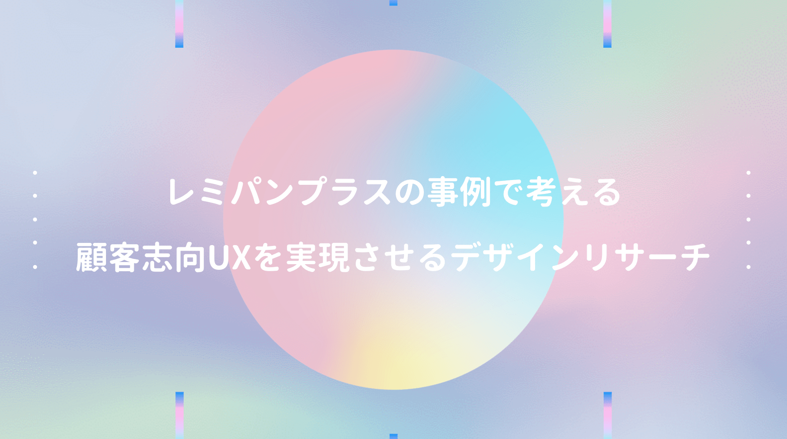

Web開発の現場では **UI/UX** という言葉を度々耳にするが、正直理解が曖昧だった。このままではマズいと本を手に取るも、どうにも抽象的な表現が多く、頭の中のモヤモヤは今も完全には消えていない。

**そもそもUXとは何かについて、直訳すれば「ユーザーの体験」となる。**

本からのイメージは、商品・サービスを通じて、今までとは一味違う体験が出来たり、マイナスからの問題解決で好ましい感情をもたらすとか、とにかく利用者や社会をポジティブにするといったもの。

<a href="https://hb.afl.rakuten.co.jp/hgc/146fe51c.1fd043a3.146fe51d.605dc196/yomereba_main_202007092105376388?pc=http%3A%2F%2Fbooks.rakuten.co.jp%2Frb%2F14584960%2F%3Fscid%3Daf_ich_link_urltxt%26m%3Dhttp%3A%2F%2Fm.rakuten.co.jp%2Fev%2Fbook%2F" target="_blank" >UX×Biz　Book</a>
posted with <a href="https://yomereba.com" rel="nofollow" target="_blank">ヨメレバ</a>

明海司/井登友一 マイナビ出版 2016年12月    

<a href="https://hb.afl.rakuten.co.jp/hgc/146fe51c.1fd043a3.146fe51d.605dc196/yomereba_main_202007092105376388?pc=http%3A%2F%2Fbooks.rakuten.co.jp%2Frb%2F14584960%2F%3Fscid%3Daf_ich_link_urltxt%26m%3Dhttp%3A%2F%2Fm.rakuten.co.jp%2Fev%2Fbook%2F" target="_blank" >楽天ブックス</a>

<a href="https://www.amazon.co.jp/exec/obidos/asin/4839959064/kanon123-22/" target="_blank" >Amazon</a>

<a href="https://www.amazon.co.jp/gp/search?keywords=UX%C3%97Biz%E3%80%80Book&__mk_ja_JP=%83J%83%5E%83J%83i&url=node%3D2275256051&tag=kanon123-22" target="_blank" >Kindle</a>
                              	  	  	  	  	

 

上に紹介した本では、色んな専門家が様々な視点からUXを語っているが、私が一番理解しやすかったのは、デザインリサーチ を活用した平野レミ考案のレミパンプラスの事例だった。

デザインリサーチにも色々な手法があるらしいが、どの手法にも共通するのが、人の行動だけを観察するのではなく、むしろ人を取り巻く環境の文脈的状況との相互関係を分析すること だとされている。

例として、平日夜の就寝時間は、完全な自由意思ではなく、朝から重要な客先MTGがあれば、遅刻して迷惑をかけないよう前日の夜更かしを避けるし、夏の電車移動では、厳しい日差しと熱風にさらされるJRの地上駅より、多少時間がかかっても、冷房が効いた地下鉄利用の選択肢も有り得る。

人間の行動と心理の多くは、かなりコンテクストに依存しているので、客観的に観察すると、一見不合理な行動を無意識で行う事が多く、本人が言語化出来ないことは意外に多いらしい。

さてレミパンプラスの事例だが、もし自分がフライパンを新規開発するとなった時、どんな商品なら売れると考えるだろうか。小型で軽量で、収納場所をとらないとか？

勿論この機能性も重要だけど、人間は慣れの動物なので、少し使い辛くてもいずれ慣れてしまう。

そこでレミパンプラスの開発チームは、調理現場での（一般人+プロの調理人の）行動観察調査を実施し、一般人もプロの調理人も同時に複数作業（多分みんな毎日忙しいからだと思う）を行っていることに気付き、更に菜箸やトング、計量スプーンの置き場に困る様子が目立っていたそうだ。

火で熱している鍋に一時置きすると、取手のプラ部分が焼け焦げるし、かと言ってシンクに置くのは衛生的に微妙。都度洗って拭き取る行為など、無意識に無駄な行動をするケースが多かった。

フライパンに焦点を当てず、一連の調理行動中でフライパンの使われ方を俯瞰した視点として、お玉、ヘラ、菜箸など各種キッチンツールとフライパンをどうデザインすれば、課題を解決出来るか？

この課題を真剣に考えた結果、フライパンの取手部分のマグネットを入れ、トングやお玉を置けるようにしたとか。いずれ競合他社に真似はされるけど、この事例でUXの本質が一瞬垣間見えた気がした。

あとユーザーは ニーズを語るプロ ではなく、自身のニーズを明確に言葉として表現出来る割合は5%程度に過ぎない話も印象深かった。デザインリサーチで分かる無意識の行為にこそ、語られることのない95%の潜在的なニーズがあり、顧客の期待価値が隠れているのかなぁ〜と。