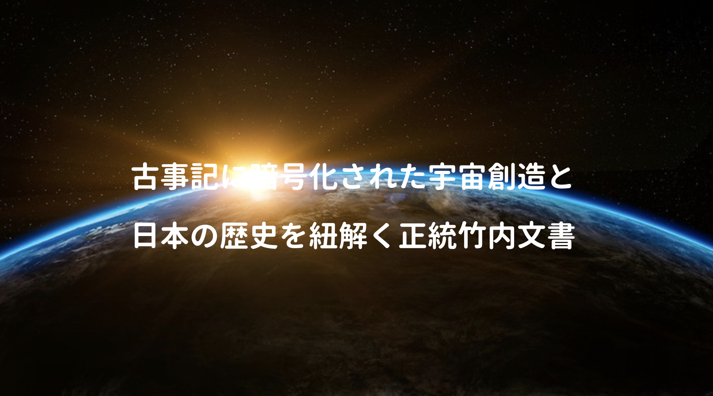
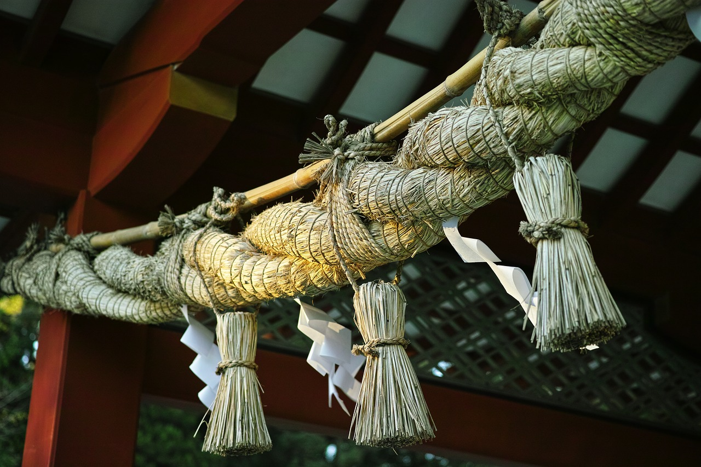

第73世武内宿禰として有名な竹内睦泰氏が書かれた「古事記と宇宙」。

第74世が決まっていない今、門外不出と言われる帝王日嗣の一部を話せる範囲で語られている。

**宇宙の始まりは!? 日本とは!? 日本人とは!?**

古事記には多くの秘密が暗号化されているので、記紀を把握されている方には興味深い内容ばかり。

当然信じるか信じないかはあなた次第と言った感じだけど。

<a href="https://hb.afl.rakuten.co.jp/hgc/146fe51c.1fd043a3.146fe51d.605dc196/yomereba_main_201901131307491961?pc=http%3A%2F%2Fbooks.rakuten.co.jp%2Frb%2F14509290%2F%3Fscid%3Daf_ich_link_urltxt%26m%3Dhttp%3A%2F%2Fm.rakuten.co.jp%2Fev%2Fbook%2F" target="_blank"  rel="noopener noreferrer">古事記の宇宙</a>
posted with <a href="https://yomereba.com" rel="nofollow noopener noreferrer" target="_blank">ヨメレバ</a>

竹内睦泰 青林堂 2016年11月02日    

<a href="https://hb.afl.rakuten.co.jp/hgc/146fe51c.1fd043a3.146fe51d.605dc196/yomereba_main_201901131307491961?pc=http%3A%2F%2Fbooks.rakuten.co.jp%2Frb%2F14509290%2F%3Fscid%3Daf_ich_link_urltxt%26m%3Dhttp%3A%2F%2Fm.rakuten.co.jp%2Fev%2Fbook%2F" target="_blank"  rel="noopener noreferrer">楽天ブックス</a>

<a href="https://www.amazon.co.jp/exec/obidos/asin/4792605709/kanon123-22/" target="_blank"  rel="noopener noreferrer">Amazon</a>

<a href="https://www.amazon.co.jp/gp/search?keywords=&__mk_ja_JP=%83J%83%5E%83J%83i&url=node%3D2275256051&tag=kanon123-22" target="_blank"  rel="noopener noreferrer">Kindle</a>
                              	  	  	  	  	

ちなみに続編では卑弥呼にも言及されている。

## 著者・竹内睦泰氏とは!?

大学受験予備校で日本史講師されていた通称・むっちゃん。

また神主（古神道宗家)であり、第73世武内宿禰でも有名な方。

武内宿禰とは歌舞伎のように代々襲名されるもので、竹内神道は秘密結社と言われている。

何だか秘密結社と言われると随分胡散臭い気もするが、どうも竹内神道は別に人を救う気は泣く、ただただ祈り、ただただ歴史を伝えていく(口伝)団体。

https://www.youtube.com/watch?v=9uycqoY3WbE

由緒正しい家柄ですが、金が無いらしい。

## 武内宿禰とは!?

記紀に伝わる古代日本の人物。

孝元天皇(8代)の子孫であり、歴代天皇（第12代から第16代）に仕えたといわれる伝説上の忠臣であり、以下の神社で今も祀られている。

・気比神宮（福井県敦賀市)

・宇倍神社（鳥取県鳥取市)

・高良大社（福岡県久留米市)

まあお名前を耳にする機会は無いけど、教科書にも出てきた蘇我氏の祖先(他にも紀氏・巨勢氏・平群氏・葛城氏など中央有力豪族の祖先でもある)らしく、明治時代には1円札の肖像画にもなっている。

## 竹内文書の信憑性

**竹内文書ってオカルトなのか!?**

まず「竹内文書」と聞けば、いわゆる茨城の「竹内文書」があり、武内宿禰が飛行船で世界旅行したり、イエス・キリストが3世紀頃に来日して名前が八戸太郎天空だったとか色々あるが、竹内睦泰氏曰く、これは嘘の話であり、元々門外不出で面に出してはいけないと。

ちなみに本書の中で、茨城竹内文書は明治期に竹内と称した家に養子に入った者(竹内巨麿ら)が、真の竹内家の口伝であると主張するも、茨城の竹内家とは正統な竹内家とは家の繋がりは無い。

ただ代々竹内家の墓守をしていた地下人だったらしく、竹内家の宴会(参加は出来ないけど)の席で漏れ聞こえてくる雑口伝を元に、奇想天外な話を作り上げたとか。

そうは言いつつ、第73世武内宿禰さん本人も実際に口伝の出来事を見聞きした訳ではなく、代々伝わる口伝を伝えているだけなので、本当かどうかは分からないと動画では正直にお話されている。

## 宇宙創成と超ひも理論

古事記は決して荒唐無稽な話ではなく、現代科学が証明する内容に近いと。

元々宇宙には無があり、記紀には登場していないだけで、造花三神以前にも多くの神がいらっしゃり、また造花三神の一柱であるアメノミナカヌシは宇宙そのもので、宇宙の運行を司る神。

そして造花三神の残り二柱は神皇産霊神(たかみむすひ)と神皇産霊神(かみむすひ)、「結び」という語が入っているが、凝縮するという意味、つまり神皇産霊神が誕生した時、ビッグバンが発生。

また竹内睦泰氏は都内のバーで有名な学者(インフレーション・ひも理論)と話す機会があり、その方の話が竹内家に伝わる口伝(帝王日嗣)の宇宙創造の話と、とても似通っている事に気づいたらしい。

そもそも[紐理論](http://www2.yukawa.kyoto-u.ac.jp/~shigeki.sugimoto/YITP50.pdf)が難しすぎて、私の低スペックな脳で理解出来るはずはない。学校では物質の最小構成要素は原子や分子で説明されていたが、時代に進むにつれ、粒子やクォークが発見され、頭の良い学者が出した結論は、万物の根源である素粒子は極小の紐と考えると全てのつじつまが合うって感じかな。

神道で何となくそれを連想させる身近なものがある。

神社のしめ縄もものすごい力で結ばれる。

宇宙は一度凝縮し、今でも膨張を続けている。

そして古事記上では神皇産霊神(たかみむすひ)の頃、ぎゅっ、ぎゅっ、ぎゅっと結び、爆発の前に凝縮があり、神皇産霊神(かみむすひ)の時に爆発的に宇宙が広がっていき、多くの神が生まれている。

## 日本から始まる世界の歴史

竹内睦泰氏の歴史授業も拝見したが、まず縄文時代と日本の歴史を振り返る。

・縄文時代は1万3000年前から(教科書では1万2000年となっている)と伝わっている.

・縄文土器の存在は科学的な分析(放射性炭素c14年代測定法)からも明らかである.

・日本人が縄文土器で最初にワインを作った(またリゾットも食べていた)

・縄文時代は氷河期で、火山国である日本は人類が住める暖かい場所だった.

シュメール・メソポタミアや中国4000年の歴史も凄いけど、日本はもっと歴史ある国。

https://www.youtube.com/watch?v=VSYEaJ5hnjs&t=1148s

+αの内容で日本が出来る迄（[参考リンク](https://www.kubota.co.jp/siryou/pr/urban/pdf/11/pdf/11_2_1.pdf)）

◼︎ 氷河期〜日本列島形成まで

・地球の歴史上、約2万年前にはウルム氷期（最終氷期）のピーク.

・それから徐々に温暖化になり、南極の氷が溶け出す.

・ユーラシア大陸と陸続きだった日本が水位の上昇で今の形になる.

・日本海は存在せず、元々は大きな湖だった.

ここからはムー動画の内容も含めて神話の世界。

・日本列島が形成される中、大陸に渡る人と日本に残る人に別れる.

・大陸に渡る際、陸地経由(朝鮮など)と海経由で渡る民族に別れる.

・それらの民族が現在のイラン周辺に辿り着き、文明を起こす.

・辿り着いた部族(祭祀)をスメル族と呼び、頂点が天皇(スメラミコト).

・スメルが訛ってシュメールとなる.

・もう一方でスサという都市が形成され、スサの王(スサノオ)がいた.

Googleマップ上でSusaを確認できる。

## 天孫降臨〜神武東征

古事記では天孫から瓊瓊杵尊が日向の高千穂に降り立っているが、どう捉えれば良いのか？

・スメル(天照系)はインドやインドネシア等を経由して宮崎の高千穂に辿り着く.

・一方スサノオ(出雲系)はユーラシア大陸を経由し辿り着き、出雲に拠点を置く.

・古代では天照系と素戔嗚系は戦争をしており、一旦は素戔嗚系が勝利を収める.

・その時に誓約生み(肉体関係)を結び、その時に生まれたのが宗方三神.

・この戦争の時、天照の夫だったオシホミミは戦死(名前に3回も勝がある)

・天照側は素戔嗚が死ねば勝てると思い、しばらくして再度戦争.

・タケミカヅチが出雲軍(主にタケミナカタ)を倒し、天照側が日本の頂点に立つ.

結局、古事記にはどのような暗号が隠されていたのか!?

記紀の中では縦の系譜(祖父-父-子-孫)で説明されていたが、実は横の系譜(実の夫や兄弟だったり)になったり、神話上でオブラートに隠されていた事も部族同士の争いなどをモチーフにしていたり、それが神の名前に現れていたり。

また正統竹内文書では、元々日本にいた人が中東周辺に辿り着き、そこからまた帰ってきたというスタンスなので、都市伝説で出てくるイスラエルの生き残りが日本に来た系の話に若干似ているかも。