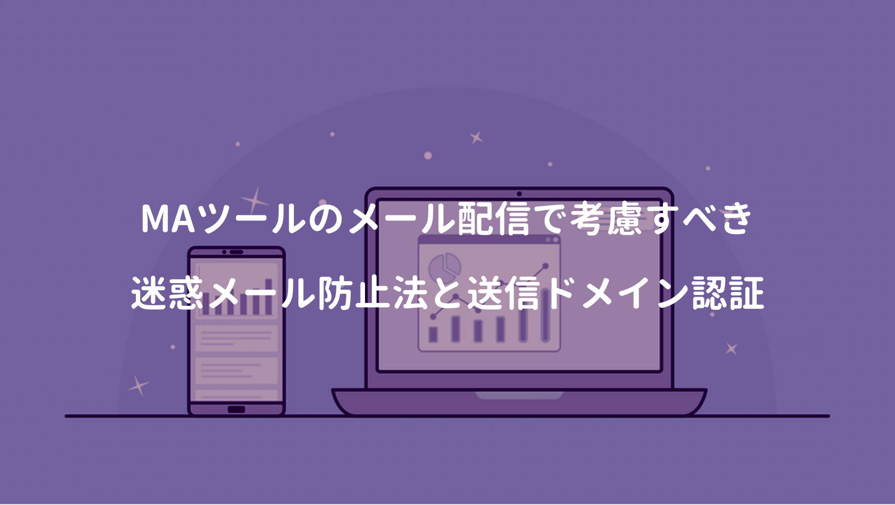

MAツール開発に携わると、メール絡みの法律やメール配信の仕組みにも気を配らなければならない。

知っておくべき法律の一つが **迷惑メール防止法（特定電子メール法）**で、この法律では営利目的の企業や個人事業主が、広告・宣伝のために送信するメールを **特定電子メール** と定めている。

特定電子メールでは、オプトイン・オプトアウト・送信者の氏名または名称の明記が義務付けられる。

<a href="https://hb.afl.rakuten.co.jp/hgc/146fe51c.1fd043a3.146fe51d.605dc196/yomereba_main_202008022254551036?pc=http%3A%2F%2Fbooks.rakuten.co.jp%2Frb%2F14665971%2F%3Fscid%3Daf_ich_link_urltxt%26m%3Dhttp%3A%2F%2Fm.rakuten.co.jp%2Fev%2Fbook%2F" target="_blank" >実践マーケティングオートメーション</a>
posted with <a href="https://yomereba.com" rel="nofollow" target="_blank">ヨメレバ</a>

永井俊輔/できるシリーズ編集部 インプレス 2017年02月    

<a href="https://hb.afl.rakuten.co.jp/hgc/146fe51c.1fd043a3.146fe51d.605dc196/yomereba_main_202008022254551036?pc=http%3A%2F%2Fbooks.rakuten.co.jp%2Frb%2F14665971%2F%3Fscid%3Daf_ich_link_urltxt%26m%3Dhttp%3A%2F%2Fm.rakuten.co.jp%2Fev%2Fbook%2F" target="_blank" >楽天ブックス</a>

<a href="https://www.amazon.co.jp/exec/obidos/asin/4295000507/kanon123-22/" target="_blank" >Amazon</a>

<a href="https://www.amazon.co.jp/gp/search?keywords=%E5%AE%9F%E8%B7%B5%E3%83%9E%E3%83%BC%E3%82%B1%E3%83%86%E3%82%A3%E3%83%B3%E3%82%B0%E3%82%AA%E3%83%BC%E3%83%88%E3%83%A1%E3%83%BC%E3%82%B7%E3%83%A7%E3%83%B3&__mk_ja_JP=%83J%83%5E%83J%83i&url=node%3D2275256051&tag=kanon123-22" target="_blank" >Kindle</a>
                              	  	  	  	  	

 

2019年時点で国内の迷惑メール件数は **1日に7億5千通** と言われ、全電子メールの約44%を占められており、迷惑メールから一般消費者を守るために制定されたらしい。

迷惑メールの詳細は、参考文献の迷惑メール白書を読んでみると、実態を窺い知れると思う。

## オプトインとオプトアウト

まず迷惑メール被害から、一般消費者を守るための施策に **オプトイン** と **オプトアウト** がある。

**オプトイン** は**「事前の同意」**のことで、事前に相手から同意を得なければ、メール送信出来ないが、メールアドレスを名刺など書面で通知した場合は、オプトインを取得したとみなされる。

私の関わっているMAツールでは、リード登録時にメール配信の希望有無を選択できる。名刺等で事前に対象者のメールアドレスを知っていれば「希望する」を選択し、その他のリード（Unknown等）は、フォームでの問い合わせ時にオプトインを取得する仕組みになっていた。

**オプトアウト** は**「受信拒否の通知」**を意味し、相手から申し出があった場合にメール配信を中止する仕組みだが、一般的には受信メールの下部に **配信停止フォーム** へのURLを記載し、オプトアウト出来る仕組みが提供されている（たまに配信停止リンクが無いメルマガも見受けられるけど）

ちなみに2017年に **改正個人情報保護法** が施行される迄は、ユーザーの受信承諾が不要で、ユーザーが受信拒否（オプトアウト）を行わない限り、メールを送り続けることが可能だった...が、まだまだ迷惑メール問題は解決してないっぽい。

## 送信ドメイン認証

メール配信を行う場合、自社のメールアドレス（送信元アドレスが自社ドメイン）から、MAツールのメールサーバを経由して配信が行われる。しかしこの場合、両者のドメインが一致せず、メールアプリによっては迷惑メール扱いされ、メールの到達率や開封率が著しく低下する恐れがある。

そのような事態を防ぐため、MAツールでは、メールの送信元が正規のものであると証明する **送信ドメイン認証** の仕組みが用意されており、**SPF** と **DKIM** の設定が一般的となっている。

**SPF** では、まず送信側メールアドレスのIPアドレスをDNSに登録。受信側は送信元ドメインを管理するDNSからSPFレコードを取得し、送信元メールサーバのIPアドレスと一致するか確認する仕組み。

**DKIM** は電子署名で認証を実施する。送信側メールサーバの公開鍵をDNSに登録し、送信側メールサーバは自身の秘密鍵で電子署名を付けて送信する。受信側ではDNSより公開鍵を取得し、電子署名を検証することで、なりすましや改ざんの有無をチェックできる。

迷惑メール白書ではSPFとDKIMで検証したドメイン名と、メールソフトで表示される送信元アドレスのドメイン名が一致しているかチェックするDMARKが紹介されている。日本国内での普及率は低いが、米国や英国では高い水準で採用されているので、そのうち日本でも必須になるかも。

## 参考文献
■ [迷惑メール白書](https://www.dekyo.or.jp/soudan/aspc/wp.html)  
■ [SPF・DKIMの特徴と違い](https://sendgrid.kke.co.jp/blog/?p=10121)  
■ [迷惑メール対策に必要な「SPF」と「DKIM」とは？](https://baremail.jp/blog/2019/06/07/138/)  
■ [バウンスメールとは？その仕組みと原因、対策について](https://www.onemarketing.jp/lab/lead-nurturing/bounce-mail_171)  
■ [エンベロープ（envelope）From/To とヘッダーのFrom/To](https://www.cuenote.jp/documents/smtp/000204.html)  
■ [メール設定で最初につまずくSMTP・POP・IMAP その意味＆設定方法は？](https://time-space.kddi.com/ict-keywords/kaisetsu/20170824/2081) 