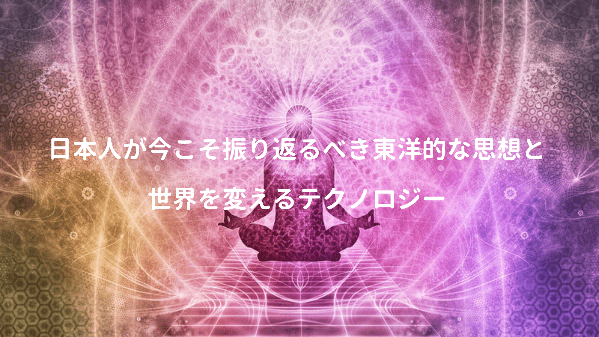

実業家や筑波大学教員として働く傍、アーティストとしても活動する現代の魔術師・落合陽一氏。

最近テレビで観る機会も増えた同氏だが、以前に出版された日本再興戦略を読んでみたら、一般的な抽象論に終始することなく、日本を再興するため各人が何をすべきなのか、具体的に書かれていたこと、そして多方面における博識ぶりに大変感銘を受けた。

<a href="https://hb.afl.rakuten.co.jp/hgc/146fe51c.1fd043a3.146fe51d.605dc196/yomereba_main_201902052131530486?pc=http%3A%2F%2Fbooks.rakuten.co.jp%2Frb%2F15238997%2F%3Fscid%3Daf_ich_link_urltxt%26m%3Dhttp%3A%2F%2Fm.rakuten.co.jp%2Fev%2Fbook%2F" target="_blank"  rel="noopener noreferrer">日本再興戦略</a>
posted with <a href="https://yomereba.com" rel="nofollow noopener noreferrer" target="_blank">ヨメレバ</a>

落合陽一 幻冬舎 2018年01月29日    

<a href="https://hb.afl.rakuten.co.jp/hgc/146fe51c.1fd043a3.146fe51d.605dc196/yomereba_main_201902052131530486?pc=http%3A%2F%2Fbooks.rakuten.co.jp%2Frb%2F15238997%2F%3Fscid%3Daf_ich_link_urltxt%26m%3Dhttp%3A%2F%2Fm.rakuten.co.jp%2Fev%2Fbook%2F" target="_blank"  rel="noopener noreferrer">楽天ブックス</a>

<a href="https://www.amazon.co.jp/exec/obidos/asin/4344032179/kanon123-22/" target="_blank"  rel="noopener noreferrer">Amazon</a>

<a href="https://www.amazon.co.jp/gp/search?keywords=%93%FA%96%7B%8D%C4%8B%BB%90%ED%97%AA&__mk_ja_JP=%83J%83%5E%83J%83i&url=node%3D2275256051&tag=kanon123-22" target="_blank"  rel="noopener noreferrer">Kindle</a>
                              	  	  	  	  	

どうも暗いニュースが多い昨今の日本、ネガティブな意識に苛まれる事も多い。

そんな中ここまで日本の事を想い、どうすれば日本を再興できるか、具体的なグランドデザインを描く同氏の考えを知ることは、各人に良いキッカケになるかも。

## 欧米というユートピア

まず普段何気に使っている「欧米」という言葉。

しかし実際には欧州と米国は全く別の国であり、そもそも欧米という言葉は存在しない。

欧州と言っても、イギリスもフランスもドイツも全く異なる別の国だし、イギリスもイングランド、ウェールズ、スコットランド、北アイルランドで民族性も全く異なるので、同一視するとアイデンティティーを軽視する可能性に繋がるし、何となく欧州と米国を同一視して「欧米」と総称している。

今までタカアンドトシの「欧米か!!」のツッコミにも、何も違和感を感じなかったが、まず本書ではこれから日本再興のために、自分達は何が得意なのか、そして何が向いているのかを知るため、自国の歴史(日本のルーツや東洋的な考え方)を振り返る必要があると!!

## 頭で理解出来る西洋哲学

明治時代に欧州型、終戦後に米国型のスタイルが導入され、勿論良い面もあっただろうけど、日本には適合しない西洋的価値観も多く、色んな所で歪みが出てしまった現代社会。

古来より東洋的な考え方を育んできた日本人は、今一度根底にある東洋的思想を学ぶ事を落合氏も提唱されており、私自身も大いに賛成だが、東洋哲学って本を読んでもいまいち腑に落ちない(;^_^ 

ちなみに西洋的思想は落合氏曰く、そもそも西洋の精神の根底には個人主義があり、皆が理解する権利があると考えられるので、読み手が理解出来るよう書き手側に大きな責任が負わされている。

飲茶氏が書かれた書籍では、ここらへんを分かりやすく説明されていた。

<a href="https://hb.afl.rakuten.co.jp/hgc/146fe51c.1fd043a3.146fe51d.605dc196/yomereba_main_201901291858022308?pc=http%3A%2F%2Fbooks.rakuten.co.jp%2Frb%2F13441671%2F%3Fscid%3Daf_ich_link_urltxt%26m%3Dhttp%3A%2F%2Fm.rakuten.co.jp%2Fev%2Fbook%2F" target="_blank"  rel="noopener noreferrer">史上最強の哲学入門</a>
posted with <a href="https://yomereba.com" rel="nofollow noopener noreferrer" target="_blank">ヨメレバ</a>

飲茶 河出書房新社 2015年11月06日    

<a href="https://hb.afl.rakuten.co.jp/hgc/146fe51c.1fd043a3.146fe51d.605dc196/yomereba_main_201901291858022308?pc=http%3A%2F%2Fbooks.rakuten.co.jp%2Frb%2F13441671%2F%3Fscid%3Daf_ich_link_urltxt%26m%3Dhttp%3A%2F%2Fm.rakuten.co.jp%2Fev%2Fbook%2F" target="_blank"  rel="noopener noreferrer">楽天ブックス</a>

<a href="https://www.amazon.co.jp/exec/obidos/asin/4309414133/kanon123-22/" target="_blank"  rel="noopener noreferrer">Amazon</a>

<a href="https://www.amazon.co.jp/gp/search?keywords=%8Ej%8F%E3%8D%C5%8B%AD%82%CC%93N%8Aw%93%FC%96%E5&__mk_ja_JP=%83J%83%5E%83J%83i&url=node%3D2275256051&tag=kanon123-22" target="_blank"  rel="noopener noreferrer">Kindle</a>
                              	  	  	  	  	

## 西洋における超人思想

更に西洋的思想を知る上でヒントになる本ではユヴァル・ノア・ハラリ氏（挫折する人も多いけど）

<a href="https://hb.afl.rakuten.co.jp/hgc/146fe51c.1fd043a3.146fe51d.605dc196/yomereba_main_201902072209057933?pc=http%3A%2F%2Fbooks.rakuten.co.jp%2Frb%2F14385169%2F%3Fscid%3Daf_ich_link_urltxt%26m%3Dhttp%3A%2F%2Fm.rakuten.co.jp%2Fev%2Fbook%2F" target="_blank"  rel="noopener noreferrer">サピエンス全史（上）</a>
posted with <a href="https://yomereba.com" rel="nofollow noopener noreferrer" target="_blank">ヨメレバ</a>

ユヴァル・ノア・ハラリ/柴田 裕之 河出書房新社 2016年09月09日    

<a href="https://hb.afl.rakuten.co.jp/hgc/146fe51c.1fd043a3.146fe51d.605dc196/yomereba_main_201902072209057933?pc=http%3A%2F%2Fbooks.rakuten.co.jp%2Frb%2F14385169%2F%3Fscid%3Daf_ich_link_urltxt%26m%3Dhttp%3A%2F%2Fm.rakuten.co.jp%2Fev%2Fbook%2F" target="_blank"  rel="noopener noreferrer">楽天ブックス</a>

<a href="https://www.amazon.co.jp/exec/obidos/asin/430922671X/kanon123-22/" target="_blank"  rel="noopener noreferrer">Amazon</a>

<a href="https://www.amazon.co.jp/gp/search?keywords=%83T%83s%83G%83%93%83X%91S%8Ej%81i%8F%E3%81j&__mk_ja_JP=%83J%83%5E%83J%83i&url=node%3D2275256051&tag=kanon123-22" target="_blank"  rel="noopener noreferrer">Kindle</a>
                              	  	  	  	  	

<a href="https://hb.afl.rakuten.co.jp/hgc/146fe51c.1fd043a3.146fe51d.605dc196/yomereba_main_201902072209417916?pc=http%3A%2F%2Fbooks.rakuten.co.jp%2Frb%2F15546610%2F%3Fscid%3Daf_ich_link_urltxt%26m%3Dhttp%3A%2F%2Fm.rakuten.co.jp%2Fev%2Fbook%2F" target="_blank"  rel="noopener noreferrer">ホモ・デウス　上</a>
posted with <a href="https://yomereba.com" rel="nofollow noopener noreferrer" target="_blank">ヨメレバ</a>

ユヴァル・ノア・ハラリ/柴田 裕之 河出書房新社 2018年09月05日    

<a href="https://hb.afl.rakuten.co.jp/hgc/146fe51c.1fd043a3.146fe51d.605dc196/yomereba_main_201902072209417916?pc=http%3A%2F%2Fbooks.rakuten.co.jp%2Frb%2F15546610%2F%3Fscid%3Daf_ich_link_urltxt%26m%3Dhttp%3A%2F%2Fm.rakuten.co.jp%2Fev%2Fbook%2F" target="_blank"  rel="noopener noreferrer">楽天ブックス</a>

<a href="https://www.amazon.co.jp/exec/obidos/asin/4309227368/kanon123-22/" target="_blank"  rel="noopener noreferrer">Amazon</a>

<a href="https://www.amazon.co.jp/gp/search?keywords=%83z%83%82%81E%83f%83E%83X%81%40%8F%E3&__mk_ja_JP=%83J%83%5E%83J%83i&url=node%3D2275256051&tag=kanon123-22" target="_blank"  rel="noopener noreferrer">Kindle</a>
                              	  	  	  	  	

さて数々の著名人が推薦する同氏の書籍(サピエンス全史とホモデウス)だが、ハラリ氏は一連の書籍の中で結論として人類は超人(Homo Deus=神の人)になるとの見解を示しており、それに対して落合氏が東洋的思想から反論を唱えられていたのでリンク貼っておく。

■[【落合陽一 徹底解説・前編】「サピエンス全史」続編から見える日本の勝ち筋](https://forbesjapan.com/articles/detail/19747)  
■[【落合陽一 徹底解説・後編】「サピエンス全史」続編から見える日本の勝ち筋](https://forbesjapan.com/articles/detail/19754)  

ハラリ氏と同じかは微妙だが、過去に西洋哲学の世界で超人思想を掲げていた方がいた。

<a href="https://hb.afl.rakuten.co.jp/hgc/146fe51c.1fd043a3.146fe51d.605dc196/yomereba_main_201902072206128952?pc=http%3A%2F%2Fbooks.rakuten.co.jp%2Frb%2F15207962%2F%3Fscid%3Daf_ich_link_urltxt%26m%3Dhttp%3A%2F%2Fm.rakuten.co.jp%2Fev%2Fbook%2F" target="_blank"  rel="noopener noreferrer">飲茶の「最強！」のニーチェ</a>
posted with <a href="https://yomereba.com" rel="nofollow noopener noreferrer" target="_blank">ヨメレバ</a>

飲茶 水王舎 2017年11月30日    

<a href="https://hb.afl.rakuten.co.jp/hgc/146fe51c.1fd043a3.146fe51d.605dc196/yomereba_main_201902072206128952?pc=http%3A%2F%2Fbooks.rakuten.co.jp%2Frb%2F15207962%2F%3Fscid%3Daf_ich_link_urltxt%26m%3Dhttp%3A%2F%2Fm.rakuten.co.jp%2Fev%2Fbook%2F" target="_blank"  rel="noopener noreferrer">楽天ブックス</a>

<a href="https://www.amazon.co.jp/exec/obidos/asin/4864700915/kanon123-22/" target="_blank"  rel="noopener noreferrer">Amazon</a>

<a href="https://www.amazon.co.jp/gp/search?keywords=%88%F9%92%83%82%CC%81u%8D%C5%8B%AD%81I%81v%82%CC%83j%81%5B%83%60%83F&__mk_ja_JP=%83J%83%5E%83J%83i&url=node%3D2275256051&tag=kanon123-22" target="_blank"  rel="noopener noreferrer">Kindle</a>
                              	  	  	  	  	

日本再興戦略の中でも**「西洋的思想の根底に流れるものは、個人が神を目指す、全知全能に近づいていく思想」**と紹介されており、確かにそうかもしれない。

## 絶対体感主義の東洋哲学

次に日本のルーツを知る意味でも、東洋哲学が大切なのは分かるがどう知れば良いのか。

一応西洋哲学を分かりやすく解説された飲茶氏も東洋哲学の入門レベルの書籍を出版されていた。

<a href="https://hb.afl.rakuten.co.jp/hgc/146fe51c.1fd043a3.146fe51d.605dc196/yomereba_main_201902052137035102?pc=http%3A%2F%2Fbooks.rakuten.co.jp%2Frb%2F14454130%2F%3Fscid%3Daf_ich_link_urltxt%26m%3Dhttp%3A%2F%2Fm.rakuten.co.jp%2Fev%2Fbook%2F" target="_blank"  rel="noopener noreferrer">史上最強の哲学入門　東洋の哲人たち</a>
posted with <a href="https://yomereba.com" rel="nofollow noopener noreferrer" target="_blank">ヨメレバ</a>

飲茶 河出書房新社 2016年10月06日    

<a href="https://hb.afl.rakuten.co.jp/hgc/146fe51c.1fd043a3.146fe51d.605dc196/yomereba_main_201902052137035102?pc=http%3A%2F%2Fbooks.rakuten.co.jp%2Frb%2F14454130%2F%3Fscid%3Daf_ich_link_urltxt%26m%3Dhttp%3A%2F%2Fm.rakuten.co.jp%2Fev%2Fbook%2F" target="_blank"  rel="noopener noreferrer">楽天ブックス</a>

<a href="https://www.amazon.co.jp/exec/obidos/asin/4309414818/kanon123-22/" target="_blank"  rel="noopener noreferrer">Amazon</a>

<a href="https://www.amazon.co.jp/gp/search?keywords=%8Ej%8F%E3%8D%C5%8B%AD%82%CC%93N%8Aw%93%FC%96%E5%81%40%93%8C%97m%82%CC%93N%90l%82%BD%82%BF&__mk_ja_JP=%83J%83%5E%83J%83i&url=node%3D2275256051&tag=kanon123-22" target="_blank"  rel="noopener noreferrer">Kindle</a>
                              	  	  	  	  	

西洋哲学の流れを丁寧に解説され、東洋哲学も同様かと思いきや、本書を開いた瞬間に冒頭で、本書で東洋哲学を理解することは不可能であると書かれていたのには驚かされた。

POINT**とにかく「それ(目覚め)」を体験しなくては始まらない!!**

本書ではウパニシャット時代から釈迦に龍樹、中国における老荘思想などの百家争鳴の時代、そして日本に仏教が伝来し、禅が生まれる話などが紹介されているが、Amazonでの一部低評価に記載されている通り**「その解釈あってる!?」**と思う点は多々ある。

それを差し引いても西洋哲学同様に著者の本書はAmazonレビュー上でも高評価なのでオススメ!!

## お釈迦様を脳科学的に解釈

東洋哲学の釈迦や龍樹に焦点を絞り、苫米地氏の脳科学的な観点で考察された一冊も面白かった。

<a href="https://hb.afl.rakuten.co.jp/hgc/146fe51c.1fd043a3.146fe51d.605dc196/yomereba_main_20190206225734042?pc=http%3A%2F%2Fbooks.rakuten.co.jp%2Frb%2F6741061%2F%3Fscid%3Daf_ich_link_urltxt%26m%3Dhttp%3A%2F%2Fm.rakuten.co.jp%2Fev%2Fbook%2F" target="_blank"  rel="noopener noreferrer">お釈迦さまの脳科学</a>
posted with <a href="https://yomereba.com" rel="nofollow noopener noreferrer" target="_blank">ヨメレバ</a>

苫米地英人 小学館 2010年10月    

<a href="https://hb.afl.rakuten.co.jp/hgc/146fe51c.1fd043a3.146fe51d.605dc196/yomereba_main_20190206225734042?pc=http%3A%2F%2Fbooks.rakuten.co.jp%2Frb%2F6741061%2F%3Fscid%3Daf_ich_link_urltxt%26m%3Dhttp%3A%2F%2Fm.rakuten.co.jp%2Fev%2Fbook%2F" target="_blank"  rel="noopener noreferrer">楽天ブックス</a>

<a href="https://www.amazon.co.jp/exec/obidos/asin/4098250969/kanon123-22/" target="_blank"  rel="noopener noreferrer">Amazon</a>

<a href="https://www.amazon.co.jp/gp/search?keywords=%82%A8%8E%DF%89%DE%82%B3%82%DC%82%CC%94%5D%89%C8%8Aw&__mk_ja_JP=%83J%83%5E%83J%83i&url=node%3D2275256051&tag=kanon123-22" target="_blank"  rel="noopener noreferrer">Kindle</a>
                              	  	  	  	  	

お釈迦様が悟ったことを以下のように説明。

POINT**釈迦の悟りは縁起でも空でもなく、言語を超えた体感である!!**

瞑想修行の果てに辿り着いた体感(言語で表現できない)をどう他人に伝えるか、その過程で対機説法が得意なお釈迦様は十二支縁起を語り、また瞑想は何も考えないのではなく、脳をフル回転させて抽象度を高め、言語化が不可能な高い抽象度を脳で感じる(=スコトーマが外れて自我が無い事の理解)こと。

龍樹の空を量子力学に関連付けたり、人間が自我だと認識している事を部分関数で表現する発想がいかにもって感じだが、最終的に悟りは運転免許に過ぎず、悟った次に自分がどのような機能を社会や宇宙に対し果たすかを考える事と締められている。

悟ることにより自他の区別がない状態をつくる。

もし本当に日本人のDNAに東洋哲学の考えがあるのならば、西洋哲学の根底にある個人主義はちょっと合わないかなぁ〜とも思える。日本再興戦略、色々考えさせられる良い本だった。