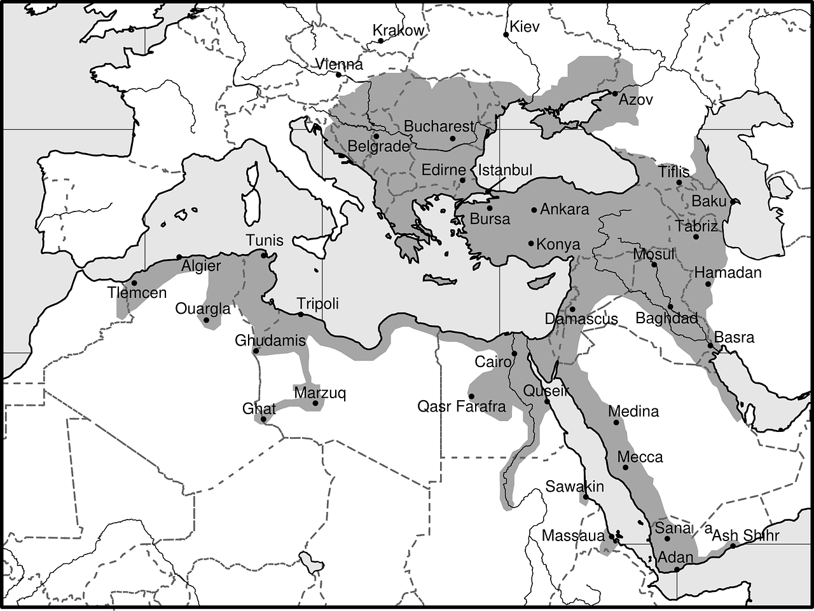

元国税調査官である著者が歴史をお金の観点から、世界史上様々な国の栄枯盛衰を振り返る一冊。

なぜお金の流れで歴史を見直す必要があるのか!?

POINT**本当に歴史を動かしているのは、政治や戦争ではなくてお金・経済だから！**

お金の観点で歴史を見直すと、現代でも大きな影響力を持っているあの民族が思い浮かぶが、とにかく受験勉強中の学生にも、歴史を忘れ気味の大人にもオススメの一冊!!

<a href="https://hb.afl.rakuten.co.jp/hgc/146fe51c.1fd043a3.146fe51d.605dc196/yomereba_main_201902241902062322?pc=http%3A%2F%2Fbooks.rakuten.co.jp%2Frb%2F13493753%2F%3Fscid%3Daf_ich_link_urltxt%26m%3Dhttp%3A%2F%2Fm.rakuten.co.jp%2Fev%2Fbook%2F" target="_blank"  rel="noopener noreferrer">お金の流れでわかる世界の歴史</a>
posted with <a href="https://yomereba.com" rel="nofollow noopener noreferrer" target="_blank">ヨメレバ</a>

大村大次郎 KADOKAWA 2015年12月10日    

<a href="https://hb.afl.rakuten.co.jp/hgc/146fe51c.1fd043a3.146fe51d.605dc196/yomereba_main_201902241902062322?pc=http%3A%2F%2Fbooks.rakuten.co.jp%2Frb%2F13493753%2F%3Fscid%3Daf_ich_link_urltxt%26m%3Dhttp%3A%2F%2Fm.rakuten.co.jp%2Fev%2Fbook%2F" target="_blank"  rel="noopener noreferrer">楽天ブックス</a>

<a href="https://www.amazon.co.jp/exec/obidos/asin/4041032199/kanon123-22/" target="_blank"  rel="noopener noreferrer">Amazon</a>

<a href="https://www.amazon.co.jp/gp/search?keywords=%82%A8%8B%E0%82%CC%97%AC%82%EA%82%C5%82%ED%82%A9%82%E9%90%A2%8AE%82%CC%97%F0%8Ej&__mk_ja_JP=%83J%83%5E%83J%83i&url=node%3D2275256051&tag=kanon123-22" target="_blank"  rel="noopener noreferrer">Kindle</a>
                              	  	  	  	  	

昨今の歴史では、欧州諸国からの視点で描かれるものが多く、本書では古代エジプト、ローマ帝国の徴税制度が優れていた点に始まり、時代の先端を走っていた中国、ユーラシア大陸の交易路の礎を築いたモンゴル、欧州諸国を圧倒していたオスマン帝国など幅広い。

更には現代に起きたリーマンショックまで、大まかな世界の流れも理解出来る一冊。

## 徴税・財務管理の重要性

世界史で世の中のお金・富・財がどのように作られ、どう流れていったのか!?

狩猟民族だった人類は、農耕により富・財を蓄え、個人が縄張りを持ち始めて人口増加、人の集まる場所にお金・物も集まって技術革新が起きる一方、争いも増えていった。

次第に人の集まりが国家となるが、その国家が繁栄するか没落するかのポイントは何か!?

POINT**それを決定付けるのは徴税・財務管理が公平に正しく行われてるかが鍵！**

本書を読み進めていくと、徴税・財政管理が上手く行われていると国は安定し、官僚が堕落し上手く税金が集められなくなると、次第に国は不安定になり滅亡していくのが如実に分かる。

## ユダヤ人と世界経済

世界史をお金の観点で見た時、欠かすことが出来ないのがユダヤ人の存在。

平穏に暮らしていたかと思えば、エジプト人に連れ去られて奴隷(一説には重税を滞納したためとも言われてます)にされたり、自分達の国が建国出来たかと思えば分裂し他国に滅ぼされたり、長い歴史を通じてあらゆる土地でマイノリティーであり、異教徒故に度々迫害や追放の憂き目に遭ったり…

ユダヤ人は自分達を受け入れてくれる場所をもとめ、世界をさまよう民族。とにかく大変過酷な歴史を歩んでおり、迫害され続ける放浪の民故に厳しい環境で生き抜くため、お金に対して合理的な処世術を唱え、現代でも金融業などで大きな利益を生み出している。

POINT**放浪することで各地域の情報を沢山持ち、世界的な情報ネットワークを構築！**

オランダのアムステルダム、イギリスのロンドン、アメリカのウォール街などユダヤ人の行く先々の都市は世界の金融センターとなり、迫害されたユダヤ人の多くが今もアメリカに移り住んでいる。

## 大航海時代の幕開け

中国の没落、モンゴル帝国崩壊後、世界経済で強い影響力を持ったのがオスマン・トルコ。

栄華を極めたローマ帝国に匹敵する程の力を持ち、1299〜1922年の600年続いた歴史ある帝国、また地中海と黒海を抑えており、オスマン帝国はヨーロッパ諸国とアジアが交易を中継地。

その領土の大きさも驚愕だが、当時のイスラム商人がアラビア数字を普及させたり(諸説あり)、現代に伝わる複式簿記を広めたりと、世界経済にも大きな影響を与えている。

交通の要所である首都コンスタンチノープルを手中に納めたことは繁栄の要因。当時ヨーロッパからアジアへの交易を行うためには、シルクロード経由か東南アジアからマラッカ海峡を経て、ペルシャ湾に上陸する海上ルートの2つが最も採算がとれる安全なルート。この両ルートの中央ターミナル的な役割を担うのが、首都コンスタンチノープルとなる。

当時のオスマン・トルコでは、中央集権制度が上手く進んでおり、数万の職業兵士を要していたので、ヨーロッパ諸国は軍事の面で太刀打ち出来ず。また地中海も支配されているので、仕方なく海上迂回ルートを開拓し出し、これが西欧諸国の大航海時代が幕開けに繋がっている。

## 資本主義とプロテスタント

マックス・ウェーバーの著書**「プロテスタンティズムの論理と資本主義の精神」**によれば、プロテスタントが資本主義の原動力になった事実を説明されている。

プロテスタントが主流になって以降、人々は信じ難いほどにストイック化し、ある使命感にかられて守銭奴となり、利益追求に走ったと分析。特にカルヴァン派は、ある種の欲望とは違った「信仰的動機」から、黙々とカネを追い求めるようになった。

ルターの宗教改革により、人間が神から喜ばれる唯一の方法は、修道院での禁欲やお布施ではなく、生活上の義務を遂行(人間の職業=神に与えられた使命)するとの考えが根付く。更にプロテスタントの一派であるカルヴァン派は、人間の社会的営みの全てが、神の栄光を高めるために存在していると解釈。

カルヴァン派の根底には「予定説」があり、全ての未来は神によって事前に決まり、人間には変えられないし、人間に自力救済の道などは無い、あるとすれば神の恩寵以外にありえない。つまり人間のために神が存在するのではなく、神のために人間が存在するという考えが根底にある。

どうすれば救われるのか分からないが、少なくとも神に計画・目的がある以上、天職として与えられた職業労働も、合理的に遂行し、有益なものでないと神に喜ばれない。

それが出来たかを測るモノサシは、道徳性(神が望む働き方)・有用性(神の役に立つ働き方)・利益率(それらが出来た証し)の3つであり、特に利益を最重要視。神の意図に適った労働をしているから利益が生まれ、神のために働いて利益を得るのは良いことで、神に命じられていると解釈出来る。

POINT**利潤が貯まれば貯まるほど「救いの確証」が深まるという考え方！**

このようにプロテスタントは資本主義を発展させ、経済的繁栄を手にしたが、戒律を守ってストイックに生きる排他的な姿勢はユダヤ教の考えに酷似している。ユダヤ教とカルヴァン派の根底には神のために禁欲的に利益を追求、その果てにあるのは選民という共通項がある。

<a href="https://hb.afl.rakuten.co.jp/hgc/146fe51c.1fd043a3.146fe51d.605dc196/yomereba_main_201903221528054198?pc=http%3A%2F%2Fbooks.rakuten.co.jp%2Frb%2F15571889%2F%3Fscid%3Daf_ich_link_urltxt%26m%3Dhttp%3A%2F%2Fm.rakuten.co.jp%2Fev%2Fbook%2F" target="_blank"  rel="noopener noreferrer">経済学の名著50冊が1冊でざっと学べる</a>
posted with <a href="https://yomereba.com" rel="nofollow noopener noreferrer" target="_blank">ヨメレバ</a>

蔭山克秀 KADOKAWA 2018年08月31日    

<a href="https://hb.afl.rakuten.co.jp/hgc/146fe51c.1fd043a3.146fe51d.605dc196/yomereba_main_201903221528054198?pc=http%3A%2F%2Fbooks.rakuten.co.jp%2Frb%2F15571889%2F%3Fscid%3Daf_ich_link_urltxt%26m%3Dhttp%3A%2F%2Fm.rakuten.co.jp%2Fev%2Fbook%2F" target="_blank"  rel="noopener noreferrer">楽天ブックス</a>

<a href="https://www.amazon.co.jp/exec/obidos/asin/4046020407/kanon123-22/" target="_blank"  rel="noopener noreferrer">Amazon</a>

<a href="https://www.amazon.co.jp/gp/search?keywords=%8Co%8D%CF%8Aw%82%CC%96%BC%92%9850%8D%FB%82%AA1%8D%FB%82%C5%82%B4%82%C1%82%C6%8Aw%82%D7%82%E9&__mk_ja_JP=%83J%83%5E%83J%83i&url=node%3D2275256051&tag=kanon123-22" target="_blank"  rel="noopener noreferrer">Kindle</a>
                              	  	  	  	  	

今ではそうした宗教的な色彩は抜けたが、資本主義の発展の裏には、こんな精神があったとのこと。

## 世界大戦と経済

第一次世界大戦が起きた理由は不明だが、経済でみると利害関係が明確との本書考察。

まず当時のドイツは急激な経済発展を遂げ、ヨーロッパ最大の工業国になった結果、英仏露の妬みを買い、またオーストリア・ハンガリー帝国との合併を危惧し、このままドイツを野放しにすればヨーロッパを制覇されるとの恐れが英仏露を結託させ、ドイツ叩きに向かわせてしまった。

敗戦による大きな代償を支払ったドイツは、旧国土を回復すべくあちらこちらに侵攻、その一つであるポーランドは英仏と協定を結んでしたので第二次世界大戦が勃発。

破竹の勢いでヨーロッパを制覇、二ヶ月でフランスを撃破、イギリスは本土に逃げ帰り、降伏か和平交渉は間近と思われていたが、イギリスがアメリカに参戦を要求。アメリカはドイツと戦争する理由が無かったが、ドイツが掲げた欧州新経済秩序が戦争に駆り立て、あえなくドイツ撃沈。

ちなみに欧州新経済秩序とは金本位制を捨てた現行制度に近いもので、当時世界の金の約4割を保持するアメリカには、この上なく嫌な制度。これを実現させてしまうと、ヨーロッパ市場をドイツが独占、せっかく手に入れた経済大国の地位を失うことを恐れていた。

## フランス革命前夜のマネーゲーム

一国の通貨が世界の基軸通貨になることの矛盾、そしてブレトン・ウッズ体制崩壊後も、未だ有効な国際金融システムを見つかっていないと著者は指摘されている。

そんな状況を反映して近年にはリーマンショックが起き、アメリカを中心に世界がマネーゲーム化の流れを促進。ちなみにこれは90年代のソ連崩壊も影響しており、共産主義が健全だった頃、西洋諸国は共産主義の台頭を恐れ、資本主義が暴走しないよう貧富の格差にも一定の配慮していた模様。

ただしソ連崩壊後は企業や投資家に際限なく自由を与え、便宜を図る政策に舵を切った。投資に対する減税を行い、投資を促進させる流れが活発化、それに伴って広がり続ける世界の貧富の差。

現在の状況がフランス革命前夜の社会に酷似していると著者は言及されている。