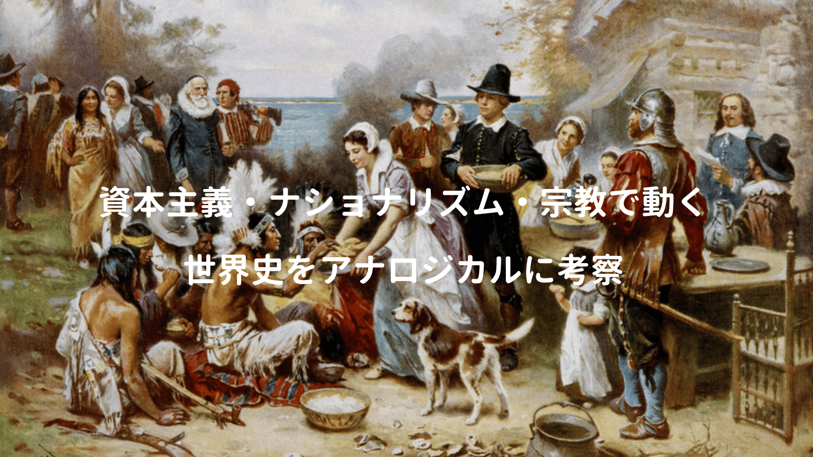

ビジネスパーソンに大切な基礎教養の一つである世界史。

ヒト・モノ・カネが国境を超え、めまぐるしく移動する現代。過去のアナロジー(類比)によって、現代を考察する思考力が備わっていれば、未知の出来事に遭遇しても冷静に分析が可能らしい。

そんなアナロジカル思考の訓練に役立つのが著者・佐藤優氏の「世界史の極意」で「いま」を読み解くため、過去の歴史を振り返るだけでなく、各章を考察する上で役立つ本が幾つか紹介されている。

<a href="https://hb.afl.rakuten.co.jp/hgc/146fe51c.1fd043a3.146fe51d.605dc196/yomereba_main_201903102051329175?pc=http%3A%2F%2Fbooks.rakuten.co.jp%2Frb%2F13077671%2F%3Fscid%3Daf_ich_link_urltxt%26m%3Dhttp%3A%2F%2Fm.rakuten.co.jp%2Fev%2Fbook%2F" target="_blank"  rel="noopener noreferrer">世界史の極意</a>
posted with <a href="https://yomereba.com" rel="nofollow noopener noreferrer" target="_blank">ヨメレバ</a>

佐藤優 NHK出版 2015年01月    

<a href="https://hb.afl.rakuten.co.jp/hgc/146fe51c.1fd043a3.146fe51d.605dc196/yomereba_main_201903102051329175?pc=http%3A%2F%2Fbooks.rakuten.co.jp%2Frb%2F13077671%2F%3Fscid%3Daf_ich_link_urltxt%26m%3Dhttp%3A%2F%2Fm.rakuten.co.jp%2Fev%2Fbook%2F" target="_blank"  rel="noopener noreferrer">楽天ブックス</a>

<a href="https://www.amazon.co.jp/exec/obidos/asin/4140884517/kanon123-22/" target="_blank"  rel="noopener noreferrer">Amazon</a>

<a href="https://www.amazon.co.jp/gp/search?keywords=%90%A2%8AE%8Ej%82%CC%8B%C9%88%D3&__mk_ja_JP=%83J%83%5E%83J%83i&url=node%3D2275256051&tag=kanon123-22" target="_blank"  rel="noopener noreferrer">Kindle</a>
                              	  	  	  	  	

更に本書では世界史の広い範囲から3つのテーマに絞って集中的に考察。

■ 多極化する世界を読み解く極意

■ 民族問題を読み解く極意

■ 宗教紛争を読み解く極意

現代は資本主義・ナショナリズム・宗教の掛け算で動くことから抜粋された各テーマだが、民族や宗教問題は平均的日本人には馴染みが少ないので、理解が難しいかもしれない。

今回は多極化する世界を読み解く極意における資本主義を中心に考察。

## アナロジカル思考の重要性

アナロジー(類比)とは似ている事物を結びつけて考えること。

これは未知の出来事に遭遇した際に「この状況は過去経験したあの時にそっくり」と冷静に分析でき、歴史以外にもビジネスで必要な説明スキル向上にも寄与。

著者はアナロジー的思考の狙いの一つに「戦争の阻止」を挙げられ、今置かれている状況を別の時代・場所との類比に基づき理解することで、非常に複雑な出来事を前にどう行動するか考えることに繋がり、また神学的な観点でも役立つとか。

また歴史をアナロジカルに考えるには、最低限の知識(高校レベル)が必要だが、ビジネスパーソンに必要な基礎知識は、学校の世界史A・Bで十分身に付くと学校教科書を推奨。

<a href="https://hb.afl.rakuten.co.jp/hgc/146fe51c.1fd043a3.146fe51d.605dc196/yomereba_main_20190911232909513?pc=http%3A%2F%2Fbooks.rakuten.co.jp%2Frb%2F15544856%2F%3Fscid%3Daf_ich_link_urltxt%26m%3Dhttp%3A%2F%2Fm.rakuten.co.jp%2Fev%2Fbook%2F" target="_blank"  rel="noopener noreferrer">一度読んだら絶対に忘れない世界史の教科書</a>
posted with <a href="https://yomereba.com" rel="nofollow noopener noreferrer" target="_blank">ヨメレバ</a>

山崎 圭一 SBクリエイティブ 2018年08月20日    

<a href="https://hb.afl.rakuten.co.jp/hgc/146fe51c.1fd043a3.146fe51d.605dc196/yomereba_main_20190911232909513?pc=http%3A%2F%2Fbooks.rakuten.co.jp%2Frb%2F15544856%2F%3Fscid%3Daf_ich_link_urltxt%26m%3Dhttp%3A%2F%2Fm.rakuten.co.jp%2Fev%2Fbook%2F" target="_blank"  rel="noopener noreferrer">楽天ブックス</a>

<a href="https://www.amazon.co.jp/exec/obidos/asin/4797397128/kanon123-22/" target="_blank"  rel="noopener noreferrer">Amazon</a>

<a href="https://www.amazon.co.jp/gp/search?keywords=%E4%B8%80%E5%BA%A6%E8%AA%AD%E3%82%93%E3%81%A0%E3%82%89%E7%B5%B6%E5%AF%BE%E3%81%AB%E5%BF%98%E3%82%8C%E3%81%AA%E3%81%84%E4%B8%96%E7%95%8C%E5%8F%B2%E3%81%AE%E6%95%99%E7%A7%91%E6%9B%B8&__mk_ja_JP=%83J%83%5E%83J%83i&url=node%3D2275256051&tag=kanon123-22" target="_blank"  rel="noopener noreferrer">Kindle</a>
                              	  	  	  	  	

## 現代社会を社会経済史から考察

過去の時代が「帝国主義の時代」であるならば、現代は「新・帝国主義の時代」とのアナロジー。

帝国主義時代を社会経済史の観点で見た時、資本主義は「重商主義→自由主義→帝国主義→国家独占資本主義→新自由主義」の変遷を辿っており、レーニンの「帝国主義」から資本主義がどう変容するか理解、帝国主義から新・帝国主義の大まかな流れを把握した後に2つのアナロジーを考察されている。

POINT**自由主義の裏には覇権国家の存在があり、覇権国家が弱体化すると帝国主義化する！**

イギリスが覇権国家の頃は自由主義の時代であり、イギリスが弱体化するとドイツ・アメリカの台頭により帝国主義の時代へ、また世界大戦後にアメリカが覇権国家となるも、同時多発テロやリーマンショックで弱体化すると、中国・ロシアが国益を主張し始めて新・帝国主義の時代が到来。

POINT**帝国主義の時代にはグローバル化に伴い、国家機能が強化される！**

極度にグローバル化が進むと国家の徴税機能が弱体化(多国籍企業は租税回避策を取る)、先進諸国内の格差拡大に伴って社会不安も高まり、国が不安定になる。自己保存の機能から国家機能が強化される傾向だが、この本を読んでいる時にこんな記事を発見した。

[米上院議員、Amazon、Googleら大手テック企業は分割すべきと主張](https://iphone-mania.jp/news-241172/)

欧州では以前からGAFA向けに新しい税法(デジタル税)を導入すべきとの意見が強まったり、GoogleはAndroidの独禁法違反していると制裁金を課されたり、何かと風当たりが強いが、アメリカ国内でも大手テック企業は分割すべきとの意見が出ている。

## 資本主義の本質と産業革命まで

本書ではマルクスの「資本論」をベースに、資本主義の本質や産業革命が起きるまでの流れを解説。

POINT**資本主義社会の本質は「労働を商品化」とする考え方がポイント！**

なぜ資本主義はイギリスで起きたのか!?

15〜16世紀のヨーロッパ寒冷期、イギリスの毛織物産業の発展に伴って大量の羊毛が必要となり、領主や地主が農民を追い出した。また大量の羊を飼い始めたことが近代資本主義のキッカケで、追い出された農民は資産(土地や生産手段)を持たず、自らの労働力を売るしかなくなり、資本家は労働者を毛織物工場で雇用し、大きな富を獲得。

ちなみに資本主義がイギリスで生まれた理由だが、スペインやポルトガルの金持ちは、浪費+余ったお金を修道院に寄付して富の蓄積が無く、オランダでは地理的要因(羊毛産業に適していない)で資本主義が起こらなかった。

東インド会社が設立された頃、インドとの交易が始まることでキャラコ(毛織物に比べて軽くて吸湿性も高い上位互換品)が輸入され、イギリスの毛織物産業が大打撃。これに対抗すべく、安く売るために大量生産を目指す中で産業革命が起き、紡績機や織機などが発明。

また本書では資本主義と帝国主義を考察する上で、役立つ書籍を幾つか紹介されている。

<a href="https://hb.afl.rakuten.co.jp/hgc/146fe51c.1fd043a3.146fe51d.605dc196/yomereba_main_201903112104015509?pc=http%3A%2F%2Fbooks.rakuten.co.jp%2Frb%2F12674883%2F%3Fscid%3Daf_ich_link_urltxt%26m%3Dhttp%3A%2F%2Fm.rakuten.co.jp%2Fev%2Fbook%2F" target="_blank"  rel="noopener noreferrer">資本主義の終焉と歴史の危機</a>
posted with <a href="https://yomereba.com" rel="nofollow noopener noreferrer" target="_blank">ヨメレバ</a>

水野和夫 集英社 2014年03月    

<a href="https://hb.afl.rakuten.co.jp/hgc/146fe51c.1fd043a3.146fe51d.605dc196/yomereba_main_201903112104015509?pc=http%3A%2F%2Fbooks.rakuten.co.jp%2Frb%2F12674883%2F%3Fscid%3Daf_ich_link_urltxt%26m%3Dhttp%3A%2F%2Fm.rakuten.co.jp%2Fev%2Fbook%2F" target="_blank"  rel="noopener noreferrer">楽天ブックス</a>

<a href="https://www.amazon.co.jp/exec/obidos/asin/4087207323/kanon123-22/" target="_blank"  rel="noopener noreferrer">Amazon</a>

<a href="https://www.amazon.co.jp/gp/search?keywords=%8E%91%96%7B%8E%E5%8B%60%82%CC%8FI%E0%81%82%C6%97%F0%8Ej%82%CC%8A%EB%8B%40&__mk_ja_JP=%83J%83%5E%83J%83i&url=node%3D2275256051&tag=kanon123-22" target="_blank"  rel="noopener noreferrer">Kindle</a>
                              	  	  	  	  	

## 歴史はヒストリーとゲシヒテ

各国の歴史教科書を読み比べると、歴史の立体的な理解に繋がり、各国の内在的論理が理解できる。

教科書は学生にどの程度の知識水準を求めるか、また国家がどのスタンスで教育に取り組んでいるかが明確に分かり、更に歴史の異なる2つの概念についての考察も面白かった。

■ ヒストリー

年代順に出来事の連鎖を客観的に記述する編年体.

 

■ ゲシヒテ

歴史上の出来事の連鎖には必ず意味があるとのスタンスで記述.

日本の教科書はどちらかと言えばヒストリー気質が強いだろうか。

本書ではロシアやイギリスの教科書を抜粋し紹介されているが、両国とも細かい年表の暗記より、まずは歴史を大きな流れで理解し、自らが徹底的に考えること点と書く点を重視している模様。

## 大英帝国の歴史

イギリスは過去の過ち(帝国主義時代の植民地政策など)を認め、新・帝国主義時代への対応を模索するために歴史の教科書がゲシヒテとなっている。

資本主義を知る意味でもイギリスの歴史は外せず、その助けになるのがこちらの一冊。

<a href="https://hb.afl.rakuten.co.jp/hgc/g0000015.o51y41f2.g0000015.o51y5a32/kaereba_main_201903112325386699?pc=https%3A%2F%2Fproduct.rakuten.co.jp%2Fproduct%2F-%2F4683ec08055b361391f7cf13fbf11c96%2F&m=http%3A%2F%2Fm.product.rakuten.co.jp%2Fproduct%2F4683ec08055b361391f7cf13fbf11c96%2F" target="_blank"  rel="noopener noreferrer">嘘だらけの日英近現代史   /扶桑社/倉山満</a>
posted with <a href="https://kaereba.com" rel="nofollow noopener noreferrer" target="_blank">カエレバ</a>

<a href="https://hb.afl.rakuten.co.jp/hgc/146fe51c.1fd043a3.146fe51d.605dc196/kaereba_main_201903112325386699?pc=https%3A%2F%2Fsearch.rakuten.co.jp%2Fsearch%2Fmall%2F%25E5%2598%2598%25E3%2581%25A0%25E3%2582%2589%25E3%2581%2591%25E3%2581%25AE%2F-%2Ff.1-p.1-s.1-sf.0-st.A-v.2%3Fx%3D0%26scid%3Daf_ich_link_urltxt%26m%3Dhttp%3A%2F%2Fm.rakuten.co.jp%2F" target="_blank"  rel="noopener noreferrer">楽天市場</a>

<a href="https://www.amazon.co.jp/gp/search?keywords=%E5%98%98%E3%81%A0%E3%82%89%E3%81%91%E3%81%AE&__mk_ja_JP=%E3%82%AB%E3%82%BF%E3%82%AB%E3%83%8A&tag=kanon123-22" target="_blank"  rel="noopener noreferrer">Amazon</a>

筆者の個人的な推論による歴史観がなく、事実を事実として述べられていると評価が高い。

アメリカ、モンゴル、ローマよりもずる賢く、トルコ、ペルシャ、インド、中国の大国は屈服、かつて強国と言われたポルトガル、スペイン、オランダ、神聖ローマ帝国も叩き潰し、挑戦者であったフランス、ロシア、ドイツを敗北者に仕立て上げた史上最強最大の国・大英帝国。

暴君揃いで有名な小国イングランドの苦悩、七年戦争で世界中に血の雨を降らせた大ピット、その息子である小ピットとナポレオンの戦い、世界を振り回した最強のボス・パーマストン。

日英同盟をはじめ日本と英国の関わりと、現在のイギリスに至る流れが面白く紹介されている。