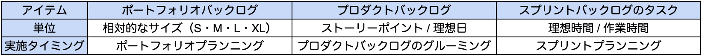
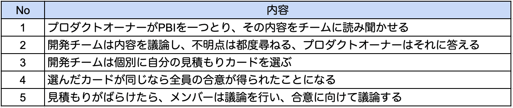
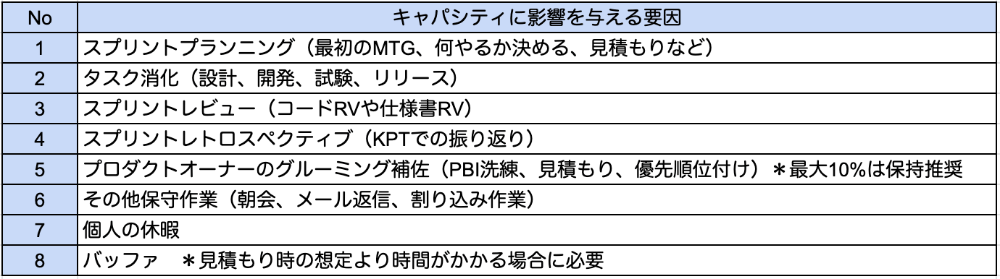
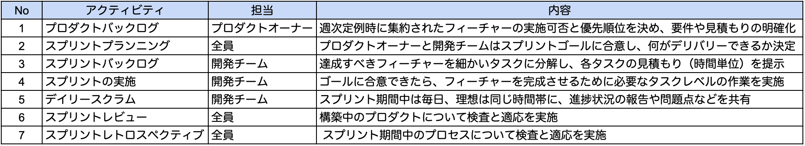
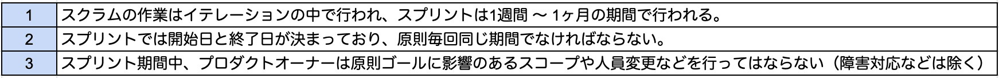

以前参画したプロジェクトで、アジャイル開発のスクラム導入を検討した時の話。

結論から言えば、私の在籍期間中にスクラムは導入できなかった。

今後、同じ轍を踏まないよう自分を戒める意味でも、当時考えていたことを書き残しておく。

<a href="https://hb.afl.rakuten.co.jp/hgc/146fe51c.1fd043a3.146fe51d.605dc196/yomereba_main_202101261646202916?pc=http%3A%2F%2Fbooks.rakuten.co.jp%2Frb%2F12842933%2F%3Fscid%3Daf_ich_link_urltxt%26m%3Dhttp%3A%2F%2Fm.rakuten.co.jp%2Fev%2Fbook%2F" target="_blank" >エッセンシャルスクラム</a>
posted with <a href="https://yomereba.com" rel="nofollow" target="_blank">ヨメレバ</a>

ケネス・S．ラビン/岡澤裕二 翔泳社 2014年07月    

<a href="https://hb.afl.rakuten.co.jp/hgc/146fe51c.1fd043a3.146fe51d.605dc196/yomereba_main_202101261646202916?pc=http%3A%2F%2Fbooks.rakuten.co.jp%2Frb%2F12842933%2F%3Fscid%3Daf_ich_link_urltxt%26m%3Dhttp%3A%2F%2Fm.rakuten.co.jp%2Fev%2Fbook%2F" target="_blank" >楽天ブックス</a>

<a href="https://www.amazon.co.jp/exec/obidos/asin/4798130508/kanon123-22/" target="_blank" >Amazon</a>

<a href="https://www.amazon.co.jp/gp/search?keywords=%E3%82%A8%E3%83%83%E3%82%BB%E3%83%B3%E3%82%B7%E3%83%A3%E3%83%AB%E3%82%B9%E3%82%AF%E3%83%A9%E3%83%A0&__mk_ja_JP=%83J%83%5E%83J%83i&url=node%3D2275256051&tag=kanon123-22" target="_blank" >Kindle</a>
                              	  	  	  	  	

## プロジェクト参画時の役割（1）ー プロダクトオーナープロキシ

BtoBマーケティング向けのMAツール開発に参画し、最初の業務はプロダクトオーナーと開発チームの仲立ち（要件定義 〜 リリース迄）だった。恐らくプロダクトオーナープロキシに相当すると思われる。

各部署のリーダーが、メンバーから要望やフィーチャーをヒアリングし、スプレッドシートで管理する。週次定例ではプロダクトオーナーが中心となり、実施可否と優先順位が決められていた。

当時はスクラムへの興味が薄かったので気づけなかったが、プロダクトオーナーはスクラム開発の役割を見事に果たされていたと思う（自分の意識や理解が追いついていなかったのが残念）

プロキシとしての役割を振り返った際、次の3点に考えが行き届いていなかったと反省する。

反省１**プロダクトオーナーに優先度の高いPBIの概算工数を提示できていなかった.**  
反省２**見積もり算出とベロシティへの意識が欠如していた.**  
反省３**スクラムに適したプロジェクト管理ツールで適切に管理出来ていなかった.**

優先順位を決める際、各アイテムのコストが必要になる。しかし優先度高めのPBIでさえ、概算工数を提示できていなかった。理由は諸々あるが、開発チームとの調整不足で、プランニングが機能していなかったと感じる（PBIの見積もりとベロシティは後述）

またPBIの管理についても、ツール選定から熟慮していればと後悔ばかりが募る。後で調査したところ、スクラム開発を本格的にやるのであれば [Jira Software](https://www.atlassian.com/ja/software/jira) が最も適していそうだった。

## プロジェクト参画時の役割（2）ー 開発チームのマネジメント

後任にプロダクトオーナープロキシを引継ぎ、次に担った役割は開発チームのマネジメントだった。開発チームの問題解決をフォローし、自己組織化を促すロールだったと認識している。

この時、既にスクラム開発を意識していた。徐々に人数も増え、開発メンバーもスクラムを実現させる能力が身につき始めていたので、なんとかスクラムを導入できないか試行錯誤した。

スクラム開発では開発メンバーに機能横断的な多様性（T型人材）と十分な能力（バックエンド / フロントエンド / クラウド）が求められ、WEB開発における一通りの知識と経験が必要になる。

この点について、スクラムの **スプリントレトロスペクティブ** を取り入れ、KPTでの振り返りで改善のサイクルを生み出せたが、チームキャパシティの考慮や技術的負債を返す意識を持ってもらう働きかけが足りていなかったかもしれない（チームのキャパシティは後述）

反省４**チームキャパシティの考慮（＝タスク棚卸し＋分割）**  
反省５**タスクレベルの作業に強力な技術プラクティスを取り入れてもらう働きかけ.**  

エッセンシャルスクラムでも度々、エクストリームプログラミング（XP）の技術プラクティスが紹介されている。スクラム導入を真剣に考え出した時には、既に離任することが決まっていたので、当現場では本書の紹介に終わってしまったのが残念でならない。

<a href="https://hb.afl.rakuten.co.jp/hgc/146fe51c.1fd043a3.146fe51d.605dc196/yomereba_main_202101262208272133?pc=http%3A%2F%2Fbooks.rakuten.co.jp%2Frb%2F13292388%2F%3Fscid%3Daf_ich_link_urltxt%26m%3Dhttp%3A%2F%2Fm.rakuten.co.jp%2Fev%2Fbook%2F" target="_blank" >エクストリームプログラミング</a>
posted with <a href="https://yomereba.com" rel="nofollow" target="_blank">ヨメレバ</a>

ケント・ベック/シンシア・アンドレス オーム社 2015年06月    

<a href="https://hb.afl.rakuten.co.jp/hgc/146fe51c.1fd043a3.146fe51d.605dc196/yomereba_main_202101262208272133?pc=http%3A%2F%2Fbooks.rakuten.co.jp%2Frb%2F13292388%2F%3Fscid%3Daf_ich_link_urltxt%26m%3Dhttp%3A%2F%2Fm.rakuten.co.jp%2Fev%2Fbook%2F" target="_blank" >楽天ブックス</a>

<a href="https://www.amazon.co.jp/exec/obidos/asin/4274217620/kanon123-22/" target="_blank" >Amazon</a>

<a href="https://www.amazon.co.jp/gp/search?keywords=%E3%82%A8%E3%82%AF%E3%82%B9%E3%83%88%E3%83%AA%E3%83%BC%E3%83%A0%E3%83%97%E3%83%AD%E3%82%B0%E3%83%A9%E3%83%9F%E3%83%B3%E3%82%B0&__mk_ja_JP=%83J%83%5E%83J%83i&url=node%3D2275256051&tag=kanon123-22" target="_blank" >Kindle</a>
                              	  	  	  	  	

## PBIの見積もりとベロシティ

PBIの優先順位を決める材料として、プロダクトオーナーはコストを把握する必要がある。

そのタスクをどの程度のベロシティでこなせるのか計測しなければならない。

エッセンシャルスクラムでは、見積もり方法や単位、実施タイミングを次のように定めている。

ポートフォリオプランニングはスクラムに含まれていので、開発チームには関係ないかもしれないが、要件も出揃っていないため、Tシャツのサイズくらいにざっくりした数値となる。

PBIの見積もりでは、ストーリーポイントと理想日がよく使われ、本書では前者を推奨。

アイテムの内容次第だが、成熟した開発チームであれば、これまでの経験に照らし合わせ、納得感のある数値が出せるかもしれない。お約束事には次の2つが考えられる。

約束１**見積もりに使う数字は尺度を決めておく（チケット作成は2、チケット検索は8など）**  
約束２**正確な見積もりが目標であって、必要以上に精度を追い求めすぎないことが大切.**  

また見積もりのテクニックではプランニングポーカーが紹介されており、次の手順に沿って進める。

ブラウザ上でプランニングポーカーができる [hatjitsu](https://hatjitsu.toolforge.org/) がある。

PBIの見積もりが算出できれば、スプリント終了時に完成させたPBIサイズを合計し、チームのベロシティ（生産量）が算出できる。数回スプリントを続け、ベロシティを監視すれば、チームの成長具合も測れるし、次のスプリントでどの程度の作業にコミットできるか、判断材料にも使える。

## チームキャパシティ

スプリント期間を、全てスプリントの実施に充てられる訳ではない。

キャパシティに影響を与える要因が多くあることを認識し、スプリント期間で消化可能なタスク量を算出しなければならない。キャパシティの単位は、ストーリーポイントか作業時間を使うことが推奨されており、改めて見積もりの考慮が重要だと痛感させられる（作業時間の方がやりやすそう）

ちなみにスプリント期間が2週間の場合、プランニング、レビュー、レトロスペクティブなどのアクティビティに約1日は確保、プロダクトオーナーのグルーミング（PBI修正、見積もり、優先順位付け）の支援に、最大10%程度の時間確保が望ましいと言われる。

スクラムでは開発チームが自己組織化している必要があり、どの作業から着手すべきか、どのようにタスク計画するか、誰が作業するかをチーム自身が決めるなければならない。特にジュニアメンバーばかりの場合、スクラムマスターが正しく導かなければ、なかなか上手く進められない。

## スクラムの流れ

最後に改めてスクラムのアクティビティと作業内容を掲載。

スクラムの原則↓

次の現場では、是非スクラムを成就させたい!!

## 参考記事
■ [スクラムガイド＠2020年11月](https://scrumguides.org/docs/scrumguide/v2020/2020-Scrum-Guide-Japanese.pdf)  
■ [お薦めの【アジャイル・スクラム本】16冊を学習レベルごとにご紹介](http://stay-foolish.com/20180611_agilebook)  
■ [新米スクラムマスターにお勧めの本](https://yattom.hatenablog.com/entry/20170409/p1)  
■ [スクラムってどんな開発手法？ 基本ルールや必要な役割を紹介＠CodeZine](https://codezine.jp/article/detail/12296)  
■ [アジャイル開発とは？今さら聞けない開発手法のメリット・デメリット](https://hnavi.co.jp/knowledge/blog/agile_software_development/)  
■ [スクラム開発におけるプロジェクト管理ツール比較](https://qiita.com/okamok/items/ab3eafe562a26a0d520a)  
■ [Jiraではじめるスクラム開発 ー スクラムボードの使い方初級編](https://qiita.com/navitime_tech/items/602e60c41c036d8eae97)  
■ [オンラインでプランニングポーカー](https://ezworks.org/2020/05/14/online-planningpoker/)  
■ [ブラウザでプランニングポーカー](https://mamimumemoomoo.hateblo.jp/entry/2017/04/16/230913)  