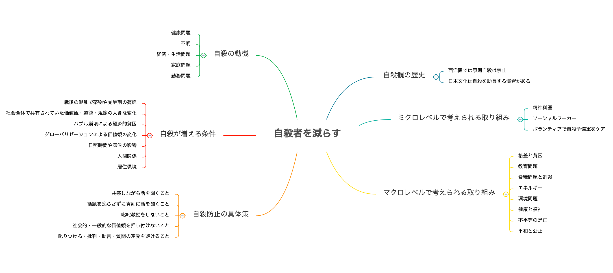

自殺はある日、突然起き、残された者に何とも言えない猛烈な感情体験を残す。

自分は大丈夫だ、自分の周り人間に自殺する人はいないと思う気持ちは分かるが、平均寿命が大幅に伸びた現代では、誰にでも自殺に遭遇する可能性がある（＝戦争が減り、平和な証拠でもある）

この社会問題を考えるため、何か参考になる情報がないか探してみると**「自殺予防の基礎知識 – 多角的な視点から自殺を理解する(著書:末木新)」**が目に入ったので、そちらを一読してみた。

本書のあらすじだが、自殺予防の基礎知識として、自殺に対する現状理解と自殺をする人の心理状況、そして今自殺を考えている人に、個人レベルでできる対処方法などが解説されていた。

中盤では過去にさかのぼり、西洋・東洋での自殺観の違い、自殺と自傷の関係性とメディアが与える自殺への影響度も考え、最後に自殺対策の歴史と有効性に言及されている。

多岐に渡る自殺予防の基礎知識が網羅されていると大変感銘を受けた。

## 全体像

## 自殺の現状と様々な傾向

戦後、日本の自殺数は、3度の増加傾向が見られ、大きな要因には社会的な変化（戦後の混乱で覚醒剤や薬物が蔓延 / 社会全体で共有されていた価値観・道徳・規範などが大きく変化 / バブル崩壊による経済的貧困 / グローバリゼーションによる価値観の変化）が考えられる。

デュルケームはそのような理由で自殺する人を**「アノミー的自殺」**と命名している。

より詳細に確認すると、自殺の動機は**（健康問題 > 不詳 > 経済・生活問題 > 家庭問題 > 勤務問題）**の順で多いとされている。

また自殺者には「孤独」と「相反する二つの心」の共通心理があるので、経済的な貧困である無職や、孤独になりやすい未婚者が、自殺に繋がりやすいのは、何となく理解しやすい。

他には **日照時間** や **気温** も自殺に関係しており、ロシアは先進国内でも自殺率が高く、日本でも北の方が自殺率が高いとされる。事故物件で有名な大島てるの管理人も、物件の間取り（天井の低さや柱の位置）で自殺確率が上がる話をされていたので、色んな理由が複合的に関係していると思われる。

## 自殺の危機が迫っている人の対処方法

**第3章** で言及されている対処方法について、非常に興味深い内容であると同時に、自殺を考えている人と向き合うことは、膨大なエネルギーを必要とするアクションだと痛感した。

何かの手違いで誤った対応してしまうと、自殺の助長に繋がる懸念があり、大変デリケートな話だ。

色んな施策はあるだろうが、時代や西洋・東洋問わずに多くの研究者が推奨しているのは 共感すること で、逆にやってはいけないのは 話題を逸らす、激励する、社会的・一般的な価値観を押し付ける、叱りつける、批判・助言、質問の連発 を挙げられていた。

## 自殺観の歴史

**第4章** では西欧と東洋（主に日本）の自殺観の違いを、歴史を振り返りながら説明されていた。

西欧では古代ギリシャにさかのぼり、プラトン（人間は神の所有物なので自殺は神の意思に逆らう行為なので禁止）と、アリストテレス（自殺は国家や共同体を棄損する行為なので禁止）の考え方の違い、アウグスティヌスやトマス・アクティナスの自殺観など、先人の多種多様な考えに触れられた。

いつの時代も、前提条件として自殺を禁止するも、時代が変われば、考え方も微妙に変わっている。

ちなみに日本は、先進諸国の中でも自殺が多い国だと言われている。

その理由には 3つの要因（①.スチュワート・ピッケンが提唱した日本語がヨーロッパ諸言語に比べ、自殺に関する語彙が豊富なので自殺との親和性がある点 / ②.儒教の影響（自殺に関してダブルスタンダードな考え方）/ ③.仏教の影響（輪廻転生）） があると言われていた。

## 自殺問題の難しさ

自殺は何か単一の問題で生じるのではなく、様々な社会的問題や個人的な悩みが絡み合い、稀に起きる大変深刻な社会問題。自殺の動機も人それぞれで「なぜこの人は自殺をしたのか？」と事後的に動機が推定されるケースが多い。

その証拠に動機の2位は「理由不詳」とされている。

**人はなぜ自殺をするのか？** そのの動機特定も困難だが、自殺予防対策の有効性を明らかにする事は更に困難 らしく、因果関係を実証するための実証実験が難しいとされる（ほぼ無理）

POINT**自殺という現象は、10万人を1年間追跡しつづけ、20人程度の割合とされ、明確な自殺予防対策（かかりつけ医などのコミュニティーサポートや自殺方法の制限くらい）が分かっていない。**

**そんな現状において、個人レベルで何が出来るか？ どう考えるべきか？ どう行動すれば良いのか？**

本書の終盤では、そのヒント**（自殺対策に関するマクロとミクロの考え方）**が紹介されており、マクロ視点（自殺に影響を及ぼす社会的な問題解決の主張）と、ミクロ視点（今、目の前に「死にたい」と言ってる人に薬や心理療法を施し、身近で困っている人を助ける）の2つがある。

ミクロ視点では、自身が精神科医やソーシャルワーカーとなり、ボランティアで自殺予備軍のケア・フォロー、マクロ視点では、仕事を通して社会問題の解決に携わることが考えられる。

自分はマクロな視点を重視しつつも、会社の仕事を通してSDGsの施策に関わったり、個人レベルで何が出来るかを考え、個人でやれる事が少なければ、何かしらの団体に入ってみる等があるかと感じる。

## 参考文献

■ [自殺を予防する - 世界の優先課題](https://apps.who.int/iris/bitstream/handle/10665/131056/9789241564779_jpn.pdf?sequence=5&isAllowed=y)  
■ [自殺対策を推進するためにメディア関係者に知ってもらいたい基礎知識](https://www.mhlw.go.jp/stf/seisakunitsuite/bunya/hukushi_kaigo/seikatsuhogo/jisatsu/who_tebiki.html)  
■ [警視庁 - 自殺者数](https://www.npa.go.jp/publications/statistics/safetylife/jisatsu.html)  
■ [外務省 - SDGsの取組み](https://www.mofa.go.jp/mofaj/gaiko/oda/sdgs/about/index.html)  
■ [著者の紹介ページ](https://researchmap.jp/read0146450/)  