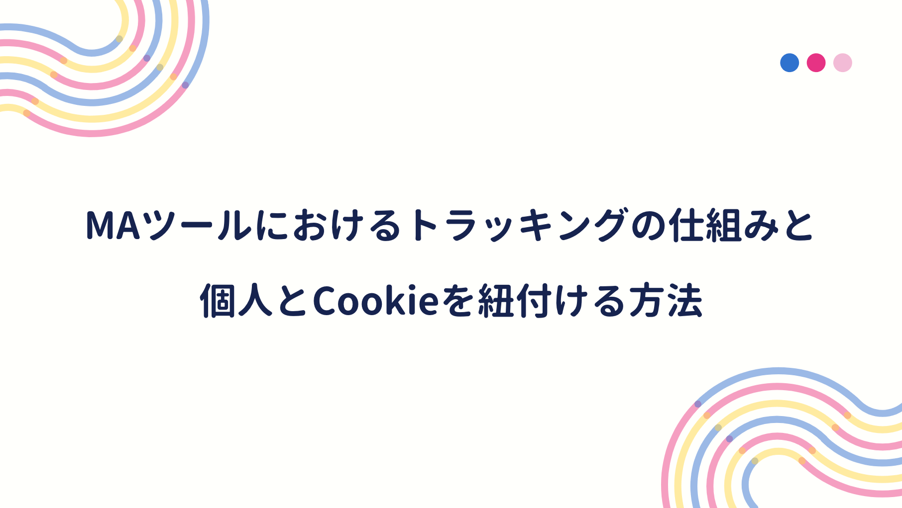
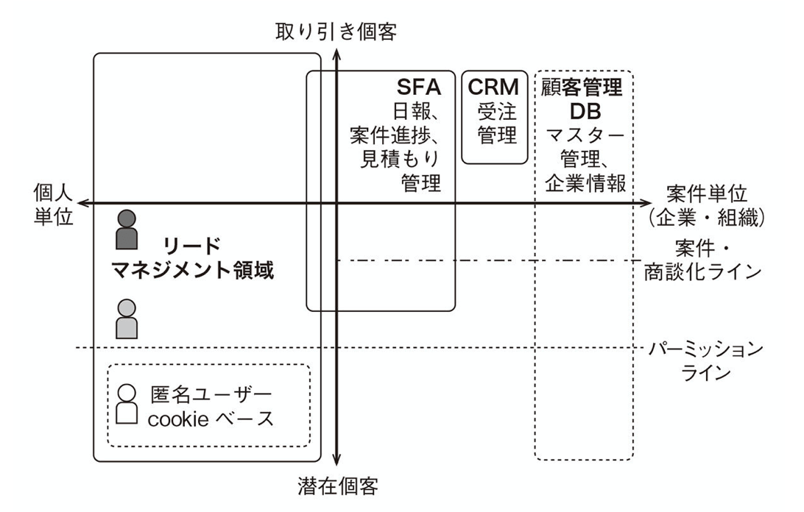

Nexalの上島千鶴氏は、ナーチャリングの概念を広めた第一人者として紹介される方。

また複数の外資系IT企業に勤めた経歴から、リードビジネスは勿論、MAツールのシステム的な知見もあり、マーケティングに関する本も幾つか出版されている。

今回はこちらの本について、MAツールの技術周りを集中的に一読してみた。

<a href="https://hb.afl.rakuten.co.jp/hgc/146fe51c.1fd043a3.146fe51d.605dc196/yomereba_main_202004041645517401?pc=http%3A%2F%2Fbooks.rakuten.co.jp%2Frb%2F14291219%2F%3Fscid%3Daf_ich_link_urltxt%26m%3Dhttp%3A%2F%2Fm.rakuten.co.jp%2Fev%2Fbook%2F" target="_blank" >マーケティングのKPI</a>
posted with <a href="https://yomereba.com" rel="nofollow" target="_blank">ヨメレバ</a>

上島千鶴 日経BP 2016年06月20日    

<a href="https://hb.afl.rakuten.co.jp/hgc/146fe51c.1fd043a3.146fe51d.605dc196/yomereba_main_202004041645517401?pc=http%3A%2F%2Fbooks.rakuten.co.jp%2Frb%2F14291219%2F%3Fscid%3Daf_ich_link_urltxt%26m%3Dhttp%3A%2F%2Fm.rakuten.co.jp%2Fev%2Fbook%2F" target="_blank" >楽天ブックス</a>

<a href="https://www.amazon.co.jp/exec/obidos/asin/4822237613/kanon123-22/" target="_blank" >Amazon</a>

<a href="https://www.amazon.co.jp/gp/search?keywords=%E3%83%9E%E3%83%BC%E3%82%B1%E3%83%86%E3%82%A3%E3%83%B3%E3%82%B0%E3%81%AEKPI&__mk_ja_JP=%83J%83%5E%83J%83i&url=node%3D2275256051&tag=kanon123-22" target="_blank" >Kindle</a>
                              	  	  	  	  	

 

まずデマンドジェネレーション（マーケターが案件を創出し、営業へ引き渡すまで）を円滑に行うため、何より大切なリードの管理だが、上島さんはリードを次のように定義している。

POINT**成約に繋がる、または取引成立の可能性が少しでも見込める個客(BtoBは組織内個人) ≒ 個客**

BtoBマーケティングで商談を創出するためには、まず展示会等で集めた名刺情報をMAツールでデジタル化し、お礼メールやフォーム登録により、個人とCookieを紐づけてトラッキングしていく。

更にナーチャリング活動後は営業へ連携し、SFAやCRMで案件管理するのが一般的になる。

（[実態](/post-31/)としては、マーケターと営業には大きな溝が生まれがちで、マーケターが案件を創出しても、営業が追わないことが多い。また営業はSFAに案件を登録するだけでも、責任者から結果を追求されるので、導入してもSFAが活用されないという話は、結構あるあるらしい）

まず疑問に思ったことは、どのようにリードを管理しているのか。

一般的にWebサイトのヘッダー内に、JavaScriptの解析タグを貼り付け、Cookieを活用したトラッキングが行われている（昨今は個人情報の観点から問題視されているけど）

ちなみに解析タグを貼り付けるだけでも、次のような情報が取得できる。

1. どの端末でアクセスしたか

2. どの企業から閲覧されているか

3. いつ、どのページを、何秒見たか（閲覧時刻/滞在時間/直帰率）

4. 何人来たか

5. どこ経由で自社サイトに来たか.

6. 検索エンジンで入力されたキーワード（検索エンジンに未ログインの場合のみ）

7. サイト内検索ワード.

 

私が関わっているMAツールでは、ページの読了率やメール開封率も解析されていた。

サイトを訪問するだけではUnknowユーザーだが、メールアドレスがあれば、行動を追跡できる。

そのため個人とCookieを紐づける必要があり、2種類（フォーム経由とメール経由）が考えられる。

第一の方法は **フォームCV** で、サイトに設置されているホワイトペーパー等をダウンロードする際、問い合わせフォームに必要情報（メールアドレス等）が入力されると紐付けられる。

第二の方法は **リンク押下** で、サンクスメール等のメール中にあるリンクURLを踏んでもらうことでCookieと紐付けできる（クエリストリングが埋め込まれている）

しかし著書自身も、これが合法なやり方は判断できず、また利用者もこのような使われ方は想定していないので、オプトアウトやCookie削除方法の説明など、最低限のフォローが必要と言われていた。
