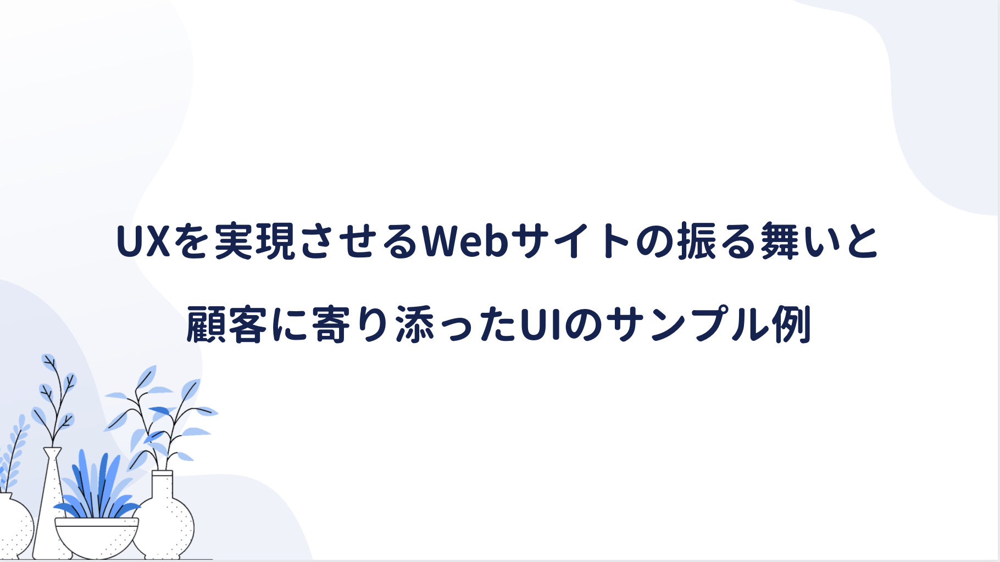

Webデザインで語られるUI/UX。

私も専門ではないが、次の書籍では色んな企業サイトを例に、Webサイトの振る舞いが説明されており、今まで思いつきでやっていたUIを見直すキッカケになった。

<a href="https://hb.afl.rakuten.co.jp/hgc/146fe51c.1fd043a3.146fe51d.605dc196/yomereba_main_202007092105376388?pc=http%3A%2F%2Fbooks.rakuten.co.jp%2Frb%2F14584960%2F%3Fscid%3Daf_ich_link_urltxt%26m%3Dhttp%3A%2F%2Fm.rakuten.co.jp%2Fev%2Fbook%2F" target="_blank" >UX×Biz　Book</a>
posted with <a href="https://yomereba.com" rel="nofollow" target="_blank">ヨメレバ</a>

明海司/井登友一 マイナビ出版 2016年12月    

<a href="https://hb.afl.rakuten.co.jp/hgc/146fe51c.1fd043a3.146fe51d.605dc196/yomereba_main_202007092105376388?pc=http%3A%2F%2Fbooks.rakuten.co.jp%2Frb%2F14584960%2F%3Fscid%3Daf_ich_link_urltxt%26m%3Dhttp%3A%2F%2Fm.rakuten.co.jp%2Fev%2Fbook%2F" target="_blank" >楽天ブックス</a>

<a href="https://www.amazon.co.jp/exec/obidos/asin/4839959064/kanon123-22/" target="_blank" >Amazon</a>

<a href="https://www.amazon.co.jp/gp/search?keywords=UX%C3%97Biz%E3%80%80Book&__mk_ja_JP=%83J%83%5E%83J%83i&url=node%3D2275256051&tag=kanon123-22" target="_blank" >Kindle</a>
                              	  	  	  	  	

 

例えば サイト内検索 では、製品カテゴリを入力し、型番まで連動して表示されるサジェスト機能が実現できれば、詳細を記憶していないユーザーも、目的のページへ一早く辿りつける。

「目的の情報が探しやすく・見つけやすい」という体験をUIで実現する方法には、私が携わったシステム開発の現場でも多く見受けられたが、本書では色んな事例が紹介されている。

## 複数の検索軸を提供

検索軸について、従来は「製品情報」のメニュー下で「製品大カテゴリ → 製品中カテゴリ → 製品小カテゴリ」のようにドリルダウンさせ、目的の情報を見つけるルートは1つしかないサイトが多かった。

しかし数年前から、グローバルナビゲーション上に **アプリケーション（ガイド）** を表示させ、「携帯電話用 / 車載用 / 医療機器用」と用途別に「複数の探すルート」を用意 しているサイトが多い。

ナビゲーションに慣れ親しむ人からすれば、ナビゲーションの無いWebサイトは不便だと感じ、サイトを利用しなくなる可能性は十分考えられるので、必須施策の一つだと思える。

目的の情報を見つけやすくする施策には 事例 があり、課題解決の方法を具体的に理解でき、自分事化しやすい。購買検討に大きな影響力を発揮するコンテンツだと言われている。

また単に事例を紹介するのではなく「テーマから探す / 業界・職種から探す / 工程・作業から探す / 製品から探す」と複数の検索軸を提供すれば、より利便性を向上させる施策の一つとなりえる。

世の中の企業HPを確認すると、大体が上のように対応されている印象だ。

## 製品詳細ページと問い合わせのふるまい

製品詳細ページと問い合わせページについて、典型的な良い事例が紹介されていた。

例えば、製品詳細から「ご相談 / 見積もり」ボタンを押してページ遷移する時、詳細ページの「商品名」が引き継がれる と、ユーザーは**「何に問い合わせをしようとしていたか？ 何の商品名だっただろう？」**と、詳細ページに戻る必要がなくなり、ストレスなく快適なUXを実現できる。

また各詳細ページで 製品の詳細情報のみを印刷 できれば、稟議書や製品比較文書に添付する時、そのまま添付できるので利便性はより向上する。

営業支援機能が期待される問い合わせページでは 単に「お問い合わせ」ボタンを提供するのではなく、目的別に「お問い合わせ / 価格・見積依頼 / 無料テスト機貸出 / 修理・代替機即納」と目的別に用意 すれば、ユーザーがフォームで文章作成する手間を省ける。

この施策で「価格・見積依頼 / 無料テスト機貸出」のような引き合いの強いリードには、営業部門に直接対応させ「修理・代替機即納」は、サポート部門に連絡がいくような体制も可能になる。

## トップページ

最後に一番悩ましいトップページについて、限られたスペースで何を表示させるかは大事な話だ。

本書では メガドロップダウンナビゲーション が紹介されており、ページ遷移せずとも、第2、第3階層の情報が表示されるため、ユーザーは目的の情報に辿り着きやすいと思われる。

また最後に ユーザーが訪問目的を達成しやすいWebサイトの要件 がまとめられていた。

1. 訪問者が必要としている情報がある.

2. その情報は見つけやすい（分かりやすい / 使いやすいUI）

3. その情報は分かりやすい（分かりやすい言葉遣い / 色使い / 表現）

4. その情報が役に立つ（課題解決に有効）

5. その会社に決める理由がある（競合他社との差別化 / 優位性）

6. そのWebサイトは問題なく操作でき、閲覧できる（標準技術で構築されている）

 

なんとなくのUI設計から、上の観点で本ブログも見直しが必要だと痛感した。